# Xamarin 中带有形状的酷炫过渡动画。形式

> 原文：<https://medium.com/geekculture/cool-transition-animations-with-shapes-in-xamarin-forms-7675e4ad0868?source=collection_archive---------7----------------------->

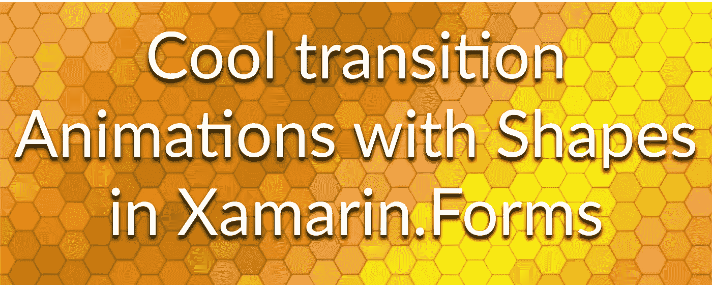

如果你喜欢用西班牙语阅读这篇文章，请点击这个[链接](https://fabricio-bertani.medium.com/animaciones-de-transici%C3%B3n-geniales-con-shapes-en-xamarin-forms-b2288254b7eb)。

Xamarin 的正式发布。表单 4.7 中，首次包含了 [***形状***](https://docs.microsoft.com/en-us/xamarin/xamarin-forms/user-interface/shapes/) 控件，在*实验*标志下。快进到现在，在实际版本( *v5.0.0.2012* )中，事情发生了很大的变化， *Shapes* 留下了实验性的旗帜，现在它在所有支持的平台上(Android、iOS、UWP、WPF 和 macOS)都相当稳定。

*形状*这是一个非常强大的控件，可以让我们轻松地在屏幕上绘制任何形状，比如[圆形](https://docs.microsoft.com/en-us/xamarin/xamarin-forms/user-interface/shapes/ellipse)、[线条](https://docs.microsoft.com/en-us/xamarin/xamarin-forms/user-interface/shapes/line)、[矩形](https://docs.microsoft.com/en-us/xamarin/xamarin-forms/user-interface/shapes/rectangle)、[多边形](https://docs.microsoft.com/en-us/xamarin/xamarin-forms/user-interface/shapes/polygon)，甚至可以从一些 svg 图像文件中取值，并使用[路径](https://docs.microsoft.com/en-us/xamarin/xamarin-forms/user-interface/shapes/path)进行粘贴。我们可以使用这个控件来创建图形、好看的背景、创新的 UI 控件等等。从大卫·奥尔蒂诺的这篇伟大的文章中可以看出。

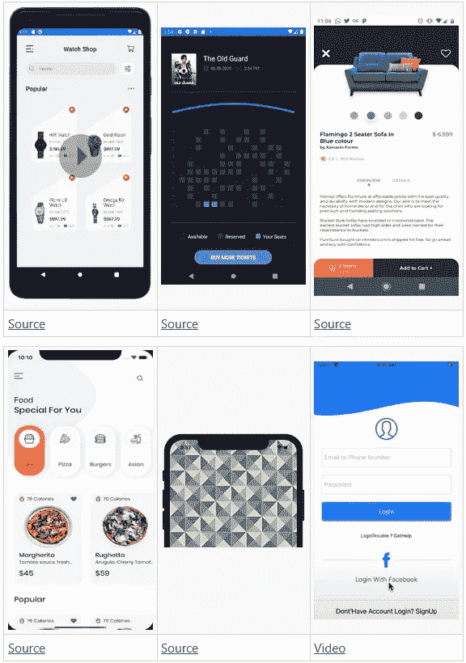

UI samples created with Shapes

Xamarin 提供的另一个真正强大的工具。表单是[动画](https://docs.microsoft.com/en-us/xamarin/xamarin-forms/user-interface/animation/)，通过使用默认控件或创建我们自己的自定义动画来帮助我们给应用程序带来活力。

# 动画形状！

为了使我们的应用程序与众不同，我们应该创造一些真正令人印象深刻的东西，将形状和动画放在一起似乎是一个好的开始。此外，让我们将页面之间的导航添加到组合中。

面对现实吧，夏玛琳。表单内置过渡动画很无聊，由 giam Paolo Gabba**创建的 [SharedTransitions](https://github.com/GiampaoloGabba/Xamarin.Plugin.SharedTransitions) 插件真的很棒，但是它只是包含了如今在大多数应用程序中广泛使用的常见过渡。
我们将使用形状来创建一些很棒的过渡动画！**

在开始之前，这篇文章的一些注意事项:

*   尽管形状适用于 UWP、WPF 和 macOS，*我们将坚持只在 Android 和 iOS 上使用*。
*   我们将在主页上集中大部分导航。
*   我们将删除原来的工具栏，并用一个假的代替，以便全屏显示动画。
*   这些只是示例，不是实际的产品代码。

## 我们开始吧！

对于我们所有的页面，我们将使用一个*网格*控件来包装整个页面内容，以便利用 overlap 属性。
此外，我们将`x:Name`设置为工具栏和内容，使它们在过渡过程中消失。

这里我们将创建我们的第一个形状，在这种情况下，我们想要一个指向右边的红色大箭头。
让我们使用一个*路径*控件。在检查[标记语法](https://docs.microsoft.com/en-us/xamarin/xamarin-forms/user-interface/shapes/path-markup-syntax)时，我们可以看到`Data`字段基本上需要:`M`来确定路径的起点，接着是起始`X,Y`点，然后用`L`来定义这条线和它行进的几个`X,Y`点，最后用`Z`来表示路径的终点。我们将它隐藏在屏幕的左侧。

在我们代码后面的按钮点击处理程序中，我们只是在主线程上调用一个异步方法，它将运行我们的[自定义动画](https://docs.microsoft.com/en-us/xamarin/xamarin-forms/user-interface/animation/custom)。
在动画中，我们将打开形状的可见性，并使其从左向右移动，同时淡出工具栏和内容。整个动画将持续 350 毫秒。由于我们的动画是同步提交的，我们需要添加一个比动画稍长的延迟，然后最终导航到下一页。

让我们来看看结果:

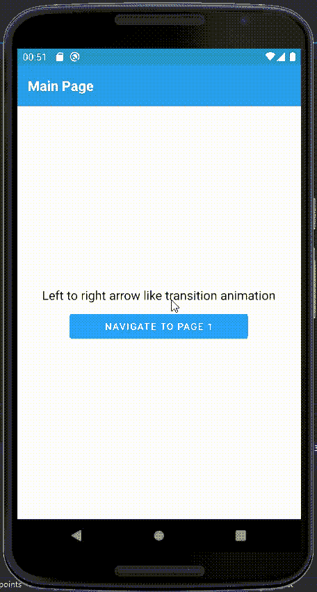

Left to right arrow shape transition animation

我们的*箭头导航页面*将与*主页*几乎相同，但是箭头将指向相反的方向。

而后面的代码将几乎相同，但也为 Android 后退按钮添加了一个覆盖。

这将是向前和向后导航的结果。

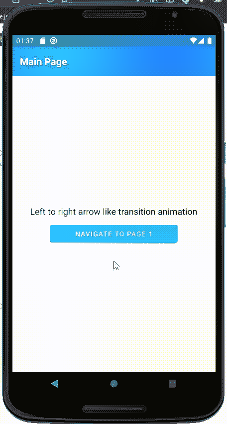

Animation of transition from left to right and backwards

对于我们的第二个页面导航过渡，让我们创建一些重叠的形状。

让我们把它从底部移动到顶部

结果是:

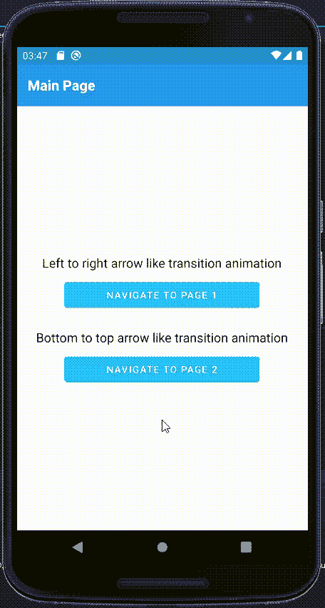

Bottom to top arrow shape transition animation

现在，对于返回动画，让我们更有创造性地使用[椭圆](https://docs.microsoft.com/en-us/xamarin/xamarin-forms/user-interface/shapes/ellipse)创建两个圆，一个在屏幕的左上角，另一个在右下角。

我们将从右下角开始增长一个圆，使其回到左上角的原始大小

结果是:

Circle shape transition animation

继续我们的“创意热潮”，让我们创建一个多页的过渡动画，这意味着动画开始于一个屏幕，结束于另一个屏幕。

出于这个原因，我们在主页上添加了一些隐藏在屏幕两侧的形状。

在后面的代码中，我们将创建一个动画来关闭我们制作的窗格形状，并导航到下一页。

在下一页，我们从相同的窗格形状开始，但是它们必须是闭合的。

在后面的代码中，我们覆盖了`OnAppearing`方法并执行窗格打开动画。

结果是:

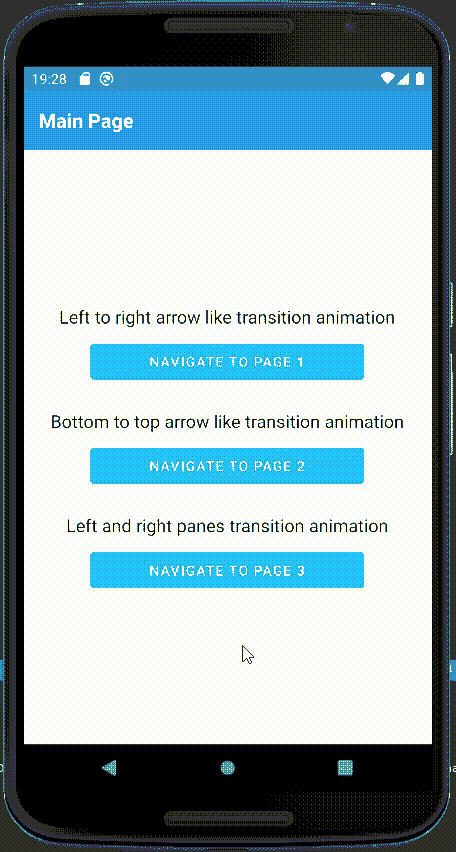

Left and right pane shapes transition animation

对于回归动画，我们来做点更有趣的。

虽然有些形状用路径制作很简单，但有些形状不需要或需要很长时间来制作，因此我们将使用 SVG 路径数据。如果你足够幸运，也许你的团队中有一个用户界面设计师，你可以去请他们做出你可以使用的优秀设计。
如果没有，您可以使用类似 [Figma](https://www.figma.com/) 的工具来创建和导出 SVG 代码:

在 Figma 上创建你的形状，然后右击它，找到*复制/粘贴*部分并选择`Copy as SVG`。

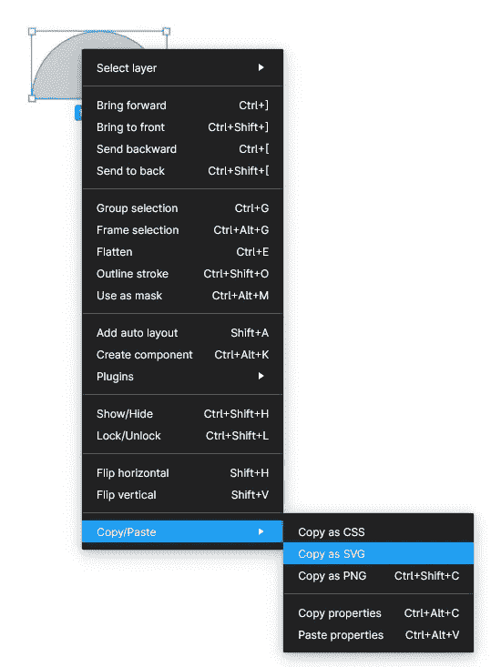

将它粘贴到您的编辑器上，并获取`d`标签中的内容

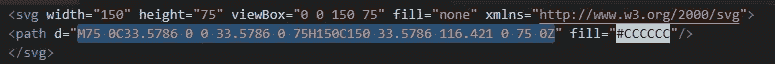

最后，将其作为`Data`粘贴到 Xamarin 中。表单路径。

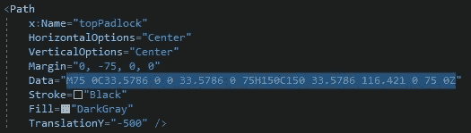

现在让我们将所有的形状添加到屏幕上:

请记住，我们需要在主页面上添加相同的内容，但也需要说明，我们只想在从特定页面返回时启动该动画，因此我们只需添加一个标志:

现在我们可以为返回动画添加代码*的剩余部分。*

结果是:

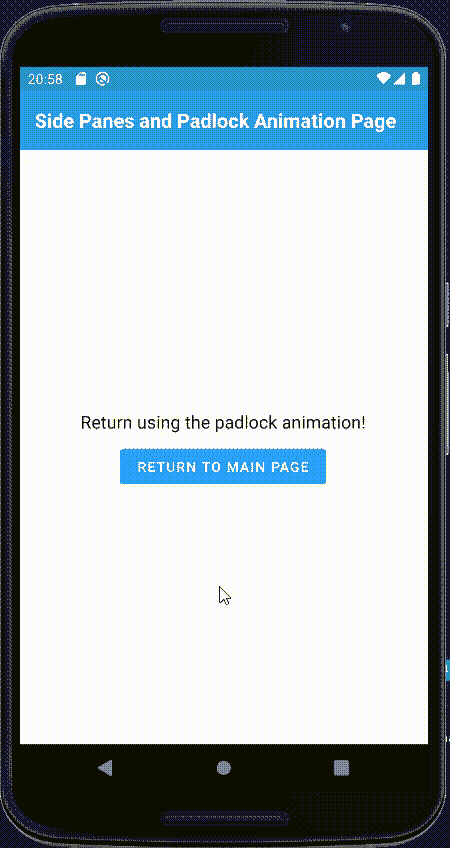

Padlock shape transition animation

对于我们的最后一个例子，让我们强调在屏幕上运行大量形状和动画的引擎。因此，我们将制作一个野生口袋妖怪作为过渡动画！

对于这个例子，我们添加口袋妖怪作为一个 png 图像，但你可以看看一些 svg 口袋妖怪图像采取的路径😉。

这些将是我们在主页上的形状

以及的动画背后的代码:

结果:

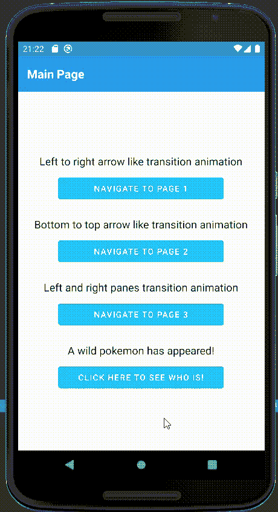

Pokemon shapes transition animation

## 那都是乡亲们！

正如我之前所说的，这些只是我们如何开发我们的创造力并拓展 Xamarin.Forms 的边界的例子。

如果这篇文章能帮助你创作出令人惊叹的过渡动画，或者你想展示你所做的事情，请在评论中留下一个样本，稍后会添加到这篇文章中。

另外，你可以在 GitHub 上看到这篇文章的完整样本库。👇

 [## FabriBertani/XFShapeAnimatedTransitions

### 在 GitHub 上创建一个帐户，为 FabriBertani/XFShapeAnimatedTransitions 的发展做出贡献。

github.com](https://github.com/FabriBertani/XFShapeAnimatedTransitions) 

感谢阅读，继续编码！😁