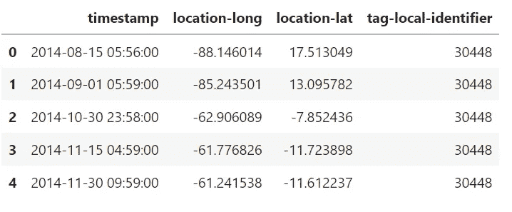
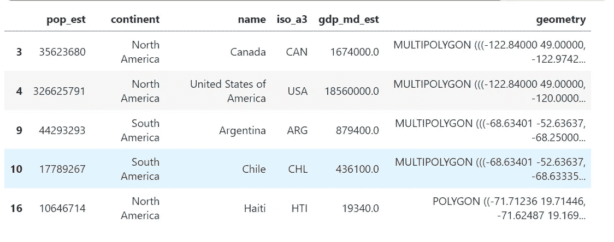
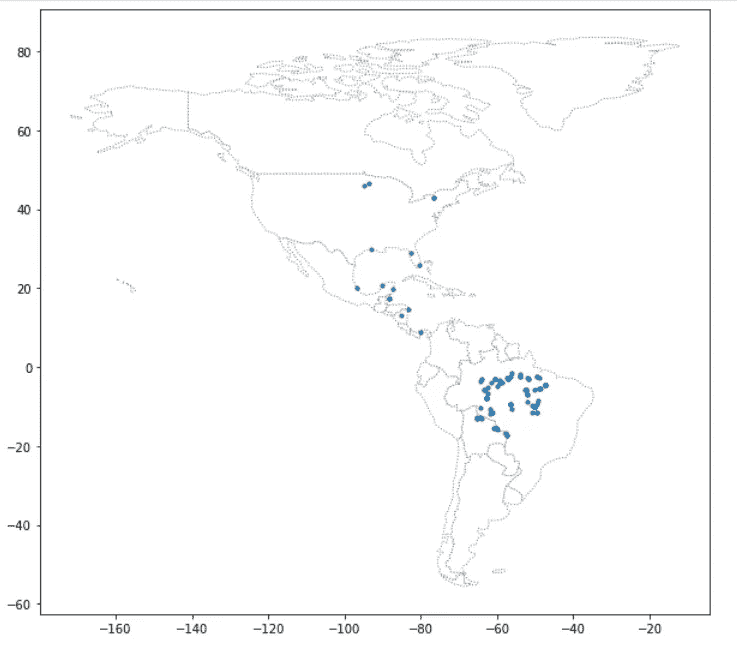
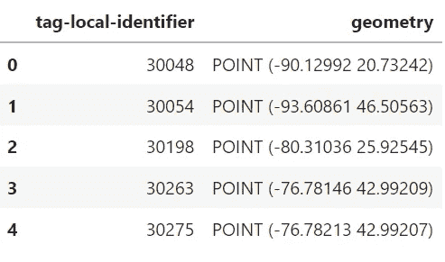
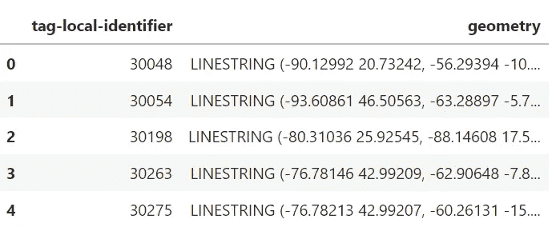
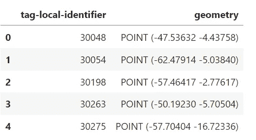
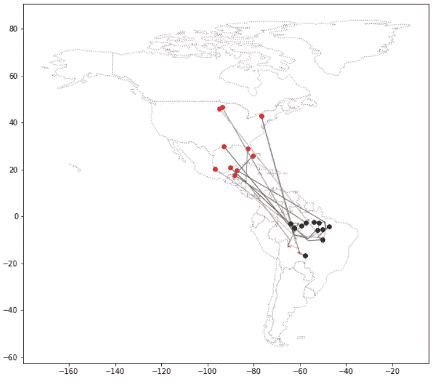
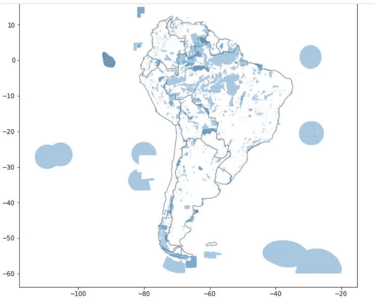
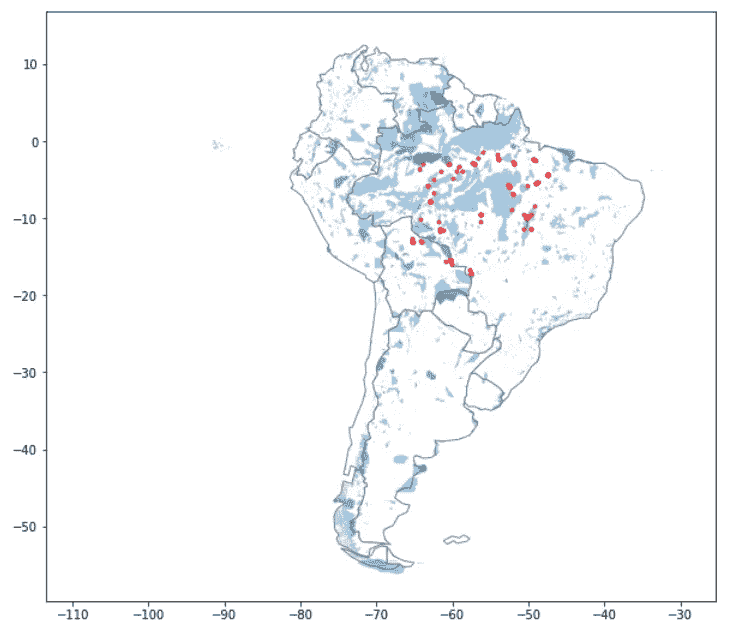

# 使用 Geopandas 的坐标参考系统！

> 原文：<https://medium.com/geekculture/coordinate-reference-systems-using-geopandas-d8151b2b5598?source=collection_archive---------15----------------------->


Photo by [Markus Spiske](https://unsplash.com/@markusspiske?utm_source=medium&utm_medium=referral) on [Unsplash](https://unsplash.com?utm_source=medium&utm_medium=referral)

本文将研究地理空间数据框架的**创建，像以前一样映射到世界地图中，研究任何实体的**线路、起点和终点**，并了解追踪迁徙濒危鸟类**物种**的相关用例的具体观察结果。**

这里创建的地图描绘了二维的地球表面。但是，这个世界实际上是一个**三维地球仪**。所以用一种叫做**地图投影**的方法将其渲染为**平面**。

**坐标参考系统(CRS)** 用于显示**投影点**如何对应地球上的真实位置。在本教程中，将详细讨论 CRS 以及一个**用例及其代码实现**。

## **用例**

假设你是一名**鸟类保护专家**，想了解**紫貂**的迁徙模式。在你的研究中，你发现这些鸟通常在美国东部度过夏季繁殖季节，然后迁徙到南美洲过冬。但是由于这种鸟处于濒危的威胁之下，你应该去这些鸟更有可能去的地方仔细看看。

南美洲的几个保护区在特殊的规定下运作，以确保迁徙(或生活)到那里的物种有最好的机会茁壮成长。你想知道**紫色马丁斯**是否会光顾这些地区。为了回答这个问题，有一些**最近收集的数据**追踪**11 种不同鸟类**的全年位置。

## **代码实现**

使用的一些著名的库有[](https://pandas.pydata.org/)****[**geo Pandas**](https://geopandas.org/en/stable/)[**shapely**](https://pypi.org/project/shapely/)。****

```
**import pandas as pd
import geopandas as gpd
from shapely.geometry import LineString

# Load the data and print the first 5 rows
birds_df = pd.read_csv("purple_martin.csv", parse_dates=['timestamp'])
print("There are {} different birds in the dataset.".format(birds_df["tag-local-identifier"].nunique()))
birds_df.head()

There are 11 different birds in the dataset.**
```

********

****First 5 rows of the data frame (Kaggle image)****

****在这里，我们看到了**时间戳**变量以及**纬度和经度**值。数据集中有 **11 只鸟，每只鸟由“tag-local-identifier”**列中的**唯一值标识。每只鸟都有几个测量值，在一年的不同时间收集。******

****接下来，让我们从 **birds_df 数据帧**创建 **GeoPandas 数据帧**。****

```
**birds = gpd.GeoDataFrame(birds_df, geometry=gpd.points_from_xy(birds_df["location-long"],birds_df["location-lat"]))

# Set the CRS to {'init': 'epsg:4326'}

# Your code here: Set the CRS to {'init': 'epsg:4326'}
birds.crs = {'init' :'epsg:4326'}**
```

******gpd.points_from_xy()** 用于从**经纬度**位置创建点对象( **location-long** 和 **location-lat** 变量)。参数 **epsg** 指 [**欧洲石油调查组织(EPSG)**](http://www.epsg.org/) 代码。当从 **CSV 文件**创建**地理数据框**时，我们必须设置 **CRS** 。 [**EPSG 4326**](https://epsg.io/4326) 对应经纬度中的**坐标。******

****现在，为了绘制数据，我们从 **GeoPandas** 加载`**'naturalearth_lowres'**` **数据集**，并将其设置为**地理数据框架**，其中包含美洲(北美和南美)所有**国家的边界。******

```
**# Load a GeoDataFrame with country boundaries in North/South America, print the first 5 rows
world = gpd.read_file(gpd.datasets.get_path('naturalearth_lowres'))
americas = world.loc[world['continent'].isin(['North America', 'South America'])]
americas.head()**
```

********

****Geopandas data frame containing only countries from the Americas (Kaggle image)****

****所以，在我们有了**个国家的 GeoPandas** ( **个美洲**)数据框之后，让我们**把它标绘到世界地图上**。代码如下。****

```
**ax = americas.plot(figsize=(10,10), color='white', linestyle=':', edgecolor='gray')
birds.plot(ax=ax, markersize = 10);

#ax.set_xlim([-110, -30])
#ax.set_ylim([-30, 60])**
```

********

****The **americas** Geopandas data frame and the **birds** geopandas data frame (Kaggle image)****

******set_xlim** 和 **set_ylim** 值被设置为仅在**鸟(蓝点)**集中的地方放大地图的**相关部分**。****

## ******鸟的起点和终点以及经过的路线******

****在这里，我们将找到鸟类的**起点和终点**以及经过的**路径，并尝试**在世界地图上将它们**可视化。代码如下。******

```
# GeoDataFrame showing path for each bird
path_df = birds.groupby("tag-local-identifier")['geometry'].apply(list).apply(lambda x: LineString(x)).reset_index()
path_gdf = gpd.GeoDataFrame(path_df, geometry=path_df.geometry)
path_gdf.crs = {'init' :'epsg:4326'}

# GeoDataFrame showing starting point for each bird
start_df = birds.groupby("tag-local-identifier")['geometry'].apply(list).apply(lambda x: x[0]).reset_index()
start_gdf = gpd.GeoDataFrame(start_df, geometry=start_df.geometry)
start_gdf.crs = {'init' :'epsg:4326'}

# Show first five rows of GeoDataFrame
start_gdf.head()
```

****path_gdf** 包含了显示每只鸟的**路径的 **LineString 对象**。它使用`**LineString()**`方法从一系列点对象中创建一个 LineString 对象。****

****start_gdf** 包含每只鸟的**起点**。**

****

**First 5 rows of start_gdf geopandas data frame (Kaggle image)**

**正如我们可以看到的，有鸟的开始点**和上面看到的**标签-本地标识符(唯一的鸟类型)**。****

```
path_gdf.head()
```

****

**path_gdf geopandas data frame (Kaggle Image)**

****路线**鸟被表示为**线串**物体。**

**这同样适用于包含鸟类的**目的地点**的 **end_gdf geopandas 数据帧**，因为我们创建了 **start_gdf geopandas 数据帧**。**

```
end_df = birds.groupby("tag-local-identifier")['geometry'].apply(list).apply(lambda x: x[-1]).reset_index()
end_gdf = gpd.GeoDataFrame(end_df, geometry=end_df.geometry)
end_gdf.crs = {'init': 'epsg:4326'}

# Show first five rows of GeoDataFrame
end_gdf.head()
```

****

**end_gdf geopandas dataframe (Kaggle image)**

**鸟类的**起点(start_gdf)** 和**终点(end_gdf)** 点以及它们各自的**路线(path_gdf)。****

```
ax = americas.plot(figsize=(10, 10), color='white', linestyle=':', edgecolor='gray')

start_gdf.plot(ax=ax, color='red',  markersize=30)
path_gdf.plot(ax=ax, cmap='tab20b', linestyle='-', linewidth=1, zorder=1)
end_gdf.plot(ax=ax, color='black', markersize=30)
```

****

**Start, endpoints, and the paths of the birds (Kaggle image)**

**上图清楚地显示了**红色**点( **start_gdf** )，**黑色**点( **end_gdf** )，以及 **americas geopandas 数据框上鸟类的行进路径( **path_gdf** )。****

**接下来，我们将看看这些鸟是否像我们在文章前面讨论的那样迁徙到保护区。密码是。**

```
# Path of the shapefile to load
protected_filepath = "SAPA_Aug2019-shapefile-polygons.shp"

# Your code here
protected_areas = gpd.read_file(protected_filepath)
```

****受保护文件路径**是一个**。shp** 文件，其中有关于南美 [**保护区**](https://www.iucn.org/our-work/protected-areas-and-land-use) 集合的信息。与之前的**绘图选项**相同，我们将**在南美地图上可视化保护区**。**

```
south_america = americas.loc[americas['continent']=='South America']

# Your code here: plot protected areas in South America
ax = south_america.plot(figsize=(10,10), color='white', edgecolor='gray')
protected_areas.plot(ax=ax, alpha=0.4)
```

****南美** geopandas 数据框是从**美洲** geopandas 数据框创建的。然后在南美绘图对象( **ax** )上绘制**保护区**。剧情如下。**

****

**Protected areas on the south americas map (Kaggle image)**

**可以清楚地看到，保护区主要集中在地图的**北部**。如果我们观察政治地图的话，它们大多存在于巴西(亚马逊盆地地区)。尽管如此，在海洋水域也有许多隔离的集群。南方也有一个**粗星团**。******

南美洲受保护土地的数量(按百分比计算)是多少？要知道我们从**总面积(REP_AREA)中减去**总海洋面积(REP_M_AREA)** 。**代码是。

```
P_Area = sum(protected_areas['REP_AREA']-protected_areas['REP_M_AREA'])
print("South America has {} square kilometers of protected areas.".format(P_Area))

South America has 5396761.9116883585 square kilometers of protected areas.
```

使用每个多边形的`area`属性得到每个国家的**总面积**(以 **EPSG 3035** 为 CRS)，然后将结果相加得到整个南美洲的面积(单位**平方公里)**。

```
# Your code here: Calculate the total area of South America (in square kilometers)
totalArea = sum(south_america.geometry.to_crs(epsg=3035).area) / 10**6

# What percentage of South America is protected?
percentage_protected = P_Area/totalArea
print('Approximately {}% of South America is protected.'.format(round(percentage_protected*100, 2)))

Approximately 30.39% of South America is protected.
```

## **最后，南美洲的鸟在哪里？**

那么，这些鸟在保护区吗？

让我们创建一个显示所有鸟类的图，以及它们在南美洲被发现的所有地点。此外，标出南美洲所有保护区的**位置。**

为了**排除**纯海洋区域**(没有陆地部分)的**保护区，您可以使用**“海洋”**列(并且只绘制`**protected_areas[protected_areas['MARINE']!='2']**`中的行，而不是`protected_areas`地理数据框中的每一行)。

```
ax = south_america.plot(figsize=(10,10), color='white', edgecolor='gray')

protected_areas[protected_areas['MARINE']!='2'].plot(ax=ax, alpha=0.4, zorder=1)

birds[birds.geometry.y < 0].plot(ax=ax, color='red', alpha=0.6, markersize=10, zorder=2)
```



The birds in red dots present in the protected areas (Kaggle image)

从上面的图中，我们可以看到**保护区**中有鸟类的存在，这些鸟类只在陆地和**上**有。

所以，简而言之，我们可以在南美洲**中北部**集群的**保护地**中识别出**鸟类的存在。尽管如此，还是有一些保护区(比如最北部的 T39 或者南部的 T42)鸟类不会在那里定居。**

我这里指的是从 [**到**](https://www.kaggle.com/code/abhi2652254/exercise-coordinate-reference-systems/edit) 。跟着 [**me**](/@abhi2652254) 说 [**hi**](https://www.linkedin.com/in/obhinaba17/) 。