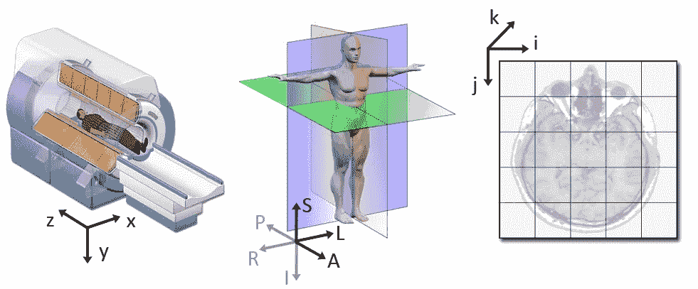
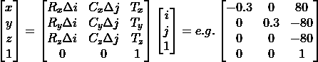
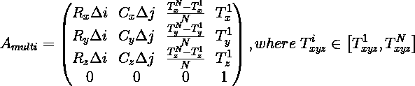
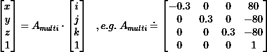

# 医学数据科学中的坐标系统——rant

> 原文：<https://medium.com/geekculture/coordinate-systems-in-medical-data-science-a-rant-90394f60b27?source=collection_archive---------4----------------------->

Sagittal plane slices of the brain from [this source](https://theaisummer.com/medical-image-coordinates/#introduction-to-dicom-for-machine-learning-engineers)

使用医学数据集有时很糟糕！当我开始处理真实世界的数据集时，我没有意识到医疗文件格式缺乏标准化。

我误以为 DICOM 文件是标准化的，可以像*一样使用。jpg* 或*。png* 文件。我希望能够像加载任何其他类型的图像一样加载它们。 ***哎呀这是怎么回事。***

为了工作，我建立了一个系统，可以在给定的 CT 体积内放置手术工具。那么可以在考虑许多物理效应的同时生成投影图像。虽然它在大部分时间*都能正常工作*，但偶尔也会出现看似随机的故障，并且会放错工具的位置。

我必须弄清真相。虽然这个帖子是我找到的资源的总结，但它主要是我对悲惨现状的咆哮。

## 并非所有的 DICOMs 都是平等的

DICOM 的目标是为各种医疗数据提供一个单一的接口。这包括 X 射线、MRI、超声波图像和各种混合数据集。*(注意:DICOM 也包含一个网络协议，但这里不感兴趣)*

虽然这无疑有利于制造商之间的互操作性，但也带来了一些问题。这些主要是由于缺乏标准化造成的。由于制造商坚持他们的内部约定，他们都被集成到 DICOM*‘标准’*。

> 示例:CT 扫描的切片可以存储在每个切片的单个**文件中，或所有切片**的单个**文件中。**

虽然这可以用代码来处理，但真正的问题出现在更复杂的层面上。

## 三个坐标系

当采集 CT 扫描时，患者相对于扫描仪定位。虽然对于固定扫描仪来说，这或多或少是明确定义的，但对于便携式 C 型臂系统(我主要使用这种系统)来说，这变得更加复杂。扫描仪可以在患者周围任意定位，完全改变了患者在采集图像中的方位！

为了保持用于诊断应用的患者方位，要求临床医生在扫描之前提供基本的定位。该信息存储在 DICOM 元数据中。

为了明确定义患者相对于扫描仪的方向和位置，我们必须定义三个坐标系。

the three coordinate systems from [here](https://www.slicer.org/wiki/Coordinate_systems). Defined on MRI but analogous to CT

这三个系统都是笛卡尔坐标系，只是在间距、旋转和参考点上有所不同。此外， *xyz* 和 *lps* 系统是连续的，带有单位 *mm* ，而 *ijk* 系统是离散的，没有单位。

所谓的**世界系统*XYZ*是相对于扫描仪定义的。不同厂商对旋转轴的定义不同(此处 *z* )。在 CT 系统中，原点 *(0，0，0)* 通常位于旋转中心。**

**解剖系统*LPS*由医学术语定义。两个通常的约定是 ***LPS*** 或 ***RAS*** 系统。这里 LPS 代表(左、后、上),并指示沿定义的轴的向量方向。原点可以任意选择*(或取决于所描绘的解剖结构)*，并且通常仅定义在扫描的旋转中心，以简化转换。**

**图像系统** ***ijk*** 索引扫描仪产生的原始数据阵列。根据定义，原点(0，0，0)位于左上角附近；因此，索引 *i* 从左到右，索引 *j* 从上到下，索引 *k* 从近到远。

如果患者面朝上躺在 MRI 或 CT 系统中，如上图所示， *xyz* 世界系统和 *lps* 患者系统将重合。这是 DICOM 中假定的标准系统。

澄清这些术语后，让我们看看复杂的部分:如何从 DICOM 标准中给出的体积重建解剖系统。

## DICOM 标准下的帧转换

如前所述，DICOM 中的 CT 图像可以是多切片或单切片数据集。为了将给定的索引从图像坐标系转换到患者参考系统，DICOM 提供了两个属性:

[图像方向](https://dicom.innolitics.com/ciods/enhanced-ct-image/enhanced-ct-image-multi-frame-functional-groups/52009229/00209116/00200037)标签指定了轴 *i* 和 *j* 指向的解剖空间的矢量方向。这通过两个向量 ***R*** 和 ***C*** 给出，这对于数据集中的所有切片都是相同的。

[图像位置](https://dicom.innolitics.com/ciods/enhanced-ct-image/enhanced-ct-image-multi-frame-functional-groups/52009230/00209113/00200032)标签定义了解剖空间中的点，每个切片的(0，0)索引位于该点。它存在于每个切片中，尽管在大多数情况下只有深度坐标会改变。我们将其表示为 **T** 用于翻译**。**

对于**单层数据集**，这完全有意义，因为将像素索引 *(i，j)* 映射到解剖框架的仿射变换可以直接定义为:

2d-3d affine transform including a real world example (adapted from [here](https://nipy.org/nibabel/dicom/dicom_orientation.html#dicom-affine-formula))

其中 **R** 、 **C** 和 **T** 由两个讨论的标签定义，并且沿着 *i* 和 *j* 的像素间距也作为[像素间距](https://dicom.innolitics.com/ciods/enhanced-ct-image/enhanced-ct-image-multi-frame-functional-groups/52009229/00289110/00280030)标签在元数据中可用。*注意:我们在这里直接使用 xyz，因为我们假设了前面讨论过的标准位置。*

> 这是 2d-3d 转换！

右边的矩阵是从真实数据集的第一个切片构建的。如您所见，图像采集开始于解剖空间中的点(80，-80，-80)，但沿 *-x* 采样。

对于一个**多切片数据集**来说，这种切片式的定义没有什么意义。如果给定的 *ijk* 直接坐标，提供编码 *xyz* 位置的*单仿射变换*会更容易。相反，这种仿射变换必须从 DICOM 提供给我们的属性中手工计算出来。

所以让我们来看看计算…

## 多切片仿射变换计算

对于多切片数据集，必须根据给定的参数计算 3d 仿射变换。为此，我们可以从上面的单切片情况开始，为 *k* 组件添加第三列。

> 按照惯例，DICOM 数据按照 **(k，j，i)** 顺序存储。因为我们的数学模型使用 **(i，j，k)** 约定，所以我们在加载后立即转置数据数组的轴。在 python 中:

> data_ijk = data_kji.transpose((2，1，0))。复制()

`.copy()`重写内存中的数组以实现快速访问。

由于患者空间轴中 k 的方向没有明确说明，我们必须根据给定的图像位置来推断。记住，图像位置标签 **T** 给了我们每个切片第一个像素的 *xyz* 位置！如果我们从第一个切片的标签中减去最后一个切片的标签中的位置，我们就得到一个沿深度方向的矢量分量。

为 *ijk* 向量的 *k* 分量插入这一列，结果如下:

multi-slice 3d affine transform from image to anatomical system. (adapted from [here](https://nipy.org/nibabel/dicom/dicom_orientation.html#d-affine-formulae))

请注意，我们必须根据给定切片的数量来归一化这个矢量分量。在大多数在假定的患者位置采集的真实数据集中，这个看起来复杂的等式简化为这个相当简单的旋转和平移变换:

example for a 3d affine matrix

如果图像系统与患者系统对准，由于位置 Tx 和 Ty 不沿切片变化，因此 k 列中的相应条目消失。

## 结论

利用这种仿射变换，我们能够明确地定位患者空间中的给定体积。恼人的部分:这在其他更专业的标准中很容易得到，比如 NIfTI 标准。

由于其优越性和降低的复杂性 *.nii.gz* 图像在神经成像中非常常见。如果你可以选择，我强烈推荐你使用它而不是传统的 DICOM。省了很多头疼的事。

以下是我在这篇文章中使用的一些好资源:

 [## 尼巴贝尔

### 首先，我们定义标准的基于患者的 DICOM 坐标系。这就是 DICOM 中 x、y 和 z 轴的含义…

nipy.org](https://nipy.org/nibabel/dicom/dicom_orientation.html)  [## 理解用于深度学习医学图像分析的坐标系和 DICOM

### 有时候你认为你理解了一些事情，但是你没有解释清楚。这是你必须回头看的时候了…

theaisummer.com](https://theaisummer.com/medical-image-coordinates/#introduction-to-dicom-for-machine-learning-engineers) 

[http://DICOM . NEMA . org/medical/DICOM/current/output/chtml/part 03/Sect _ c . 7 . 6 . 2 . html # Sect _ c . 7 . 6 . 2 . 1 . 1](http://dicom.nema.org/medical/dicom/current/output/chtml/part03/sect_C.7.6.2.html#sect_C.7.6.2.1.1)