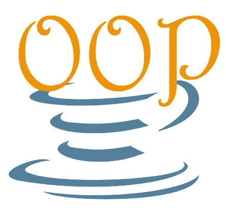
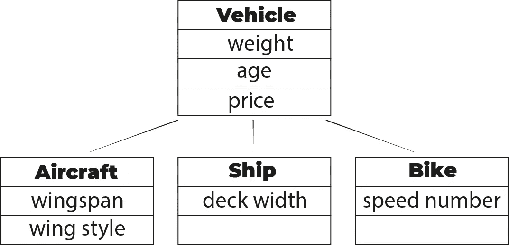
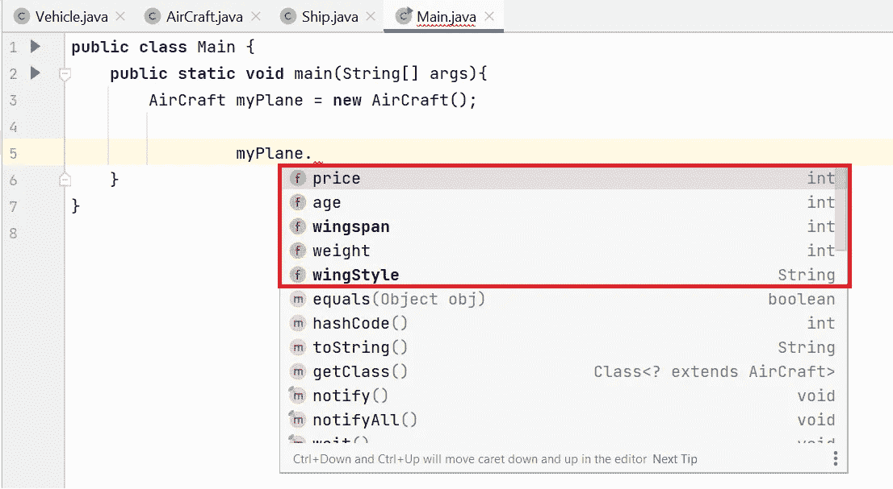

# 面向对象编程的核心概念-1

> 原文：<https://medium.com/geekculture/core-concepts-of-object-oriented-programming-1-49397c7e0cbe?source=collection_archive---------30----------------------->

> 在本文中，我将讨论面向对象编程的重要概念，这些概念对于创建可扩展的项目非常重要。如果你对面向对象编程不是很熟悉，首先你可以看看 [***这篇文章***](https://azizkale.medium.com/basic-concepts-of-oop-77cdaecda561) 中题目的一些基本概念。

我将使用 JAVA 作为编程语言，IntelliJ IDEA 作为 IDE。

我将描述的主题如下:

*   [继承](#2a3e)
*   [多态性](#d8d3)
*   [超驰](#e6fc)
*   [关键词【超级】](#dbd3)
*   [界面](#804a)

## 遗产

项目中不希望出现重复的代码。当您必须创建多个具有公共字段(属性)的类时，**继承**开始发挥作用，让您摆脱重复的代码。

为此，您应该首先创建一个包含公共字段的类。这个类被命名为**父类**。然后创建其他类，它们有自己单独的字段。这些名字叫做**子类**。

正如你在下面的例子中看到的；“Vehicle”是父类，其他是子类。因为所有的子类都已经是一个工具，所以它们自动拥有父类包含的特性。

image-1

像在现实生活中一样，孩子可以继承父类中的特性。

现在让我们看看它在代码世界中的样子:

首先我们创建 **Vehicle** 类，并添加字段和方法。

code example-1

然后是**飞机**类:

code example-2

注意，飞机类通过关键字`exntends` 继承了车辆类的特性。关键字`super`指的是父类(类 Vehicle ),因为 AirCraft 从父类获得构造函数。

现在，在主类中，我创建了一个飞机实例并检查了它的特性:

image-2

如图 2 所示，虽然飞机类通常只有两个特征，但另外三个特征来自父类(来自车辆类)。

## 多态性

**多态性**字面意思是具有多种形状或形式的事物。在面向对象的世界里，通过继承，你可以使对象多态。因为当一个对象扩展另一个类时，它就变成了自己的类型和它的父类的类型。

code example-2

code example-3

正如你在上面看到的，起初我从类`Ship`扩展了类`Vehicle`。在**主**类中，我创建了两个名为`myPlane1`和`myShip1`的对象。这些对象属于`Vehicle`的类型，但是是从它们自己的构造函数中创建的。

但是它到底在哪里有用呢？让我们看一个更进一步的例子；

code example-4

如代码示例 4 所示，对象`myVehicle`属于类型`Vehicle`，但是我创建了两次该对象，并且来自不同的构造函数。通过这个对象，我可以到达方法`howOldAmI(int thisYear)`，我可以从它们自己的类中得到不同的结果。

## 推翻

当用一个类扩展另一个类时，父类中的方法会自动扩展到子类。但是您不必使用与父类中相同形式的方法。所以你可以做出改变。这是“**覆盖**”。但是方法声明必须相同。

code example-5

在类`AirCraft`中，我重写了方法`howOldAmI`并更改了返回值。注意关键字`@override`。

## 关键词“超级”

关键字`super`代表父类。可以用`super`调用父类中的变量或方法。让我们对代码示例 5 进行一些更改:

我们用`super`从父类调用了同样形式的方法，然后做了一些补充。

## 连接

到目前为止，我们只从一个父类扩展了类。但是如果我们需要从一个以上的类扩展一个类呢？此时，**接口**的概念就发挥作用了。当我们必须从多个类中扩展一个类时，我们必须创建接口，而不是作为父类的类。

让我们看看下面的例子:

如您所见，我们通过使用“interface”关键字而不是“class”来创建接口。现在让我们创建 Dog 类，它可以从接口继承方法:

在使用接口时，我们使用关键字“**实现**，而不是“**扩展**”。

在接口中，我们只列出方法签名而不列出任何实现代码，这一点很重要。我们在从接口继承方法的类中实现这些方法。

接口不是让我们减少代码，而是执行好的代码。一个接口迫使任何实现它的类必须实现一定数量的方法。

您不能从界面创建对象。它们的唯一目的是由一个或多个类来实现。