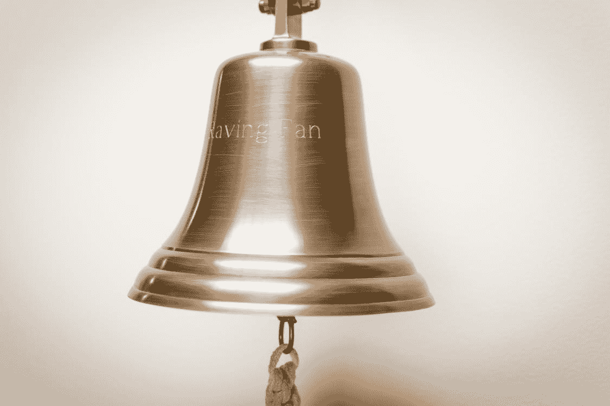

# Unity 中的协程和回调

> 原文：<https://medium.com/geekculture/coroutines-and-callbacks-in-unity-ee075719e7a4?source=collection_archive---------5----------------------->



Photo from [pexels.com](https://www.pexels.com/it-it/foto/campana-in-ottone-633497/) by [Mike](https://www.pexels.com/it-it/@mike-204930/)

## 协程完成了吗？

## 如何让协程在完成后响铃

当一个`**Coroutine**` 在统一中是这样开始的:

```
**StartCoroutine**(CoroutineName(vars));
NextCommand();
```

一段代码在**更新模式**之外运行。这意味着代码的执行不受限制…