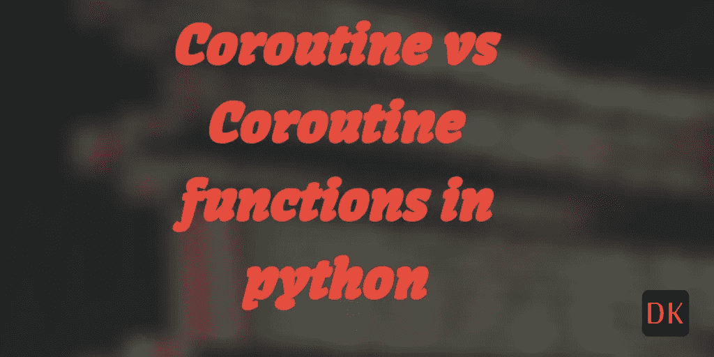

# Python 中的协程与协程函数

> 原文：<https://medium.com/geekculture/coroutines-vs-coroutine-functions-in-python-a3957c1a0f9b?source=collection_archive---------11----------------------->

## 协程和协程函数之间的细微差别。



# 简介:

有一种常见的误解，认为`coroutine`函数和协程对象是相同的。嗯！不完全是。尽管它们共存，但两者之间还是有一点点微小的差别。理解它们之间的区别是很重要的。

# 什么是协程？

简单地说，`coroutine`是一个普通的 Python 函数，以关键字`async`为前缀。要快速了解 Python 中的`asyncio`库，请参考这里的。用`async def`创建的协程被称为原生协程，因为它们是从`python` 3.5 构建到标准库中的。

# 协程函数与协程:

为了理解其中的区别，让我们使用`asyncio`库编写一个简单的异步函数。

```
import asyncio, time

async def hello_world():
    print(time.ctime())
    await asyncio.sleep(1.0)
    print(time.ctime())

loop = asyncio.get_event_loop()
task = loop.create_task(hello_world())
loop.run_until_complete(task)
loop.close()
```

当我们看到这个函数时，我们说这是一个协程。然而，这个假设只是部分正确。 ***请注意，异步函数不是协程。它们就像任何其他 Python 函数一样。***

还不相信？让我们来测试一下。我们将尝试打印`hello_world function`的`type`。

```
print(type(hello_world)) Output: 
<class 'function'>
```

我和你一样惊讶。这些天来，我一直假设当我们用`async def`声明一个 Python 函数时，它们就变成了协程。显然不是。如果它们不是协程，那么它们是什么？它们是 ***协程函数*** 。

让我们使用`python`中的`inspect`模块对此进行快速测试。

```
import inspect print(inspect.iscoroutinefunction(hello_world)) Output: 
True
```

那什么是协程？

执行/评估协程函数时会创建一个`coroutine`。换句话说，当一个`async def`函数被调用时，它将返回一个协程。

```
import asyncio, time

async def hello_world():
    print(time.ctime())
    await asyncio.sleep(1.0)
    print(time.ctime())

coro = hello_world()
print(type(coro))
print(inspect.iscoroutine(coro))
print(inspect.iscoroutinefunction(coro))
```

# 输出:

```
<class 'coroutine'> 
True 
False
```

瞧啊。我们已经打印出了`coro`变量的类型，它具有求值函数`hello_world()`，类型为`coroutine`。`inspect`模块为`iscoroutine()`返回 true，为`iscoroutinefunction()`返回`False`。

这也正是`generators`的工作方式。就像协程和协程函数一样，我们也有生成器和生成器函数。

```
def get_number():
    values = range(100)

    for i in values:
        if i % 2 == 0:
            yield i

nums_ = get_number()

print(type(get_number))
print(type(nums_))
print(inspect.isgeneratorfunction(get_number))
print(inspect.isgenerator(nums_))
```

输出:

```
<class 'function'> 
<class 'generator'> 
True 
True
```

# 总结:

*   协程和协程函数是不同的。
*   协程是我们通过评估一个协程函数得到的
*   以`async def`为前缀的函数是协程函数
*   带有`yield`关键字的函数是一个`generator`函数
*   生成器函数计算为生成器。

 [## 协程和任务- Python 3.10.2 文档

### 本节概述了使用协程和任务的高级 asyncio APIs。用…声明的协程

docs.python.org](https://docs.python.org/3/library/asyncio-task.html) 

*原载于 2022 年 2 月 10 日 https://dock2learn.com*[](https://dock2learn.com/tech/coroutines-vs-coroutine-functions-in-python/)**。**

**更多内容看* [***说白了。报名参加我们的***](http://plainenglish.io/) **[***免费周报***](http://newsletter.plainenglish.io/) *。在我们的* [***社区不和谐***](https://discord.gg/GtDtUAvyhW) *获得独家获取写作机会和建议。****