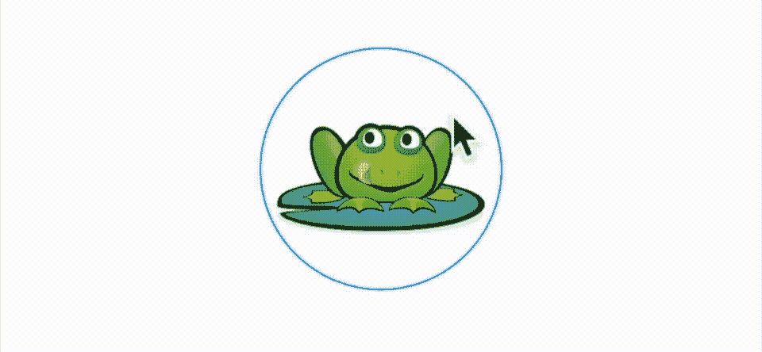

# 使用 SwiftUI2.0 纠正自定义手势的路径

> 原文：<https://medium.com/geekculture/correcting-paths-on-custom-gestures-with-swiftui2-0-7113019684f0?source=collection_archive---------3----------------------->

## 寻找不同的方法来改善绘画

Redrawing a circle so that it will definatively be matched as a circular gesture

我上周发表了一篇文章，谈到了创建一个自定义手势，一个圆形手势。这篇文章本质上是对 https://www.raywenderlich.com[网站上的这篇优秀的](https://www.raywenderlich.com)[教程](https://www.raywenderlich.com/1724-uigesturerecognizer-tutorial-creating-custom-recognizers#toc-anchor-006)的更新。虽然有太多的话要说，以真正做到公正。那篇论文的关键词是…