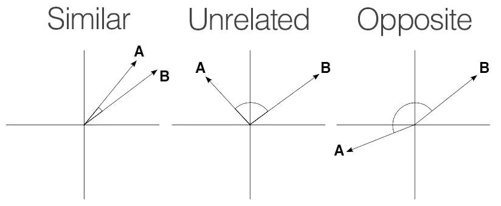
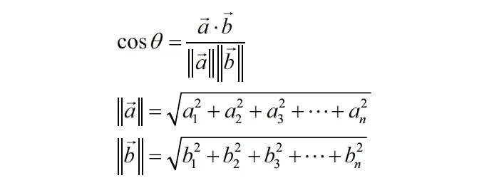

# 机器学习基础:余弦相似性和余弦距离

> 原文：<https://medium.com/geekculture/cosine-similarity-and-cosine-distance-48eed889a5c4?source=collection_archive---------18----------------------->

余弦相似性是一种度量，用于测量在多维空间中投影的两个向量之间的角度的余弦。

> 两个向量之间的角度越小，它们彼此越相似。

假设两个向量之间的角度为 90 度，余弦相似度的值将为 0；这意味着这两个向量相互垂直，这意味着它们之间没有相关性。

随着余弦相似性度量越来越接近 1，则两个向量 A 和 B 之间的角度变得越来越小。在这种情况下，A 和 B 彼此更相似。

Source: [pyimagesearch](https://www.pyimagesearch.com/)

余弦相似性在数学上被描述为向量的点积和每个向量的欧几里德范数或幅度的乘积之间的除法。

其中，`a`和`b`是多维空间中的向量。

因为𝑐𝑜𝑠(𝜃)值在范围[1，1]内:

*   1 值将表示强烈相反的向量，即没有相似性
*   0 表示独立(或正交)向量
*   1 表示向量之间的高度相似性

**余弦距离:**

通常，人们使用余弦相似度作为向量之间的相似性度量。现在，余弦距离可以定义如下:

> **余弦距离= 1 —余弦相似度**

这背后的直觉是，如果 2 个向量完全相同，那么**相似度**是 **1** (角度=0，因此𝑐𝑜𝑠(𝜃)=1)，因此，**距离**是**0**(1–1 = 0)。

## 余弦相似性的应用:

1.  该指标用于数据挖掘、信息检索和文本匹配过程
2.  在推荐引擎中用于推荐相似的产品/电影/节目/书籍。
3.  在信息检索中，使用加权 TF-IDF 和余弦相似度是快速检索与搜索查询相似的文档的一种非常常见的技术。
4.  基于余弦相似性的局部敏感散列技术提高了匹配 DNA 序列数据的速度。