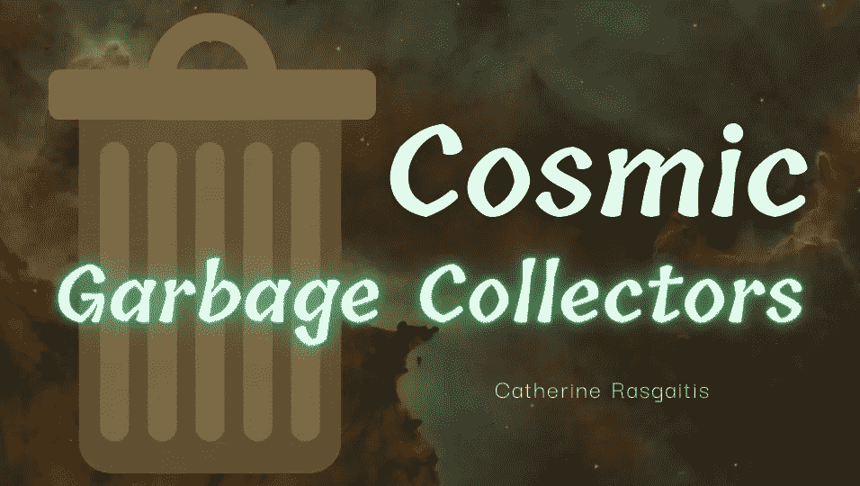

# 宇宙垃圾收集器

> 原文：<https://medium.com/geekculture/cosmic-garbage-collectors-358f25459c70?source=collection_archive---------34----------------------->

## 探索地球充满垃圾的轨道…以及如何清理垃圾

photo by [NASA](https://unsplash.com/@nasa), courtesy of [Unsplash](https://unsplash.com/photos/-hI5dX2ObAs)

今天，垃圾随处可见。垃圾填埋场的垃圾逐渐流入供水系统。海洋被塑料填满了。甚至空气也被温室气体污染了。

不幸的是，太空也不例外。