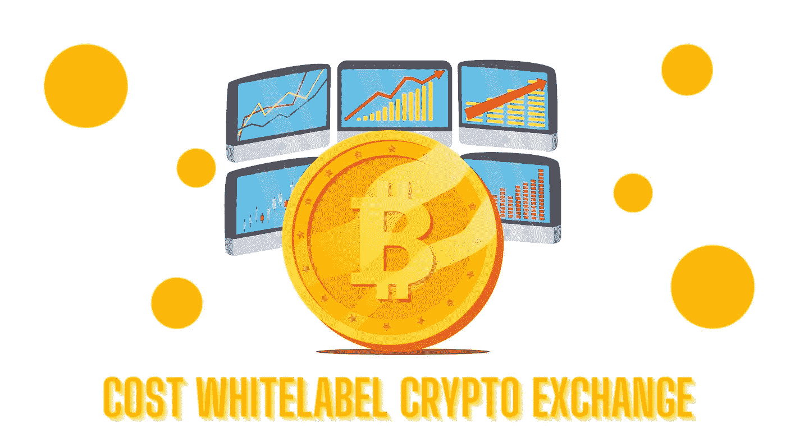

# 白标加密交易所的成本- 2022 年

> 原文：<https://medium.com/geekculture/cost-of-whitelabel-crypto-exchange-dab9367aeb94?source=collection_archive---------13----------------------->

**Cost Of White label Crypto Exchange**

在一个现代化和技术进步的世界里，有一个神奇的密码世界正在创造一种趋势。当你开始投资加密货币时，它总能给你带来很多。

而一个交流平台，则是一片充满可能的土地。它有非凡的便利设施，使它成为最好的。此外，与市场上的其他交易所相比，它的价格非常便宜。获得加密交换并不是最难的，但是获得正确的交换是最重要的。

交易所世界中最重要的一个是白标交易所。据说这是最实惠的一款，并且由于其非凡的能力，可以很容易地在市场上推出。

要得到一个，你需要知道白标密码交易所 的[**费用。一定要多了解他们，然后尝试建立你选择的最非凡的分散式交易所。**](https://bit.ly/3bhihav)

## 什么是白标加密交换？

一个 [**白标加密交换**](https://bit.ly/3bhihav) 是一个读取部署解决方案，可以很容易地在市场上推出。这种交换与其他交换相比是最好的，而且很容易实现。它具有丰富的安全性，是效率最高、性价比最高的解决方案。这是一个分散的交易所，可以用来交换密码，以换取法定货币。

## **它有什么意义让你去买？**

白标交易所是一个分散的交易所，允许在没有第三方参与的情况下进行点对点交易。它是所有交易所中最安全的，因为它以完全透明的方式处理直接交易。它让每个人都惊叹于船上最广泛的证券。购买现成的解决方案，如[白色标签](https://en.wikipedia.org/wiki/White-label_product)，然后根据您的要求进行定制。

你不可能在市场上以一个**可承受的价格**得到一个类似的产品，这就是它的重要性，让你选择一个。

你已经听说了它的重要性，并想建立一个交易所或利用一个白色标签交易所。但是你要知道开发 one 的**成本。**

# 白标密码交易所的费用

白标加密交易所是最罕见的交易所之一。交换的成本取决于您尝试在其中部署的功能。功能越多，花费越多。然而，选择它们将是密码交换发展中最重要的任务。

它们有一些非凡的特性，可以引导你进入一个更好的环境:

## **交易所的特点**

这些特征向他们展示了他们建造得有多好。现在让我们来看看:

*   性价比高
*   易于部署
*   可定制的软件
*   低平台维护成本
*   强大的安全性
*   符合行业标准和法规
*   与流动性提供者整合

## **发展**

加密交换的 [**开发**](https://bit.ly/3bhihav) 也可以从头开始，但是你需要从一开始就构建好一切。然而，白标加密交易所给了你额外的优势，让它在最早推出。选择最实惠的才是最明智的决定。

您可以联系最有效的 exchange 开发公司，在市场上轻松推出产品。

## **收益**

分散交易所使交易者的资金可以直接从一个人转移到另一个人。他们也可以把钱放在钱包里，通过分散交易找到买家或卖家。它防止任何黑客攻击或威胁，因为运营商不会以不道德的方式使用资金。如果在交易所运营商负责的时候发生了一些事情，就有可能结束托管风险。

## **结论**

白标加密交易所的**成本**是每个人都想知道的第一件事，因为他们将得到市场上最不可思议的一个。如果有人想建立一个能带来巨大创收机会的交易所，他们肯定会考虑安全性。因此，一个白标加密交易所将完成这项工作。选择正确的公司来完成工作，并以令人难以置信的方式成为交易所市场中的最佳公司。