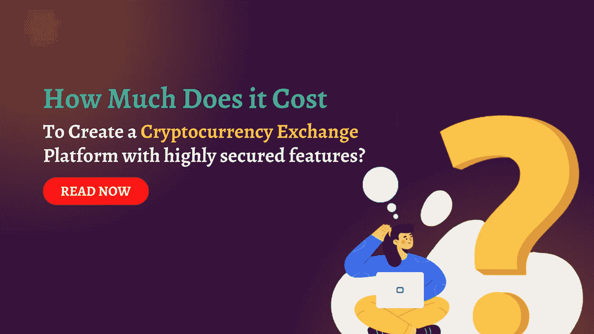

# 创建白标加密货币交易平台的成本

> 原文：<https://medium.com/geekculture/cost-to-create-whitelabel-cryptocurrency-exchange-platform-30d3aafe5de1?source=collection_archive---------17----------------------->

你想知道创建一个加密货币交换平台要花多少钱吗？在这篇文章中了解更多！

根据《财富商业洞察》的数据，2028 年全球加密货币市场预计将达到 19.025 亿美元，2021 年至 2028 年的 CAGR 为 11.1%。

对加密货币交易所不断增长的需求导致开发加密货币交易所平台的成本增加。

加密货币交易平台的开发成本从 5000 美元到 50000 美元不等，这是一个具有标准功能的基本交易平台。无论如何，开发一个网站和一个应用程序的费用从 132，000 美元到 145，000 美元不等。

在本文中，我们将讨论加密货币交易所开发的成本。

## 什么是加密货币兑换脚本开发？

开发加密货币兑换脚本来创建您想要的加密货币兑换脚本。与加密货币专家分享您富有远见的加密项目，这些专家将开始使用最前沿的技术堆栈和结果驱动的业务解决方案进行加密交换。健壮的 [**加密货币兑换脚本**](https://www.cryptocurrencyscript.com/cryptocurrency-exchange-script) 将允许你用区块链技术创业。具有高质量的接口、高安全性和出色的性能。公司有现成的解决方案，可以让你快速开展自己的交易所业务。他们的脚本是专业设计的，安全性很高。

## 我可以用加密交换做什么？

您可以创建一个新的分散在线市场，用于交换任何数字加密资产，而无需在开发、资产安全和员工方面花费数万美元。

发送和接收任何当前的加密货币。

创建、铸造/刻录和冻结/解冻新代币，以实现资产数字化。

用不同的代币组成交易对。

使用创建的交易对发送买卖加密资产的订单。

使用交易视图或任何其他交易图表 API 来监控市场图表上其他市场对的价格和市场活动。

使用各种界面检查交易历史和交易链上的区块。

激活一个完整节点来监听和广播链事务、块和共识。

创建和实施更多工具来改善和增强您自己的加密货币交易所。

## 加密货币交易所的好处

**便利**:加密交易所让用户更容易开户或购买他们的第一种加密货币。这有助于将新的交易者带入加密交易平台，也增加了加密市场的受欢迎程度。

**它们是有执照的:**这些集中交易所中的大多数都是有执照的，并受政府法规的管理。如果出现问题，这可以让交易者安心。

**第三方托管的使用:**他们在交易中扮演中间人的角色，持有货币，直到双方完成交易。因此，一旦交易完成，就没有必要担心交易。

**透明度:**他们向交易员提供他们的地址和位置。因此，如果需要，客户可以更方便地联系他们。

**优惠和折扣:**加密交易所也在大量交易时提供折扣。用户还可以将法定货币兑换成加密货币，并将加密货币兑换成法定货币。

**隐私:**DEX 上的交易(如 pancakeswap)不会与第三方共享任何数据。因此，它允许保护消费者的信息和隐私。此外，在注册集中交换时，需要提供电子邮件、身份证明和电话号码等个人信息。德克斯不需要这些。

**安全性:**去中心化的最大好处是它提供了更高的安全性。加密货币就是为此而创造的，它让消费者能够完全控制自己的资产。

**分散式服务器:**大多数 dex 没有集中式服务器；相反，数据存储在世界各地的多台服务器上。因此，数据是安全的，几乎不可能被黑客攻击。

## 解释加密货币交易所开发成本的重要原因

开发加密货币交易所的成本将由许多原因和因素决定。让我们逐一深入探讨一下:

**1。您需要的功能**

你首先应该考虑的是你的加密货币交易平台需要的功能。有些交易所非常简单，只提供基本的交易功能，如买卖订单和图表。其他的提供了更全面的功能，比如保证金交易，衍生品交易等等。

您需要的功能越多，开发您的平台的成本就越高。因此，仔细检查您需要的特性并只包含那些绝对必要的特性是至关重要的。虽然这似乎是一项艰巨的任务，雇用区块链开发公司可能会导致低于标准的结果。

**2。你的团队规模**

另一个重要的考虑是你的开发团队的规模。如果你只需要一个小的开发团队来开发一个基本的加密交换平台，你可能会成功。如果你想推出一个更复杂、功能齐全的交易所，就需要一个更大的团队。

当然，你的团队越大，你的开发成本就越高。因此，在计划您的发展预算时，请记住您团队的规模。

**3。平台复杂性**

平台的复杂性将影响加密货币交易平台的开发成本。一个复杂的平台将需要更多的时间和资源来开发，从而提高整体成本。功能的数量、用户的数量和安全级别都是影响平台复杂性的因素。

为了不超出预算，在开发加密货币交易平台时考虑这些因素至关重要。鉴于当前的市场状况，选择一个易于扩展以适应未来增长的平台也很重要。

**4。你们团队的位置**

另一个重要的考虑是你的开发团队的位置。例如，如果团队位于生活成本高的地区，开发成本会更高。此外，人才和其他资源的成本可能因地点而异。如果团队在人才匮乏的地区，开发成本会更高。

此外，如果你想省钱，你可能会倾向于雇佣低工资国家的开发人员。团队的位置会影响加密货币平台的开发成本。

**5。开发时间表**

如果您想快速推出您的 exchange 平台，您需要考虑仓促开发计划的成本。随着数字货币的普及，加密货币交易平台变得越来越受欢迎。但是，在启动交换之前，考虑开发所需的时间是至关重要的。

开发一个精心规划和执行的加密货币交换平台可能需要几个月的时间。此外，由于加密货币市场不断变化，因此为平台留出足够的时间来适应新的条件至关重要。通过仔细规划和执行，可以在合理的时间和资金量内建立加密货币交易所。

**6。工具和技术**

开发加密货币交易平台的成本因所使用的工具和技术而异。例如，如果您选择传统的开发方法，由于需要购买或租赁硬件、软件和其他工具，成本可能会更高。

但是，如果您选择使用基于云的解决方案，您的成本可能会更低，因为您只需为您使用的服务付费。此外，使用开源解决方案有助于降低开发成本。在为您的项目选择合适的工具和技术时，考虑所有这些因素以确保您能够控制成本是至关重要的。

**结束**

加密货币交易平台的开发成本将受到许多因素的影响，包括平台的复杂性、团队的位置和开发时间表。为了控制成本，在开始开发过程之前，必须仔细考虑所有这些因素。在 [**加密货币兑换开发公司**](https://www.cryptocurrencyscript.com/cryptocurrency-exchange-development) 团队的协助下，您可以在您的预算内创建一个高质量的加密货币兑换平台。