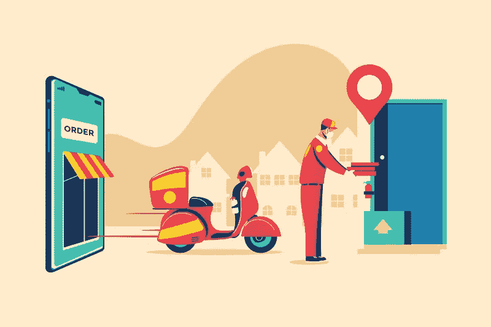

# 开发 Instacart 克隆的成本

> 原文：<https://medium.com/geekculture/cost-to-develop-an-instacart-clone-6f89c7dc2c11?source=collection_archive---------23----------------------->

作为一个企业主，你必须决定最好的现成杂货交付软件，以开始你的按需杂货业务。

弄清楚开发一个杂货交付应用程序的成本可能会很累，因为这涉及到大量的研究。但是我们计划给你准确的信息。

在这篇文章中，我们揭示了黄金三重奏问题，以及如何购买符合您预算的优质应用程序！

grocery delivery app

# 什么是现成的杂货交付应用？

现成的杂货应用程序是一个按需平台，将帮助初露头角的企业家开始他们的杂货配送业务。

按需杂货交付应用程序的目标是在一个平台下连接用户、多家杂货店、快速交付合作伙伴和管理员。

# 黄金三人组提问:

当你计划为你的企业购买现成的杂货应用程序时，这些是围绕着你的想法的黄金三人组问题！

我们在这里以近乎耐心和清晰的态度回答这些问题！

# 1.为什么了解杂货配送 app 开发成本很重要？

了解拥有一个现成的杂货交付应用程序的成本必须是企业家的首要任务。

但你为什么要知道开发和收购一个杂货交付应用程序的成本呢？

了解原因，你永远不会同意我们的观点！

*   构建一个杂货交付应用程序必须符合你的预算计划。
*   您用来开发杂货应用解决方案的技术也是成本因素之一。因此，了解选择何种技术来构建解决方案至关重要。

你在上面读到的每一个理由可能都不是长期投资，但是最初，你会需要你得到的所有支持。老实说，你必须买得起它！

# 2.影响开发成本的因素:

这些因素将帮助你决定你计划为你的按需杂货交付业务创建什么样的应用程序。

*   你更喜欢哪种解决方案:现成的按需杂货交付解决方案，还是从头开始开发的解决方案？
*   您选择用来构建按需杂货交付应用程序的技术类型:原生技术与跨平台技术。
*   当你从零开始开发时，你雇佣的熟练开发人员的数量将影响杂货应用程序开发的成本。
*   您希望杂货交付应用程序具备的特性和功能。

# 3.2022 年开发一款杂货配送 app 的成本是多少？

你为你的在线杂货递送业务创建的应用程序必须是预算友好的。我们先来看两个场景再做选择吧！

**方案一:**

例如，你选择了一个软件开发团队，帮助你从头开始构建一个杂货应用程序。

从头开发一个应用程序的成本从 20，000 美元到 50，000 美元不等，使用原生技术在 7 个多月的时间内构建杂货交付应用程序解决方案。

这花费了更多的时间，更多的金钱，却可能无法让你满意！

**方案二:**

假设您选择购买现成的杂货交付市场应用程序解决方案，该解决方案可由领先的现成解决方案提供商 100%定制。

而且想象一下，上述所有的优势，成本范围都是 3000 美元到 5000 美元！？

是的，你没看错！是不是很神奇？

这个现成的解决方案将拥有所有最新的特性和功能，您将需要在市场上推出您的杂货交付应用程序。

但是，如果您计划现在或在不久的将来定制更多的功能，将收取 25 美元/小时的额外费用。

你渴望拥有一个像我们这样现成的平台吗？

然后，来看看我们的产品， [**WooberlyGrocery！**](https://www.rentallscript.com/grocery-delivery-script/)

## WooberlyGrocery 的技术堆栈:

WooberlyGrocery 是使用最新的跨平台技术——Flutter 构建的。

使用这项技术将帮助您更快地启动您的业务，并且在 UI 和 UX 的情况下输出将是完美的！

WooberlyGrocery 附带一套免费服务，

*   免费白色标签。
*   免费服务器安装。
*   免费提交应用程序。

**注意:**所列福利可能因选择的计划而异。

## 结论:

选择什么是正确的开始你的杂货店送货业务。但我们向您保证，我们的现成应用解决方案将是您企业的最佳操作系统。

您可以与技术专家团队讨论，他们将回答您关于开发流程和其他核心解决方案细节的所有问题！

随意在 [**Whatsapp**](https://wa.me/919626360033) 上聊天。