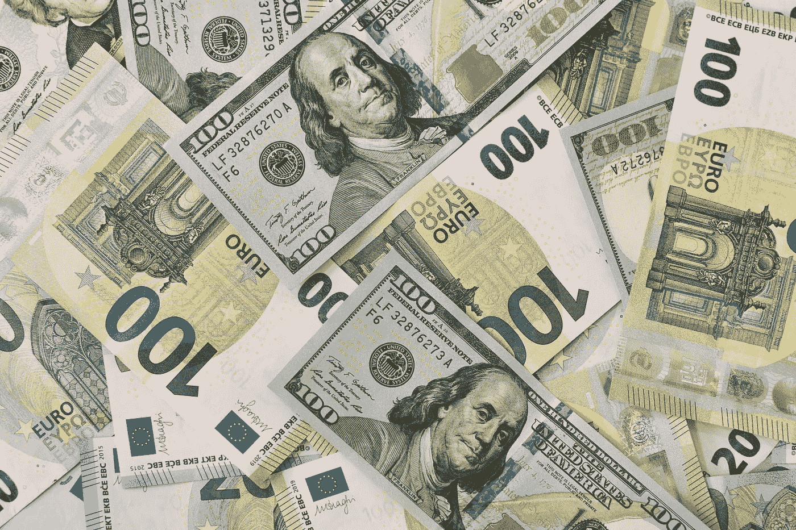

# 比特币能让你免于恶性通货膨胀吗？

> 原文：<https://medium.com/geekculture/could-bitcoin-save-you-from-hyperinflation-e574a6a6b61f?source=collection_archive---------4----------------------->

## 从不同的角度看它

我写关于比特币、加密和金融的文章，是为了分解复杂的概念，让每个人都能理解。请和我一起从不同的角度看待比特币。

在我们继续之前，如果你不明白通货膨胀[读一下这个](https://medium.datadriveninvestor.com/what-is-inflation-59950a16a69f?sk=e653fd13c7f5981e10622bc4d0a391ef)。如果你是比特币的新手，不知道它是什么，[先看这个](/the-capital/what-the-heck-is-bitcoin-anyway-ad07876ade46?sk=2ea41e9c4f3b58b5a025ae0fd23c423f)。