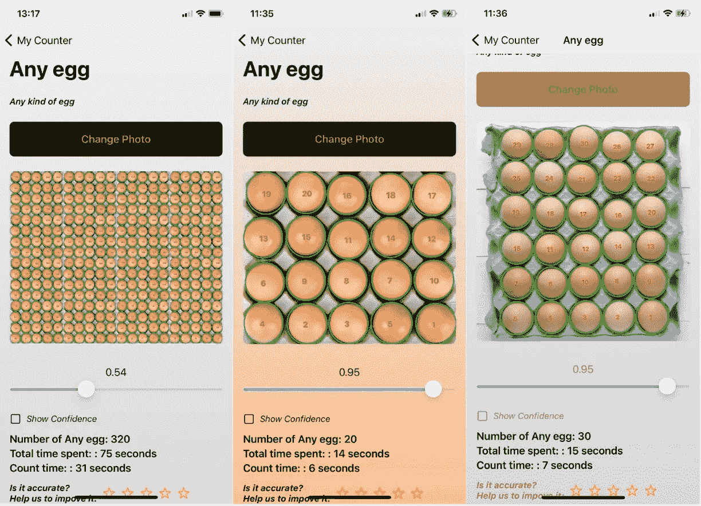

# 基于图像处理和深度学习的图像系统目标计数

> 原文：<https://medium.com/geekculture/counting-number-of-objects-in-image-system-based-on-image-processing-and-deep-learning-e8445fe0dc2d?source=collection_archive---------10----------------------->

在这个系列中，我将告诉你如何建立一个包含计数方法，python 服务器，iOS 应用程序客户端以及如何部署它的系统。这可以高精度地计数图像中相似对象的数量。当 ***物体被*** *重叠或部分遮挡时如何计数？*这个系列会帮到你。开始吧！

*Example results for counting eggs*