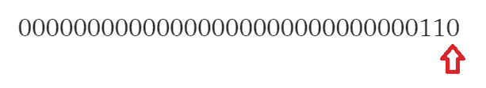
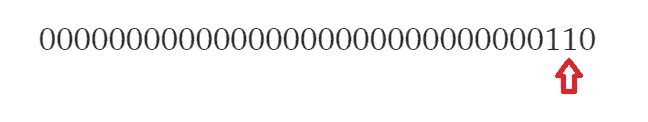
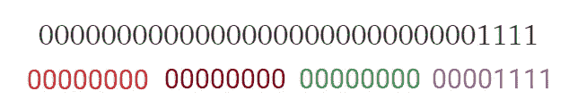
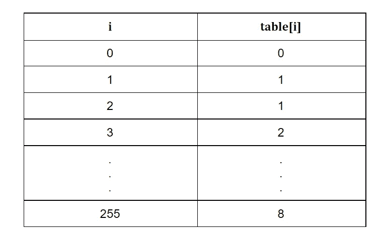
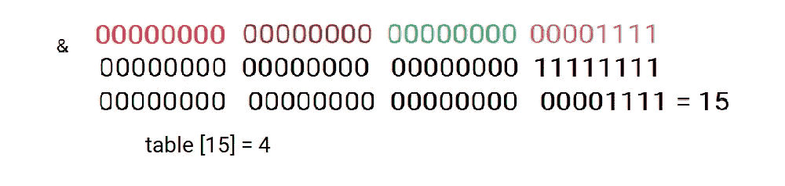
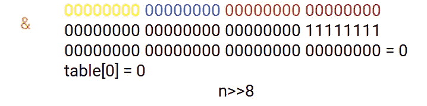
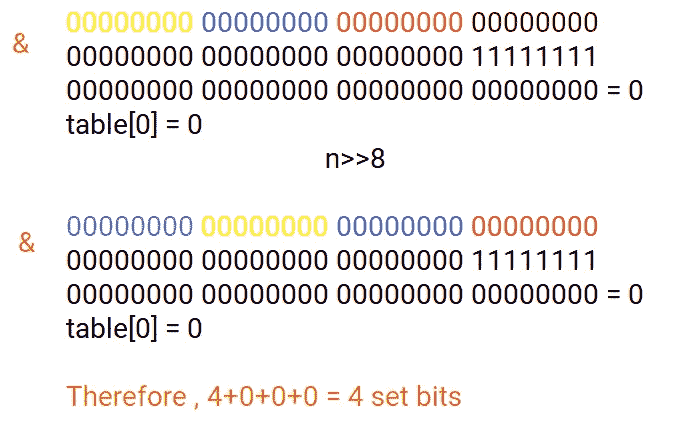
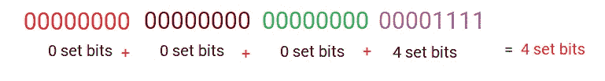

# 计数设置位

> 原文：<https://medium.com/geekculture/counting-set-bits-d309f3652557?source=collection_archive---------41----------------------->

二进制表示中的设置位由 1 表示。当我们用二进制格式表示一个数时，对应于 1 的位称为“置位”，对应于 0 的位称为“未置位”。

例如，让我们取一个数 6
，6 的二进制表示如下
(假设以 32 位格式表示该数):
00000000000000000000000000110

现在，如果我们从最右边的位开始，我们会发现第一位未置位。



现在，当我们向左移动时，我们看到第二位被设置。



如此继续下去。

该数字总共包含 2 个设置位(分别在第二和第三位置)。

> 为了编写一个计算一个数的所有设定位的程序，有许多方法，但我们将看到一种在恒定时间内完成工作的方法，即程序的时间复杂度为θ(1)。


Photo by [Ben White](https://unsplash.com/@benwhitephotography?utm_source=medium&utm_medium=referral) on [Unsplash](https://unsplash.com?utm_source=medium&utm_medium=referral)

所以让我们开始吧…

# **查表法**

这种方法需要一些初始化，然后它只是需要恒定的时间。

1.  二进制形式的给定数(假设 32 位格式)被分成 4 部分，每部分 8 位。例如，让我们拿数字 15
    00000000000000000000000000000001111



该数字分为 4 部分，每部分由 8 位组成
8 位中可以存储的最小数字是 00000000 = 0
8 位中可以存储的最大数字是 11111111 = 255(2⁸-1)

2.我们现在创建一个包含从 0 到 255 的值的表，其中第 I 个表表示数字 I 中的置位位数。
即，表[4]的值等于数字 4(即 1)中的置位位数。



1.  当数字为 0 时，我们没有设置位，因此 table[0]= 0；
2.  当 number = 1(表示为 01)时，我们有 1 个设置位，因此 table[1] = 1
3.  当数字= 3 (011)时，我们有 2 个设置位，因此表[3] = 2
4.  当数字= 255 (11111111)时，表[255] =8。

3.现在，在这个表的帮助下，我们找到了给定数字的所有四个部分中单独设置的位数，并将它们相加

为了找到每组中的设置位

*   我们取每个集合的最大数，即 0xFF(11111111 ),并对该数执行“与”运算，
*   在上表中查找结果值，以找到位数
*   然后将数字右移 8，再继续 3 次。



现在请写一点代码

```
#include <bits/stdc++.h>
**using** **namespace** std;**int** table[256];
**void** initialize(){
**int** i;
table[0] = 0;
for (i = 1; i < 256; i++)
{table[i] = (i & 1) + table[i / 2];}
}**int** lookup(**int** n){
**int** count = table[n & 0xff];
n = n >> 8;
count += table[n & 0xff];
n = n >> 8;
count += table[n & 0xff];
n = n >> 8;
count += table[n & 0xff];
return count;
}**int** main(){
**int** n;
initialize();
cin >> n;
cout<<lookup(n);
return 0;
}
```

Wohoo！你在恒定时间内解决了这个问题。


Photo by [bruce mars](https://unsplash.com/@brucemars?utm_source=medium&utm_medium=referral) on [Unsplash](https://unsplash.com?utm_source=medium&utm_medium=referral)