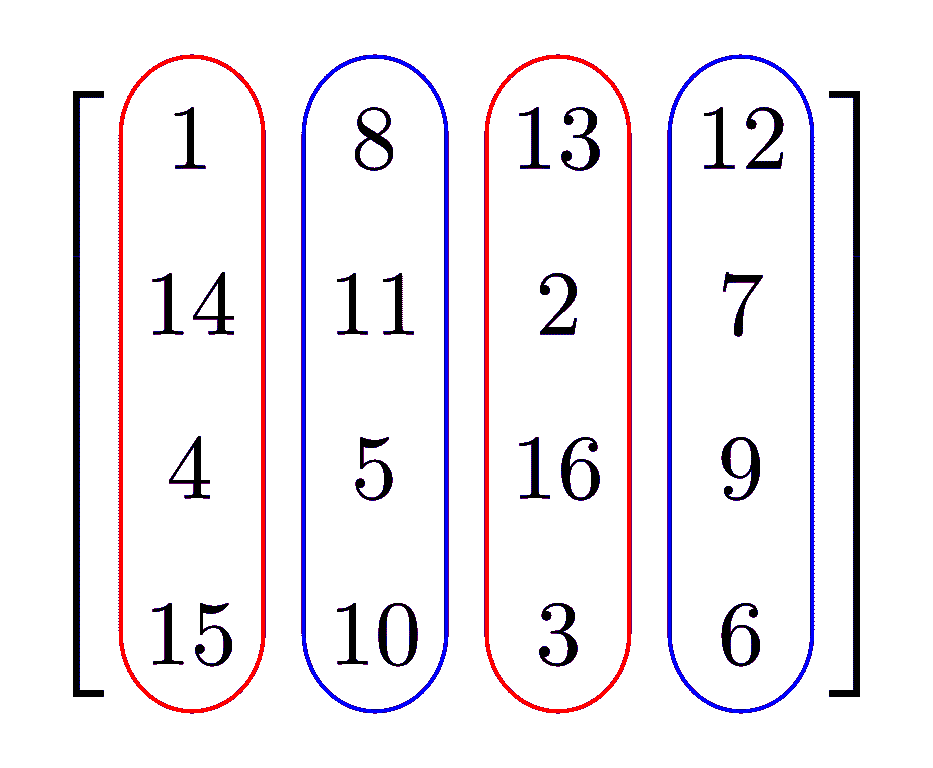

# 课程回顾:用于线性代数的 Python

> 原文：<https://medium.com/geekculture/course-review-python-for-linear-algebra-325dc955ca22?source=collection_archive---------76----------------------->

因为我一直在努力提高我的 Python 编程语言的知识和技能，所以我决定参加一些免费的课程，试图提高我的知识基础。我在 YouTube 上找到了一门关于线性代数的课程。我决定观看视频并承担课程工作，因为它侧重于 Python 编程语言，这是我想提高技能的东西…