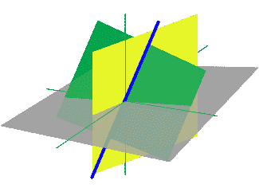

# 课程回顾:Udacity 的 Python 线性代数课程

> 原文：<https://medium.com/geekculture/course-review-udacitys-linear-algebra-course-with-python-1b3f4f37f457?source=collection_archive---------38----------------------->

为了提高我的 Python 编程技能，我注册了 Udemy 的免费在线线性代数课程。线性代数据说是机器学习的基础，所以我想拿起这个技能。这门课程旨在让那些已经学习过这一数学分支的人重温一下。我从未学过线性代数，但学了代数和…