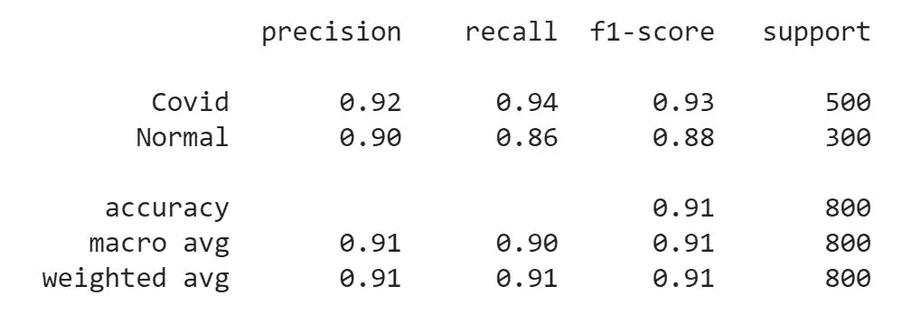
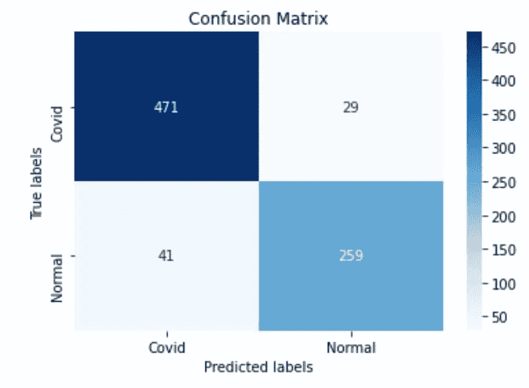
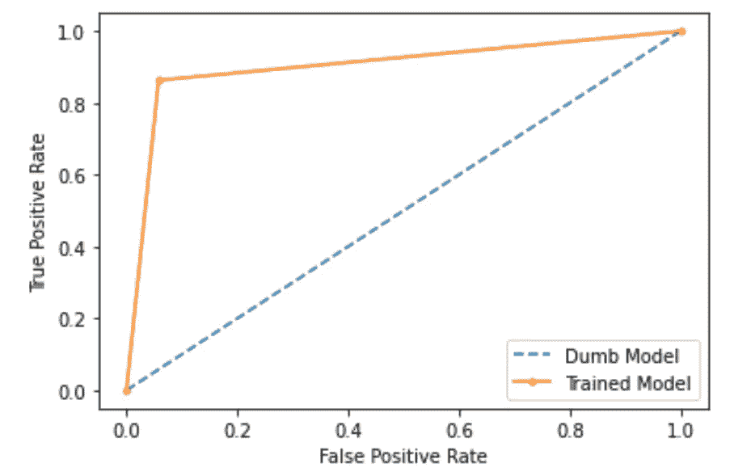

# 通过分析胸部 X 射线图像进行新冠肺炎检测-I

> 原文：<https://medium.com/geekculture/covid-19-detection-by-analyzing-chest-x-ray-images-i-e693ec21a3cc?source=collection_archive---------45----------------------->

## 尝试使用 ResNet50 深度学习模型通过分析胸部 X 射线图像来检测患者中的新冠肺炎

Photo by [National Cancer Institute](https://unsplash.com/@nci?utm_source=medium&utm_medium=referral) on [Unsplash](https://unsplash.com?utm_source=medium&utm_medium=referral)

# 介绍

冠状病毒(新冠肺炎)是一种由影响哺乳动物和鸟类的相关 RNA 病毒引起的传染病。自 2019 年 12 月中国武汉报告首例病例后，冠状病毒成为全球疫情，已导致全球约 380 万人死亡(截至 6 月 18 日)。诊断患者是否患有新冠肺炎的技术之一是研究他们的胸部 x 光片，以寻找可能感染的证据，然后实施必要的治疗以治愈他们的疾病。

我决定通过利用预先训练的深度学习模型的力量来自动化这个诊断过程。深度学习模型将分析胸部 x 光图像，并帮助更快地诊断患者体内的新冠肺炎病毒。

# 问题陈述

*开发一种胸部 x 射线分类器，可对 x 射线进行适当分析，并确定患者是否为新冠肺炎阳性或阴性。*

# 工作流程

为了开始这个项目，我必须获得一组好的胸部 x 光图像，这些图像可以用于训练深度学习模型。我说的好是指既满足数量又满足质量的数据集。数量很重要，因为深度学习模型尽可能多地进行概括是至关重要的。另一方面，质量很重要，因为低质量的图像会使深度学习模型难以在训练阶段从图像中提取定义的训练点，从而大大降低模型精度。

有兴趣实现胸部 x 光分类器项目的读者可以从下面的 [*链接*](https://drive.google.com/file/d/1ADJMC7r8tcIudk1VecAFi4b32dEDiHe_/view?usp=sharing) *下载数据集。*

## 数据预处理和数据扩充

获得了项目的理想数据集后，我开始分析它。我的第一个观察是，目前的图像数量仍然不足以充分训练深度学习模型。此外，在训练阶段，图像必须转换为深度学习模型可以接受的格式。

幸运的是，我有办法通过一个简单的过程来克服我的数据集中的上述缺陷。我使用了来自 Keras*的 *ImageDataGenerator* 库来执行数据扩充。同时，我从 Keras 中的 ResNet50 包中导入了*预处理 _ 输入*。Preprocess_input 有助于将图像转换成 ResNet50 模型可以接受的输入格式。然后，我将这个包作为输入传递给 ImageDataGenerator 包中的参数“preprocess_function”。*

这种技术有助于创建额外的图像，这些图像帮助我充分训练我的深度学习模型。同时，它帮助我处理图像，并为训练阶段做好准备。

我得到的最终结果是，训练集有 7800 张图片，验证集有 1008 张图片，测试集有 800 张图片。我的整个数据集中总共有 9608 张图片。

## 模型培训和模型评估

**第一步:训练深度学习模型。**

数据预处理和数据扩充阶段有助于生成充分训练和测试深度学习模型所需的必要数据。现在是时候使用训练和验证数据来训练深度学习模型了。

为此，我首先从 Keras 下载了 ResNet50 深度学习模型，之后我添加了一个*平坦层*和一个*致密层。*此外，我确保在下载整个模型时不会检索 ResNet50 模型的上层，并决定将*layer . trainible*参数设置为 false。

接下来，我使用了 Keras 提供的另外两个包，分别是 *EarlyStopping* 和 *ModelCheckpoint* 。EarlyStopping 用于确保我不会过度拟合模型，并且当验证准确性没有增加时，训练会停止。而 ModelCheckPoint 用于在一个时期结束时验证准确性增加时立即保存模型。

最后，在开始训练过程之前编译模型时，我将 *Adam* 优化器的学习率设置为 *1e-1。*原因是 1e-1 的学习率在准确度、精确度和召回率方面为我提供了最佳结果。我决定对模型进行 30 个时期的训练，但训练过程在第 13 个时期后停止，因为验证准确性没有增加。这确保了我不会过度适应我的深度学习模型。

**步骤 2:使用测试数据评估模型性能。**

训练一完成，保存了最佳模型，就到了测试深度学习模型的时候了。如前所述，我有大约 800 张胸部 x 光照片，可以用来测试模型性能。

首先，我决定计算训练模型的*精度*。*评估*方法帮我评估了模型的准确率，结果是 91.25%。

接下来，我决定为我的训练模型计算*精度*以及*召回*。根据用例，我决定更加强调回忆，因为我的模型不能将患有 covid 的患者的 x 射线归类为正常。这将意味着患者将会得到错误的信息，这可能会使他/她付出生命的代价。我决定使用 sklearn 软件包中的*分类报告*，并计算训练模型的精确度和召回分数。

(Image by Author)

从上图中我们可以清楚地看到，covid 标签的召回分数高于普通标签的召回分数，这正是我想要实现的。在训练阶段，我确实在不同的学习速度下取得了稍高的准确率，但这意味着对回忆分数的妥协，这是我没有准备好的。因此，我决定保持 1e-1 的学习率，这种学习率达到了相当高的准确率和非常好的回忆分数。

此外，我还绘制了融合矩阵图，这让我可以看到正确分类的图像数量和错误分类的图像数量。

(Image by Author)

最后，我绘制了 *ROC 曲线*并计算了 *AUC 分数*以确定模型的准确性不是模型表现的一些错误指示。我想确保根据训练数据训练的深度学习模型不是一些预测每个患者都是 covid 阳性的愚蠢模型。首先，我计算了 AUC 分数，结果是 0.903，然后绘制了 ROC 曲线，这支持了这样一个事实，即我们的深度学习模型确实是一个很好的模型，它基于在训练阶段捕获的训练点进行分类。

(Image by Author)

# 结论

我已经做了两个 NLP 项目，我想接受一个新的挑战，做一个包含图像数据的项目。检测新冠肺炎的胸部 X 射线分类器给了我这个机会，并帮助我使用预训练的模型(ResNet50)工作，并了解其核心功能。此外，它帮助我尝试了不同的技术，用于确定模型的性能，并使我认识到每个模型性能测试的重要性。

这个项目的下一步是将深度学习模型作为后端部署到一个 web 应用程序，该应用程序对属于类别 *Covid* 或 *Normal* 的 X 射线进行分类。在谷歌云平台的应用引擎服务上部署深度学习模型所需的所有步骤的详细演练可以在本博客的第二部分找到。一定要看看那个。

我为这个项目遵循的工作流程可以在我的[***Github***](https://github.com/shaunak09vb/Coronavirus-Detection-using-Chest-X-Ray/blob/main/notebook/Coronavirus_Detection_using_Chest_X_Ray.ipynb)*页面找到。我希望你喜欢看我的博客。*