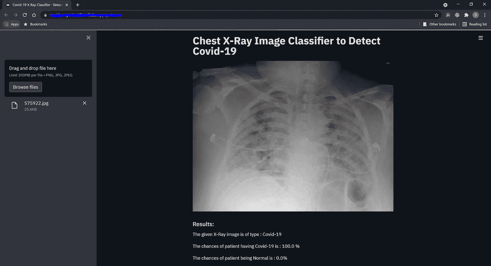
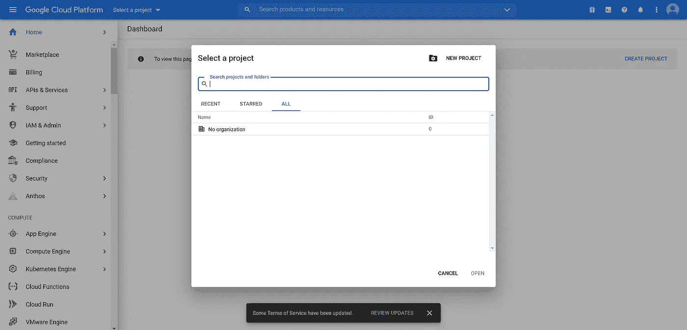
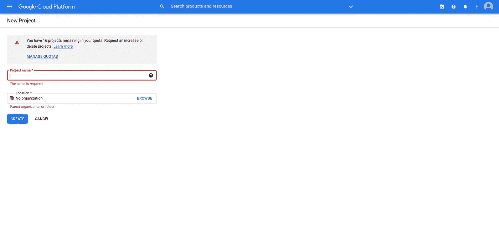
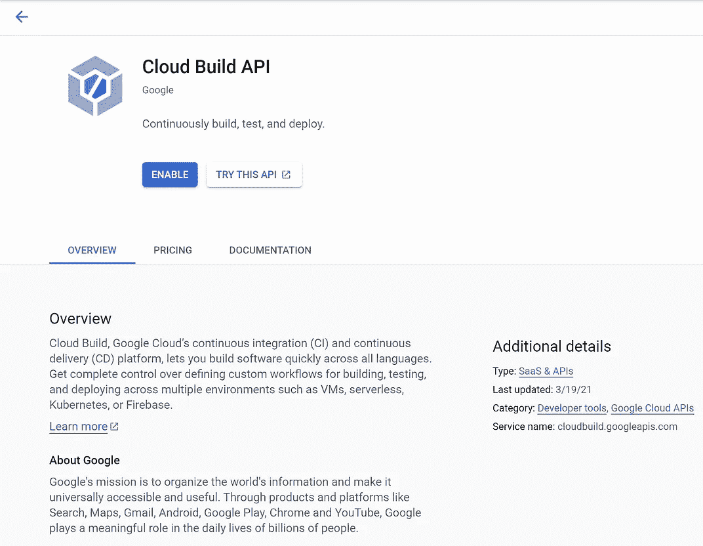
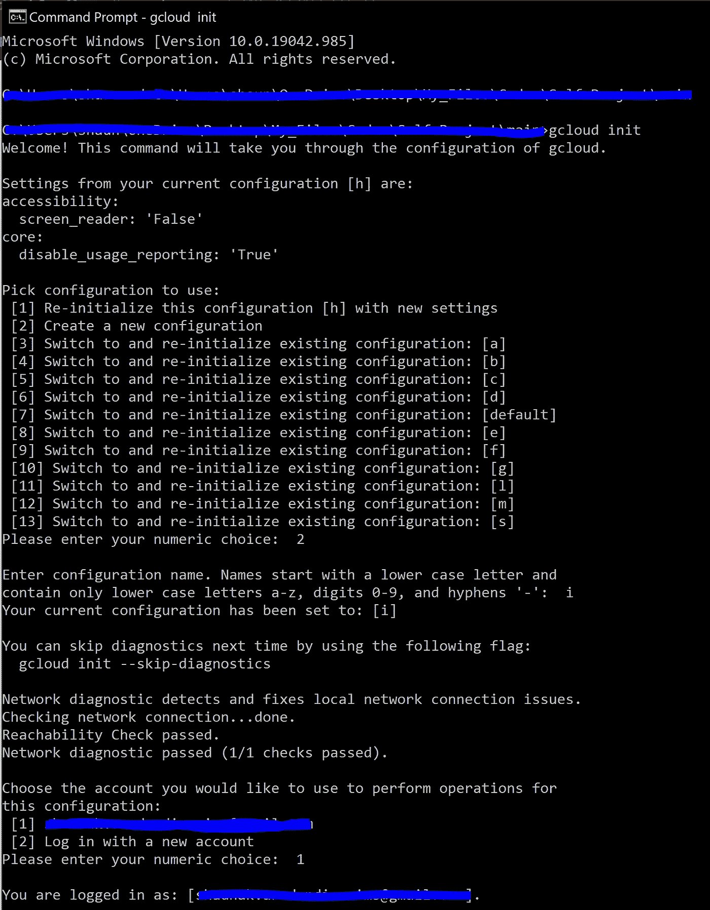
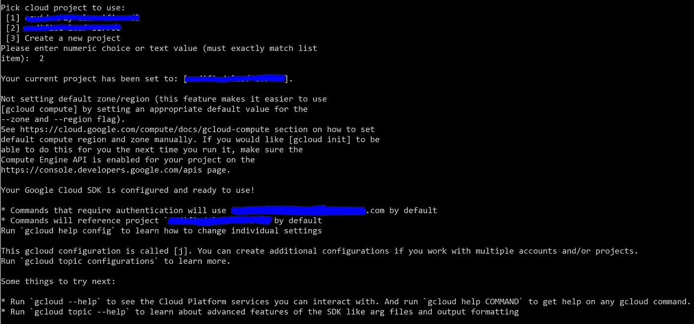
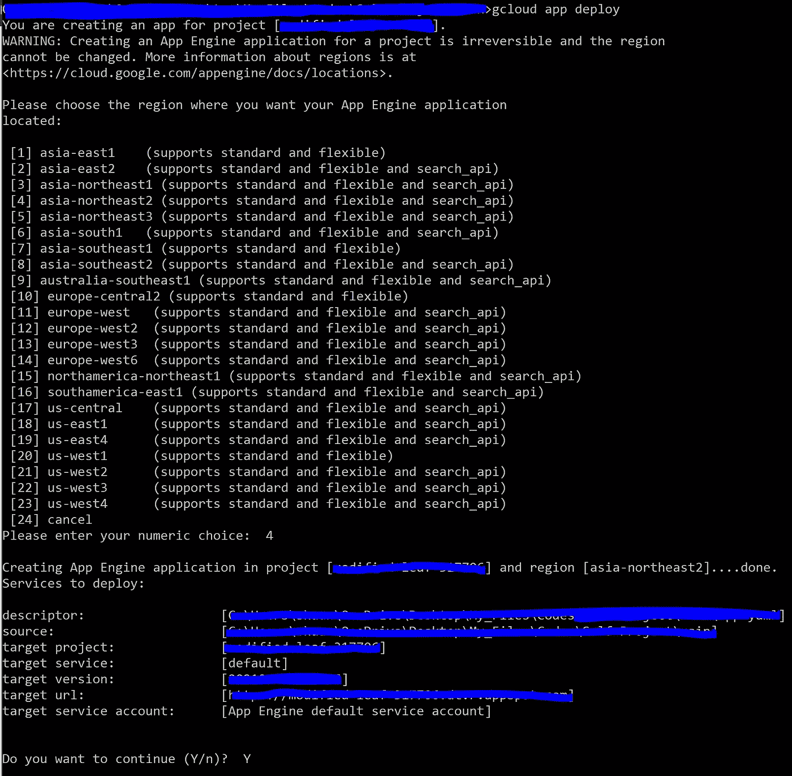
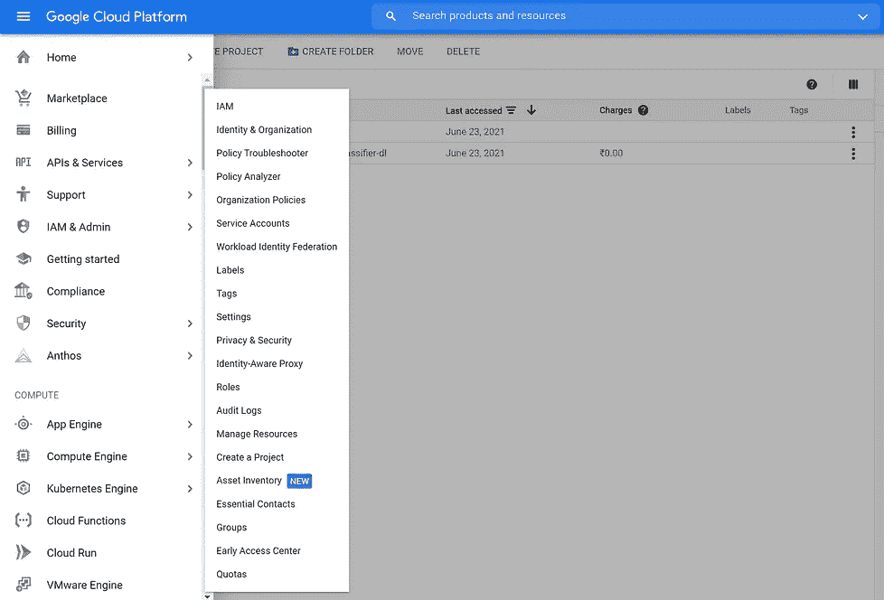
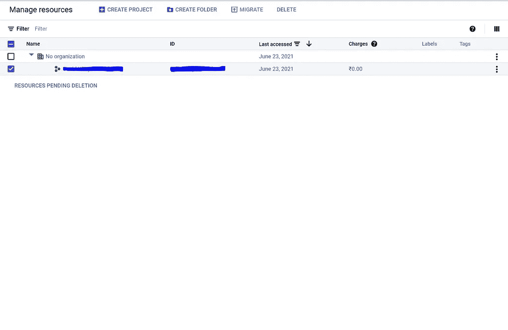

# 通过分析胸部 X 射线图像进行新冠肺炎检测。

> 原文：<https://medium.com/geekculture/covid-19-detection-by-analyzing-chest-x-ray-images-ii-40cdbbf15573?source=collection_archive---------48----------------------->

## 在谷歌云平台的 App Engine 服务上将深度学习模型部署为 web 应用的分步指南。


Photo by [Jonathan Borba](https://unsplash.com/@jonathanborba?utm_source=medium&utm_medium=referral) on [Unsplash](https://unsplash.com?utm_source=medium&utm_medium=referral)

# 介绍

冠状病毒(新冠肺炎)是一种由影响哺乳动物和鸟类的相关 RNA 病毒引起的传染病。自 2019 年 12 月中国武汉报告首例病例后，冠状病毒成为全球疫情，已导致全球约 380 万人死亡(截至 6 月 18 日)。诊断患者是否患有新冠肺炎的技术之一是研究他们的胸部 x 光片，以寻找可能感染的证据，然后实施必要的治疗以治愈他们的疾病。

我决定通过利用预先训练的深度学习模型的力量来自动化这个诊断过程。深度学习模型将分析胸部 x 光图像，并帮助更快地诊断新冠肺炎病毒。

下面这篇文章可以被认为是胸部 x 光分类器项目的第二部分，这篇文章旨在阐述在谷歌云平台的 App Engine 服务上成功部署深度学习模型所需的步骤。尚未阅读胸部 X 射线分类器项目第 1 部分的以下文章的读者可以通过以下*链接*阅读。

# 问题陈述

*开发一个 web 应用程序，用于分析胸部 x 光片并确定患者的新冠肺炎阳性还是阴性。*

# 工作流程

在我关于胸部 x 射线分类器项目的第一篇文章中，我获得了预先训练的深度学习模型 ResNet50 的帮助。我将它作为我的基础模型，并在此基础上构建我的模型的其余架构。模型训练一完成，我就在准确度、精度、召回率、混淆矩阵、ROC-AUC 评分等各种模型性能测试上对模型进行了测试。

一旦我确定我的深度学习模型通过了不同性能测试的审查，我就决定将深度学习模型部署为 web 应用程序的后端。与我之前在 AWS 的 EC2 实例上部署深度学习模型的项目不同，这一次，我将深度学习模型作为一个 web 应用部署在谷歌云平台的 App Engine 服务上。

**步骤 1** : **为 web 应用程序创建 UI。**

我使用 StreamLit 库来开发已部署的 web 应用程序的前端。该 UI 包括一个侧边栏，该侧边栏包含允许用户上传他们的胸部 x 射线照片的功能，用户通过预览他们上传的图像来获得结果。在下图中可以看到 web 应用程序的快照。



(Image by Author)

**第二步:** **创建在 Google 云平台上托管 web 应用程序所需的配置文件。**

在我将 web 应用程序部署到 Google Cloud Platforms 的 App Engine 服务之前，需要一些配置文件来确保成功部署。

第一个文件是 *app.yaml* 文件，它用于指定我们的应用程序所需的配置。该文件有助于指定 web 应用程序顺利运行所需的运行时、环境类型和资源设置。

第二个文件是*docker 文件*，它包含了构建和设置 docker 映像以及我们的 web 应用程序将在其中运行的 docker 容器所需的指令和步骤。

最后，我们需要创建 *requiremnts.txt* 文件，并指定 web 应用程序在托管到 App Engine 服务后交付结果所需的库。

现在已经创建了所需的配置文件，我可以继续完成 web 应用程序的部署了。

**第三步:模型部署**

完成 ***步骤 2*** 后，我就有了在 Google Cloud 的 App Engine 服务上部署 web 应用所需的所有文件。在我开始部署过程之前，重要的是下载 Google Cloud SDK 应用程序，并创建一个 Google 帐户来访问 Google Cloud Platform 的 App Engine 服务。

1-一旦完成上述步骤，从您想要的浏览器中搜索谷歌云平台，滚动搜索结果并点击*“云控制台”*。进入云控制台后，导航至左上角并点击*“选择一个项目”。*在接下来出现的弹出窗口中，选择*“新项目”*选项。



(Image by Author)

2 -单击新项目选项会将用户重定向到要求他/她输入项目名称的新屏幕。输入详细信息后，点击*“创建”*，完成创建新项目的最后一步。



(Image by Author)

3 -一旦创建了新项目，启用云构建 API 是很重要的。要启用它，在你的浏览器中打开一个新的标签，粘贴下面的 [*链接*](https://cloud.google.com/build/docs/securing-builds/configure-access-for-cloud-build-service-account) *。*一旦站点加载完毕，点击**蓝色按钮**，上面显示*“打开云构建设置页面”。*在打开的新选项卡中，点击*“查看 API”*，然后点击*“启用”。*成功启用 API 后，关闭选项卡并返回到新创建项目的仪表板。



(Images by Author)

现在是时候将代码部署到谷歌云平台上了。部署将通过我们系统上的本地命令提示符并在 Google Cloud SDK 的帮助下完成，Google Cloud SDK 可从以下 [*链接*](https://cloud.google.com/sdk/install) *下载。*下载完成后，安装 Google Cloud SDK，进入下一步。

5 -您可以在本地机器中打开命令提示符，并将工作目录设置为 web 应用程序脚本文件以及在 ***步骤 2*** 中创建的配置文件所在的位置。

6 -一旦设置了路径，在命令提示符下键入下面指定的命令，这将启动应用程序的部署。

```
gcloud init
```

7-执行上述命令后，下一步是选择配置。选择选项*“创建新配置”*并给配置命名。此外，选择用于在 Google 云平台上创建新项目的 Google 帐户。



(Image by Author)

8-收到成功登录的消息后，选择您为部署 X 射线分类器项目而创建的项目，并等待配置完成。一旦完成，就进入下一步。



(Image by Author)

现在是时候将所有代码部署到在谷歌云平台上创建的项目中了。为此，请在命令提示符下键入以下命令。

```
gcloud deploy
```

接下来，选择您希望 App Engine 应用程序所在的地区，我选择了选项*“4”*。最后，输入*“Y”*开始展开操作。



(Image by Author)

10-一旦部署完成，并且假设部署成功，您将收到您的 web 应用程序的 URL，可用于访问它。此外，您可以在命令提示符下键入下面列出的命令，web 应用程序将在您的浏览器中自动打开。

```
gcloud app browse
```

***警告:一旦您完成了对您部署的 web 应用程序的测试/测试，删除您的 Google Cloud 项目总是最理想的。这防止了招致不必要的服务费的风险。要做到这一点，去侧边栏菜单，选择 IAM & Admin，然后管理资源。该页面显示所有当前活动的项目，选择您创建的用于托管 X 射线分类器项目的项目并将其删除。***



(Images by Author)

# 结论

之前在 Heroku 和 AWS 上部署了机器学习/深度学习模型，我决定通过在谷歌云平台的应用引擎服务上部署 X 射线分类器来扩展我的云部署组合。它让我有机会使用 Google Cloud 接口，使用 Google Cloud SDK 部署代码，并了解 docker 文件的重要性及其在云应用程序部署中的作用。

我能够使用谷歌云平台的应用引擎服务成功部署 web 应用程序，部署的应用程序运行良好，并给出准确的结果。

在我的下一个项目中，目标是在微软的云计算服务 Azure 上部署一个机器学习/深度学习应用程序。

完成这个端到端项目所需的所有项目文件都可以在我的[***Github***个人资料中找到。我希望你喜欢看我的博客。](https://github.com/shaunak09vb/Coronavirus-Detection-using-Chest-X-Ray)