# Python 解释性数据分析-初学者指南

> 原文：<https://medium.com/geekculture/covid-19-explanatory-data-analysis-76cab46c48d1?source=collection_archive---------11----------------------->

## COVID 19 数据集—使用 matplotlib、seaborn 和 plotly

Photo by [Fusion Medical Animation](https://unsplash.com/@fusion_medical_animation?utm_source=medium&utm_medium=referral) on [Unsplash](https://unsplash.com?utm_source=medium&utm_medium=referral)

# 关于数据集

以下分析是在 GitHub 上免费提供的 Covid 19 数据集上进行的。这是一个近乎实时的数据集，每天都会频繁更新。

在这个数据集中，我尝试对各种特征进行分析，以了解病毒在不同地理区域的传播，以及工业化国家在经济上受到的影响。

# 目录

1.  [数据准备和清理](#5900)
2.  [准备和清理原始 Covid 数据](#70d5)
3.  [探索性分析与可视化](#8ea7)
    - [受影响国家 GDP 趋势](#2c3f)
    - [医疗基础设施](#c34d)
    - [人为因素](#2b54)
4.  [问答](#6eb3)
    -[Q1——哪个国家每百万人的病例数和死亡率最高？](#15d6)
    -[-Q2-哪个国家的百万人口死亡率最低？](#d1a2)
    - [Q3-每个大洲下有多少个国家？](#ad87)
    - [Q3.1-各大洲有哪些病例 vs 死亡率？](#1b0b)
    - [Q4-死亡率超过 10%的国家有哪些？](#3b78)
    -[Q5-3 月份全球冠状病毒病例是多少？](#dd50)
    -[Q6-3 月至 6 月的 Covid19 价差是多少](#0f0c)

5.[推论和结论](#3099)

6.[参考资料和未来工作](#1423)

## 导入所需的库

# №1:数据准备和清理

在下面的几个单元格中，我从数据源读取数据，并访问一些样本记录

# №2:准备和清理原始 Covid 数据

这样做是为了使数据集适合于分析。现有的数据集可能包含垃圾和不相关的值，因此清除这些数据非常重要。我只选择了那些与我的分析相关的列。

移除没有洲信息的位置

将日期列转换为数据时间数据类型

# №3:探索性分析和可视化

以下是数据集各种属性的特征分析

## 受影响国家的国内生产总值趋势

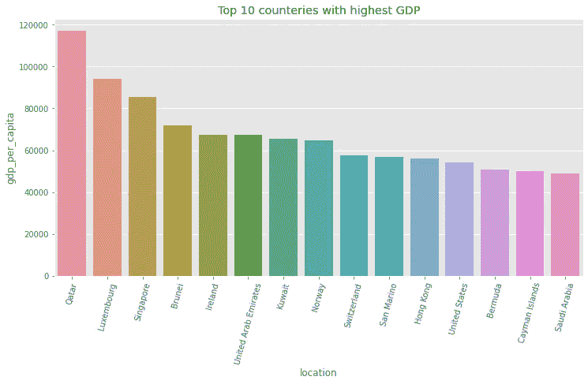

上述趋势显示了 210 个国家中人均国内生产总值最高的国家。

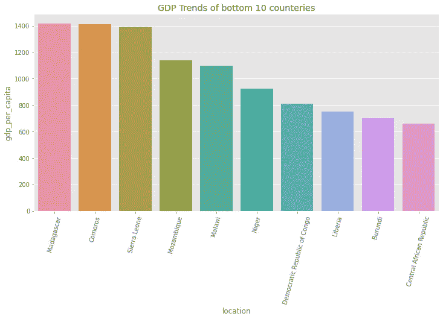

上图显示了 GDP 最低的国家。因此，由于 Covid19，这些国家的经济受到了重大打击。

# 医疗基础设施

在这里，我试图分析拥有最好医疗基础设施的国家

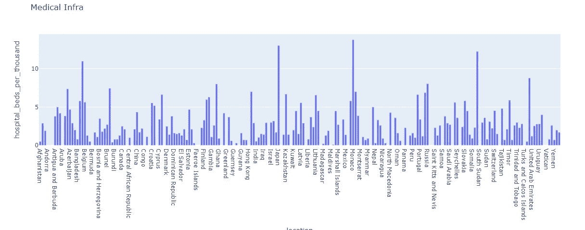

像白俄罗斯、日本、摩纳哥和韩国这样的国家拥有最多的医院床位

# 人为因素

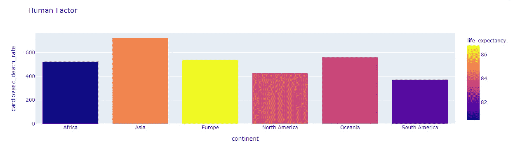

上述数据显示，亚洲是心血管相关疾病死亡率最高的地区。

就预期寿命而言，欧洲似乎是预期寿命最高的。发达国家似乎有更多的预期寿命，因为他们有更好的医疗基础设施。

# №4:提问和回答问题

## 哪些国家的每百万病例数和死亡率最高？

前 10 个国家——每百万病例数与每百万死亡数之比最高

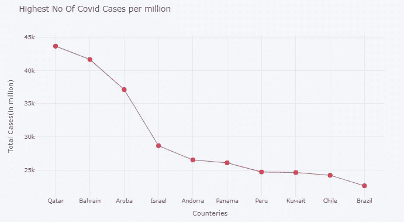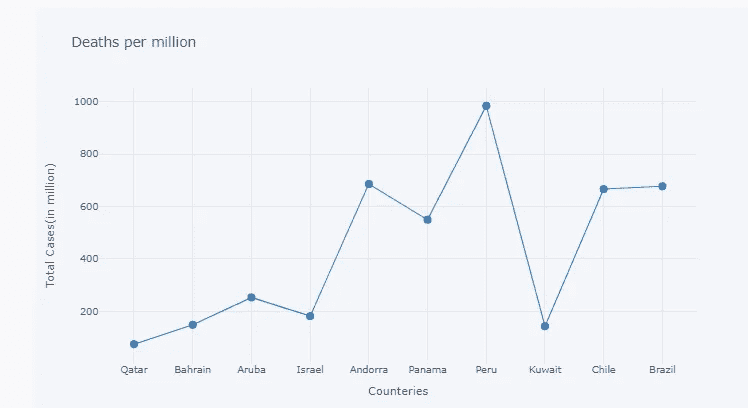

从上面两张图我们可以得出结论，即使在卡塔尔、巴林等国家总病例数很高。但是死亡率很低。秘鲁的死亡率最高

## 哪些国家的百万分之死亡人数最低？

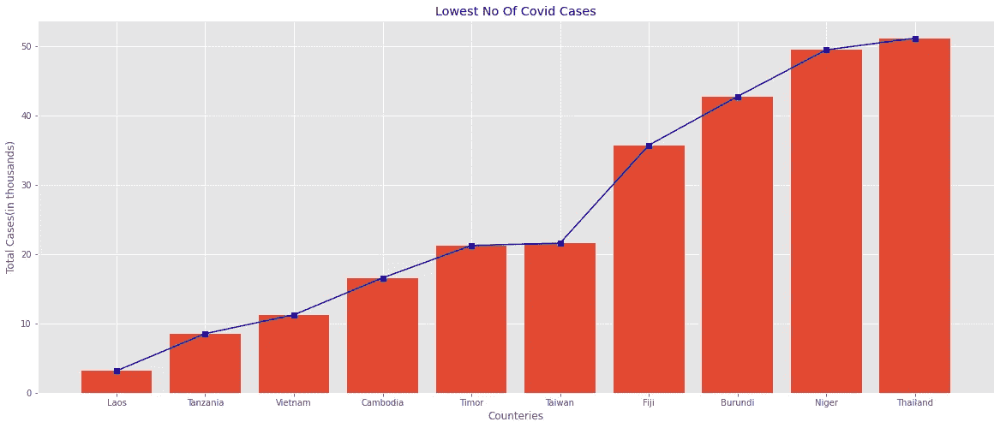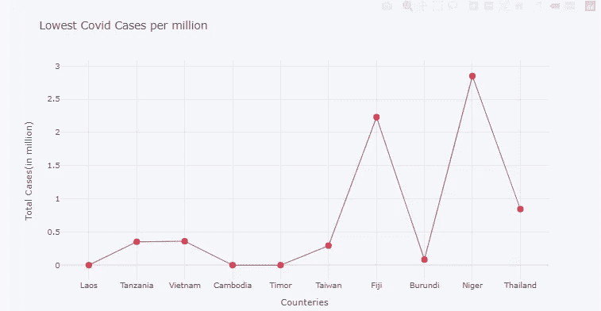

根据上面两张图，我得出结论，尽管柬埔寨、帝汶和布隆迪的 Covid 病例在上升，但总死亡人数有所下降。

像斐济和尼日尔这样的国家，死亡人数突然增加

## 每个大洲下有多少个国家？

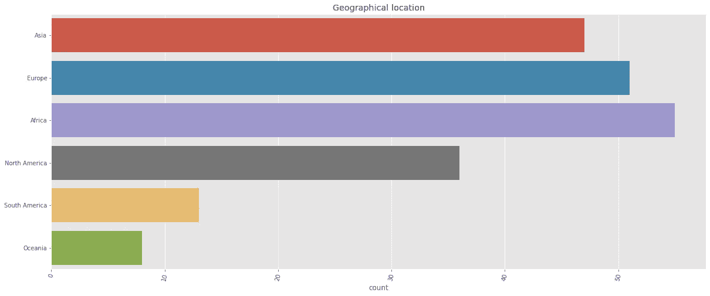

## 各大洲的病例数和死亡率是多少？

在南美洲国家观察到的病例总数差异最大，在非洲观察到的差异最小

## 死亡率超过 10%的国家有哪些？

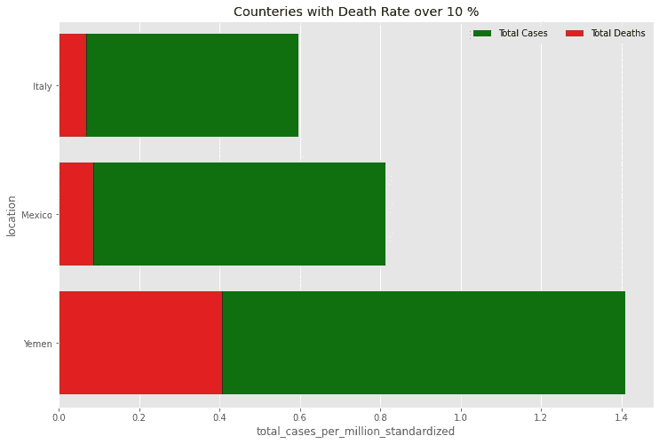

上述数据显示，也门的死亡率最高

## 3 月份全球冠状病毒病例是多少？

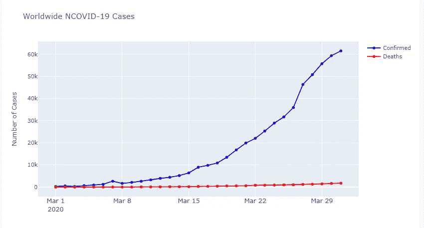

## 2020 年 3 月至 6 月的 Covid19 价差是多少？

# №5:推论和结论

我从这些数据中得出了许多有趣的推论，下面是其中几个的总结:

*   非洲国家似乎是世界上 GDP 最低的国家。
*   日本和韩国拥有最多的医院床位来应对疫情。
*   在所有大陆中，亚洲因 Covid 而导致的死亡率最高。
*   卡塔尔似乎在抗击疫情方面做得相当好，它拥有最高的每百万病例数，但也能够保持最低的每百万死亡率。
*   就每百万人的总死亡人数而言，南美洲似乎是变化最大的大陆。
*   也门是唯一一个死亡率超过 20%的国家。
*   我们还观察到，从上周到 3 月，病例总数急剧上升。

# №6:参考文献和未来工作

未来的工作

在当前的分析中，我只使用了 18 个特征，但我只是触及了表面。数据集有近 40 个特征。因此，可以对剩余的特征进行更多的分析。

参考

*   数据集—[https://github . com/owid/新冠肺炎-数据/树/主/公共/数据](https://github.com/owid/covid-19-data/tree/master/public/data)
*   熊猫用户指南:[https://pandas.pydata.org/docs/user_guide/index.html](https://pandas.pydata.org/docs/user_guide/index.html)
*   Matplotlib 用户指南:【https://matplotlib.org/3.3.1/users/index.html 
*   Seaborn 用户指南&教程:【https://seaborn.pydata.org/tutorial.html 
*   阴谋地—[https://plotly.com/python/](https://plotly.com/python/)

最后，我要感谢 Aakash N S 和 Jovian 社区免费帮助我学习👏。如果你喜欢这篇文章，请给我👏。

快乐学习😃