# 新冠肺炎疫苗和有趣的趋势

> 原文：<https://medium.com/geekculture/covid-19-vaccinations-and-interesting-trends-87cb99f4b551?source=collection_archive---------50----------------------->

作者:萨曼莎·钟(项目负责人)、安妮·李、什里什·卡尔贾吉和伊莎·沙阿

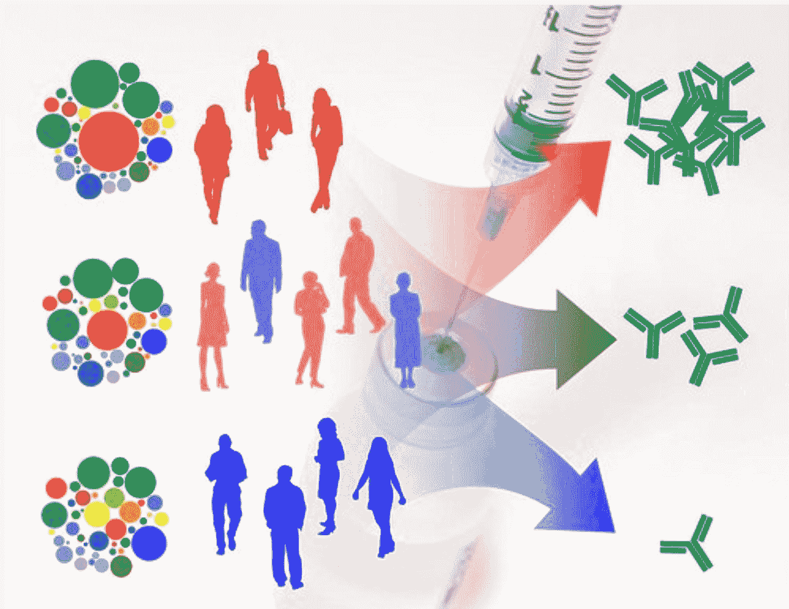

Source: [Flickr](https://www.flickr.com/photos/54591706@N02/14165434229)

# **简介**

COVID-19 疫苗分发不仅是一个医学问题，也是全世界的一个社会和政治问题。在这篇文章中，我们对疫苗分销可能的经济和政治联系感到好奇。像这样的问题:对疫苗的类型有特别的偏好吗？不同国家的疫苗接种数量有何不同，为什么？通过各种可视化和分析，我们希望以基于数据的方式回答这些问题。

由于 COVID 19 疫苗接种通常是区域性的，我们决定对不同大洲的部分选定国家进行分析。为了进行这项分析，提取了标注为“每百万人接种疫苗数”的变量。

# **非洲和南美洲**

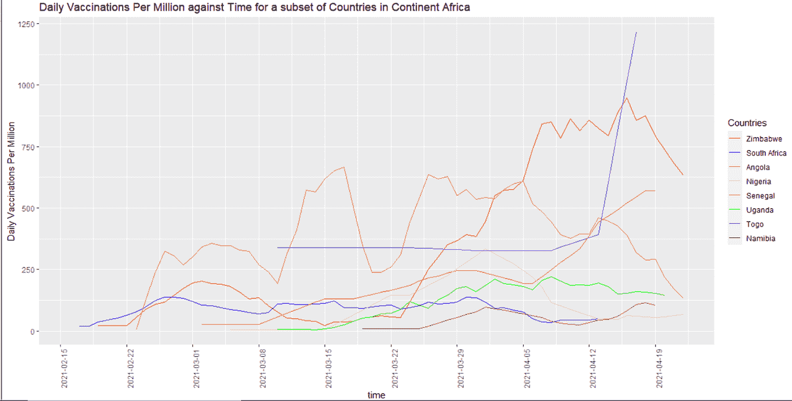

从上面的数据中，我们注意到一些值得深入分析和研究的趋势。首先，多哥经历了每百万人每日接种疫苗数量的"稳定期"，但从 4 月份开始，每百万人每日接种疫苗数量突然增加。此外，非洲大陆的许多国家没有显示出明显的趋势，每百万人接种疫苗的数量有增无减，例如安哥拉。还有一些国家每百万人每日接种疫苗的数量普遍在逐渐增加，最明显的是津巴布韦。

这些发现出乎意料，因为与国内生产总值较高的非洲国家相比，国内生产总值较低的非洲大陆国家每百万人的每日疫苗接种量有较大的增长。例如，从图表中可以看出，多哥和津巴布韦似乎在逐步增加每百万人的每日疫苗接种量，但截至 2019 年，它们的国内生产总值分别为 54.9 亿美元和 214.4 亿美元。相比之下，南非等国家的 GDP 为 3514 亿英镑。然而，与国内生产总值较低的国家相比，南非每百万人接种疫苗的数量似乎相对稳定。这一趋势或许可以用 COVAX 计划来解释，世界卫生组织通过该计划向非洲各国运送了大量疫苗，其中包括多哥( [BBC 新闻来源](https://www.bbc.com/news/56100076))。

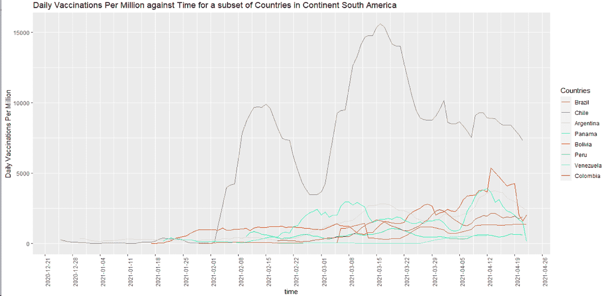

从上图中可以看出，智利似乎拥有最高的疫苗接种率，以每百万人每天接种的疫苗数来衡量。其余国家，如阿根廷、巴拿马、委内瑞拉和哥伦比亚，其疫苗接种似乎呈现出相对“稳定”的趋势，每天的接种人数都在增加和减少。这一趋势似乎是有道理的，因为智利是南美各国中国内生产总值最高的国家之一。截至 2019 年，其国内生产总值为 2823 亿美元。

预计随着国内生产总值的增长，该国将有更多的资源和能力为其公民购买和获得疫苗。此后，该图显示了这一趋势，并验证了一个假设，即对于南美洲而言，GDP 较高的国家通常有更大的能力为其人口接种疫苗。

# **澳大利亚、北美和欧洲**

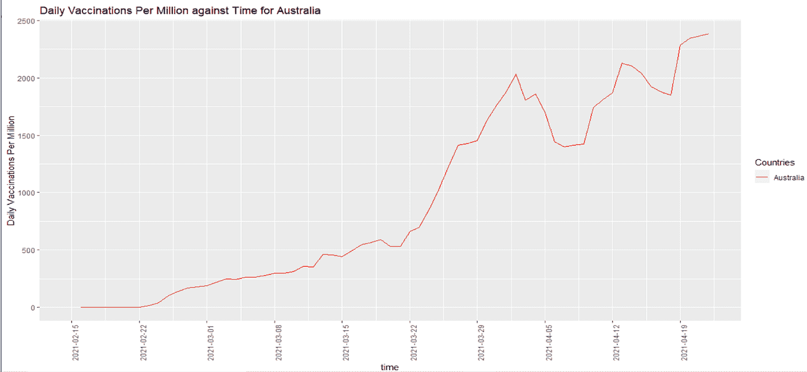

如果我们对比澳大利亚每百万人的每日疫苗接种量，我们会发现随着时间的推移，疫苗接种量会有所增加——正如我们预期的那样，全球范围内的每日疫苗发放量也会增加。

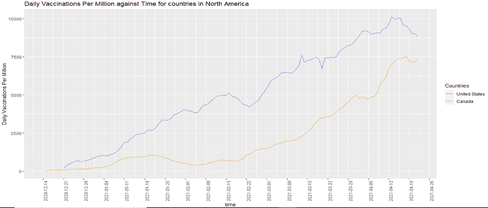

关于北美大陆(上图)，我们可以观察到加拿大和美国都经历了非常高的每百万人的疫苗接种率，并且随着时间的推移不断增加。然而，美国的疫苗接种率似乎略高于加拿大，而且两者的趋势非常相似。这可能是因为地理上的接近，也因为许多疫苗是在美国生产的。

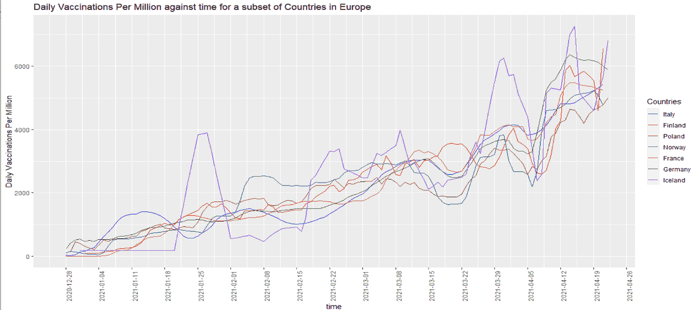

看看欧洲的各个国家，一个令人惊讶的事实是，这些国家中的许多遵循非常相似的“趋势”,每百万人的疫苗接种数量彼此没有差异。这可能是因为欧洲的许多国家都在欧盟之下，许多疫苗接种战略总是涉及整个欧盟，而不是每个国家单独参与。从今以后，这可能会导致疫苗接种的类似趋势。

我们本以为 GDP 较高的国家每百万人的疫苗接种率会较高，然而，事实并非如此。例如，智利的国内生产总值为 2.823 亿美元，而澳大利亚在 2019 年的国内生产总值为 1.397 万亿美元。然而，智利每百万人的疫苗接种率高于澳大利亚。从今以后，我们的分析支持这样的观点，即除了一个国家的经济之外，还有更复杂的政治和经济因素影响着疫苗的分发。例如，对疫苗接种的不信任可能会减缓整体疫苗接种的速度。

# **亚洲**

亚洲疫苗数量的趋势:

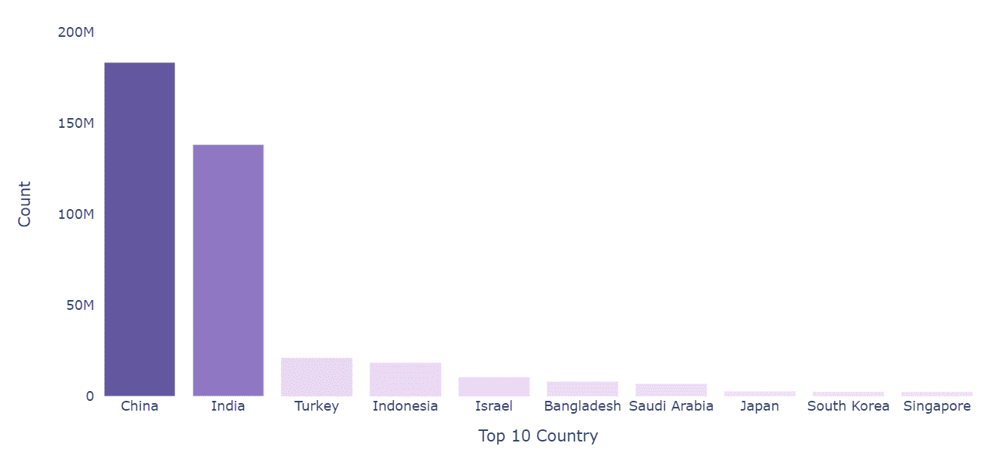

从上图可以看出，在亚洲，中国和印度的疫苗接种数量最多，这符合我们的预期，因为这两个国家的人口都很多，而且地理区域也很大。

亚洲每百人疫苗数量趋势:

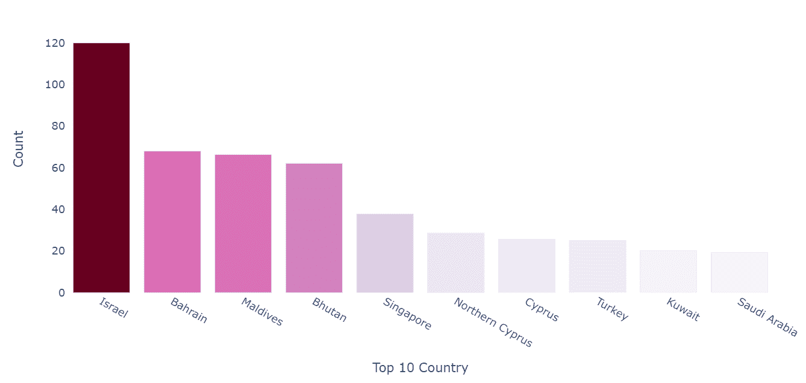

然而，如果我们看一下亚洲每百人疫苗数量的图表，我们可以看到以色列和巴林领先，随后是马尔代夫、不丹和新加坡。首先，这部分是因为与中国和印度相比，这些国家的人口相对较少。拥有 569 万人口的新加坡是上图中前 5 名中人口密度最高的国家，其高人口密度和城市化率使其国民更容易接种疫苗。

接受第一剂疫苗的人:

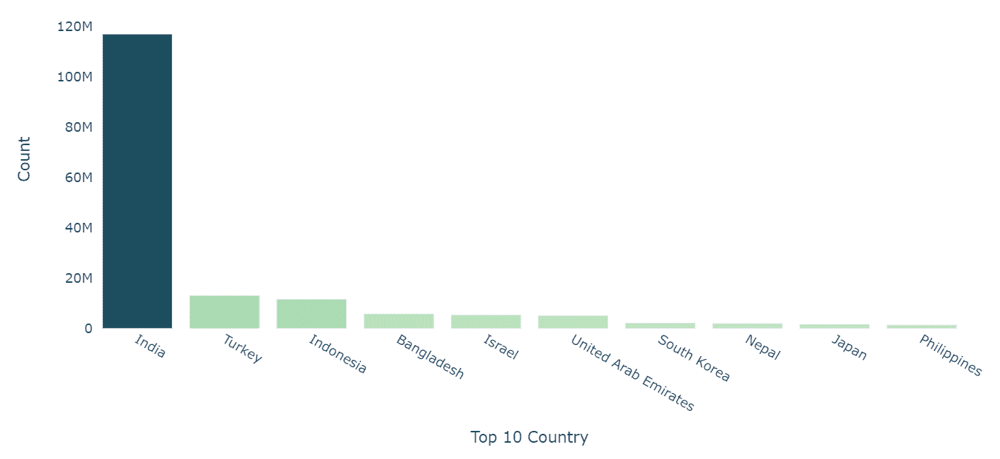

接受第一剂疫苗的人的百分比:

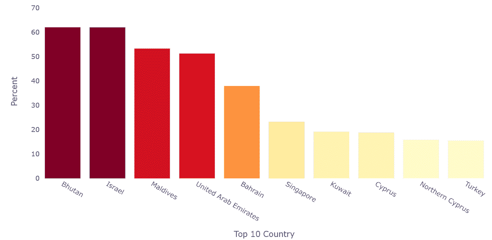

同样，如果我们看看亚洲接受第一剂疫苗的总人数和百分比，我们可以观察到类似的模式。在对首剂疫苗总数的分析中，印度等人口众多的国家处于领先地位。在接受第一剂疫苗的个人百分比图中，人口相对较少的国家位于顶部。

# **疫苗种类**

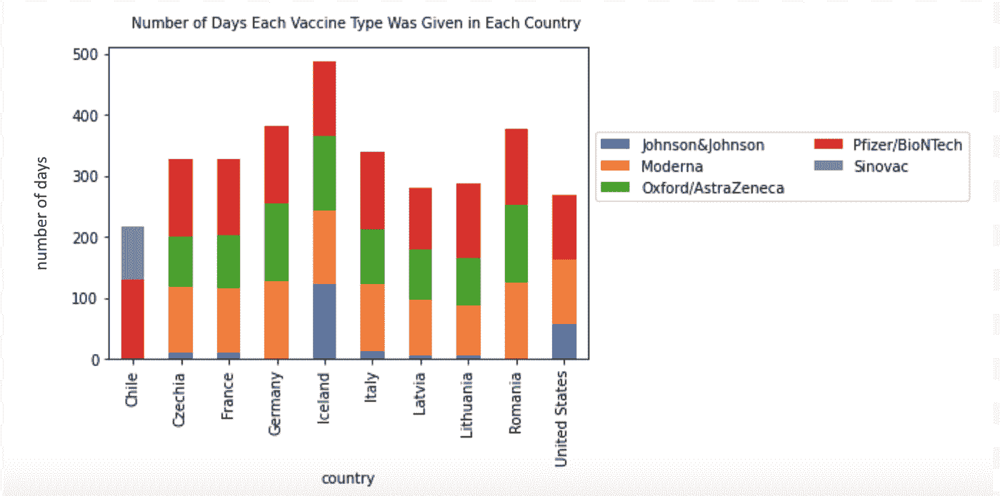

从上面的条形图中，我们可以观察到全球使用的主要疫苗类型有 5 种:强生、Moderna、牛津、辉瑞和科兴。从我们提取数据的 10 个国家来看，科兴只在智利有，而牛津在除了美国和智利以外的大多数国家都有。我们可以观察到 Moderna 和 Pfizer 在全世界分布最广、最频繁，这可能与它们的高%有效率相关(从临床试验来看，Moderna 被证明约 94.1%有效，而 Pfizer 被证明约 95%有效)。另一方面，从临床试验来看，强生公司有大约 66%的有效率，科兴生物有大约 67%的有效率，牛津阿斯利康有大约 79%的有效率。考虑不同类型疫苗的可获得性也很重要，因为也许智利也会向其人口分发 Moderna，但没有广泛获得疫苗。为了进一步检查不同疫苗类型在全球的分布情况，我们应该观察更多国家的更大数据集，以便我们可以对整个地区做出结论(即辉瑞在北美的分布最频繁)。

从上面的条形图中，我们可以观察到全球使用的主要疫苗类型有 5 种:强生、Moderna、牛津、辉瑞和科兴。从我们提取数据的 10 个国家来看，科兴只在智利有，而牛津在除了美国和智利以外的大多数国家都有。我们可以观察到 Moderna 和 Pfizer 在全世界分布最广、最频繁，这可能与它们的高%有效率相关(从临床试验来看，Moderna 被证明约 94.1%有效，而 Pfizer 被证明约 95%有效)。另一方面，从临床试验来看，强生公司有大约 66%的有效率，科兴生物有大约 67%的有效率，牛津阿斯利康有大约 79%的有效率。考虑不同类型疫苗的可获得性也很重要，因为也许智利也会向其人口分发 Moderna，但没有广泛获得疫苗。为了进一步检查不同疫苗类型在全球的分布情况，我们应该观察更多国家的更大数据集，以便我们可以对整个地区做出结论(即辉瑞在北美的分布最频繁)。

# **结论**

总之，我们对全世界每百万国家每日疫苗接种的分析表明，对于 COVID 19 疫苗接种这样的大规模问题，制药公司和政府之间的密切合作至关重要。这需要与充分的教育相结合，因为不信任疫苗对人类健康的影响可能会导致当地疫苗接种计划的延误。此外，没有一个因素可以决定一个国家疫苗接种的成功。

# **来源:**

GDP 数据来自世界银行数据:【https://data.worldbank.org/ 

Kaggle 数据集:[https://www . ka ggle . com/gp reda/covid-world-vaccine-progress](https://www.kaggle.com/gpreda/covid-world-vaccination-progress)

# Github:

[https://github.com/datares/Team-Watermelon-Datares](https://github.com/datares/Team-Watermelon-Datares)