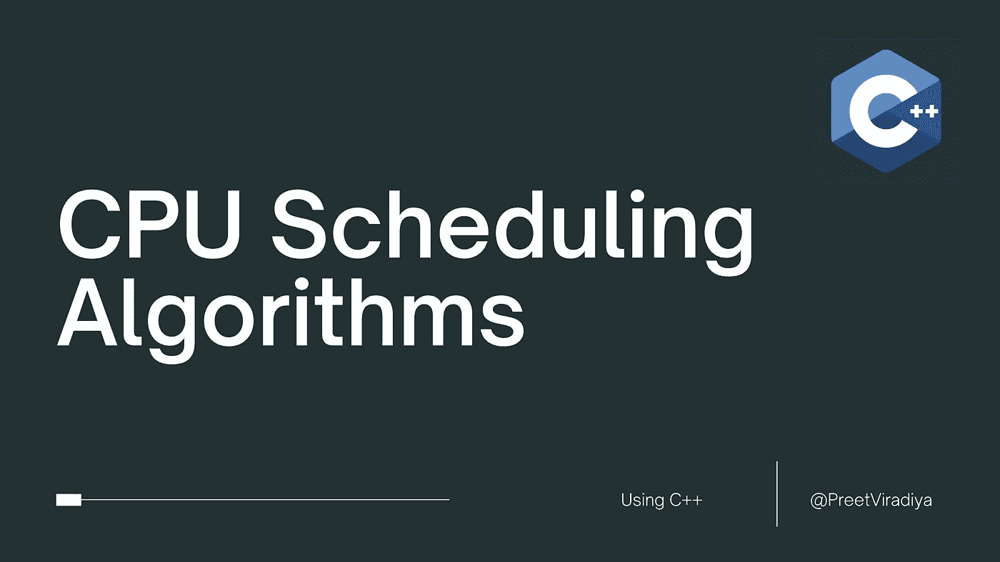

# CPU 调度算法

> 原文：<https://medium.com/geekculture/cpu-scheduling-algorithms-cd882e685eef?source=collection_archive---------23----------------------->



在多道程序系统中，操作系统调度 CPU 上的进程以最大限度地利用它，这个过程称为 CPU 调度。操作系统使用各种调度算法来调度进程。

这是短期调度程序的一项任务，为作业池中存在的进程数量调度 CPU。每当正在运行的进程请求一些 IO 操作时，短期调度程序就保存进程的当前上下文，并将其状态从运行更改为等待。在此期间，进程处于等待状态；短期调度程序从就绪队列中挑选另一个进程，并将 CPU 分配给这个进程。这个过程被称为上下文切换。

在多道程序设计中，如果长期调度程序选择更多的 I/O 进程，那么大多数时候，CPU 仍然是偶像。操作系统的任务是优化资源的利用。

如果大多数正在运行的进程将它们的状态从运行改为等待，那么在系统中可能总是存在死锁的可能性。因此，为了减少这种开销，操作系统需要调度作业，以获得 CPU 的最佳利用率，并避免死锁的可能性。

## 调度算法的目的

1.  最大 CPU 利用率
2.  中央处理器的费用分配
3.  最大排出量
4.  最短周转时间
5.  最短等待时间
6.  最短响应时间

## 抢先算法

# 1.最短剩余时间优先

这是 SJF 的先发制人形式。在该算法中，操作系统根据剩余的执行时间来调度作业。

SRTF 算法的 C++函数

```
void cpu_scheduler::srtf(){process_details(0,0);curr = 0;timer = 0 + p[curr].arrival_time;while(!stop()){if(timer >= p[curr].arrival_time){for(int i = 0; i < n; i++){if((p[i].id != curr) && (!p[i].done) && (timer >= p[i].arrival_time)){if(p[i].remaining_time < p[curr].remaining_time){curr = i;}}}if(!p[curr].done){if(p[curr].remaining_time > 1){p[curr].remaining_time--;timer++;gantt_chart.push(p[curr].id);}else{p[curr].remaining_time--;timer++;p[curr].completion_time = timer;p[curr].done = true;p[curr].turn_around_time = p[curr].completion_time - p[curr].arrival_time;p[curr].waiting_time = p[curr].turn_around_time - p[curr].burst_time;gantt_chart.push(p[curr].id);}}else{for(int i = 0; i < n; i++){if((timer >= p[i].arrival_time) && (!p[i].done)){curr = i;break;}}}}else{timer++;}}}
```

# 2.一系列

在循环调度算法中，操作系统定义一个时间段。所有的过程将以循环的方式执行。每个进程将占用 CPU 一小段时间，然后回到就绪队列等待下一次轮到它。这是一种抢占式调度。

循环算法的 C++函数

```
void cpu_scheduler::round_robin(){process_details(0,0);cout<<"\n Enter the Time Quantum : ";cin>>time_quantum;timer = 0;curr = 0;timer = timer + p[0].arrival_time;ready_queue.push(p[curr].id);cout<<endl;while(!ready_queue.empty()){curr = ready_queue.front();if(timer >= p[curr].arrival_time){if(!p[curr].done){if(p[curr].remaining_time > time_quantum){timer = timer + time_quantum;p[curr].remaining_time = p[curr].remaining_time - time_quantum;gantt_chart.push(p[curr].id);for(int i = 0; i < n; i++){if((timer >= p[i].arrival_time) && (p[i].id != p[curr].id)){if((!p[i].done) && (!found(p[i].id))){ready_queue.push(i);}}}ready_queue.push(curr);}else{p[curr].done = true;timer = timer + p[curr].remaining_time;p[curr].remaining_time = 0;p[curr].completion_time = timer;p[curr].turn_around_time = p[curr].completion_time - p[curr].arrival_time;p[curr].waiting_time = p[curr].turn_around_time - p[curr].burst_time;gantt_chart.push(p[curr].id);for(int i = 0; i < n; i++){if((timer >= p[i].arrival_time) && (p[i].id != p[curr].id)){if((!p[i].done) && (!found(p[i].id))){ready_queue.push(i);}}}}}ready_queue.pop();}else{timer++;}}}
```

# 3.优先级调度

在抢占式优先级调度中，当一个进程到达就绪队列时，它的优先级与就绪队列中其它进程的优先级以及 CPU 在该时刻正在执行的进程的优先级进行比较。在所有可用进程中，优先级最高的进程将被分配给下一个 CPU。抢占式优先级调度和非抢占式优先级调度的区别在于，在抢占式优先级调度中，正在执行的作业可以在更高优先级作业到达时停止。一旦就绪队列中的所有作业都可用，该算法将表现为非抢占式优先级调度，这意味着调度的作业将一直运行到完成，不会发生抢占。

循环算法的 C++函数

```
void cpu_scheduler::priority(){cout<<"\n Priority Order (1) for Higher-Lower (-1) for Lower-Higher : ";int priority_order;cin>>priority_order;process_details(1,priority_order);curr = 0;timer = 0 + p[curr].arrival_time;while(!stop()){if(timer >= p[curr].arrival_time){for(int i = 0; i < n; i++){if((p[i].id != curr) && (!p[i].done) && (timer >= p[i].arrival_time)){if(p[i].priority > p[curr].priority){curr = i;}}}if(!p[curr].done){if(p[curr].remaining_time > 1){p[curr].remaining_time--;timer++;gantt_chart.push(p[curr].id);}else{p[curr].remaining_time--;timer++;p[curr].completion_time = timer;p[curr].done = true;p[curr].turn_around_time = p[curr].completion_time - p[curr].arrival_time;p[curr].waiting_time = p[curr].turn_around_time - p[curr].burst_time;gantt_chart.push(p[curr].id);}}else{for(int i = 0; i < n; i++){if((timer >= p[i].arrival_time) && (!p[i].done)){curr = i;break;}}}}else{timer++;}}}
```

## 非抢占式算法

# 1.先到先服务

这是实现起来最简单的算法。到达时间最短的进程将首先获得 CPU。到达时间越短，进程获得 CPU 的时间就越早。它是非抢占式调度。

FCFS 算法的 C++函数

```
void cpu_scheduler::fcfs(){process_details(0,0);curr = 0;timer = timer + p[curr].arrival_time;while(!stop()){if(timer >= p[curr].arrival_time){if(!p[curr].done){timer += p[curr].burst_time;p[curr].completion_time = timer;p[curr].done = true;p[curr].turn_around_time = p[curr].completion_time - p[curr].arrival_time;p[curr].waiting_time = p[curr].turn_around_time - p[curr].burst_time;gantt_chart.push(p[curr].id);}else{for(int i = 0; i < n; i++){if((timer >= p[i].arrival_time) && (!p[i].done)){curr = i;break;}}}}else{timer++;}}}
```

# 2.最短的作业优先

在 SJF 调度中，在就绪队列中的可用进程列表中，具有最低突发时间的进程将是下一个被调度的。然而，很难预测处理所需的突发时间，因此该算法很难在系统中实现。

SJF 算法的 C++函数

```
void cpu_scheduler::sjf(){process_details(0,0);curr = 0;timer = 0;timer = timer + p[curr].arrival_time;while(!stop()){if(timer >= p[curr].arrival_time){for(int i = 0; i < n; i++){if((p[i].id != curr) && (!p[i].done) && (timer >= p[i].arrival_time)){if(p[i].burst_time < p[curr].burst_time){curr = i;}}}if(!p[curr].done){timer += p[curr].burst_time;p[curr].completion_time = timer;p[curr].done = true;p[curr].turn_around_time = p[curr].completion_time - p[curr].arrival_time;p[curr].waiting_time = p[curr].turn_around_time - p[curr].burst_time;gantt_chart.push(p[curr].id);}else{for(int i = 0; i < n; i++){if((timer >= p[i].arrival_time) && (!p[i].done)){curr = i;break;}}}}else{timer++;}}}
```

## 将上述函数归纳为一类

```
#include<bits/stdc++.h>using namespace std;struct process{int id;int arrival_time;int burst_time;int completion_time = 0;int turn_around_time = 0;int waiting_time = 0;int remaining_time = 0;int priority = 0;bool done = false;};class cpu_scheduler{private:process p[1000];int n;queue<int> gantt_chart;queue<int> ready_queue;int timer = 0;int time_quantum;int curr;float avg_wait = 0;public:void process_details(bool,int);void process_sorting();void process_display();void gantt_chart_display();bool stop();bool found(int);void driver_code();void fcfs();void sjf();void srtf();void round_robin();void priority();void average_waiting_time();};void cpu_scheduler::process_details(bool ispriority,int priority_order){cout<<"\n Enter the number of Processes : ";cin>>n;for(int i = 0; i < n; i++){p[i].id = i;if(ispriority){cout<<" \n Enter Priority of Process "<<i<<" : ";int x;cin>>x;p[i].priority = x * priority_order;}cout<<" \n Enter Arrival Time of Process "<<i<<" : ";cin>>p[i].arrival_time;cout<<" \n Enter Burst Time of Process "<<i<<" : ";cin>>p[i].burst_time;p[i].remaining_time = p[i].burst_time;}process_sorting();}void cpu_scheduler::process_sorting(){for(int i = 0; i < n; i++){for(int j = 0; j < n-1; j++){if(p[j].arrival_time > p[j+1].arrival_time){process temp = p[j];p[j] = p[j+1];p[j+1] = temp;}}}}void cpu_scheduler::process_display(){cout<<"\n Process Table : \n";for(int i = 0; i < n; i++){cout<<" Process ID : "<<p[i].id<<" Priority : "<<p[i].priority<<" Arrival Time : "<<p[i].arrival_time;cout<<" Burst Time : "<<p[i].burst_time<<" Completion Time : "<<p[i].completion_time;cout<<" Turn Around Time : "<<p[i].turn_around_time<<" Waiting Time : "<<p[i].waiting_time<<endl;}}void cpu_scheduler::gantt_chart_display(){cout<<"\n Gantt Chart : ";while(!gantt_chart.empty()){cout<<" P"<<gantt_chart.front()<<" ";gantt_chart.pop();}}bool cpu_scheduler::stop(){int c = 0;for(int i = 0; i < n; i++){if(p[i].done){c++;}}if(c == n){return true;}return false;}bool cpu_scheduler::found(int n){bool f = false;queue<int> temp = ready_queue;while (!temp.empty()){if(temp.front() == n)return true;temp.pop();}return f;}void cpu_scheduler::fcfs(){process_details(0,0);curr = 0;timer = timer + p[curr].arrival_time;while(!stop()){if(timer >= p[curr].arrival_time){if(!p[curr].done){timer += p[curr].burst_time;p[curr].completion_time = timer;p[curr].done = true;p[curr].turn_around_time = p[curr].completion_time - p[curr].arrival_time;p[curr].waiting_time = p[curr].turn_around_time - p[curr].burst_time;gantt_chart.push(p[curr].id);}else{for(int i = 0; i < n; i++){if((timer >= p[i].arrival_time) && (!p[i].done)){curr = i;break;}}}}else{timer++;}}}void cpu_scheduler::sjf(){process_details(0,0);curr = 0;timer = 0;timer = timer + p[curr].arrival_time;while(!stop()){if(timer >= p[curr].arrival_time){for(int i = 0; i < n; i++){if((p[i].id != curr) && (!p[i].done) && (timer >= p[i].arrival_time)){if(p[i].burst_time < p[curr].burst_time){curr = i;}}}if(!p[curr].done){timer += p[curr].burst_time;p[curr].completion_time = timer;p[curr].done = true;p[curr].turn_around_time = p[curr].completion_time - p[curr].arrival_time;p[curr].waiting_time = p[curr].turn_around_time - p[curr].burst_time;gantt_chart.push(p[curr].id);}else{for(int i = 0; i < n; i++){if((timer >= p[i].arrival_time) && (!p[i].done)){curr = i;break;}}}}else{timer++;}}}void cpu_scheduler::srtf(){process_details(0,0);curr = 0;timer = 0 + p[curr].arrival_time;while(!stop()){if(timer >= p[curr].arrival_time){for(int i = 0; i < n; i++){if((p[i].id != curr) && (!p[i].done) && (timer >= p[i].arrival_time)){if(p[i].remaining_time < p[curr].remaining_time){curr = i;}}}if(!p[curr].done){if(p[curr].remaining_time > 1){p[curr].remaining_time--;timer++;gantt_chart.push(p[curr].id);}else{p[curr].remaining_time--;timer++;p[curr].completion_time = timer;p[curr].done = true;p[curr].turn_around_time = p[curr].completion_time - p[curr].arrival_time;p[curr].waiting_time = p[curr].turn_around_time - p[curr].burst_time;gantt_chart.push(p[curr].id);}}else{for(int i = 0; i < n; i++){if((timer >= p[i].arrival_time) && (!p[i].done)){curr = i;break;}}}}else{timer++;}}}void cpu_scheduler::round_robin(){process_details(0,0);cout<<"\n Enter the Time Quantum : ";cin>>time_quantum;timer = 0;curr = 0;timer = timer + p[0].arrival_time;ready_queue.push(p[curr].id);cout<<endl;while(!ready_queue.empty()){curr = ready_queue.front();if(timer >= p[curr].arrival_time){if(!p[curr].done){if(p[curr].remaining_time > time_quantum){timer = timer + time_quantum;p[curr].remaining_time = p[curr].remaining_time - time_quantum;gantt_chart.push(p[curr].id);for(int i = 0; i < n; i++){if((timer >= p[i].arrival_time) && (p[i].id != p[curr].id)){if((!p[i].done) && (!found(p[i].id))){ready_queue.push(i);}}}ready_queue.push(curr);}else{p[curr].done = true;timer = timer + p[curr].remaining_time;p[curr].remaining_time = 0;p[curr].completion_time = timer;p[curr].turn_around_time = p[curr].completion_time - p[curr].arrival_time;p[curr].waiting_time = p[curr].turn_around_time - p[curr].burst_time;gantt_chart.push(p[curr].id);for(int i = 0; i < n; i++){if((timer >= p[i].arrival_time) && (p[i].id != p[curr].id)){if((!p[i].done) && (!found(p[i].id))){ready_queue.push(i);}}}}}ready_queue.pop();}else{timer++;}}}void cpu_scheduler::priority(){cout<<"\n Priority Order (1) for Higher-Lower (-1) for Lower-Higher : ";int priority_order;cin>>priority_order;process_details(1,priority_order);curr = 0;timer = 0 + p[curr].arrival_time;while(!stop()){if(timer >= p[curr].arrival_time){for(int i = 0; i < n; i++){if((p[i].id != curr) && (!p[i].done) && (timer >= p[i].arrival_time)){if(p[i].priority > p[curr].priority){curr = i;}}}if(!p[curr].done){if(p[curr].remaining_time > 1){p[curr].remaining_time--;timer++;gantt_chart.push(p[curr].id);}else{p[curr].remaining_time--;timer++;p[curr].completion_time = timer;p[curr].done = true;p[curr].turn_around_time = p[curr].completion_time - p[curr].arrival_time;p[curr].waiting_time = p[curr].turn_around_time - p[curr].burst_time;gantt_chart.push(p[curr].id);}}else{for(int i = 0; i < n; i++){if((timer >= p[i].arrival_time) && (!p[i].done)){curr = i;break;}}}}else{timer++;}}}void cpu_scheduler::average_waiting_time(){for(int i = 0; i < n; i++){avg_wait += p[i].waiting_time;}cout<<"\n Average Waiting Time : "<<avg_wait/n<<endl;}void cpu_scheduler::driver_code(){cout<<" \n\t\t =========================================== CPU SCHEDULING ALGORITHMS =========================================== \n";cout<<" \n\t\t\t 1\. First Come First Serve CPU Scheduling Algorithm  ";cout<<" \n\t\t\t 2\. Shortest Job First CPU Scheduling Algorithm  ";cout<<" \n\t\t\t 3\. Shortest Remaining Time First CPU Scheduling Algorithm  ";cout<<" \n\t\t\t 4\. Round Robin CPU Scheduling Algorithm  ";cout<<" \n\t\t\t 5\. Priority CPU Scheduling Algorithm  \n";int ch;cout<<" Enter The Algorithm you want to Implement : ";cin>>ch;switch(ch){case 1:fcfs();break;case 2:sjf();break;case 3:srtf();break;case 4:round_robin();break;case 5:priority();break;}process_display();gantt_chart_display();average_waiting_time();}int main(){cpu_scheduler cpu;cpu.driver_code();return 0;}
```