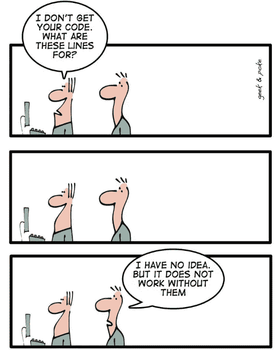
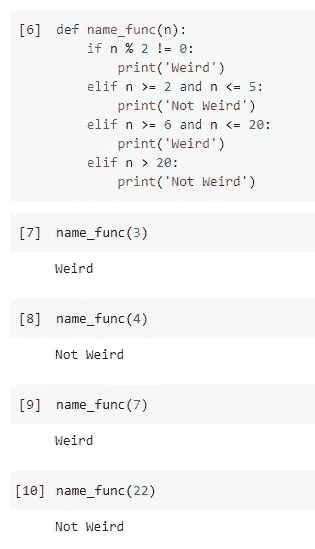
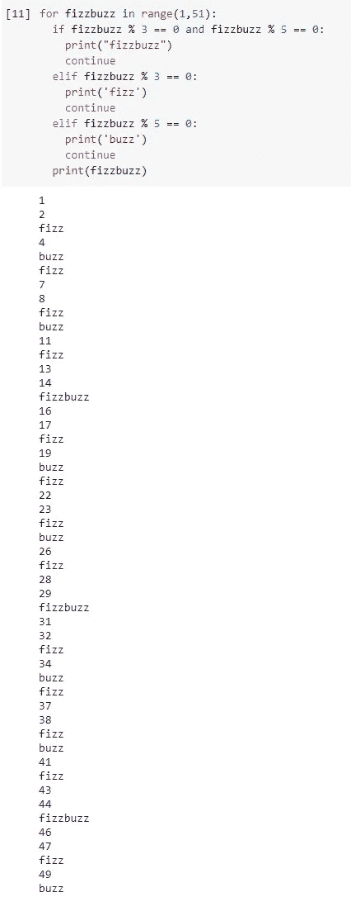
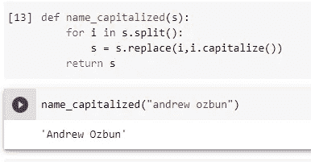

# 破解密码

> 原文：<https://medium.com/geekculture/cracking-the-code-da2663cdbcb0?source=collection_archive---------37----------------------->

***让恐怖的技术面试不那么恐怖。***

I can’t tell you how often this happened when I was first starting.

我是编码、数据分析和数据科学的新手。我正在开始我的初步面试，以获得那份梦寐以求的初级工作。压力的最大来源是在面试官观看的情况下进行编码练习。这让我汗流浃背，我对基本的技术技能一无所知，比如如何正确地编写 for 循环。这些练习通常非常公式化，需要某种功能来执行任务，比如对一系列数字进行排序，或者用虚假的单词和短语替换某个数字的倍数。

我将回顾我做过的一些练习，以及我是如何在练习中犯错误的。顺便提一句，这些练习对于一个经验丰富的(甚至是部分经验丰富的)计算机科学家来说似乎非常简单。我认为，随着我的学习和成长，我发现了其中的一个方面，即数据科学家与计算机科学家不同。我很少编写持续几天的巨大而优雅的代码块。只是因为我不需要它们。我需要的每个操作、算法或公式通常都是某个包或库中预装的函数。我每天花更多时间做的是理解每个代码块背后的数学和算法。执行诸如调整超参数之类的任务从来都不是直截了当的，需要对代码背后的数学有深刻的理解。话虽如此，但这并不是我不继续学习编程的借口。

## 模运算符:

在开始之前，我想正式介绍一下我的朋友，模算符。模运算符在 Python 中用百分号(%)表示，是一个强大而有用的小数学工具。它返回两个数相除后剩下的整数。值得注意的是，它不返回除法运算精确计算的十进制值。

***例如:*** 7 除以 2 技术上等于 3.5。然而，模运算符不会返回 0.5。在没有小数的情况下，2 除以 7 等于 6。从 7 的原始输入中减去 6 后的剩余量是 1。所以， **7%2 = 1** 。

抓住这个，它在涉及整数的编码挑战中非常有用。

# 编码挑战

**任务 1:**
给定一个整数，创建一个函数来执行以下条件动作:

*   如果 *n* 是奇数，打印“怪异”
*   如果 *n* 是偶数并且在 2 到 5 的包含范围内，打印“不奇怪”
*   如果 *n* 是偶数且在 6 到 20 的范围内，则打印“怪异”
*   如果 *n* 是偶数且大于 20，打印“不奇怪”

**解决方案:**

**思维过程:**

我对此的思考过程始于“好吧，我需要一个函数”。有时候，仅仅是识别并把它输入到屏幕上，就让我头脑中的轮子开始转动。任务描述字面上反复使用“if”这个词，这让我知道我需要使用 if else 语句。我们正在谈论数字和是或不是，所以我知道我会需要语法！=和==。我花了一秒钟思考，然后我意识到模运算符将有助于确定一个数字是否是偶数。如果一个数除以 2 的余数不等于 0，那么它就不是偶数。这是我的 if else 语句的开始。因为在任务描述中有多个 if 子句，所以我知道我必须使用 elif 语句，而不是 else 语句。剩下的语法就是填空了。确保这些数字保持在规定的数值范围内。在决定如何使用< > =运算符时，需要注意的是，该任务使用了短语“包含范围”。

## **任务二:**

*   打印数字 1–50
*   对于每 3 个印刷“嘶嘶”的倍数
*   对于每 5 个印刷“嗡嗡声”的倍数
*   对于 3 和 5 的每个倍数，打印“fizzbuzz”

**解决方案:**

**思维过程:**

我处理这个问题的方式和第一个有点不同。请注意问题所问内容的细微差别。对于第一个问题，它要求一个函数，对于这个问题，它要求我打印数字 1-50，并添加条件。我从你需要数字 1 到 50 这个事实开始。知道 Python 中的数字列表是以 0 开始的，我们将需要数字 1 到 50。先不说这个，我知道我需要一个“ *i* in range”语句，并创建一个变量来告诉 if/else 语句对每个数字做什么。说到这里，我需要一个 if else 语句。这里的其余逻辑遵循与第一个问题类似的逻辑，所以我不会重复自己。

## 任务 3:

您需要确保每个人的名字和姓氏都以大写字母开头。例如，andrew ozbun 应该将第一个字母正确地大写为 Andrew Ozbun。

输入格式:包含全名的单行输入。

输出格式:打印大写的字符串 s。

**解决方案:**

**思维过程:**

对我来说，这是相对容易的，是关于熟悉你的语法。明知 ***。利用*中的**方法是 Python 存在的关键。应用它需要弄清楚如何在函数中嵌套 for 循环。我意识到我必须把名字分开，这样函数就可以把两个单词都大写。使用一个“for *i* in”语句似乎是最符合逻辑的，可以调用由拆分产生的任何单词。然后我想通过用 ***替换字符串中的两个名字来重置‘s’对象。大写*** 并返回结果对象。注意，因为我只指定了两个 *i* 值，所以如果您试图输入名字、中间名和姓氏，这将不起作用。

# 结论

虽然当第一次面对一个有经验的程序员时，编码挑战有点令人生畏，但熟能生巧。寻找保持技能的编码挑战在互联网上并不难找到。当我处于对代码感到害羞的情况时，我会试着提醒自己:这个人曾经也是一个新手，试图学习编码并获得他们的第一份大工作。对于所有其他初学编程的人来说，我们做到了！