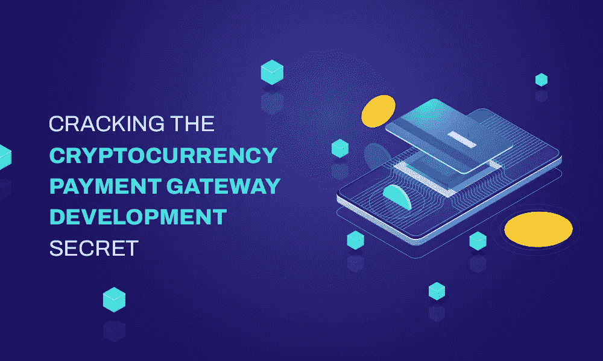

# 破解加密货币支付网关开发秘密

> 原文：<https://medium.com/geekculture/cracking-the-cryptocurrency-payment-gateway-development-secret-931f5ebd2638?source=collection_archive---------16----------------------->

我们都知道区块链已经使零售、医疗保健、娱乐等几个行业现代化..并继续在支付领域产生影响。同样，支付方式也在快速发展，从实物货币到数字货币。

Cryptocurrency Payment Gateway Development

一提到数字货币，各类受众首先想到的就是加密货币。这些货币是分散的，不需要任何银行或政府的指导。

使用区块链技术的加密货币的增长鼓励了许多商人和企业家在加密行业建立他们的业务。

目前，大多数商家已经开始接受加密货币作为其主要支付模式之一。

因此，如果你是一个想冒险进入这个行业以获取丰厚利润的人，那么推出自己的加密支付网关平台可能是一个明智的选择。

# 加密货币支付网关:

它是数字货币的支付处理器，帮助用户和商家安全地转移和接收加密货币。加密支付网关的工作方式类似于传统的支付网关，如 PayPal、Google Pay 等

在传统的支付网关中，应该链接银行账户，以安全的方式将资金转移给特定用户。同样，在加密支付网关中，人们应该链接他们的加密货币钱包，以便向平台添加资金。一旦添加了钱包，用户就可以轻松地进行支付。

类似地，为了成功执行加密支付，卖家需要设置 QR 码。此代码有助于通过支付处理器进行支付。多重加密集成提供了一个额外的好处，即用户不需要登录到交易所进行加密传输。

# 开发加密货币支付网关平台的原因

这些加密支付网关支持即时支付。与其他数字支付网关相比，使用区块链加密支付网关可以使国际交易变得更加容易，而且时间要求也非常低。

由于加密硬币的宣传与日俱增，许多国家正在建立一个使用加密货币的框架。推出加密支付网关平台可以吸引全球观众。平台上发生的交易和支付具有完全的隐私性。

加密支付是安全的区块链分类帐与结构化的安全机制，这是完全免费的欺诈。作为平台的拥有者，你可以从商家和用户两方面赚取交易费用。

此外，另一个主要的好处是，你也可以通过允许第三方在你的平台上放置广告来赚钱。也能让 google Adsense 赚到钱。

# 最佳加密货币支付网关平台

在这个现代加密市场中，有许多加密支付网关平台。但在这些平台中，只有少数平台因其先进的特性和功能而广受欢迎。有些是，

*   比特币支付
*   硬币门
*   硬币银行
*   比特币基地商业
*   阿尔法硬币
*   比特币支付
*   香料报酬

上面提到的是一些流行的加密支付网关平台，它们以其强大而可靠的服务赢得了加密市场的最佳声誉。

你可以借助加密市场的加密支付网关开发服务，推出类似于 Bitpay、Spice pay 或其他平台的加密支付网关。

# 加密货币支付网关软件的基本特征

平台中的特性是用户在使用它时首先注意到的。因此，你的平台的特性在吸引潜在受众方面起着至关重要的作用。

*   用户注册/登录
*   KYC 验证
*   管理和用户仪表板
*   钱包整合
*   存款和取款历史
*   交易历史
*   商户付款历史记录
*   安全设置
*   内容管理系统

上面提到的是开发加密支付网关平台的一些基本功能。

# 如何搭建加密货币支付网关平台？

在当今时代，开发一个加密支付网关不再是一项枯燥的任务。有一些可能的选择，以建立您的精英加密支付网关平台，有一个有利可图的业务。

第一种方法是通过互联网上免费提供的开源软件来构建，在那里你需要精通编码技术。但是有几个缺点和风险是你在发展自己的时候需要面对的。假设，如果你犯了任何小错误，那么它会影响整个开发过程，同时这种方法容易被黑客攻击。

其次，你可以从一家知名的加密货币支付网关开发公司寻找并雇佣一组专业的区块链开发人员来开发你的加密支付网关平台。

现在有了先进的技术，许多公司在世界各地提供解决方案。因此，选择一个有经验和声誉的公司是最重要的事情。

# 开发加密货币支付网关平台的成本

加密支付网关平台的开发没有固定的价格。某些因素决定了支付网关平台的成本。因此，根据您的财务能力选择您的支付网关平台的功能和选项。

# 最后的话

正如我已经提到的，加密货币正在快速增长，这意味着未来。许多国家已经支持加密硬币，许多公司已经开始接受加密作为他们的主要支付方式。因此，这将是推出您的加密货币支付网关平台以获得利润丰厚的业务的最佳时机。你所要关注的是选择最好的 [**加密货币支付网关开发公司**](https://www.alwin.io/cryptocurrency-payment-gateway-development) ，能够满足你的业务需求，并以可承受的成本让你对他们的进展感到满意。