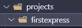
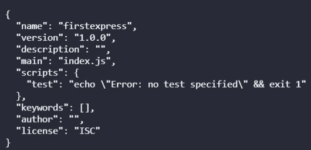
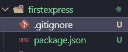
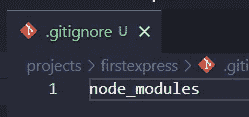
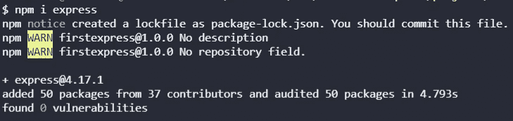
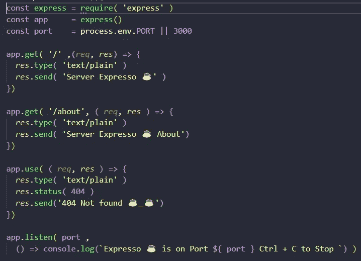
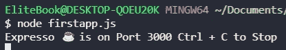
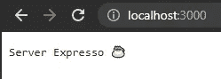
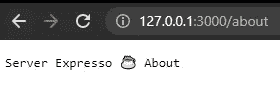
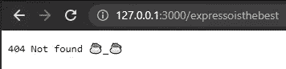

# 用 Express.js 创建一个基本的服务器(真的很基本)☕但是好吃

> 原文：<https://medium.com/geekculture/create-a-basic-server-with-express-js-really-basic-but-delicious-c5cceaca1c60?source=collection_archive---------6----------------------->


我用 [Node.js](/geekculture/create-a-basic-server-with-node-js-and-event-driven-programming-really-basic-3337bcece53e) 制作了一个小型基本服务器，Express.js 增强了管理和创建服务器或 API 的最佳方式，但是现在我们将看到如何用 Express.js 构建一个小型基本服务器，(真正的基本)请注意这一点！

# 什么是 Express.js？

Well Express.js 是一个主要用于后端的 Web 框架，具有极小、快速、灵活等特点。

极小:因为少即是多，意味着它有足够的特性来完全满足您的服务器端应用程序，没有任何问题，或者您可以添加所有您需要的或替换不必要的包，给我们带来我们需要的新鲜空气。

灵活:Express 接受 HTTP 请求并返回 HTTP 响应

快速:Express.js 团队专注于管理高流量网站的性能，许多公司都在使用它，[看看这个](https://expressjs.com/en/resources/companies-using-express.html)。

未宣传的:JavaScript 有非常多样的社区包，你可以使用它，这是 Express.js 的一个很大的特点

# 目录，NPM 和 git 忽略

创建一个目录你可以从创建一个目录开始，有一个名为 projects 的目录，在里面添加另一个我们暂时称之为 firstexpress 的目录。



Example directory

然后我们需要用下面的命令创建我们的 package.json，如果你想在你的 package.json 上写信息，你需要删除-y。

```
npm init --y
```


NPM command to create package.json



Example Creating the package.Json

之后，我们需要创建一个. gitignore 文件并添加 node_modules，这将忽略节点 _modules 到您的 GIT 分支中



Creating a gitignore file



Adding node_modules to gitignore file

# 安装快递. js

我们需要用下面的命令安装 Express.js:

```
npm i express
```



Example Installing Express

我们将创建我们的 JavaScript 文件，首先我们现在可以将其命名为 firstapp.js，我们将在那里使用我们的 JavaScript 服务器。

首先，我们需要调用函数 express with require，然后我们需要调用函数并将其保存在 app 变量上，我们需要将端口保存在变量上，之后我们需要使用我们的 app.get 方法，它需要两个参数第一个是路径，第二个是函数，还有两个参数 request 和 response，然后我们需要使用 response 及其方法 type 和 send， type 用于指定消息头，tosend 用于向用户发送响应，在本例中是带有 Server Expresso 的文本。

对于 about 和 404 not found，我们使用 app.use 方法，这样我们可以使用相同的请求和响应参数，唯一不同的是，我们使用 res.status 来指定响应的状态。

然后，我们用 app.listen 启动我们的服务器，我们为第一个参数和第二个参数指定了端口，以便在服务器在哪里、如何停止以及在哪个端口的情况下发送输出。

重要！因为 Express-handlebar 更新了它的库，所以您需要更改导入

```
import { engine } from 'express-handlebars';
```

并为此更改 handleExp

```
app.engine( 'handlebars', engine({
defaultLayout: 'main'
}))
```

如果你想看视频，你也可以看



Code to create a small server with Express.js

```
const express = require( 'express' )
const app     = express()
const port    = process.env.PORT || 3000app.get( '/' ,(*req*, *res*) => {
*res*.type( 'text/plain' )
*res*.send( 'Server Expresso ☕' )
})
app.get( '/about', ( *req*, *res* ) => {
*res*.type( 'text/plain' )
*res*.send( 'Server Expresso ☕ About')
})
app.use( ( *req*, *res* ) => {
*res*.type( 'text/plain' )
*res*.status( 404 )
*res*.send('404 Not found ☕_☕')})app.listen( port ,() => console.log(`Expresso ☕ is on Port ${ port } Ctrl + C to Stop `) )
```

要运行我们的服务器，你只需要在你的文件所在的地方运行这个命令

```
node firstapp.js
```



Example running our Express server

而在你的 [http://localhost:3000/](http://localhost:3000/) 或者你的 [http://127.0.0.1:3000/](http://127.0.0.1:3000/) 上你会看到这样的东西:



Example Home page



Example about page



Example 404 not found

# 结论

这是一个关于如何首次使用 express 的基本示例，使用 Node.js 的这个令人惊叹的框架。看到这个框架如何工作，如何使用响应向用户发送数据，以及如何从三个变量 Express、app 和 port 开始，一切都很顺利，而且我们可以节省时间，因为这个库很简单，而不是用 Node.js 创建的。

# 来源

[](http://expressjs.com/) [## Express - Node.js web 应用程序框架

### Express 是一个最小且灵活的 Node.js web 应用程序框架，它为 web 和…

expressjs.com](http://expressjs.com/) [](https://expressjs.com/en/resources/companies-using-express.html) [## 使用快递的公司

### 黑人的命也是命。支持平等司法倡议。

expressjs.com](https://expressjs.com/en/resources/companies-using-express.html) [](/geekculture/create-a-basic-server-with-node-js-and-event-driven-programming-really-basic-3337bcece53e) [## 用 Node.js 和事件驱动编程创建一个基本的服务器(非常基本)

### 我想学习 Node.js 和他的环境，我想分享我为自己的这个…

medium.com](/geekculture/create-a-basic-server-with-node-js-and-event-driven-programming-really-basic-3337bcece53e)