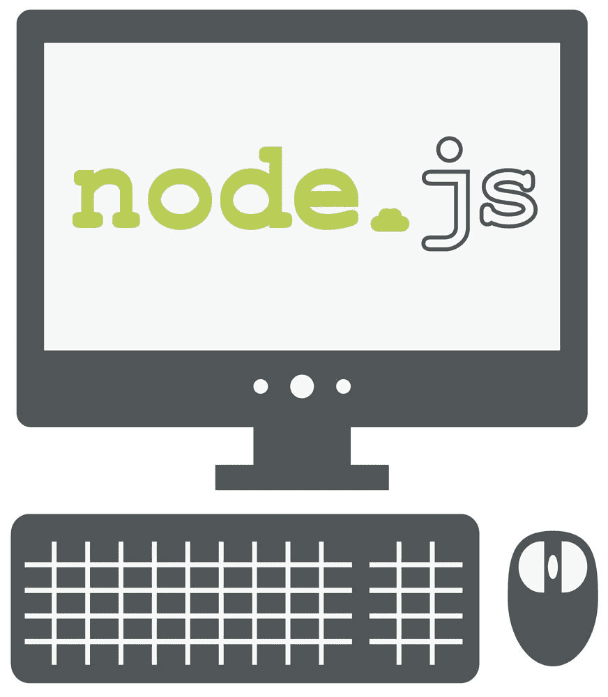
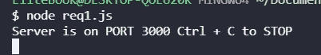
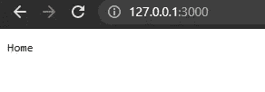
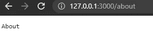
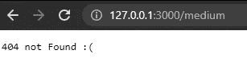

# 用 Node.js 和事件驱动编程创建一个基本的服务器(非常基本)

> 原文：<https://medium.com/geekculture/create-a-basic-server-with-node-js-and-event-driven-programming-really-basic-3337bcece53e?source=collection_archive---------16----------------------->



我想学习 Node.js 和他的环境，我想分享我为自己做的小步骤，这只是第一步，请注意！。

# Node.js 的一点介绍

Node.js 是一个 JavaScript 运行时环境，你可以用于后端和前端项目，它有自己的包模块(NPM)它是由 Ryan Dahl 创建的，如果你想了解更多关于 Node.js 的信息，请点击这里

# 事件驱动编程

让我们看看维基百科会告诉我们[关于这个](https://en.wikipedia.org/wiki/Event-driven_programming)的什么:

> 事件驱动编程是一种范例，其中程序的流程由用户的事件决定。

如果你把 Node.js 看作一个服务器端，你需要知道，在基于 web 的浏览器中，用户需要在地址栏上写下路径，然后它会返回网页，我们不控制用户的移动，一切都是一个事件，当用户改变页面到另一个页面时，就是路由，我们使用事件驱动编程。

在本练习中，您需要在计算机上安装 Node.js

要获取 Node.js，请点击[这里](https://nodejs.org/en/)

# 观看视频

# 基本示例

好，让我们来做这个小例子，在 Node.js 上创建一个小服务器，我们需要创建一个名为 hello.js 的文件，我们将在上面写这个

```
const http = require( 'http' )const port = process.env.PORT | 3000const server =  http.createServer( ( *req*, *res* ) => {const path = req.url.replace( /\/?(?:\?.*)?$/, '' ).toLowerCase()
switch( path ){
case '':
res.writeHead( 200, {
'Content-Type': 'text/plain'
})
res.end( 'Home' )
break
case '/about':{
res.writeHead( 200, {
'Content-Type': 'text/plain'
}) }
res.end( 'About' )
break
default: { res.writeHead( 404, { 'Content-Type': 'text/plain' })
res.end( '404 not Found :(' )}break}
})
server.listen( port, () => console.log( `Server is on PORT ${ port } Ctrl + C to STOP ` ) )
```

我们将创建一个名为 HTTP 的常量，我们将使用这个库，我们需要这个端口，我将为这个端口创建另一个名为 port 的常量，然后我们将使用 **http.createServer** 创建我们的服务器，它接收一个函数，当有人添加我们服务器的 URL 时，它将触发这个函数。

使用参数 req，我们将保存我们的路径，并且我们将清除这个“？”之后的所有信息然后，通过一个开关，我们将返回页面的响应，在这种情况下是 **home、about 和 404** ，我们需要第二个参数 **res.writeHead()** ，它可以管理两个参数，第一个是状态，第二个是包含响应的所有信息头的对象，然后在结束时，我们使用 res.end()在流关闭之前写入数据。

然后，我们用 **server.listen()** 监听服务器。现在，我们将添加端口和一个包含控制台日志的函数，这将向我们显示是否一切正常。

然后，如果我们运行 node **hello.js** ，我们将在控制台上看到类似这样的内容



Example server with Node.js console output

我们需要进入我们最喜欢的浏览器，在地址栏上写下这个 **127.0.0.1:3000，**然后我们就有了这个



Example Home Page with node server



Example About Page with node server



Example 404 Page with node server

# 结论

这个例子的目的是让你在学习 Node.js 的新挑战上更上一层楼。对我来说，这是一个很好的新体验，它有他的缺点和优点，但好奇的是，我们学习了事件驱动编程，以及如何创建一个简单的带有路由的服务器，我们将很快看到更多！

# 来源

[](https://en.wikipedia.org/wiki/Ryan_Dahl) [## 瑞安·达尔-维基百科

### Ryan Dahl(生于 1981 年)是一名美国软件工程师，也是 Node.js JavaScript 运行时和

en.wikipedia.org](https://en.wikipedia.org/wiki/Ryan_Dahl) [](https://nodejs.dev/learn) [## Node.js 简介

### Node.js 入门指南，服务器端 JavaScript 运行时环境。Node.js 构建于 Google 之上…

nodejs.dev](https://nodejs.dev/learn) [](https://en.wikipedia.org/wiki/Event-driven_programming) [## 事件驱动编程-维基百科

### 在计算机编程中，事件驱动编程是一种编程范式，在这种编程范式中，程序流是动态的

en.wikipedia.org](https://en.wikipedia.org/wiki/Event-driven_programming) [](https://www.amazon.com/Web-Development-Node-Express-Leveraging/dp/1492053511) [## 使用 Node 和 Express 进行 Web 开发:利用 JavaScript 堆栈

### 使用 Node 和 Express 进行 Web 开发:利用 Amazon.com 的 JavaScript 堆栈。*免费*送货到…

www.amazon.com](https://www.amazon.com/Web-Development-Node-Express-Leveraging/dp/1492053511) [](https://nodejs.org/en/) [## 节点. js

### Node.js 是基于 Chrome 的 V8 JavaScript 引擎构建的 JavaScript 运行时。

nodejs.org](https://nodejs.org/en/)