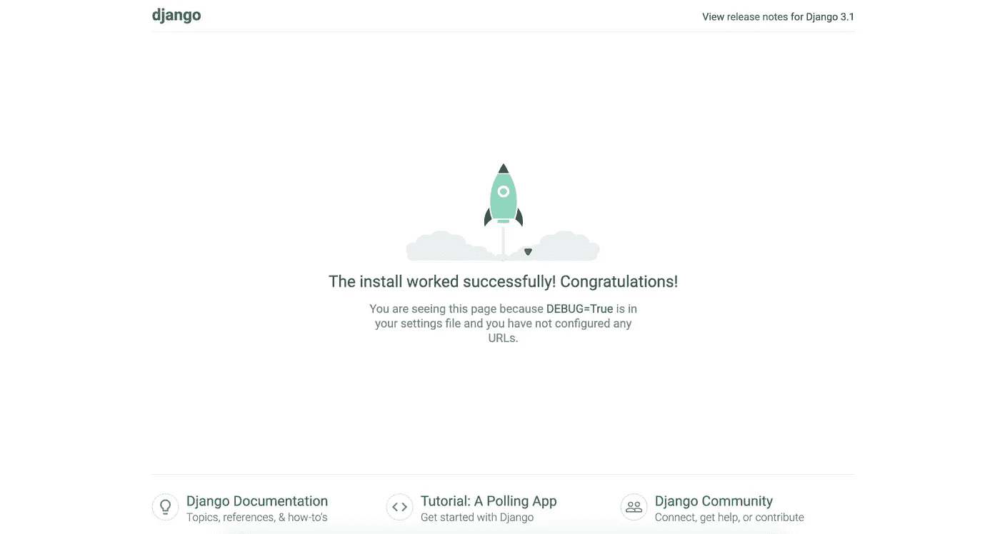
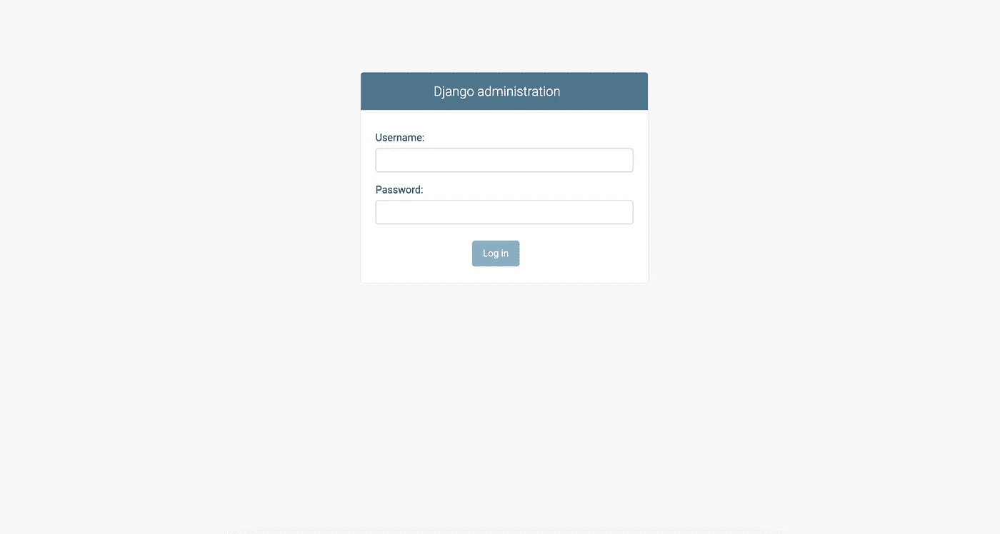
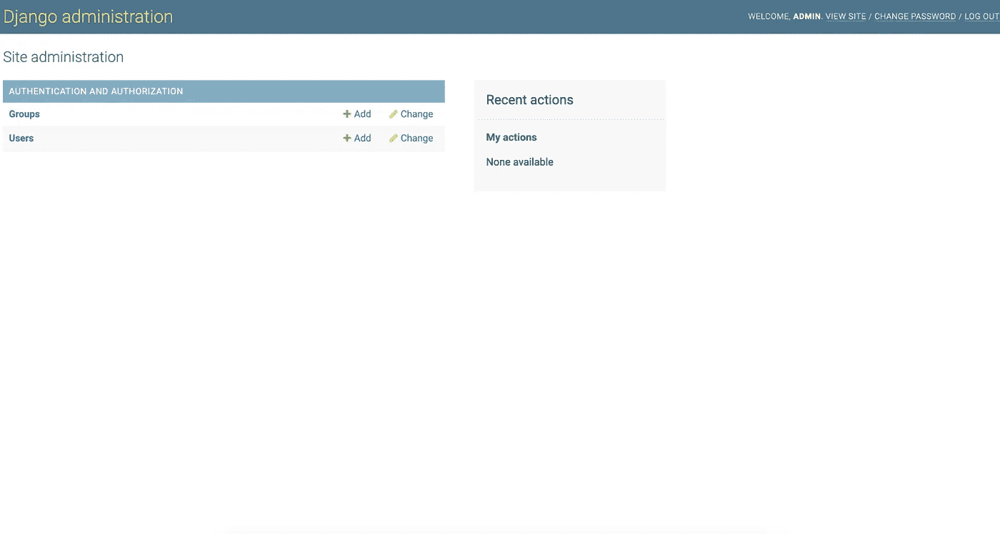
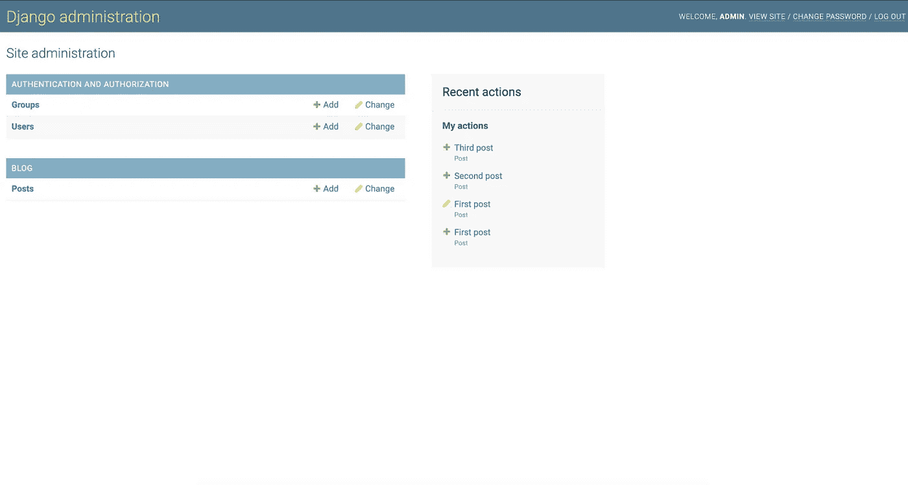
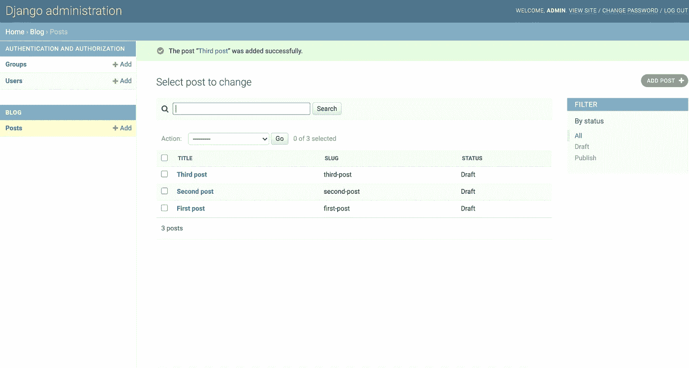
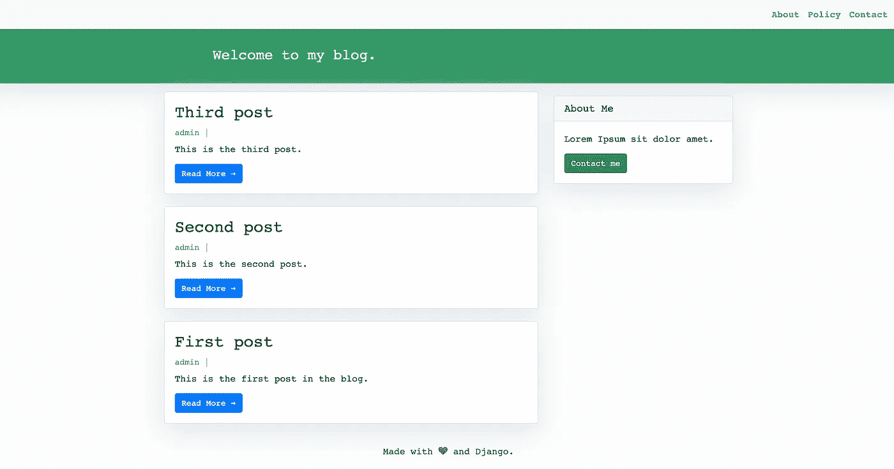
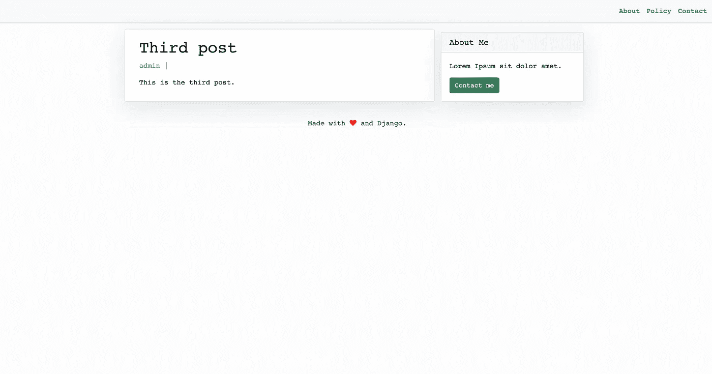

# 与姜戈一起创建博客

> 原文：<https://medium.com/geekculture/create-a-blog-with-django-60f529f1d8b6?source=collection_archive---------1----------------------->

## 使用 Python 和 Django 从头开始创建博客的分步指南。


Photo by [Kaitlyn Baker](https://unsplash.com/@kaitlynbaker?utm_source=unsplash&utm_medium=referral&utm_content=creditCopyText) on [Unsplash](/collections/9795850/tech?utm_source=unsplash&utm_medium=referral&utm_content=creditCopyText)

从头开始创建一个个性化的博客网站比看起来简单。尤其是在使用提供现成内置特性的特定框架时。Django 是这种情况下的一个很棒的框架。

# 创建 Django 应用程序

在本教程中，将按照正确的顺序介绍和简要解释开发和维护网站的所有必要步骤。

## 1.0 初始设置

假设 Python3 已经安装，创建一个目录作为起点:

```
# create a dir
mkdir djangoblog# navigate to dir
cd djangoblog
```

## 1.1 虚拟环境

创建一个虚拟环境非常简单。尝试以下命令:

```
# python3 -m venv <name>
python3 -m venv **venv**
```

这样就创建了一个虚拟环境，命名为 **venv** 。现在，让我们激活它:

```
# source <name>/bin/activate
source **venv**/bin/activate
```

在虚拟环境中，有最新版本的 Python(在本例中是 3.9)和最新版本的 pip(在本例中是 21.0.1)。然后，让我们安装 Django(默认是最新版本，这里是:3.1.7):

```
# pip install <package-name>
pip install django
```

## 1.2 项目设置(1)

创建并激活虚拟环境之后，下一步是创建一个目录，并在那里创建一个 Django 项目:

```
# create a dir
mkdir **mysite**# navigate to dir
cd **mysite**# create a django project
django-admin startproject **mysite**
```

现在，目录的结构如下所示:

```
*| — mysite
| | — __init__.py
| | — asgi.py
| | — settings.py
| | — urls.py
| | — wsgi.py
| — manage.py*
```

但是，这些文件意味着什么呢？

*   **__init__。py** →一个空白的 Python 脚本，向 Python 解释器表明这个目录实际上是一个 Python 包。它允许从目录中导入 Python 包。
*   **asgi.py** →提供支持异步的 Python web 服务器、框架和应用程序之间的标准接口。
*   **settings.py** →包含 Django 项目配置的文件。
*   **urls.py** →包含 Django 项目 URL 模式的文件。
*   **wsgi.py** →包含 Django 项目的 wsgi 配置属性的文件。它基本上是一个 Python 脚本，用于运行开发服务器并帮助部署到生产环境。
*   **manage.py** →一个命令行实用程序，允许以多种方式与 Django 项目交互。

首先，有两个同名的目录可能会引起混淆。但是，主目录的名称仍然可以更改为任何首选名称。

另一方面，二级目录名被硬编码在一些 Django 特定的文件中，因此；不建议改名。

## **1.3 运行项目**

Django 自带一个内置的 web 服务器用于开发。要运行该项目，只需导航到 *manage.py* 文件所在的位置，并尝试以下命令:

```
# default run in [http://127.0.0.1:8000/](http://127.0.0.1:8000/)
python manage.py runserver# use another port in localhost
python manage.py runserver 2000
```



## 1.4 项目设置(2)

既然已经创建了 Django 项目，下一步就是创建 Django 应用程序。让我们导航到 *manage.py* 文件所在的位置，并启动一个应用程序:

```
# python manage.py startapp <name>
python manage.py startapp **blog**
```

该应用程序已经创建并命名为**博客**。请注意，新文件是在 director 中生成的，当前结构如下所示:

```
*|— db.sqlite3
|— mysite
| |— __init__.py
| |— asgi.py
| |— settings.py
| |— urls.py
| |— wsgi.py
|— manage.py
|— blog
| |— __init__.py
| |— admin.py
| |— apps.py
| |— migrations
| |— models.py
| |— tests.py
| |— views.py*
```

在创建了一个 app 之后，Django 需要知道项目中有一个新的 app。要告诉 Django 这一点，请检查设置文件( *mysite/settings.py* )。在这里，您可以找到默认安装的应用程序:

```
INSTALLED_APPS = [
'django.contrib.admin',
'django.contrib.auth',
'django.contrib.contenttypes',
'django.contrib.sessions',
'django.contrib.messages',
'django.contrib.staticfiles',
]
```

这里也是我们添加新应用的地方:

```
INSTALLED_APPS = [
'django.contrib.admin',
'django.contrib.auth',
'django.contrib.contenttypes',
'django.contrib.sessions',
'django.contrib.messages',
'django.contrib.staticfiles',
'blog',
]
```

## 2.0 数据库模型

如上面的项目结构所示，Django 项目中生成了一个 SQLite 数据库。

在 Python 中，模型是从 *django.db.models.Model* 继承的类。模型类中的每个属性代表一个数据库字段。首先，由于现在有了一个根据上述步骤创建的应用程序，我们还需要运行一些默认创建的数据库迁移:

```
python manage.py migrate
```

假设初始迁移成功执行，让我们检查一个名为 **Post** 的表及其字段的示例:

An example of a defined Django model

这个模型是博客文章的典型例子，也是博客文章通常需要和指定的内容。开始时，从 Django 导入**模型**和**用户**默认模型。还有一个**标题**，一个一个**鼻涕虫**，**作者**和**内容**当然。作者**是默认 Django 模型**用户**的外键。**状态**是指定帖子默认只是一个**草稿**，之后就会**发布**。**

还有两个更具体的字段，称为在创建的**和在**更新的**。当在数据库表中添加或更新实例时，这些将自动更新为特定的**日期+时间**。创建对象的**排序**将从最后到第一。**

注意， **__str__()** 方法是对象的人类可读表示。Django 将在很多地方使用它，比如在 *admin* 站点。

要在数据库中创建一个新表，首先我们需要生成一个迁移文件，然后执行这个迁移:

```
# create the migration file in migrations dir
python manage.py makemigrations# migrate changes to the db
python manage.py migrate
```

## 2.1 管理内置界面

Django 带有一个内置的管理界面。此时，剩下要做的就是创建一个超级用户并登录到管理面板:

```
python manage.py createsuperuser*Username (leave blank to use '<username>'): <provide username>
Email address: <provide email address>
Password: <provide password>
Password (again): <provide password again>
Superuser created successfully.*
```

执行该命令时，需要用户名、电子邮件和密码。之后，让我们重新运行开发服务器:

```
# default run in [http://127.0.0.1:8000/](http://127.0.0.1:8000/)
python manage.py runserver
```

要访问内置的管理界面，请尝试**[***http://127 . 0 . 0 . 1:8000/admin/****。*](http://127.0.0.1:8000/admin/.)**

****

**登录后，只有 Django 认证模型中的**组**和**用户**可见，如下图所示:**

****

**为了也能看到从上面的例子中创建的 **Post** 模型，它应该包含在博客应用程序的 *admin.py* 文件中( *blog/admin.py* ):**

**An example of adding a model in the built-in admin interface**

**基于上一段代码，在帖子列表中可以看到**标题**、 **slug** 和 **status** 。可以通过定义的**状态**进行过滤，也可以通过**标题**或**内容**进行搜索。**岗位**型号将出现在界面上:**

****

**请注意，添加了一些博客文章示例，如下所示:**

****

## **3.0 视图**

**视图基本上是一个接收 web 请求并返回 web 响应的函数。目标是创建视图，为这些视图返回的数据创建 HTML 模板，并用特定的 URL 映射它们。**

**让我们深入了解更多代码并更新文件( *blog/views.py)* :**

## **3.1 URL 模式**

**当用户向页面发出请求时，Django 控制器检查 URL 以返回正确的视图。首先，我们在 *mysite/blog* 目录下创建一个名为 *urls.py* 的文件，其中包含如下所示的代码:**

```
from . import views
from django.urls import pathurlpatterns = [
    path('', views.PostList.as_view(), name='home'),
    path('<slug:slug>/', views.PostDetail.as_view(),  name='post_detail'),
]
```

**然后，需要将博客中的 URL 导入到 mysite 目录的 URL 文件中( *mysite/urls.py* ):**

```
from django.contrib import admin
from django.urls import path, includeurlpatterns = [
    path('admin/', admin.site.urls),
    path('', include('blog.urls')),
]
```

## **3.2 模板**

**使用 HTML、CSS 和 Django 模板语言创建视图模板。首先，让我们在基本目录中为模板创建一个目录。**

**要使用模板，需要先在设置中进行配置:**

```
# Added template directory in settings.py
TEMPLATES_DIRS = os.path.join(BASE_DIR,'templates')...TEMPLATES = [{
    'BACKEND': 'django.template.backends.django.DjangoTemplates',
    'DIRS': [TEMPLATES_DIRS], # Template directory added here
    'APP_DIRS': True,
    'OPTIONS': {
        'context_processors': [
        'django.template.context_processors.debug',
        'django.template.context_processors.request',
        'django.contrib.auth.context_processors.auth',
        'django.contrib.messages.context_processors.messages',
        ],
    },
},]
```

**然后，让我们有四个不同的(*。html)文件:**

*   **【base.html】→主模板，模板的“骨架”。它包括页眉、导航栏、内容&页脚。**
*   ****index.html**→使用 Django 模板语言扩展*base.html*模板。它包含主页中的博客条目，使用的模板是 *post_detail.html* 。它还包括***sidebar.html***文件。******
*   ********sidebar.html**→在主页面增加了一个小侧边栏。******
*   ******post_detail.html** →博文的详细视图。****

****让我们看看上面提到的文件是什么样子的:****

****Example of templates using HTML, CSS and Django template language, inspired by [djangocentral.com](http://www.djangocentral.com)****

****在**index.html**文件中使用 DTL 的小例子及说明:****

```
**# Extending an HTML template using Django template language
...# Including an HTML template using DTL
...# Iterating through the objects inserted in the db table "Post"
# List "post_list" is available because of inheriting from ListView
 # for post in "Post" db table
      # get the title of post**
```

> ****注意:关于 Django 模板语言的更多细节，请访问[这里](https://docs.djangoproject.com/en/3.1/ref/templates/language/)。****

****最后，项目的结构类似于下面的示例:****

```
***|— db.sqlite3
|— mysite
| |— __init__.py
| |— asgi.py
| |— settings.py
| |— urls.py
| |— wsgi.py
|— manage.py
|— blog
| |— __init__.py
| |— admin.py
| |— apps.py
| |— migrations
| |— models.py
| |— tests.py
| |— views.py
| - templates
| |- base.html
| |- index.html
| |- post_detail.html
| |- sidebar.html***
```

# ****恭喜你！🎉****

****假设这篇文章中提到的所有步骤都正确遵循，个人博客现在就可以使用了，看起来像下面的图片所示:****

********

****Blog’s main page****

********

****Detailed view of a blog post****

****此外，请随意查看我的 git repo 的源代码:****

****[](https://github.com/bthaqi/django-blog) [## bthaqi/django-博客

### 一个如何用 django 创建博客的例子。通过在…上创建帐户，为 bthaqi/django 博客的发展做出贡献

github.com](https://github.com/bthaqi/django-blog)**** 

# ****想了解更多？****

****Django 文档和教程的一些很好的来源，也是我的灵感来源，如下所述:****

*   ****https://docs.djangoproject.com/en/3.1/intro/tutorial01/****
*   ****【https://djangocentral.com/django/ ****
*   ****[https://www.fullstackpython.com/django.html](https://www.fullstackpython.com/django.html)****

> ****注:我一直最喜欢的关于姜戈的书🍨****

 ****[## Django 1.11 的两个独家新闻:Django Web 框架的最佳实践——Google 搜索

### 如果您在几秒钟内没有被重定向，请单击此处。Django 1.11 的两个独家新闻:最佳实践…

g.co](https://g.co/kgs/MxyA4c)**** 

# ****简短回顾****

****这篇简短的教程涵盖了使用 Python3 和 Django3 从头开始创建个人博客的所有必要步骤。****

****首先，它解释了需要安装什么，以及如何创建 Django3 应用程序。简短描述 Django 应用程序的结构，应用程序包含什么文件以及它们的目的是什么。****

****然后，继续讨论数据库模型、迁移和管理内置接口，直到简要解释 Django 中的视图和呈现模板。****

****假设所有的步骤都按照正确的方式进行，个人博客就可以使用了，并且可以按照*你自己喜欢的方式*进行定制！****