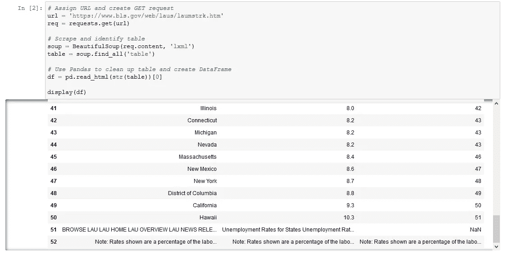
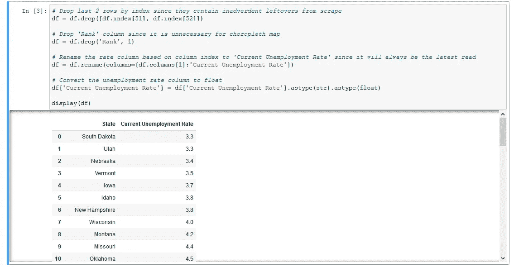
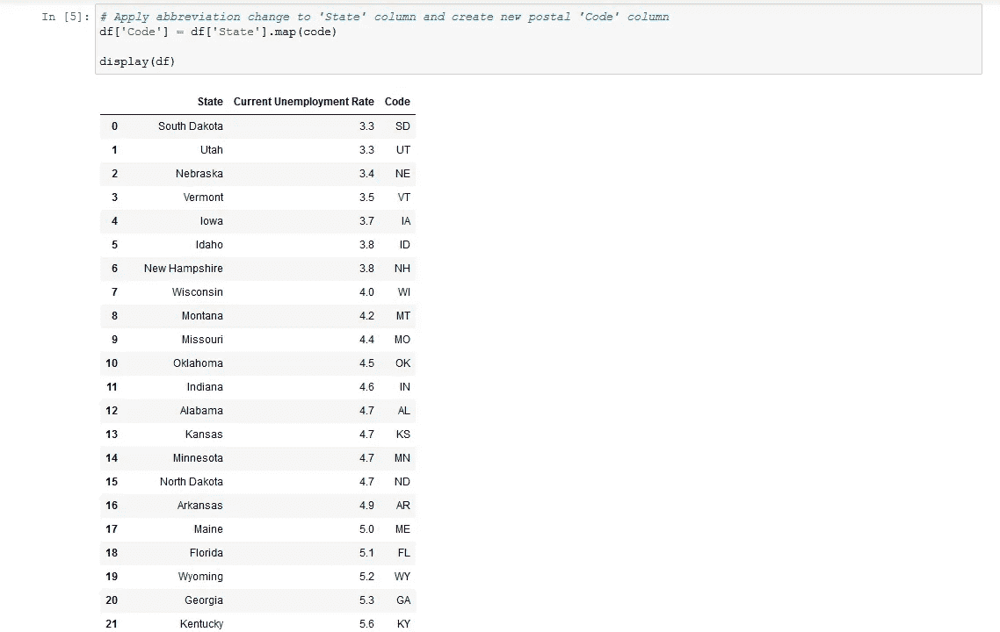
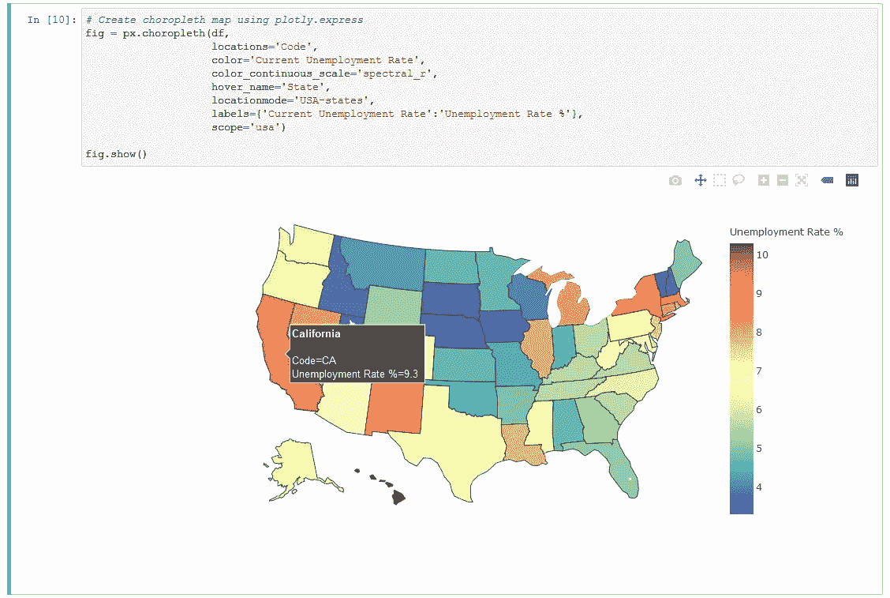
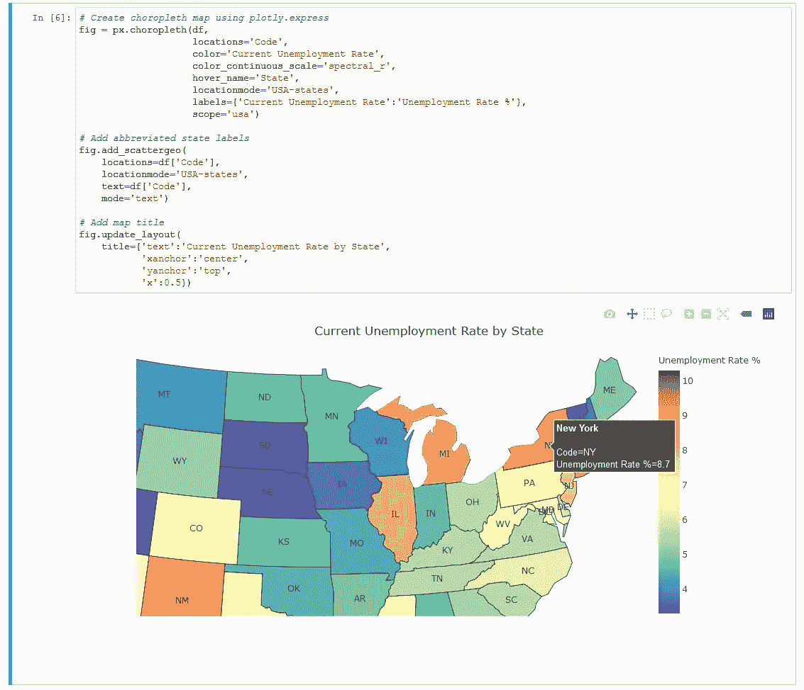
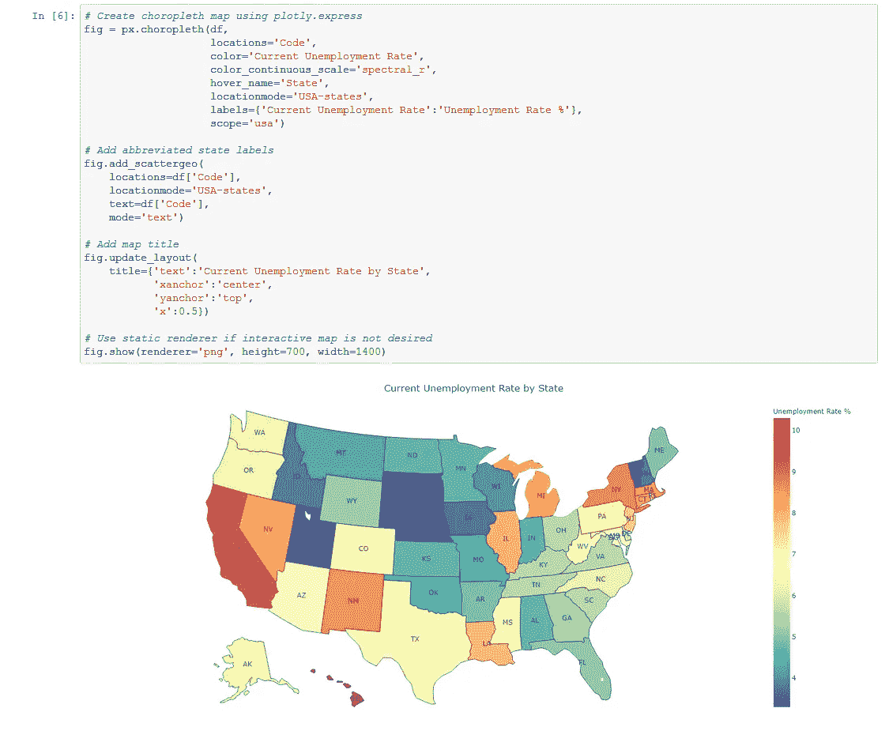

# 用 Plotly 创建州失业率的 Choropleth 图

> 原文：<https://medium.com/geekculture/create-a-choropleth-map-of-state-unemployment-rates-with-plotly-1354050e0cfd?source=collection_archive---------5----------------------->


Photo by [Michael Shannon](https://unsplash.com/@mgshannon?utm_source=medium&utm_medium=referral) on [Unsplash](https://unsplash.com?utm_source=medium&utm_medium=referral)

随着美国经济开始从新冠肺炎疫情的严重程度中复苏，各州开始取消对商业活动的限制，重要的是要了解每个州正在经历不同的劳动力市场状况，对于面临较高失业率的地区来说，复苏之路将更加艰难。美国劳工统计局是这一主题数据的具体来源，它定期在网站上公布各州的[失业率。使用 Python 中的 Plotly，可以获取这些数据来创建 choropleth 地图，突出显示全国劳动力市场状况的差异。](https://www.bls.gov/web/laus/laumstrk.htm)

为方便起见，本指南将介绍 Jupyter 笔记本的制作，它:

1.  抓取劳动统计局页面上的可用数据，并将其转换为熊猫数据框架。
2.  操纵熊猫数据帧，使其在绘图时达到理想的 choropleth 可视化。
3.  使用 Plotly 创建 choropleth 地图。

本指南也以这样一种方式划分，你可以从每一部分中得到你想要的，并将其应用于你自己的方法和期望的结果。

Python 中必须安装的必要包有:

*   熊猫
*   要求
*   美丽的声音
*   Plotly

首先，您需要导入上面提到的包。

```
import pandas as pd
import requests
from bs4 import BeautifulSoup
import plotly.express as px
```

从这里开始，接下来的两步是分配 URL 和创建 GET 请求。

```
url = '[https://www.bls.gov/web/laus/laumstrk.htm'](https://www.bls.gov/web/laus/laumstrk.htm')
req = requests.get(url)
```

之后，解析内容并选择将要使用的表。

```
soup = BeautifulSoup(req.content, 'lxml')
table = soup.find_all('table')
```

转换到下面的 Pandas 数据框架可以处理大部分需要的东西，但是要确保你的数据是干净的，并且格式正确。

```
df = pd.read_html(str(table))[0]
```

通过使用`display()`检查到目前为止加载了什么显示最后两行包含不必要的数据。



Inspecting your DataFrame in Jupyter Notebook is both easy and helpful

使用`.drop()`按索引位置删除最后两行，按名称删除“Rank”列将删除不需要的元素。

```
df = df.drop([df.index[51], df.index[52]])
df = df.drop('Rank', 1)
```

假设劳工统计局页面的原始结构没有改变，包含失业率值的列将始终位于相同的位置，因此可以通过使用`.rename()`并标识列位置而不是名称来重命名该列，以反映最新(或当前)的失业率。

```
df = df.rename(columns={df.columns[1]:'Current Unemployment Rate'})
```

因为这个列中包含的值是数字，所以确保它们被转换成`float`是很重要的，这样以后 Plotly 就不会将这些值解释为对象。

```
df['Current Unemployment Rate'] = df['Current Unemployment Rate'].astype(str).astype(float)
```



The steps outlined above reflect the bulk of the DataFrame manipulation that will be needed

Plotly 使用缩写的两个字母的邮政编码来表示州的位置，因此有必要创建一个包含州的全名到缩写的转换的字典。

```
code = {'Alabama': 'AL',
        'Alaska': 'AK',
        'Arizona': 'AZ',
        'Arkansas': 'AR',
        'California': 'CA',
        'Colorado': 'CO',
        'Connecticut': 'CT',
        'Delaware': 'DE',
        'District of Columbia': 'DC',
        'Florida': 'FL',
        'Georgia': 'GA',
        'Hawaii': 'HI',
        'Idaho': 'ID',
        'Illinois': 'IL',
        'Indiana': 'IN',
        'Iowa': 'IA',
        'Kansas': 'KS',
        'Kentucky': 'KY',
        'Louisiana': 'LA',
        'Maine': 'ME',
        'Maryland': 'MD',
        'Massachusetts': 'MA',
        'Michigan': 'MI',
        'Minnesota': 'MN',
        'Mississippi': 'MS',
        'Missouri': 'MO',
        'Montana': 'MT',
        'Nebraska': 'NE',
        'Nevada': 'NV',
        'New Hampshire': 'NH',
        'New Jersey': 'NJ',
        'New Mexico': 'NM',
        'New York': 'NY',
        'North Carolina': 'NC',
        'North Dakota': 'ND',
        'Ohio': 'OH',
        'Oklahoma': 'OK',
        'Oregon': 'OR',
        'Pennsylvania': 'PA',
        'Rhode Island': 'RI',
        'South Carolina': 'SC',
        'South Dakota': 'SD',
        'Tennessee': 'TN',
        'Texas': 'TX',
        'Utah': 'UT',
        'Vermont': 'VT',
        'Virginia': 'VA',
        'Washington': 'WA',
        'West Virginia': 'WV',
        'Wisconsin': 'WI',
        'Wyoming': 'WY'}
```

现在，通过使用`.map()`创建一个新的对应列，包含每个州的所有缩写代码，可以将该字典应用于“州”列。

```
df['Code'] = df['State'].map(code)
```



Finally ready for Plotly

使用 Plotly 创建 choropleth 地图是通过使用`px.choropleth()`和指定可视化参数来完成的。

```
fig = px.choropleth(df,
                    locations='Code',
                    color='Current Unemployment Rate',
                    color_continuous_scale='spectral_r',
                    hover_name='State',
                    locationmode='USA-states',
                    labels={'Current Unemployment Rate':'Unemployment Rate %'},
                    scope='usa')
```

首先，`df`确定了我们打算使用的数据帧。使用`locations`指定包含 Plotly 使用的两个字母的州缩写的“Code”列。在地图上，通过使用`color`和`color_continuous_scale`来区分这些值，以说明各州之间的差异。请注意，`spectral_r`色标只是`spectral`颠倒了，因为用红色而不是蓝色来说明高失业率更直观。在这种情况下，`locationmode`用于将几何图形标识为`USA-states`。最后，`scope`缩小地图范围，以便在呈现地图时消除美国以外的任何元素。

准备就绪后，使用`.show()`显示交互式地图。



The basic foundation of the choropleth map should now be visible

如果您想添加更多的视觉信息，您可以使用`.add_scattergeo()`为每个状态添加文本标签，如下所示。

```
fig.add_scattergeo(
    locations=df['Code'],
    locationmode='USA-states',
    text=df['Code'],
    mode='text')
```

您也可以使用`.update_layout()`为地图添加标题，并使文本居中，因为默认情况下，Plotly 会将标题文本放在左上角。

```
fig.update_layout(
    title={'text':'Current Unemployment Rate by State',
           'xanchor':'center',
           'yanchor':'top',
           'x':0.5})
```



Even a small amount of additional visual information can go a long way

最后，通过选择 PNG 渲染器，您可以在`.show()`中使用静态渲染器来创建图像，而不是交互式地图。

```
fig.show(renderer='png', height=700, width=1400)
```



A static PNG allows for greater flexibility in terms of sharing your map than the default Plotly renderer

希望这份指南能为任何对劳动力市场指标或数据可视化感兴趣的人提供一个很好的起点和灵感来源。使用 Plotly 创建这些类型的地图的好处在于，它提供了自定义最终输出的每个方面的自由。您可以创建定制的色标、标签、注释、标题，以及几乎所有其他粒度级别的东西，这是使用其他工具很难做到的。Plotly 还提供了将其他 Python 包(如 BeautifulSoup 和 Pandas)无缝、快速地结合起来的便利，这意味着不需要同时处理多个应用程序。所以，继续策划吧！