# ReactJSX 与 Instagram 相遇:轻松添加和删除评论

> 原文：<https://medium.com/geekculture/create-a-comment-app-using-reactjsx-b46522aa95f6?source=collection_archive---------11----------------------->

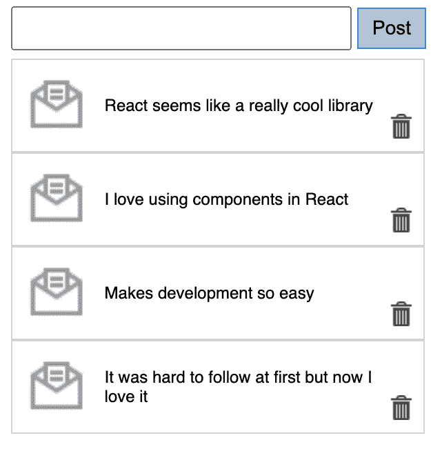

Simple comment App

## 你知道 Instagram 完全基于 ReactJS 库吗？你想知道如何编写一些基本功能的代码吗，比如添加和/或删除评论？如果是，继续读下去！

## 掌握 ReactJSX 的威力

首先在 create-react-app 环境中设置一个简单的应用程序，它将使用 npm 下载并安装几个 NodeJS 包，然后继续在应用程序中添加状态。了解如何连接事件处理程序来添加新注释，以及如何连接事件处理程序来删除注释。

目标:

*   在 create-react-app 环境中开发一个简单的应用程序
*   在应用程序中使用状态和属性
*   连接事件处理程序来添加和删除注释

如果你是新手，对开发这个应用没有足够的信心，请在 [Youtube](https://www.youtube.com/watch?v=w7ejDZ8SWv8) 上观看教程。

让我们开始编码吧！👩‍💻

通过按 Ctl +`打开 Visual Studio 代码终端，并键入:*npx create-react-app simple-comment-app。*在这里阅读更多关于这个命令[的信息。](https://create-react-app.dev/docs/getting-started)

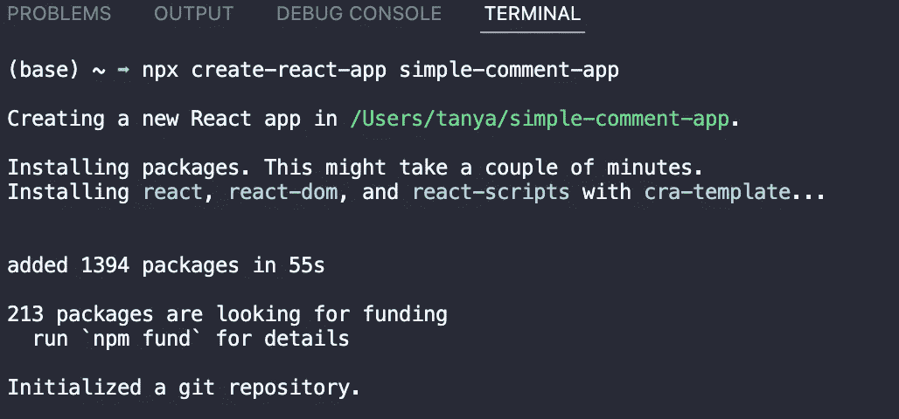

Img-1 Create react app cli

接下来进入创建的子文件夹: *cd simple-comment-app。*并运行: *npm start* 运行 React 的开发服务器。该应用将在您的浏览器中打开，网址为 [http://localhost:3000/](http://localhost:3000/) 。

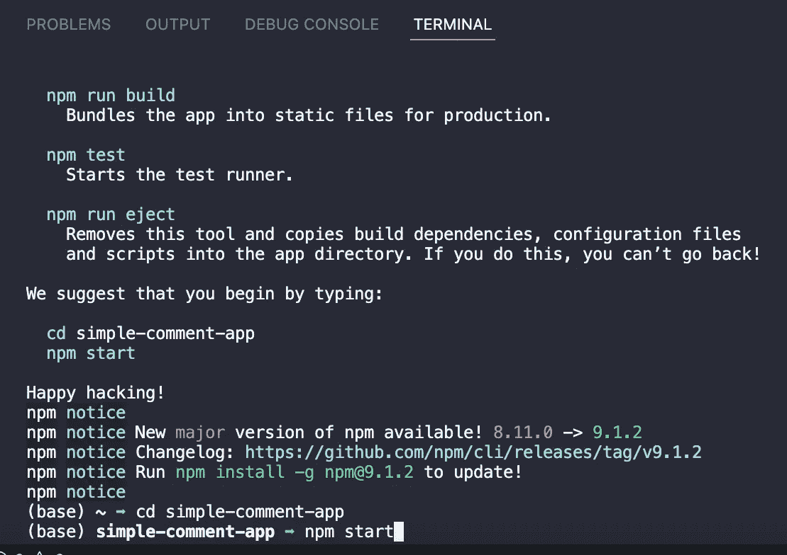

Img-2 CLI

通过展开来浏览您的公共和源代码文件夹(Img-3，index.html 是我们的切入点)。

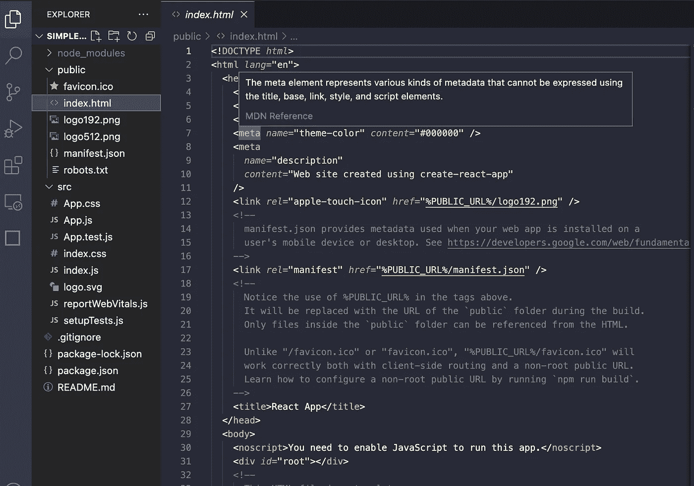

Img-3 Created files.

接下来，我们将创建一个名为 *Comment.js* 的新组件，它将呈现从应用程序顶层组件一直传递到 Comment 的消息。在 render 函数中，我们将以表格的形式显示注释。table 元素应用了 css 类“comment”。在这个表中，我们用一行来表示这个注释(也就是< tr >标签)。在这一行的第一个单元格中，我们显示消息图标。第二个单元格是通过 props 从 *CommentList* 传递到*组件*的消息的实际内容。第三个单元格是回收站图标，用于删除评论。在最底层，确保您有*导出默认注释*，这样这个注释模块就可以用于其他 js 文件中的代码。

让我们连接一个删除事件处理程序，以便能够使用 index 删除注释(Img-4，第 6–8 行)。每个*评论*组件都有一个关联的索引，该索引作为 props 的一部分被传入。这个 *deleteComment* 事件处理程序只需要调用 *this.props.deleteComment* 并传入 *this.props.index* 。此外，我们希望用户能够通过点击垃圾箱图标来删除评论，为此，我将把 *onClick* 事件处理程序添加到在< td >标记中包含该图标的单元格中(Img-4，第 19 行)。

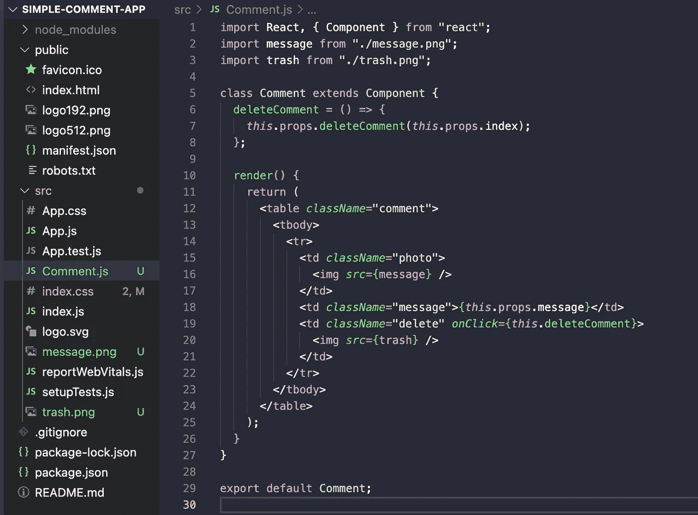

Img-4 Comment Component

我现在将创建一个新文件 *CommentList.js* 来表示一个组件，该组件将呈现和显示评论列表。将 react 和 Comment 组件导入该文件。然后，我将创建一个具有 render 函数的类，该类返回一个具有 className="commentList "的< div >和从最高级别的应用程序组件(参见 Img-7 上的应用程序组件代码)传递的属性。我们需要在应用程序中呈现的消息可以在 *this.props.messages* 中找到。我将调用消息列表上的 map 函数(Img-5，第 13 行)。map 函数接受另一个函数作为输入参数，该函数对列表中的每个元素应用某种转换。这里我们想要的转换是，对于每条消息，我们将把该消息传递给一个 *Comment* 组件(Img-5，第 15 行)。您将为这个组件指定属性:一个惟一标识这个组件的键，一个 prop 消息的值，该消息是*注释*必须呈现的消息。为了能够使用消息的索引位置删除消息，我们需要将每个评论的索引传递到 this 组件中。我将设置一个名为 index 的变量，并将其初始化为 0 (Img-5，第 8 行)。接下来，我将为每个*评论*组件(Img-5，第 15 行)传递指定的索引值。此外，我还将传入另一个名为*index = { index++ }:*index 的最后一个值，先初始化为 0，然后 index 值会为下一个注释递增。我还将使用**扩展操作符** *{…this.props}* 来传递我们从更高级别的组件接收到的所有属性。

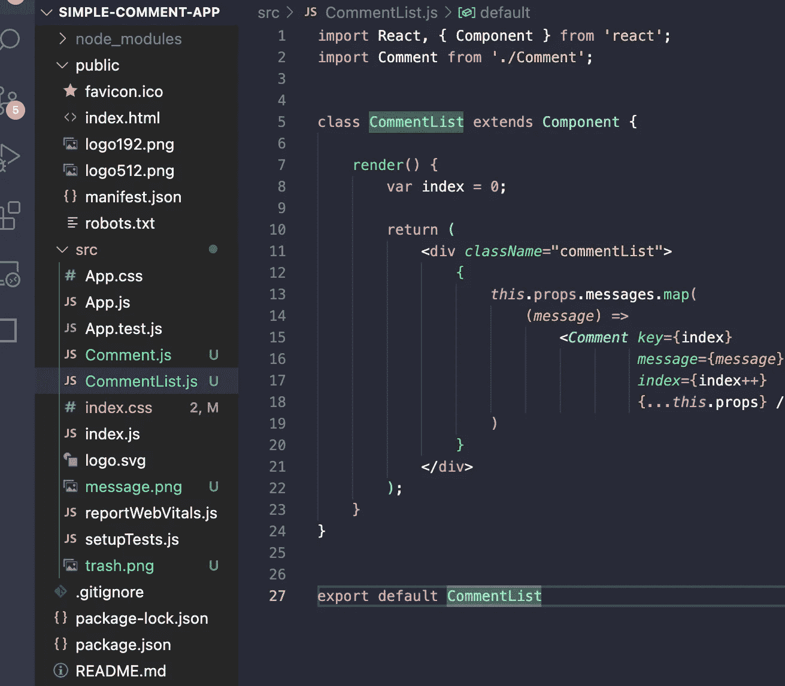

Img-5 CommentList Component

让我们继续向我们的应用程序添加另一个组件 *CommentBox.js* (Img-6) *。*这将是一个允许我们输入新评论的表单，新评论将显示在评论列表中。为 react 包中的 React 和组件设置导入语句。在渲染函数中，我们有一个外部的< div >和输入框。在输入框下，我们有一个按钮，其文本为:Post。这是一个允许我们在应用程序上发表新评论的组件。我将在第 4 行 Img-6 的顶部添加一个构造函数，它接受 props 作为输入参数，并在向它传递 props 时调用超类。这里我要做一个决定:这个*评论框*应该作为一个**控制的**组件还是一个**非控制的**组件与输入文本框一起工作？这个选择很重要，原因有几个:React 中的最佳实践建议您的组件通常应该是受控组件，其中您在输入框中指定的值是使用您的 *React 控制的。组件*状态(通常不允许表单元素管理自己的内部数据)。在这里，我将有意识地选择让我的输入文本框成为一个不受控制的组件。原因是这是一个相当简单的表单元素。现在我们必须创建一个 *ref* 来引用该组件的 DOM 节点(Img-6，第 7 行)。我们需要在 render 函数中引用这个 *ref* ，这样输入就有了 *ref* 属性(Img-6，第 18 行)。一旦用户指定了他/她想要在输入文本框中添加的评论，用户将继续并点击 Post 按钮。因此，我们需要为 Post 按钮添加 click 处理程序，以便将消息添加到我们的消息列表中(Img-6，第 19 行)。

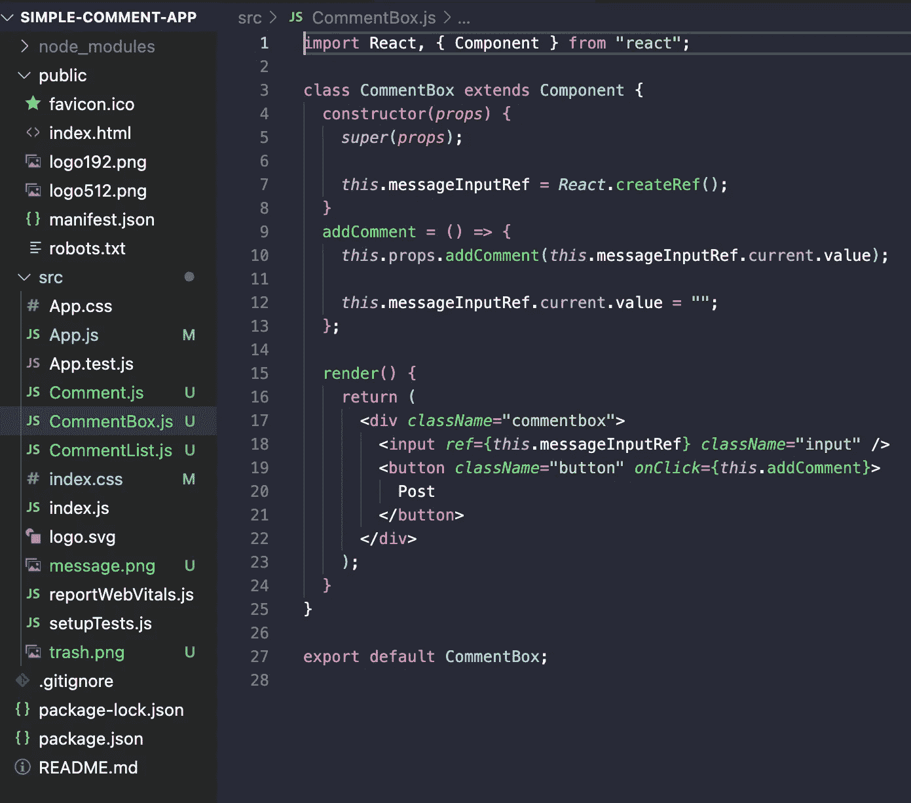

Img-6 CommentBox Component

标准的做法是让应用程序中最高级别的组件是一个。/App.js '。我将删除此处的现有代码，它指的是使用 create-react-app 环境创建的 starter 应用程序，我将粘贴我自己的代码。

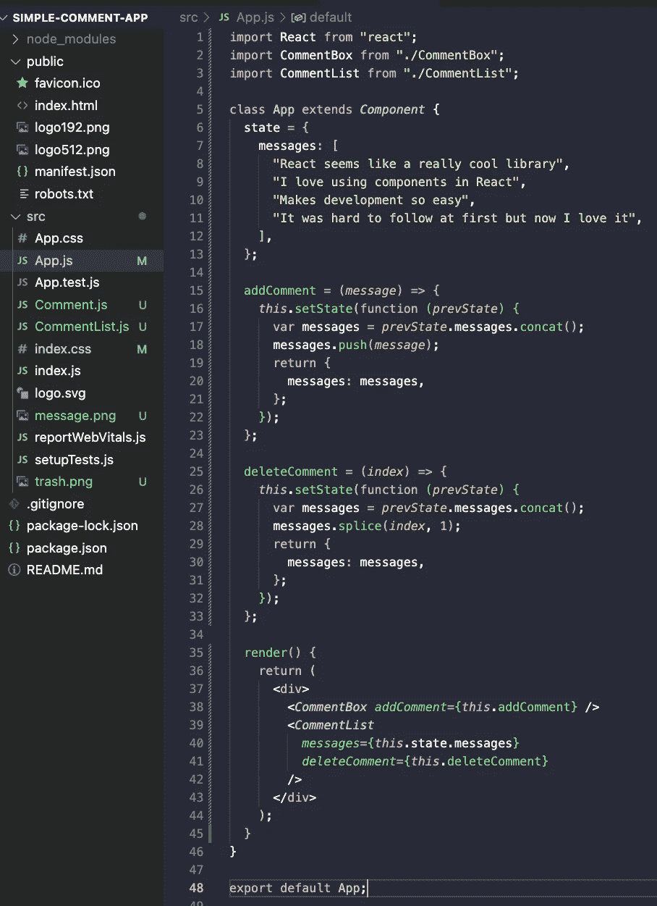

Img-7 App Component(highest level)

在添加交互性之前，让我们给应用程序添加一些状态(Img-7，第 6–13 行)。我们将把我们的状态存储在尽可能高的组件中(最佳实践！)，也就是 *App* *组件*。该状态仅保存将要使用我们的评论应用程序显示的消息列表。这里的状态只包含一个属性:我们希望在应用程序中显示的消息列表。我将通过 props (Img-7，第 40 行)把我在这个*应用组件*的状态中的消息列表传递给 *< CommentList >* 。

将交互性添加到组件中非常重要，这需要事件处理程序。没有交互性意味着这个应用在这个时间点很无聊。让我们解决这个问题(Img-8，第 15–23 行)。

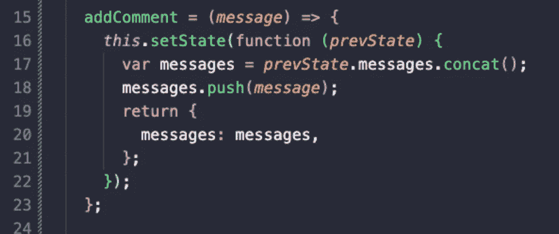

Img-8 Adding interactivity to our App component

我将添加一个事件处理程序来处理添加一个新的注释，该注释将显示在应用程序的注释中。我已经使用箭头符号定义了名为 *addComment* 的事件处理程序(Img-8，第 15 行)。事件处理程序通常使用箭头符号定义，因为当您在 ES6 类中使用箭头符号时，您定义的方法会自动绑定到组件的当前实例。在这个 *addComment* 事件处理程序中，我们要做的就是更新应用组件的当前状态。我们将调用 this.setState 函数(Img-8，第 16 行)。这需要一个输入参数——这个函数的输入参数是这个对象的前一个状态。在更新状态之前，我们将使用以前的状态来访问该组件中的当前消息列表。

*prev state . messages . concat*将创建一个新的 JS 列表，该列表将保存在 messages 变量中(Img-8，第 17 行)。我们将通过使用 *messages.push* (Img-8，第 18 行)*将我们想要添加的新消息推送到列表的最后来更新这个消息列表的新副本。现在我们将返回组件的新状态。messages 属性有一个新的消息列表，在该列表的最末尾附加了全新的消息(Img-8，第 19–21 行)。从该事件处理程序更改组件的状态将重新呈现该组件。但是我们首先需要连接这个事件处理程序。*

负责允许我们添加新消息的组件是 CommentBox，它现在将成为我们 CommentList 的一部分。我将把这个事件处理程序 *this.addComment* 以道具的形式传入 CommentBox 组件(Img-9，第 38 行)。 *addComment* 事件处理程序在这个应用程序注释中定义，它作为函数属性传递给 CommentBox。

Img-9 Passing event handler from the App component down to CommentBox component

接下来，我们将设置一个事件处理程序，允许我们删除评论。看看这个 *deleteComment* 事件处理程序的输入参数:它接受您想要删除的注释的索引，并相应地更新状态(Img-10，第 25 行)。一旦我们知道了需要删除的注释的索引，我们就调用 *this.setState* 并传递一个允许我们访问先前状态的函数。我们使用*prev state . messages . concat()*创建当前消息的副本。然后，我们可以在变量 *messages、*中使用这些消息，我们称之为 messages.splice 来删除由 index (Img-10，第 28 行)指定的消息。

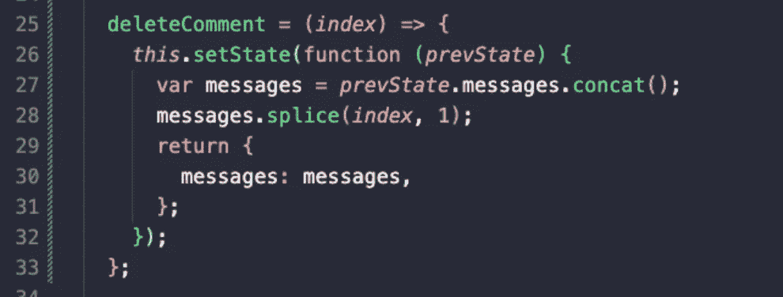

Img-10 Event handler to delete comments

在我们的 React 应用程序中，我们将允许用户通过单击每条消息旁边的垃圾桶图标来删除消息，这意味着我们必须将这个 *deleteComment* 事件处理程序传递给 *CommentList* 组件(Img-11，第 41 行)。*注释列表*是使用*注释*组件显示单个消息的列表。

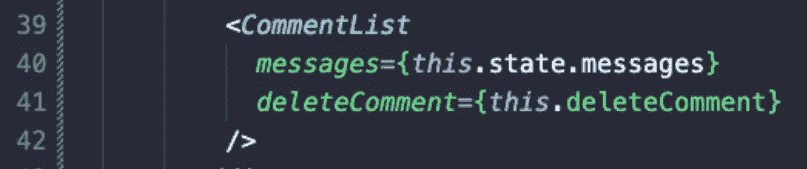

Img-11 Passing delete function as part of props to CommentList component

你做到了！谢谢你和我一起编码！感谢您的时间和关注！

 [## 简单注释反应应用程序

你最终的申请应该是这样的。](https://youtube.com/shorts/UVAhEZ-Leo4?feature=share)