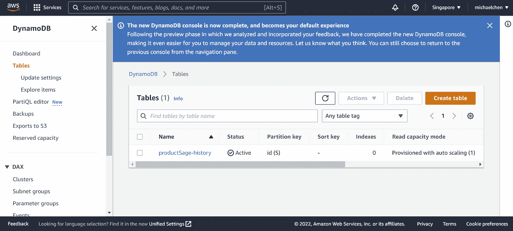
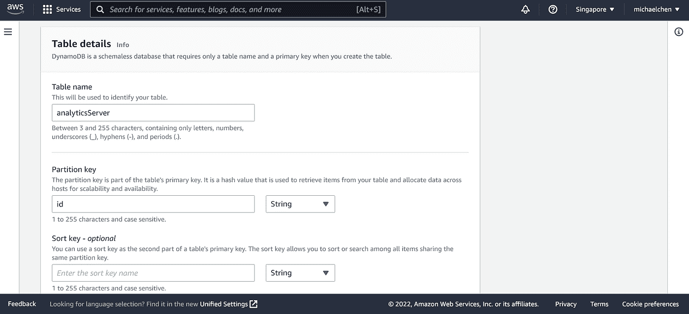
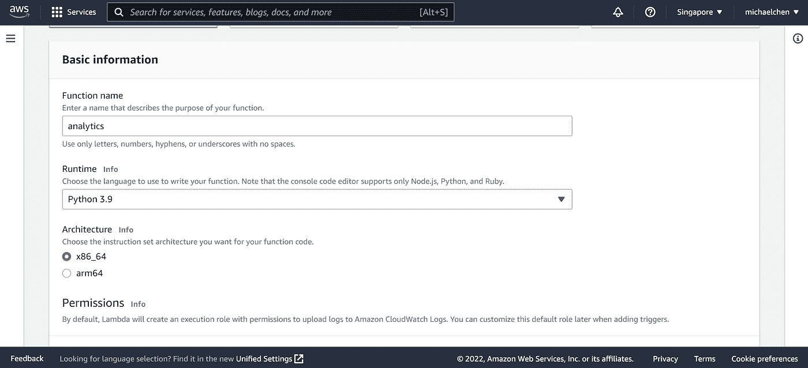
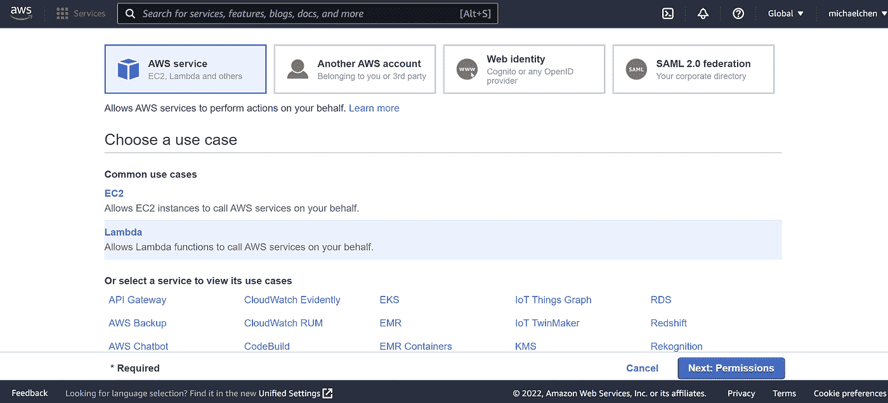
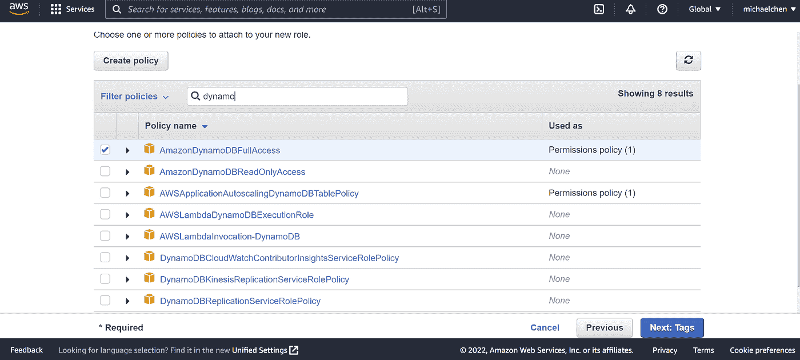
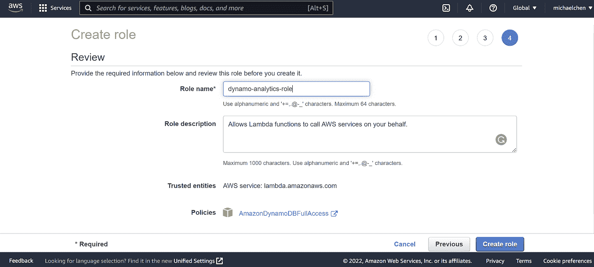
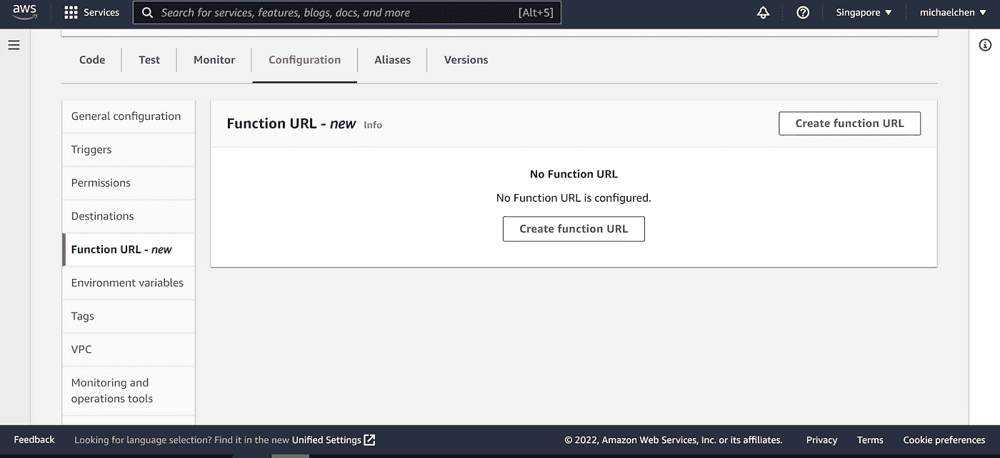
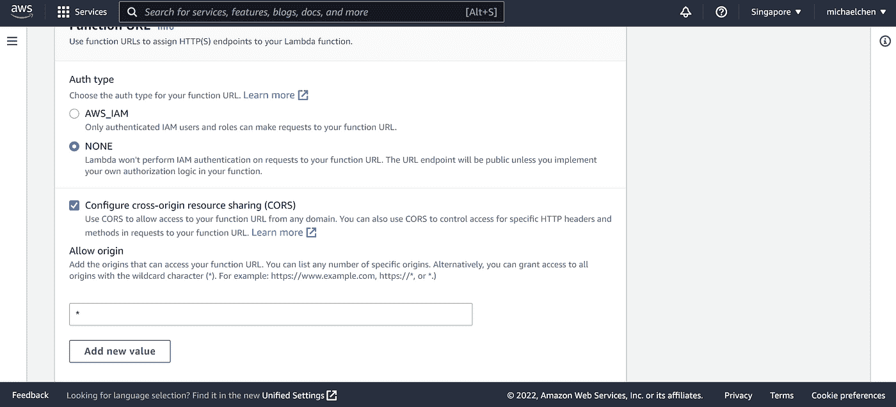

# 使用 Python 和 AWS 在 30 分钟内创建一个自定义分析服务器

> 原文：<https://medium.com/geekculture/create-a-custom-analytics-server-in-30-minutes-with-python-aws-c126f5496b73?source=collection_archive---------11----------------------->

Source: [Unsplash](https://unsplash.com/photos/zBLtU0zbJcU)

有时候，谷歌分析并不是最好的解决方案。

当我在创建 [ProductSage](http://productsage.io) 的时候，我只想知道用户在我的网站上搜索了什么。使用谷歌分析的行话，我试图跟踪“自定义事件”。

但是 GA 并不适合我的用例——我在另一个项目中使用了它的定制事件特性，这个过程变得不必要的困难。这一次，我想要一些快速简单的东西，没有处理 GA 的不直观的 API，缓慢更新的服务器和混乱的 web 界面的包袱。平心而论，GA 确实是免费的，但这是以我的时间(和心理健康，似乎)为代价的。

所以我决定，对于 ProductSage，我将使用 AWS Lambda 和 DynamoDB 来创建一个简单的分析服务器，成本几乎为 0 美元。以下是如何在 30 分钟或更短时间内完成设置的方法。

# 它是如何工作的

DynamoDB 是由 AWS 提供的非关系型(NoSQL)数据库服务。没有固定结构的项目存储在表中。

AWS Lambda 让您可以在线运行代码，而无需关心任何与服务器相关的事情。你所需要做的就是把你的代码上传到 Lambda 函数中，它就会在云上运行！

这是两个部分的结合:

*   **步骤 1** :客户端应用程序通过一个 API 向你的 Lambda 函数发送数据。
*   **第二步** : Lambda 函数访问你的 DynamoDB 表，并将数据存入其中。

就是这样！解释完了，让我们一起创建服务器。

# 辅导的

## **创建 DynamoDB 表**

转到 AWS 控制台上的 DynamoDB 服务。点击侧边栏中的“表格”部分后，点击右侧橙色的“创建表格”按钮。

输入一个表名(由您决定)并输入“id”作为您的分区键。

让其余的选项保持原样，然后单击底部的“创建表格”按钮。

等待 AWS 完成创建您的表，它就准备好了！

## 创建 Lambda 函数

转到 AWS 控制台上的 AWS Lambda 服务，然后单击右侧橙色的“创建函数”按钮。

输入函数名并选择 Python 3.9 作为运行时。

由于这个 Lambda 函数将用于将数据插入到我们的 DynamoDB 表中，因此该函数需要访问 DynamoDB 服务。

要告诉 AWS 这一点，可以通过进入微小的“IAM 控制台”链接来创建一个新的执行角色。

选择“Lambda”并单击下一步。

检查“AmazonDynamoDBFullAccess”策略。这将允许您的 Lambda 函数访问 DynamoDB。

写一个合适的名字，然后点击“创建角色”！请注意，执行角色是可重用的。所以如果你想在将来创建另一个类似的 Lambda 函数，你可以重用这个角色。

创建后，使用 AWS 控制台上的代码编辑器将以下代码键入 *lambda_function.py* 中。

单击“部署”，您的功能就准备好了！除了一件事…

## **API 端点**

我们需要通过创建一个链接到这个函数的 API 来使客户端应用程序可以访问它。别担心，这只需要一分钟。

在同一个 Lambda 界面中，在“配置”下，转到“函数 URL”，然后点击“创建函数 URL”。

为“认证类型”选择“无”，然后选中“配置跨来源…”。我们将保持其他一切不变，然后单击“保存”按钮创建 URL。

请注意，在生产中，您应该将“允许来源”字段更改为您的网站 URL。这确保只有您的网站可以向分析服务器发送数据。

最后，为了确保一切正常，使用下面的 cURL 命令测试您的 API。

为了使用 Python 提取您的分析数据，这里有一个示例代码:

恭喜你。你的分析服务器是完整的🥳🥳🥳

## 了解更多信息的资源

*   [https://docs . AWS . Amazon . com/lambda/latest/DG/lambda-URLs . html](https://docs.aws.amazon.com/lambda/latest/dg/lambda-urls.html)
*   [https://medium . com/brain station 23/破冰与动力 db-5302e7456d2a](/brainstation23/break-the-ice-with-dynamodb-5302e7456d2a)
*   [https://boto 3 . Amazon AWS . com/v1/documentation/API/latest/reference/services/dynamo db . html](https://boto3.amazonaws.com/v1/documentation/api/latest/reference/services/dynamodb.html)