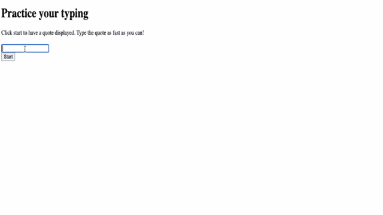

# 用 JavaScript 在 5 分钟内创建一个游戏！！

> 原文：<https://medium.com/geekculture/create-a-game-with-javascript-in-5-minutes-35f69c3b66e3?source=collection_archive---------7----------------------->

你好，我最近用 JavaScript 制作了这个令人惊奇的游戏，并决定在这里分享它。游戏应用事件驱动编程，因此它很容易理解和快速建立。游戏捕捉玩家打字时的速度，并输出所用的时间。它有一个单词数组，向玩家显示，并在玩家输入时循环显示一个单词。


代码使用 JavaScript 编程语言，尽管您可以使用任何语言。因为这个输出显示在浏览器上，所以 JavaScript 更适合这里。这里也使用了 HTML 和 CSS。我最初决定尝试制作这个游戏，以便理解 JavaScript 中的事件是如何处理的。

# 什么是事件？


事件是在您正在编程的系统中发生的动作或事件，系统会告诉您这些动作或事件，以便您的代码可以对它们做出反应。例如，当用户点击网页中的按钮时，用户期望诸如显示信息框或像提交按钮那样重定向到另一个页面的反应。

来自 [mdn web docs](https://developer.mozilla.org/en-US/docs/Learn/JavaScript/Building_blocks/Events) 的其他例子有助于激发您的好奇心，包括:

*   用户选择、单击或将光标悬停在某个元素上。
*   用户选择键盘上的一个键。
*   用户调整或关闭浏览器窗口。
*   网页加载完毕。
*   提交一份表格。
*   视频播放、暂停或结束。
*   出现错误。

为了对事件作出反应，程序员附加了一个事件侦听器，它现在在事件触发后对事件作出反应。顾名思义，监听器监听一个事件，并通过处理该事件的事件处理程序对其做出响应。

# **代码**

这里使用 HTML 来提供一个可视界面，用户可以在其中输入。

```
<!DOCTYPE html>
<html>
    <head>
        <title>This is an event Driven Game</title>
        <meta charset="utf-8"/>
        <meta http-equiv="X-UA-Compatible" content="IE=edge"/>
        <meta name="viewport" content="width=device-width, initial-scale=1"/>
        <link rel="stylesheet" type="text/css" href="./style.css"/>
        <script src="./script.js" defer></script>
    </head>
    <body>
        <h1>Typing game!</h1>
        <p>Practice your typing skills with a quote from Sherlock Holmes. Click **start** to begin!</p>
        <p id="quote"></p><!-- This displays our quote -->
        <p id="message"></p><!-- This displays status message -->
        <div>
            <input type="text" aria-label="current word" id="typed-value" />
            <button type="button" id="start">Start</button>
        </div>
    </body>
</html>
```

JavaScript 使用段落标签、输入标签和按钮标签中的 id 属性来操作标签并在浏览器上显示文本。

我们也有 CSS 来为游戏提供一点风格。

```
body{
    background-color: #cca3ed;
}
h1{
    text-align: center;
    font-family: sans-serif, Arial, Helvetica;
}
.highlight{
    background-color: yellow;
}
.error{
    background-color: lightcoral;
    border: red;
}
```

现在我们继续看菜单上的主菜，JavaScript！

在脚本的最顶端，我们有一个包含引号列表的数组。

```
const quotes = [
    'When you have eliminated the Impossible, whatever remain, howevre impossible, must be completed',
    'There is nothing more deceptive than an obviuos fact',
    'I ought to know by this time that when a fact appears to be opposed to a long train of deductions it invariably proves to be capable of bearing some other interpretation.',
    'I never make exceptions. An exception dispoves the rules',
    'What one man can invent, another can discover',
    'Nothing clears up a case so much as stating it to another person',
    'Education never ends, Watson. Life is a series of learning and learning until the day we die.'
];
```

这个数组存储了游戏用来测试你打字速度的数据。简单来说，数组是同一类型元素的集合。

就像食谱一样，这就是我们需要的:

*   包含所有引号列表的数组
*   空数组存储当前报价的所有单词
*   存储玩家当前正在键入的单词的索引的空间
*   玩家点击开始的时间

我们还需要对 UI 元素的引用:

*   文本框(**键入的值**)
*   报价显示(**报价**)
*   消息(**消息**)

```
let words = [];
let wordIndex = 0;
let startTime = Date.now();
const quoteElement = document.getElementById('quote');
const messageElement = document.getElementById('message');
const typedvalueElement = document.getElementById('typed-value');
```

空数组存储当前报价的所有单词。假设显示的报价可能是第二个“没有什么比明显的事实更具欺骗性”，那么这将是要存储在空数组中的报价。wordIndex 变量用作存储用户当前正在键入的单词的索引的空间。startTime 变量显示用户开始输入的时间。这有助于衡量用户到目前为止输入了多长时间，从而计算出输入报价所需的时间。

**添加启动逻辑**

```
document.getElementById('start').addEventListener('click', () =>{
    const quoteIndex = Math.floor(Math.random() * quotes.length);
    const quote = quotes[quoteIndex];
    words = quote.split(' ');
    wordIndex = 0;
    const spanWords = words.map(function(word) { return `<span>${word} </span>`});
    quoteElement.innerHTML = spanWords.join('');
    quoteElement.childNodes[0].className = 'highlight';
    messageElement.innerText = '';
    typedvalueElement.value = '';
    typedvalueElement.focus();
    startTime = new Date().getTime();
});
```

如上所示，事件监听器用于监听事件的发生，并显示相应的信息。当用户单击 start 时，代码选择一个报价，设置用户界面，并设置对当前单词和时间的跟踪。

设置跟踪的单词

使用 Math.floor 和 Math.random 允许我们从报价数组中随机选择一个报价。Math.floor()是 JavaScript 中的一个函数，它向下舍入并返回小于或等于给定数字的最大整数。Math.random()函数返回一个大于或等于 0 且小于 1 的浮点伪随机数，在该范围内近似均匀分布，然后可以缩放到所需的范围。

我们将报价转换成单词数组，这样我们就可以跟踪玩家当前正在键入的单词。wordIndex 被设置为 0，因为用户将从第一个单词开始。

设置用户界面

我们创建了一个 spanWords 数组，其中包含了一个 span 元素中的每个单词，允许我们突出显示这个单词。使用加入阵列。join()创建一个字符串，该字符串可用于更新 quoteElement 上的 innerHTML。这将向玩家显示报价。

我们将第一个 span 元素的类名设置为 highlight，以便将其突出显示为黄色。上面的 css 文件显示了它的样式。

通过将 innerText 设置为(“”)来清理 messageElement。

设置文本框

我们清除 typedValueElement 上的当前值，并将焦点设置为 typedValueElement。

通过调用 getTime 启动计时器。

**添加打字逻辑**

```
 typedvalueElement.addEventListener('input', () => {
    const currentWord = words[wordIndex];
    const typedValue = typedvalueElement.value;
    if(typedValue === currentWord && wordIndex === words.length -1) {
        const elapsedTime = new Date().getTime() - startTime;
        const message = `CONGRATULATIONS! You finished in ${elapsedTime / 1000} seconds`;
        messageElement.innerText = message;
    }else if (typedValue.endsWith(' ') && typedValue.trim() === currentWord){
        typedvalueElement.value = '';
        wordIndex++;
        for(const wordElement of quoteElement.childNodes){
            wordElement.className = '';
        }
        quoteElement.childNodes[wordIndex].className = 'highlight';
    }else if(currentWord.startsWith(typedValue)){
        typedvalueElement.className = '';
    } else{
        typedvalueElement.className = 'error';
    }
});
```

当玩家输入时，会引发一个输入事件。这个事件监听器将检查以确保玩家正确输入单词，并处理游戏的当前状态。我们首先获取玩家目前输入的单词和值。然后逻辑如下进行，我们检查引用是否完整，单词是否完整，单词是否正确，或者最后，是否有错误。

如 if 条件所示，如果 typedValue 等于 currentWord，wordIndex 等于比单词长度小 1，则引用完成。我们通过从当前时间中减去开始时间来计算运行时间。我们将 elapsedTime 除以 1000，将毫秒转换为秒。玩家输入完报价后，这段时间会显示为成功消息。

为了使单词完整，typedValue 必须以空格结尾，并且必须等于 currentWord。我们将 typedElement 上的值设置为(“”)，以允许键入下一个单词。我们还遍历 quoteElement 的所有子节点，将 className 设置为 empty(' ')以恢复到默认显示。将当前单词的类名设置为高亮显示，以将其标记为下一个要键入的单词。

如果 currentWord 以 typedValue 开始，那么这表明该单词键入正确但不完整。我们通过清除 className 来确保默认显示 typedValue。

如果出现错误，我们将 typedValue 上的 className 设置为 error。



这就是用 JavaScript 构建一个打字游戏的全部内容。用这段代码在你的机器上测试一下，看看它是否能运行。

黑客快乐！！