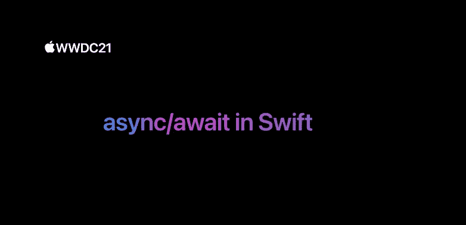

# 使用 async/await 创建一个通用网络层。

> 原文：<https://medium.com/geekculture/create-a-generic-networking-layer-using-async-await-9168b6281721?source=collection_archive---------2----------------------->



[https://developer.apple.com/videos/play/wwdc2021/10132/](https://developer.apple.com/videos/play/wwdc2021/10132/)

完成处理程序是闭包，是自包含的功能块，可以在代码中传递和使用。它们作为参数传递给函数，然后在函数完成时被调用。

当我们想要执行异步作业时，它们在 iOS 中使用，例如，让我们看看使用 **URLSessionDataTask** 执行请求并解码响应的通用 API 是什么样子的。它看起来会像这样…

Generic networking layer — completion handlers

这里公共的 **fetch** 函数在内部调用私有的**解码** **任务**函数。**解码** **任务**函数使用 **URLSession** 数据任务从服务器获取资源，正如您可以看到的，会话数据任务也是一个闭包，在它内部，一旦我们获得数据、响应或错误，我们就执行我们的转义完成处理程序。这并没有什么问题，只是简单的东西会变得冗长而不可读。

还有一些其他选项，如 **Promises** 有助于使这种代码更加紧凑和易于理解，但现在在 **Swift 5.5** 中，我们可以使用新的 **async** 和**await**API 来清理这一点，甚至使我们的代码更加安全，所以让我们看看如何重构这种通用代码，但现在使用 [**async-await**](https://github.com/apple/swift-evolution/blob/main/proposals/0296-async-await.md) 。

出于示例的目的，我们仍然使用相同的 APIError，但是现在我们使用 **async/await** ，fetch 函数仍然将可解码类型和请求作为参数，但是现在该函数是 **async** ，而不是传递完成处理程序。

1.  当你标记一个函数 **async 时，**关键字应该在函数签名中的**抛出**之前，就像这个例子，或者如果函数没有**抛出**则在箭头之前。现在，如果响应成功，对象被解码，方法将返回它。
2.  iOS 15 引入了一个新的 **URLSession** 方法[数据(for:delegate:)](https://developer.apple.com/documentation/foundation/urlsession/3767352-data) **，**这个方法返回非可选数据和非可选响应。如果您进入 **GenericAPI** 示例，您将看到我们使用[data task(with:completion handler:)](https://developer.apple.com/documentation/foundation/urlsession/1407613-datatask)代替，该方法返回可选数据、可选响应和可选错误。这两种方法都是异步的，并且做得非常相似(嗯，不完全是这样,“旧的”API 也返回错误信息，但是异步的**不返回，我不确定为什么苹果决定在返回值中删除这条信息🤷🏽‍♂️).这个**异步**方法**抛出**所以调用者需要添加一个**尝试**关键字，因为是**异步**它也需要**等待**关键字。**

> *如果一个表达式中有多个* ***异步*** *函数调用，你只需要写****await****一次，就像你只需要一个****try****对于一个有多个抛出函数调用的表达式。*

3.在 **do/catch** 块中，如果解码操作成功，我们将返回解码后的值。

4.要不然，我们**扔**。

当调用一个**异步**方法时，有一件事你需要知道，让我们看一个例子，我们将创建一个远程对象，它有一个**发布的**属性，这个属性将用我们的**异步**获取函数的响应来设置…

```
**final** **class** FeedRemote: ObservableObject {
/// 1
**private** **let** client = Client()
/// 2
@Published **private**(**set**) **var** musicItems: [MusicItemViewModel] = []**///3
var** request: URLRequest = {
**let** urlString = "https://rss.itunes.apple.com/api/v1/us/apple-music/coming-soon/all/50/explicit.json"
**let** url = URL(string: urlString)!
**return** URLRequest(url: url)
}()**///4
func** fetchMusicItems()  {**let** container = **try** **await** client.fetch(type:  Container<MusicItem>.self, with: request)
     musicItems = container.feed.results.map { MusicItemViewModel(musicItem: $0) }
}
```

1.  **客户端**是一个符合 **AsyncGenericAPI 的类。**
2.  **musicItems** 属性将使用 **Combine** 框架发布响应中的更改。
3.  在这种情况下，请求将使用 RSS 提要 Apple generator API。
4.  从视图控制器或任何具有初始化的 **FeedRemote** 对象的实例中调用 **fetchMusicItems** 。在这个函数内部，我们调用我们的**异步** fetch 函数，它有 **try** 和**异步**关键字，因为我们知道这是一个**异步**和**抛出**调用。

如果你尝试运行这个应用程序，编译器会显示几个错误…

你能看到的第一个错误是 *"* ***从这里抛出的错误没有被处理"*，**这是一个简单的错误，你只需要将你的代码包装在一个 **do/catch** 块中，第二个错误更有趣 ***"在一个不支持并发的函数中进行异步调用"*** 这是什么意思？嗯，这只是意味着您需要从同步上下文中“桥接”异步调用，不用担心，这很容易解决，您可以将` **fetchMusicItems`** 标记为 **async** ,就像这样…

```
**func** fetchMusicItems() **async** { <---- marking the function as async**do** {**let** container = **try** **await** client.fetch(type:  Container<MusicItem>.self, with: request)
      musicItems = container.feed.results.map {   MusicItemViewModel(musicItem: $0) }} **catch** {
      print("The error is --- \((error **as**! APIError).customDescription)")
  }
}
```

这解决了这里的问题，但它只是移动了一级应用程序，您可以继续将顶级函数标记为 **async** 但有一个更好的方法，您可以使用 **async** 闭包来异步执行您的 **async** 调用，最终实现如下所示…

```
**func** fetchMusicItems() {**async** { <--- async closure :) 
       **  do** {
 **let** container = **try** **await** client.fetch(type: Container<MusicItem>.self, with: request)
             musicItems = container.feed.results.map { MusicItemViewModel(musicItem: $0) }
         } **catch** {
             print("The error is --- \((error **as**! APIError).customDescription)")
         }
   }
}
```

就这样，通过使用**异步**闭包，现在你可以执行你的**异步**函数，而不需要将顶层函数标记为**异步**🎉

还有最后一样东西我想给你看。如果您比较一下`**GenericAPI**`中 fetch 函数的实现与 **AsyncGenericAPI** 中 fetch 函数的实现，您可以看到，在第一个函数中，当我们获得结果时，我们使用 **CGD** 跳转到主线程，那么我们如何确保我们的**async genericapi**fetch**方法也在主线程上给我们结果以进行 UI 更新呢？**

**嗯，我们也可以使用 GCD 来完成这个任务，然后像这样把我们的代码推到主线程上…**

```
**func** fetchMusicItems() {**async** {
           **do** {
              **let** container = **try** **await** client.fetch(type: Container<MusicItem>.self, with: request)
              DispatchQueue.main.async { <--- GCD main queue
                **self**.musicItems = container.feed.results.map { MusicItemViewModel(musicItem: $0) }
              }
           } **catch** {
               print("The error is --- \((error **as**! APIError).customDescription)
           }
      }
}
```

**这是可行的，但是现在有一个更好的方法，你可以使用 **@MainActor** 属性包装器来保证你的代码将在主线程上运行，甚至不需要手动指定它。Swift 会自动将在那里发生的任何工作排队，就像我们自己使用了 **DispatchQueue.main** 一样。**

**您可以仅在您的函数或属性中使用 **@MainActor** ，但是对于这个远程类将总是发布结果以显示在 **UI 中的示例，**在整个类中使用它更有意义。通过这样做，它里面的每个函数或属性都将拥有一个 **@MainActor** 提供的好处。**

**代码将如下所示…**

```
@MainActor
**final** **class** FeedRemote: ObservableObject {
/// FeedRemote implementation ....
}
```

**这只是 Swift 5.5 通过其新的并发 API 带来的一小部分工具，还有更多，如果您感兴趣，这里是 WWDC2021 关于这一主题的所有演讲的精选列表。😁**

## **[在 Swift 中满足异步/等待](https://developer.apple.com/videos/play/wwdc2021/10132/)**

## **[用迅捷动作者保护易变状态](https://developer.apple.com/videos/play/wwdc2021/10133/)**

## **[探索 Swift 中的结构化并发](https://developer.apple.com/videos/play/wwdc2021/10134/)**

## **[满足异步序列](https://developer.apple.com/videos/play/wwdc2021/10058/)**

## **[Swift 并发:幕后](https://developer.apple.com/videos/play/wwdc2021/10254/)**

## **[对 URLSession 使用 async/await](https://developer.apple.com/videos/play/wwdc2021/10095/)**

## **[Swift 并发:更新一个样本应用](https://developer.apple.com/videos/play/wwdc2021/10194/)**

## **[快速并发:幕后](https://developer.apple.com/videos/play/wwdc2021/10254/)**

## **[在 SwiftUI 中发现并发](https://developer.apple.com/videos/play/wwdc2021/10019/)**

## **[了解并消除应用程序中的挂起现象](https://developer.apple.com/videos/play/wwdc2021/10258/)**

**这里有一个[示例](https://github.com/jamesrochabrun/WWDC2021)项目，包含这篇文章的所有代码和更多内容。🤓**

**[这里](https://forums.swift.org/t/will-swift-concurrency-deploy-back-to-older-oss/49370)是围绕早期版本的 Swift 并发支持的讨论。😭🙏**

***感谢*。🤖**