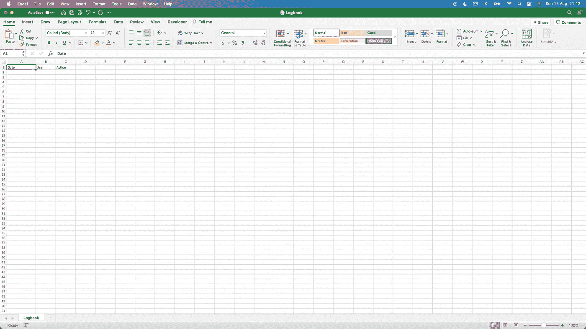

# 使用简单的 VBA 代码为您的 Excel 工作簿创建日志

> 原文：<https://medium.com/geekculture/create-a-logbook-for-your-excel-workbook-using-simple-vba-code-aa612cd4b3ba?source=collection_archive---------31----------------------->

两周前，我的上一篇文章发表在 freeCodeCamp 上，现在是时候用世界上最可怕的编程语言来写一篇新的教程了。

如果您在一个团队中工作，并且有多个成员使用同一组文档，那么维护一个记录打开或关闭某个工作簿的人员的工作表可能会很方便。虽然版本控制可能已经在某些云平台上帮了你很多，比如 OneDrive，但 VBA 可以帮助你存储其他信息，这些信息可能与你更相关。

我想让这个解释器尽可能的简单明了，来展示你如何使用简单的 VBA 代码来完成你想象不到的最简单的任务。为了阅读本教程，我不期望你有任何使用 VBA 或任何其他编程语言的经验，但它可能更容易理解某些方面。

# 准备我们的练习册

我们将首先打开一个新的工作簿，将初始工作表重命名为“Logbook ”,并为我们的日志定义一些标题，如图 1 所示。

在本教程中，我将向您展示如何存储日期、用户和操作(无论工作簿是已关闭还是已打开)，但您可以在本教程的末尾使用您的新超能力随意添加自己的标题和数据。

Figure 01: Logbook Worksheet

## 开发者标签

在我们开始编写代码之前，在您的 Excel 窗口中提供 Developer 选项卡是很重要的。关于如何在功能区中使用这些函数的快速提示，可以在本文开头的副标题为“如何使用 Visual Basic for Applications 构建宏”的文章中找到。

# 编写 VBA 代码

一旦您做好准备并打开 Visual Basic 编辑器，就该开始编写一些代码了。

为了开始编写一个宏，你总是要从 Sub 关键字开始，Sub 关键字是 subroutine 的缩写，它定义了一个函数的开始。如果你为你的宏输入一个名字，用两个圆括号结束并按下回车键，编辑器将以“End Sub”结束子程序。

只有在我们输入了两个子关键字中的一些代码之后，宏才会开始执行一些操作，所以现在就开始吧。

首先，我想在我们的日志工作表第二行的上方添加另一行。初始日志可能不需要这样做，但是可以防止您在以后的插入中覆盖数据。
要这样做，我们可以调用 Worksheets 对象上的 Rows 对象，然后调用 Insert 方法，默认情况下只会在 Rows 对象中指定的行号之上添加一行。

现在我们有了一个清晰的行，我们可以开始添加实际的信息了。要更改单元格的值，可以直接使用 Range 对象，该对象将一个或多个单元格作为参数。
由于 Value 属性是 Range 对象的默认属性，所以也不需要输入。但是为了方便起见，请理解这两行代码会做完全相同的事情。

Now 函数内置于 Excel 中，将返回设备的当前日期和时间。然后，这个时间戳被用作该列中下一个单元格的值。
如果我们现在运行这个宏，将光标放在子程序中等待的地方，点击绿色箭头，您将看到数据被插入到您的日志工作表中。

# 添加动作数据

但是，我们之前也定义了一个动作头，为什么我们不使用它呢？让我解释一下。
此时，在数据实际添加到屏幕之前，用户必须手动运行宏。不过，为了防止人们忘记这一点，Excel 想出了一些聪明的办法。他们想出了一个在打开和关闭工作簿时自动执行的功能。

尽管它们看起来像常规函数，但下面的两个宏将根据它们的名称在打开和关闭工作簿时执行。

请注意，后者包括一个参数。尽管我们现在不会使用它，但把它留在里面是很重要的，因为没有它你的程序会崩溃。

除了通过使用硬编码字符串添加动作之外，我们的宏并没有做太多改变。
对于关闭宏，我们还添加了 Save 方法。这将保存工作簿，并且是一个位于 ThisWorkbook 对象上的方法。虽然就像前面的 Value 属性一样，ThisWorkbook 是默认的，这意味着没有必要在我们的代码中包含它。省略 Save 关键字会提示用户他们是否真的想要保存他们的更改，我们希望忽略他们的偏好来跟踪工作簿的使用。

如果您现在关闭并重新打开工作簿，应插入两行新内容，包括时间戳、您的用户名以及您是否打开或关闭了文档。

# 使用 VBA 函数重构

上面的代码应该很容易理解，即使你以前从未编写过代码。如果你有，你可以说我们在两个宏中都重复了很多。

就像在许多其他编程语言中一样，我们可以定义一个可以在宏中调用的函数。如果我们想修改宏，我们不需要在几个地方修改，只需要在一个地方修改。

要定义一个新函数，可以使用 function 而不是 Sub 关键字。给新定义的函数起一个你喜欢的名字，我选择写日志。如果在括号后再次按 enter 键，Excel 将使用 End Function 完成函数定义。在这些括号之间，定义一个名为 Action 的参数，数据类型为 string。复制 function 语句中以前使用的代码，并将单元格 C2 的值替换为参数 Action。

现在我们有了一个函数，可以用来插入一个新的日志，插入的动作取决于我们作为参数给出的字符串。

要在调用一个函数时给出一个参数，你可以给这个参数命名，后跟:=和你想插入的值。

# 结论

上面的代码现在足以在每次关闭和打开工作簿时插入一个包含先前定义的信息的新行。

恭喜你，你现在已经用 VBA 在 Excel 中为自己制作了一个自动日志！

请随意试验这段代码，添加您自己的信息，如果您喜欢本教程，请不要忘记留下一点掌声。