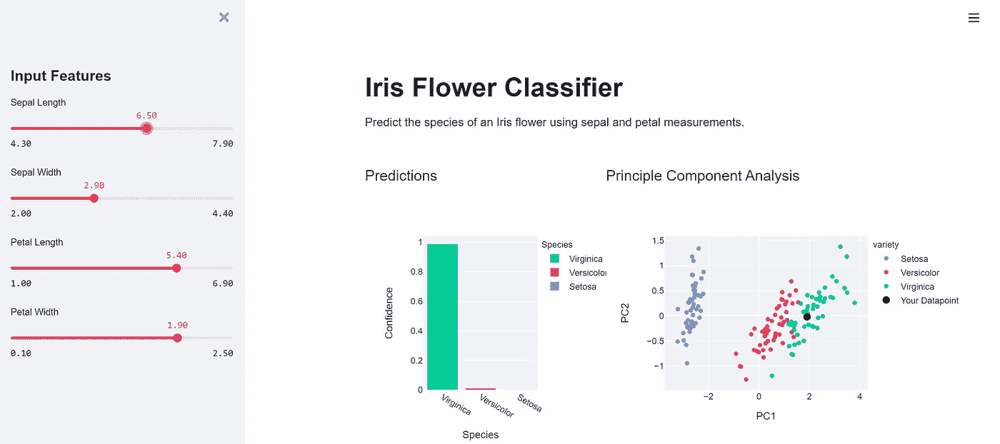
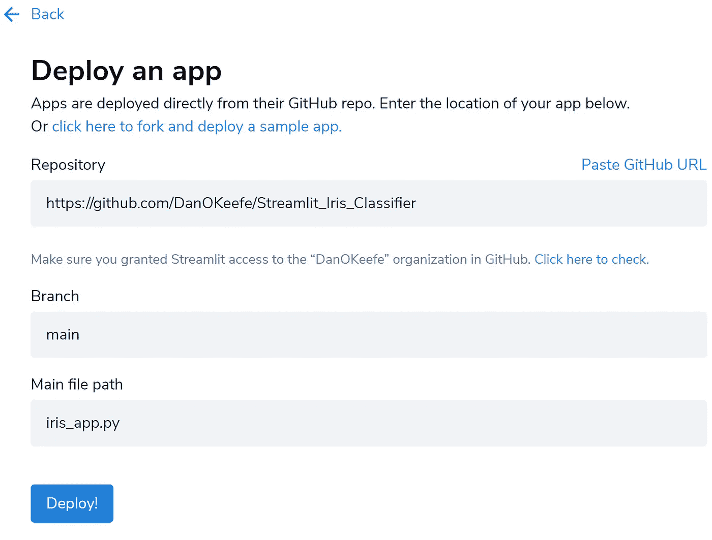
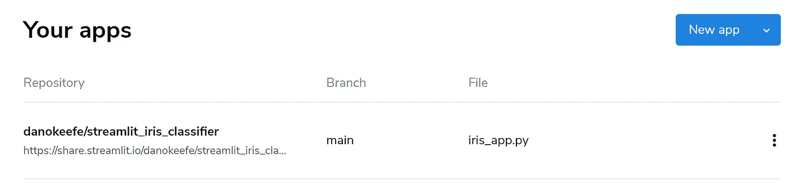

# 使用 Streamlit 创建机器学习 Web 应用程序

> 原文：<https://medium.com/geekculture/create-a-machine-learning-web-app-with-streamlit-f28c75f9f40f?source=collection_archive---------15----------------------->

Photo by [Fumiaki Hayashi](https://unsplash.com/@fumirin)

Streamlit 是一个开源的 Python 框架，它可以帮助机器学习和数据科学团队创建开箱即用的专业数据应用程序，而无需任何前端 web 开发知识。

想象一下这样一种情况，您的团队已经训练了一个机器学习模型，现在想要为客户或另一个最终用户提供一个与您的模型交互的应用程序:对新输入进行推理，并可视化输出预测。这是我们将在本文中看到的 Streamlit 的一个用例。

在这个例子中，我已经训练了一个神经网络，通过使用四个特征(萼片长度、萼片宽度、花瓣长度和花瓣宽度)来对不同物种(Setosa、Versicolor 和 Virginica)之间的鸢尾花进行分类。我们开发的应用程序将加载模型，允许用户输入新的特征值，运行模型，查看类别预测概率，并在 [PCA](https://en.wikipedia.org/wiki/Principal_component_analysis) 图上可视化输入，以将输入与我们的[虹膜数据集](https://archive.ics.uci.edu/ml/datasets/iris)中的其他数据点进行比较。

在我们开始之前，让我们看看这个应用程序是什么样子的。

Iris Flower Classification App

您将需要的 Python 库包括: [Streamlit](https://streamlit.io/) 、 [NumPy](https://numpy.org/) 、 [Pandas](https://pandas.pydata.org/) 、 [Scikit-learn](https://scikit-learn.org/stable/) 、 [Plotly](https://plotly.com/python/plotly-express/) 和 [TensorFlow](https://www.tensorflow.org/) (或 [Keras](https://keras.io/) )。

让我们从导入这些库并加载[虹膜数据集](https://archive.ics.uci.edu/ml/datasets/iris)开始:

创建一个检索虹膜数据集的函数。使用 [**@st.cache**](https://docs.streamlit.io/en/stable/api.html#streamlit.cache) 装饰器确保该函数只执行一次。如果再次调用该函数，它将返回相同的数据帧。

当用户使用侧边栏指定输入特征值时，我希望以在训练模型之前缩放特征值的相同方式来缩放这些特征值。重新创建训练期间使用的[标准缩放器](https://scikit-learn.org/stable/modules/generated/sklearn.preprocessing.StandardScaler.html)对象。

注意:如果我没有在这个应用程序中包括 PCA 图(这需要加载 Iris 数据集)，我会将训练期间每个特征的均值和方差保存到 JSON 文件中，并使用该 JSON 文件中的数据来缩放用户输入，而不是重新创建 StandardScaler 对象。这意味着应用程序将不再需要加载 Iris 数据集，这将减少初始加载时间。

用[keras . models . load _ model()](https://www.tensorflow.org/api_docs/python/tf/keras/models/load_model)加载你的模型

现在，我们可以开始布局我们的应用程序。从应用程序的标题和描述开始。

使用 [st.title()](https://docs.streamlit.io/en/stable/api.html#streamlit.title) 以标题格式显示文本。使用 [st.markdown()](https://docs.streamlit.io/en/stable/api.html#streamlit.markdown) 定义带有 markdown 的描述。

现在定义侧边栏的滑块组件，允许用户定制输入特征值。给侧边栏一个带有 [st.sidebar.header()](https://docs.streamlit.io/en/stable/api.html#add-widgets-to-sidebar) 的标题(

# 标签)。使用 [st.sidebar.slider()](https://en.wikipedia.org/wiki/Principal_component_analysis) 为每个特性定义一个滑块。使用**标签**参数给每个滑块一个标签。使用 **min_value** 和 **max_value** 参数指定滑块可以采用的最小和最大值，这将取决于我们的数据集。用**值**参数将每个滑块的起始值设置为其代表的特征的平均特征值。使用**步长**参数指定用户拖动滑块时滑块值变化的间隔。

我们希望获取这些输入，对它们进行缩放，并在我们的模型中运行它们。将输出保存为带有列种类和置信度的数据帧。我们的置信栏将总计为 1 以模拟类别概率，因为我们模型中的最后一个激活层使用了 [softmax 函数](https://en.wikipedia.org/wiki/Softmax_function)。

现在我们有了绘制预测图所需的数据。让我们创建这个图，并将其放置在应用程序主部分的一个列中。我想把主要部分分成两栏。第一列将绘制模型预测图。第二列将有 PCA 图。用 [st.beta_columns()](https://docs.streamlit.io/en/stable/api.html#streamlit.beta_columns) 创建这个两列结构。创建模型预测图，并将其放在第一列中。

使用 [scikit-learn 的 PCA](https://scikit-learn.org/stable/modules/generated/sklearn.decomposition.PCA.html) 类对整个虹膜数据集运行两个分量的 PCA。创建 PCA 结果图，按类别进行颜色编码。将用户输入添加到 PCA 图，并在第二列显示 PCA 图。我们只需要运行 PCA 一次，但是我们需要转换用户输入，并在每次用户输入改变时更新 PCA 图。

将您的代码保存为 Python 文件(如 **iris_app.py** )并在共享目录中建模。从这个目录，打开终端，用 **streamlit run iris_app.py** 启动应用。确保您的应用程序运行正常，并已准备好进行部署。

您还可以将应用程序代码的 URL 传递给 **streamlit run** 命令。比如命令**Streamlit run**[**https://github . com/dano kefe/Streamlit _ Iris _ Classifier/blob/main/Iris _ app . py**](https://github.com/DanOKeefe/Streamlit_Iris_Classifier/blob/main/iris_app.py)**就会运行这个 app。**

**要[部署您的 Streamlit 应用](https://docs.streamlit.io/en/stable/deploy_streamlit_app.html)，您可以使用 Streamlit 共享。首先，在他们的[网站](https://streamlit.io/sharing)上创建一个账户。上传你的代码到一个公共的 GitHub 库。在您的存储库中包含一个 requirements.txt 文件，告诉 Streamlit 下载哪些 Python 库来运行您的应用程序。在我们的例子中，我们的 requirements.txt 文件将如下所示。**

**登录您的 Streamlit 共享帐户，然后转到您的主页。点击“新建应用程序”按钮，填写信息，包括 GitHub 存储库的 URL、存储应用程序的存储库分支以及包含应用程序代码的 Python 文件的路径。单击部署。**

****

**Deploying a new Streamlit app with Streamlit sharing**

**您的应用现在将显示在您位于[https://share.streamlit.io/](https://share.streamlit.io/)的 Streamlit 分享主页上。你可以点击你的应用程序，在一个新的标签中打开它。现在，您可以通过向其他用户提供 URL 来共享您的应用程序！**

****

**[https://share.streamlit.io/](https://share.streamlit.io/)**

**您可以在此处查看本演示[中开发的应用程序。](https://share.streamlit.io/danokeefe/streamlit_iris_classifier/main/iris_app.py)**