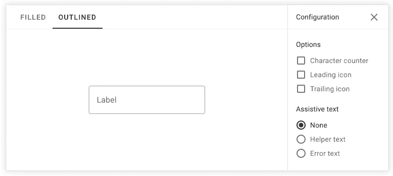
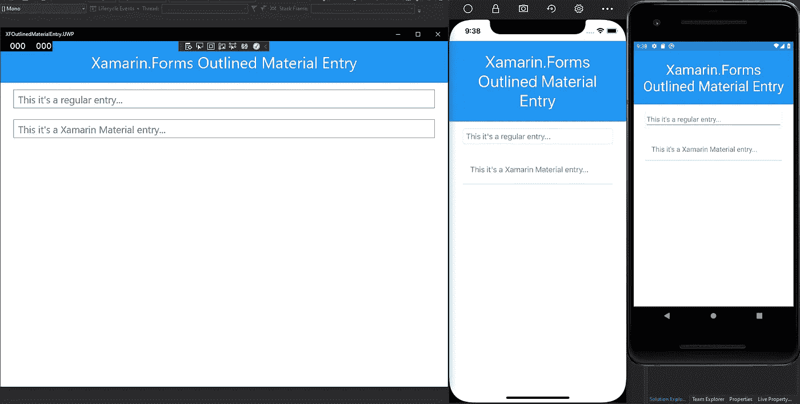
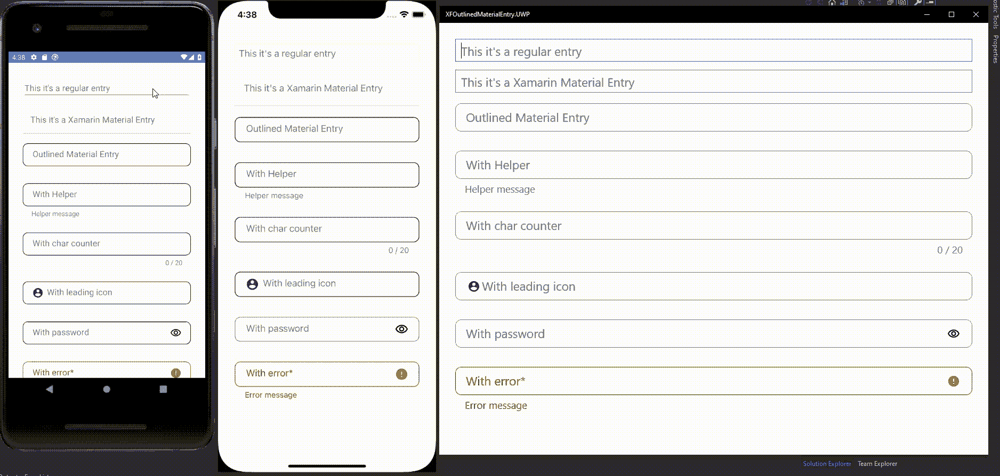
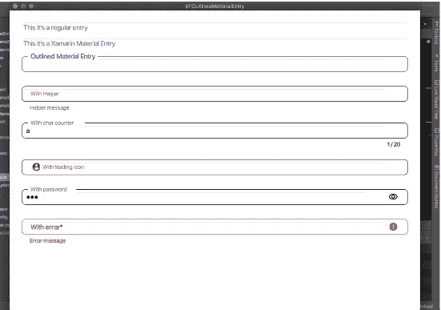

# 用 Xamarin 创建一个材料概述文本字段。形式

> 原文：<https://medium.com/geekculture/create-a-material-outlined-text-field-with-xamarin-forms-3da5eabab22c?source=collection_archive---------16----------------------->

如果你喜欢用西班牙语阅读这篇文章，请点击这个[链接](https://fabricio-bertani.medium.com/crear-un-material-outlined-text-field-con-xamarin-forms-93044e42042c)

不久前，Xamarin 团队正式发布了[材质视觉](https://docs.microsoft.com/en-us/xamarin/xamarin-forms/user-interface/visual/material-visual)，这是一个改变应用程序 UI 控件的特性，以便遵循谷歌提出的[材质设计规则](https://material.io/design)。这是一个惊人的功能，你可以查看官方文档和其他几篇关于使用它的文章。它们是在每个平台上本地构建的，具有很好的性能，但是……(总是有但是)，它们只是添加了标准的材质 UI 元素，而忽略了其他元素，比如[概述文本字段](https://material.io/components/text-fields#)

Material outlined text field sample on the Material docs.

## 因此，今天我们将创建一个完全基于 Xamarin 的材料概述 textfield。表格！！！

正如我之前所说，Xamarin 构建的材质视觉特性完全是原生的，因此它具有更好的性能。为了编写这个控件，我们将不得不牺牲一点性能(未经训练的人几乎察觉不到)，而不必处理每个平台上的本机代码。

开始之前，让我们列出控件应该具有的内容:

*   圆形边框
*   边框应该改变颜色
*   占位符动画
*   字符计数器
*   前导和尾随图标
*   密码的交互式图标
*   帮助和错误文本
*   错误图标

为了了解我们在处理什么，我们只需用一个常规条目和一个材料条目来构建我们的应用程序。

Regular and material entries on Android, iOS and UWP

让我们关注常规条目:

*   在 UWP，它有一个我们需要摆脱的框架。
*   在 iOS 中也有一帧需要移除。
*   在 Android 中，我们需要去掉那个烦人的下划线。

所以让我们为它创造一些效果:

太好了！现在，我们需要从我们概述的文本字段创建一个可重用的解决方案，所以我们应该创建它的一个组件。
我们将使用:

*   一个包含所有内容的网格，因为它的覆盖属性将帮助我们制作占位符动画。
*   用圆形边框和边框颜色环绕条目的框架。
*   帮助、计数器和错误文本的其他标签。
*   图标的图像

**让我们创建我们的可重用组件吧！**

现在，让我们在代码后面定义可绑定的属性、事件处理程序、动画和方法。

## **我们来测试一下**

只需将新组件添加到 Xamarin 中。表单页面查看结果:

现在让我们看看它在所有 3 个不同的支持平台上运行的情况！

Our Material Outlined Entry running on Android, iOS and UWP!

## **今天的节目到此结束**

希望这能帮助你创造新的酷组件，并探索 Xamarin 的力量。表单控件。

另外，你可以在 GitHub 上看到这篇文章的完整样本库。

 [## FabriBertani/xfoutlinematerialientry

### 在 GitHub 上创建一个帐户，为 FabriBertani/xfoutlinematerialientry 的开发做出贡献。

github.com](https://github.com/FabriBertani/XFOutlinedMaterialEntry) 

感谢阅读，继续编码！😁

***编辑:*** 它也可以在 macOS 上工作，但需要一些更改和调整，检查样本回购。

Kinda running on macOS, need fixes and adjustments