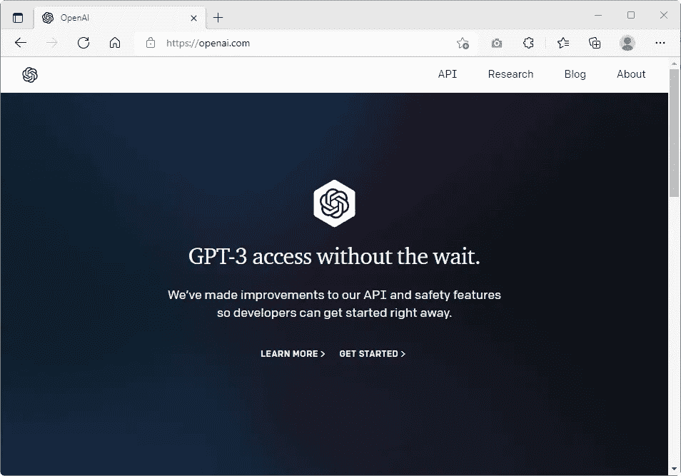
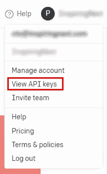
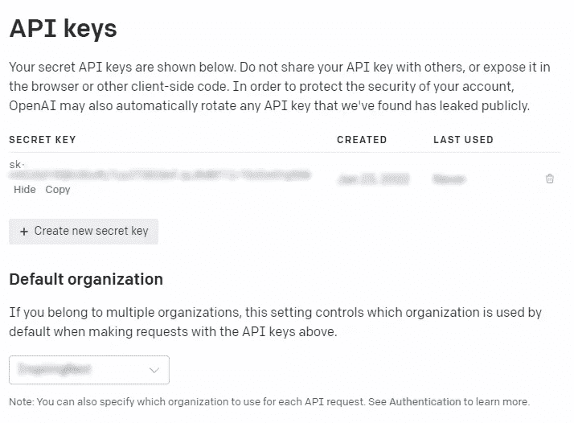
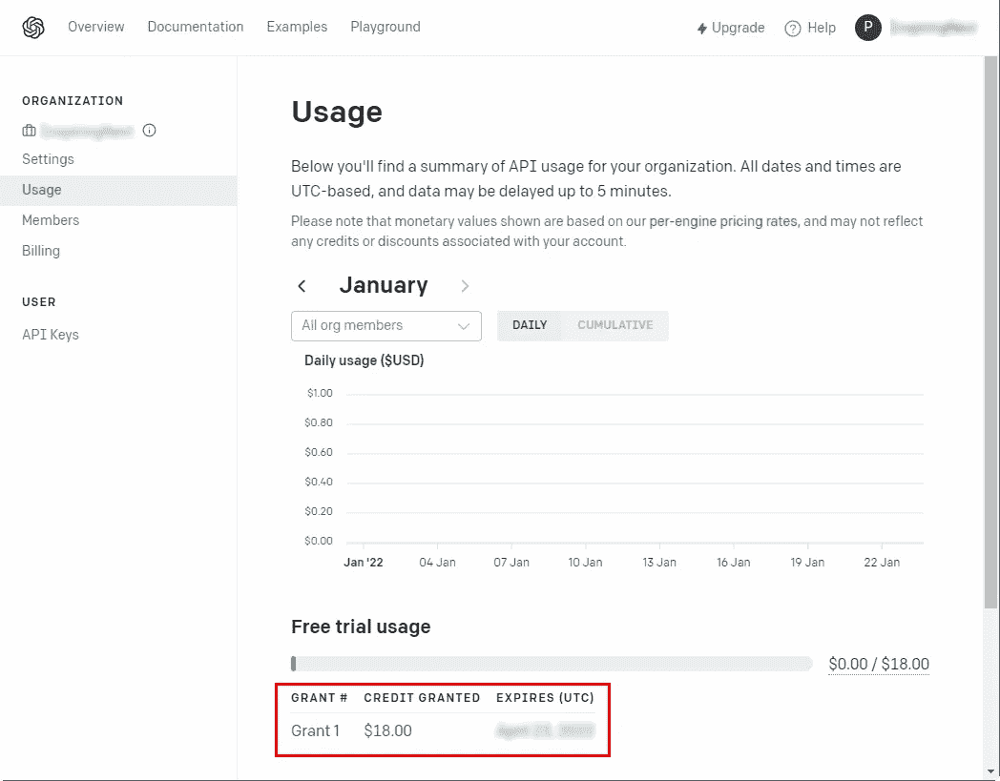
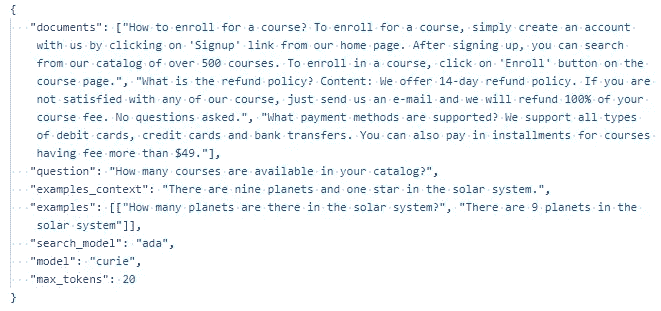
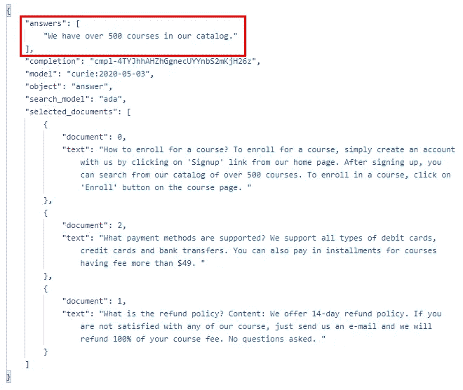

# 使用 GPT-3 和 OpenAI 创建问答服务

> 原文：<https://medium.com/geekculture/create-a-question-answer-service-using-gpt-3-and-openai-41498c73879b?source=collection_archive---------0----------------------->


Using OpenAI GPT-3 AI to build question answer service

对于你的产品或服务的任何现有知识库，创建一个人工智能驱动的插件比以往任何时候都更容易，它可以搜索知识库并以自然语言回答问题。

使用 GPT-3(由 OpenAI 开发)，人们可以轻松地构建一个 API 驱动的服务，并获得很好的结果，而无需实际学习或实现任何机器学习代码或投入大量计算能力来支持它。

OpenAI APIs 很容易理解，并且有很好的文档支持。这项服务最近刚刚结束私人测试。你只需在 [OpenAI 网站](https://openai.com/)注册并开始使用 API。

> 注意:OpenAI 不是免费服务。注册后你可以获得 18 美元的免费积分。此后，您需要将您的信用卡用于现收现付账单。

在我们深入探讨之前，让我们先了解一些术语:

## OpenAI

> OpenAI 是一个人工智能(AI)研究实验室，由盈利性公司 OpenAI LP 及其母公司非营利性 open AI Inc .——[维基百科](https://en.wikipedia.org/wiki/OpenAI)组成

OpenAI Inc .由埃隆·马斯克(Elon Musk)于 2015 年创立，后者后来于 2018 年辞职。它的既定目标是开发友好的人工智能来帮助全人类。目前它由微软支持，而 Elon 仍然是一个捐赠者。

## GPT-3

> **生成式预训练变压器 3** ( **GPT-3** )是一个自回归语言模型，它使用深度学习来产生类似人类的文本。— [维基百科](https://en.wikipedia.org/wiki/GPT-3)

GPT-3 是 OpenAI 开发的第三代语言预测模型。据说 GPT-3 生成的文本质量如此之高，以至于很难确定它是由人类还是人工智能生成的。虽然 GPT-3 可以通过注册 OpenAI 公开使用，但微软对 GPT-3 的底层模型拥有专有权，这是不公开的。

现在，让我们看看如何使用 GPT-3 在我们现有的知识库上创建一个应答服务。本指南解释了一步一步的过程。

# 在 OpenAI 注册并获得 API 密钥

这是非常明显的。我们基本上需要在 OpenAI 的网站注册来创建一个账户。它最近刚出了私人测试版，所以你可以注册并立即进入。



OpenAI’s Home Page


OpenAI’s Signup Page

你可以用你的邮箱和电话号码注册。验证您的电子邮件地址和电话后，您将立即访问该平台。



OpenAPI Menu

查看右上方的菜单，点击“查看 API 密钥”查看您的 API 密钥。

默认情况下，会为您创建一个 API 密钥。但是，您可以创建多个 API 键来区分不同应用程序中的用法。



View OpenAI API Keys

当你注册一个新账户时，你会得到一些试用积分(18 美元)来开始实验。以我的经验来看，这 18 美元玩起来绰绰有余。在“使用”页面检查您的使用情况，如下所示:



Check Usage and Trial Credit

好了，关于 OpenAI 已经说的够多了。让我们继续做一些其他令人兴奋的事情。

# 从知识库准备提要

你现有的知识库可能是一堆文档或者一个有很多文章的 WordPress 网站。无论知识库以何种形式存在，您都需要找到以纯文本形式提取内容的方法。为每篇文章生成单独的文本块。

让我们举一个例子来简化本指南的其余部分。假设我们有一个提供在线课程的平台。我们的文档包括解释如何注册课程、退款政策以及可用的支付方式的文章。以下是我们知识库中的一些文章示例:

## 样本文章 1

**题目:**如何报读课程？
**内容:**要注册一门课程，只需点击我们主页上的“注册”链接创建一个帐户。注册后，你可以从我们 500 多门课程的目录中进行搜索。要注册课程，请单击课程页面上的“注册”按钮。

## 样本文章 2

**标题:**退款政策是什么？
**内容:**我们提供 14 天退款政策。如果您对我们的任何课程不满意，只需发送电子邮件给我们，我们将退还您 100%的课程费用。不问任何问题。

## 样品第 3 条

**标题:**支持哪些支付方式？
**内容:**我们支持所有类型的借记卡、信用卡和银行转账。对于学费超过 49 美元的课程，你也可以分期付款。

> 为了准备问答服务，您可以将标题和内容合并成一个字符串，但这不是必需的。对于上面列出的 3 篇文章，您应该得到 3 个唯一的字符串。将这三者结合起来，我们称这个输入为我们的**提要**。

# 它是如何工作的？

简而言之，事情是这样的:

我们将 ***提要*** 和一个 ***问题*** 发送到 ***答案 API*** 。API 根据 ***提要*** 对 ***问题*** 返回一个 ***答案*** 。

> 返回的答案*可能不是*你原来 ***饲料*** 的一部分。在单词和句子方面可以完全不同。不过，这将是对你的问题的一个相关回答，*基于****提要*** 。

# 了解 OpenAI Answers API

OpenAI 提供了一堆 API 来做不同的事情。因为我们在这里看到的是问答服务，所以我们将使用 ***回答 API*** 。

回答 API 端点是:`https://api.openai.com/v1/answers`
请求方法是`POST`
API 密钥必须进入`Authorization`报头(前缀为‘承载’)

请求有效载荷格式:
*不要不知所措，我们一会儿就来分解一下。*

```
{
   documents: [list of strings from knoweledgebase],
   question: "This is your question?",
   search_model: "ada",
   model: "curie",
   examples_context: "There are nine planets and one star in the solar system.",
   examples: [["How many planets are there in the solar system?", "There are 9 planets in the solar system"]],
   max_tokens: 20
}
```

下面是请求负载中每一项的细目分类:

***文档*** 这只是代表知识库文章的字符串列表。在上面定义的示例知识库中，它看起来像这样:

```
[
   "How to enroll for a course? To enroll for a course, simply create an account with us by clicking on ‘Signup’ link from our home page. After signing up, you can search from our catalog of over 500 courses. To enroll in a course, click on ‘Enroll’ button on the course page.",
   "What is the refund policy? Content: We offer 14-day refund policy. If you are not satisfied with any of our course, just send us an e-mail and we will refund 100% of your course fee. No questions asked.",
   "What payment methods are supported? We support all types of debit cards, credit cards and bank transfers. You can also pay in installments for courses having fee more than $49."
]
```

***问题*** 这是你想针对你的知识库问的问题。例如，我们会问“你们的目录中有多少门课程？”在以下部分。确保问题以问号结尾。

***search _ model*** open ai 有不同的模型(也称为引擎)，它们提供不同的功能，价格也不同。常见的 GPT-3 模型有:“阿达”、“巴贝奇”、“居里”和“达芬奇”。为了记住这些名字，你可以注意到这些名字是以 a、b、c 和 d 开头的。“达芬奇”是最有能力和最昂贵的型号，而“阿达”是最快和最便宜的型号。

Answers API 分两步工作。第一步，从您提供的文件列表(***【Feed】***)中选择合适的文件。在第二步中，从最相关的文档中组成答案。***search _ model***value 指定使用哪个模型来搜索文档列表。通常“ada”对这种情况很有效。

***模型*** 该值指定使用哪个模型来生成答案。您可以为您的用例尝试不同的模型。根据您拥有的内容类型，您可以选择四种模式中的任何一种。

***示例 _ 上下文*** 和 ***示例*** 这些值与您的文档无关。这些只是简单地指示 API 我们期望从它那里得到什么类型的回答。您可以提供任何逻辑上下文和示例答案。OpenAI 会用这些值来确定 ***音调*** 和答案 ***格式*** 。

***max_tokens*** 这个值可以用来指定答案的最大长度。它不是单词或字母数量的精确表示。您可以尝试不同的值，以找到最适合您的用例的值。

> 注意:为了简单起见，我有意忽略了一些可以在有效载荷中传递的其他键。通过在有效负载中添加更多的键，您可以更好地控制 answer API。本文末尾解释了更多的关键点。关于完整的 API 参考，请参考 OpenAI 文档。

# 让我们点击回答 API

简单回顾一下，在这个阶段，我们已经准备好了所有这些项目:

1.  在 OpenAI 注册并获得一个 API 密钥
2.  从我们的知识库中准备字符串。每篇文章一个字符串。
3.  理解答案 API 和各种有效载荷键。

使用我们的样本文章，这里有一个有效载荷与文件和一个问题" ***"你的目录中有多少门课程？*** ”。



OpenAI Answers API Sample Payload

以下是收到的回答:



Response from OpenAI Answers API

如您所见，正确答案是“ ***”我们的目录中有超过 500 门课程。*** “现在这个特定的文本不是我们在 ***提要*** 中的任何文档的一部分。答案是 ***由 GPT-3 通过解释你输入的意思而创作的*** 。

# 微调

以上是一个很简单的例子。您可以通过在请求中指定额外的值来进一步微调响应。让我们在这里快速地再介绍几个。

***温度*** 温度指定了 AI 应该使用多少创作自由度。该值可以是 0 到 1 之间的任何值。0 表示没有创意，1 表示最有创意。在我的大多数用例中，0.5 到 0.7 之间的值最合适。

***n*** 关键字“n”的值指定应该生成多少个答案。默认值为 1。

# 结论

OpenAI 为开发人员提供了令人难以置信的力量，而无需实际进入训练模型和学习机器学习算法的复杂性，以利用人工智能的力量。OpenAI 为我们做了所有繁重的工作。我们可以简单地使用 API 来构建真正的人工智能应用。

为了阅读我所有的故事，和其他成千上万的媒体作家一起，考虑成为一个媒体成员。如果你[使用我的链接](https://prashantio.medium.com/membership)加入，我会从你的加入费中得到一部分。祝你好运！