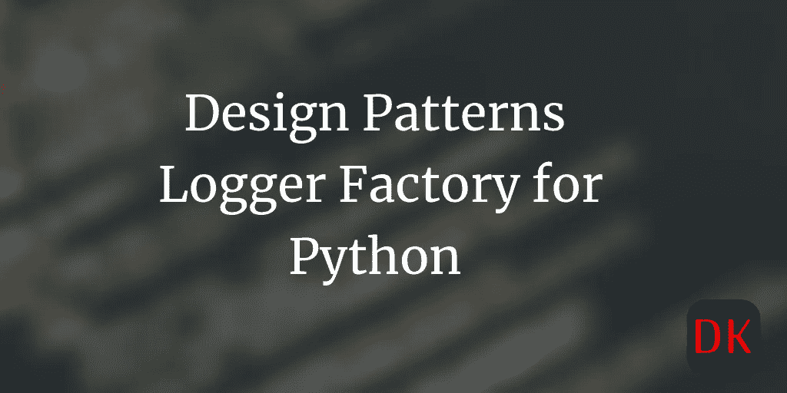
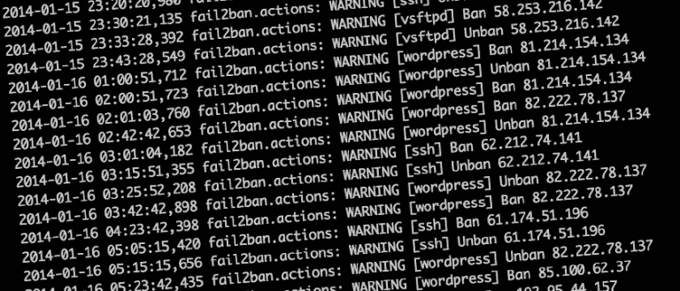
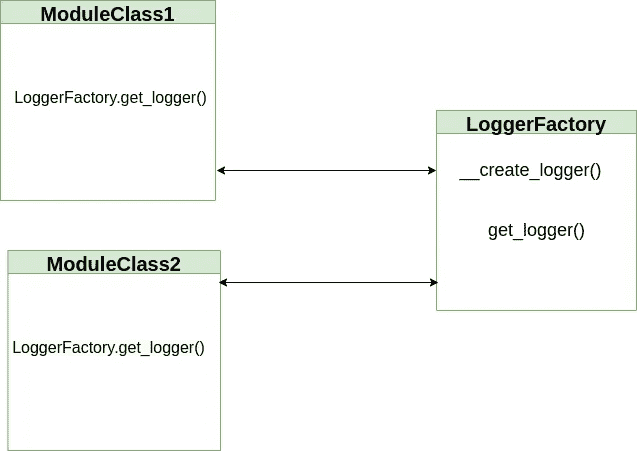

# 为 python 项目创建可重用的记录器工厂

> 原文：<https://medium.com/geekculture/create-a-reusable-logger-factory-for-python-projects-419ad408665d?source=collection_archive---------1----------------------->

## python 中的设计模式— LoggerFactory



**注:非会员，此故事可用** [**此处**](https://dineshkumarkb.com/tech/create-a-reusable-logger-factory-for-python-projects/) **。**

# 简介:

任何代码只有用适当的注释编写时才是可读的。你同意吗？我说过，开发人员的任务不仅仅是写代码。代码投入生产后，可维护性因素立即发挥作用。如果您的代码回答了以下问题，那么它是可维护的。

*   你的代码可伸缩吗？
*   你的代码可读吗？
*   你的代码可以调试吗？

出于明显的原因，代码的作者不应该回答这些问题。你的同伴应该替你回答这些问题。或者，如果你不想自己做判断，最好的办法是 6 个月或 1 年后看看你的代码。如果你理解得很快，瞧！你的代码是可维护的。

# 日志语句:

我个人认为**日志语句**增强了读取和调试的能力。



image source: google

一个具有良好日志记录能力的项目大大减少了调试时间，并最终减少了每个缺陷的周转时间。因此，每个项目都应该有一个通用的定制日志类，可以在整个项目中重用。本文讨论了如何在您的 python 项目中实现自定义日志记录器类。

# 记录器工厂:

正如你从名字中猜到的那样，我们将采用工厂模式来编写我们的自定义日志记录器类。然而，这只是工厂模式的一种适应，您可能无法完全理解实际的工厂模式。想法是在`logger_factory`文件中有对象创建逻辑，并使用一个`static method`来获得 logger 对象。不多不少。

那么，我们这里有什么？

1.  记录器工厂类
2.  使用它们的模块类

## LoggerFactory:

我们在一个私有方法中编写所有的日志对象创建逻辑(无论它在 python 中的名字是什么)`__create_logger(log_file, log_level)`。

`get_logger(log_file, log_level)`文件将被暴露在类之外，供其他模块获取 logger 对象，并将文件名和日志级别传递给`__create_logger(...)`方法。



LoggerFactory implementation in Python

```
import logging

class LoggerFactory(object):

    _LOG = None

    @staticmethod
    def __create_logger(log_file,  log_level):
        """
        A private method that interacts with the python
        logging module
        """
        # set the logging format
        log_format = "%(asctime)s:%(levelname)s:%(message)s"

        # Initialize the class variable with logger object
        LoggerFactory._LOG = logging.getLogger(log_file)
        logging.basicConfig(level=logging.INFO, format=log_format, datefmt="%Y-%m-%d %H:%M:%S")

        # set the logging level based on the user selection
        if log_level == "INFO":
            LoggerFactory._LOG.setLevel(logging.INFO)
        elif log_level == "ERROR":
            LoggerFactory._LOG.setLevel(logging.ERROR)
        elif log_level == "DEBUG":
            LoggerFactory._LOG.setLevel(logging.DEBUG)
        return LoggerFactory._LOG

    @staticmethod
    def get_logger(log_file, log_level):
        """
        A static method called by other modules to initialize logger in
        their own module
        """
        logger = LoggerFactory.__create_logger(log_file, log_level)

        # return the logger object
        return logger
```

您可以在您的模块中导入`LoggerFactory`类，并初始化记录器，如下所示。

```
from loggerfactory import LoggerFactory

# initialize the logger object

logger = LoggerFactory.get_logger("mymodule.py", log_level="INFO")
logger.info(" Inside module 1")
```

# 总结:

当您有多个需要日志记录的模块时，创建这样的内部日志记录工厂会很方便。

这避免了在项目的每个模块中初始化 python 的日志库。请注意，您也可以用多种方式创建 LoggerFactory。如果你喜欢自己的方法，你可以自由使用。

如果你觉得这有帮助，请随时留下评论。

*原载于 2021 年 7 月 12 日 https://dock2learn.com*[。](https://dock2learn.com/tech/create-a-reusable-logger-factory-for-python-projects/)**