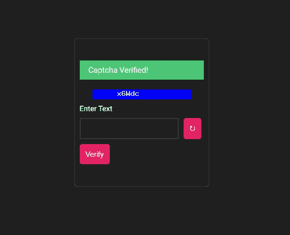
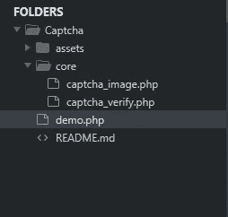
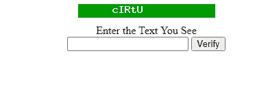
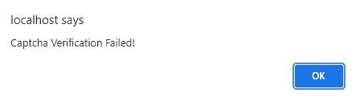
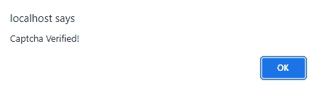
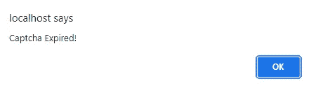

# 使用 PHP 创建一个简单的验证码

> 原文：<https://medium.com/geekculture/create-a-simple-captcha-using-php-f787ac77e8b6?source=collection_archive---------3----------------------->

我最近用 PHP 创建了一个自定义的图片验证码，我也将向你展示如何使用它。

# 我们的文件结构

*   让我们从核心文件夹开始。

我们将创建两个文件。其中一个将为我们生成验证码图像，另一个将使我们能够验证生成的验证码

## 验证码 _ 图像. php

我们需要生成我们的验证码文本，用 **md5()** 散列它，然后将散列值存储在一个会话中进行验证。

在我们的函数中，您可以指定用户需要填写多少字符。

现在，我对这个脚本做了一些有趣的事情。

我们将使用 PHP 生成一个图像，创建一个数组来存储生成的图像的随机背景颜色，然后我们将从数组中选择一个随机颜色。

现在我们将使用函数**imagecolorhallocate()**来分配图像的背景颜色，记住我们的数组索引。

现在我们需要使用函数 image string()来绘制图像字符串。

我们将传入参数；

*   $image —生成的图像
*   5-内置字体选择
*   50-左上角的 x 坐标
*   0 —左上角的 y 坐标(我们需要它居中)
*   $captcha_txt —验证码文本挑战
*   $img_clr —验证码图像颜色

现在，我们需要为验证码文本设置一个到期时间，用验证码文本散列到期时间，然后将它存储在一个会话变量中。

最后，我们需要将使用 **imagestring()** 生成的图像字符串转换为 png 图像，然后通过销毁图像来释放与图像相关的内存。

至此，我们完成了 captcha_image 文件。

让我们现在保存文件，并创建一个新的来验证我们的验证码。

## 验证码 _ 验证. php

我们将声明一个函数，它只接受一个参数，即用户输入*，然后将状态代码设置为返回值。*

## ***第一步***

*检查 3 个会话变量是否存在，然后将它们的值赋给我们的局部变量。*

*第二步*

*   *我们将检查验证码是否仍然有效。*
*   *重新散列用户输入 MD5(＄input。$captcha_expire)。*
*   *然后把它和我们治疗中的进行比较。*

*如果匹配，我们将返回状态码 200，这意味着我们的验证码验证成功。但是如果不匹配，我们将返回一个状态码 400。*

*现在保存文件并创建一个索引页面，我们将在这里向用户显示我们的验证码*

## *Index.php*

*以下是我们将要做的事情*

*   *我们将创建一个图像标签，并将 src 设置为 core/captcha_image.php。*
*   *我们将为用户创建一个表单，以填写他们看到的图像中的文本。*
*   *一旦用户点击提交按钮，我们将处理表单输入，然后向用户显示我们的验证结果*

*现在，让我们测试我们的脚本。*

*现在，我将提供两种不同的输入，并故意让验证码无人值守 4 分钟，以便我向您展示该功能是如何工作的。*

*   *验证码挑战*

**

*   *挑战失败*

**

*   *成功挑战*

**

*   *过期挑战*

**

# *资产文件夹*

*我已经向你展示了我们需要的基本功能。然而，你可以扩展你的验证码脚本来自动切换图像，以防用户看不到当前图像。*

*你也可以为你的验证码定义一些样式。*

*访问我的 [GitHub Repo](https://github.com/Octagon-simon/PHP-Snippets/tree/main/Captcha) 来看看我是如何定制和设计我的。*

*如果有任何与这个脚本相关的东西我可以帮到你，请告诉我！*

*谢谢大家！*