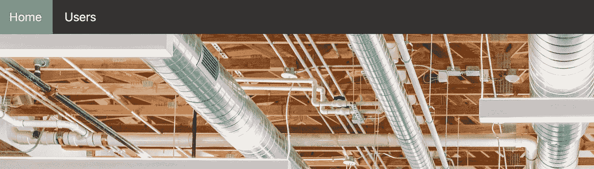

# 创建一个简单的 NextJS 用户列表应用程序第 3 部分——向 Navbar 添加活动样式

> 原文：<https://medium.com/geekculture/create-a-simple-nextjs-users-list-app-part-3-add-active-styles-to-navbar-c06e7f755c85?source=collection_archive---------16----------------------->

## 如何在 Next.js 中使用 useRoute

在这篇文章中，我们将添加活动样式到导航栏。所以当用户在“主页”页面时，“主页”按钮会变成绿色。

如果用户点击“用户”按钮，“用户”按钮将变成绿色。

