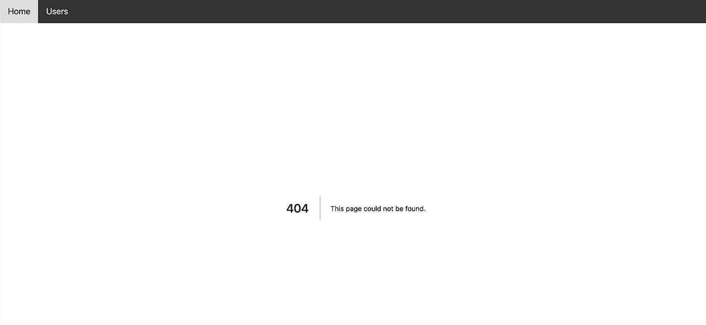

# 创建一个简单的 NextJS 用户列表应用程序第 6 部分—定制错误页面

> 原文：<https://medium.com/geekculture/create-a-simple-nextjs-users-list-app-part-6-custom-error-page-c3acf55e867f?source=collection_archive---------28----------------------->

在前一部分中，我们已经看到了默认的 Next.js 错误页面。

Default Next.js Error Page

在本文中，我们将创建自己的错误页面。在“用户”文件夹下，创建 404.js。