# 用 Rust 创建一个 Solana 客户端

> 原文：<https://medium.com/geekculture/create-a-solana-client-with-rust-62b35a59511d?source=collection_archive---------6----------------------->


Photo by [CHUTTERSNAP](https://unsplash.com/@chuttersnap?utm_source=unsplash&utm_medium=referral&utm_content=creditCopyText) on [Unsplash](https://unsplash.com/s/photos/blockchain?utm_source=unsplash&utm_medium=referral&utm_content=creditCopyText)

Solana 是一个分散的区块链，允许你运行分散的应用程序。

在过去的几个月里，我一直在探索这个世界，并想分享一些关于 Solana 的 Rust API 的好东西。这对我来说是一个很好的起点。

这个描述非常简短，但是你可以通过这个[链接](https://solana.com/)更好地了解索拉纳。(我也会这么做)

Solana 提供了一些不同的客户端 API，比如 [Rust](https://docs.solana.com/developing/clients/rust-api) 和 Node.js

完整的源代码在[paoloposso/Solana _ rust _ client(github.com)](https://github.com/paoloposso/solana_rust_client)上。如果你愿意的话，可以查看它以获得代码片段和/或克隆它。

## 入门指南

我想你已经安装了 Rust。如果不是这样，使用这个[连杆](https://www.rust-lang.org/tools/install)。

用`cargo new --bin rust_client`创建一个 rust 项目

导航到包含项目的文件夹，并打开您喜欢的 IDE /编辑器。我用的是 Visual Studio 代码。

创建一个 lib.rs 文件。

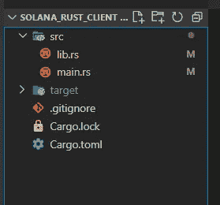

Structure of my project

将下列依赖项添加到。toml 文件。

```
[dependencies]
solana-sdk = "1.10.0"
solana-client = "1.10.0"
solana-program = "1.7.14"
```

在 main.rs 上创建一个 RPC 客户端，它将被注入到 lib.rs 文件的函数中。这样我们可以集中配置。

注意，我使用的是[Solana*devnet*](https://docs.solana.com/clusters)*URL。*

```
*let rpc_client = RpcClient::new("https://api.devnet.solana.com");*
```

*同样为了简单起见，我注入了 RPC 客户机，而不是用客户机创建一个结构。*

*要包含在 lib.rs 文件中的导入:*

```
*use std::error::Error;
use solana_client::rpc_client::RpcClient;
use solana_program::pubkey::Pubkey;
use solana_sdk::{system_transaction, signature::{Keypair, Signature}};*
```

*我将创建一个方法来返回一个新的 keypair，只是为了减少 rust SDK 在主文件中的依赖性，并更好地集中对 Solana 网络的调用。*

*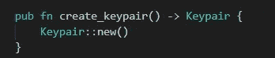*

*Function that returns newly created keypair*

*在本例中，对于每次执行，我们将为发送方和接收方创建新的密钥对。*

## *Airdrop:向发送方密钥对添加资金*

*下面的代码片段显示了请求空投的代码。*

*这些方法接收 lamports 中的数量，表示 0.000000001 SOL。因此，在将 lamports 发送到 RPC 客户端方法之前，有必要计算它的值。*

*我们通过创建一个值为 1000000000 的 const LAMPORTS_PER_SOL 来实现。*

*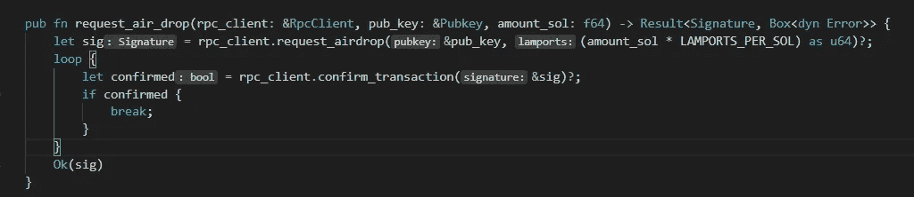*

*Requesting an airdrop on Solana devnet*

*注意，在请求空投之后，我们调用 *confirm_transaction* 方法，并且只在确认之后返回函数。*

## *检查账户余额*

*我们还可以使用帐户的公钥来检查余额。余额在 lamports 中返回，所以我们可以通过除以我们创建的常量来格式化它。*

*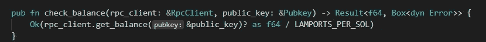*

*Function that checks the balance for a public key*

## *转移资金*

*现在我们两个新创建的账户之间的转账。*

*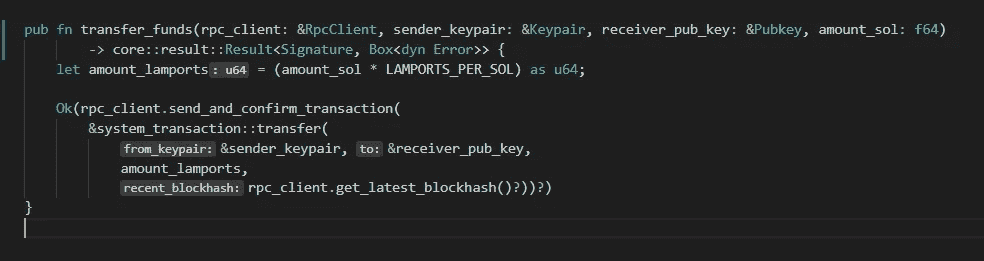*

*Transferring funds between accounts*

*这个*send _ and _ confirm _ transaction*方法包含了这个只有在确认后才返回的版本。这样，我们可以以一致的形式输出帐户余额。*

## *调用我们的函数*

*在 **main 方法**，main.rs 文件中，我们将调用 *create_keypair* 函数来创建发送方和接收方。*

*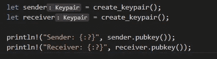*

*Creation of keypairs and output of both keypair’s public keys*

*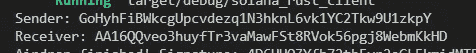*

*Output of public keys on console*

*之后，我们可以打印密钥并使用 [Solana Explorer](https://explorer.solana.com/?cluster=devnet) 在 *devnet* 上检查它们的余额。下面的例子是接收器**在**传输之后，因此 0.5 SOL 平衡。*

*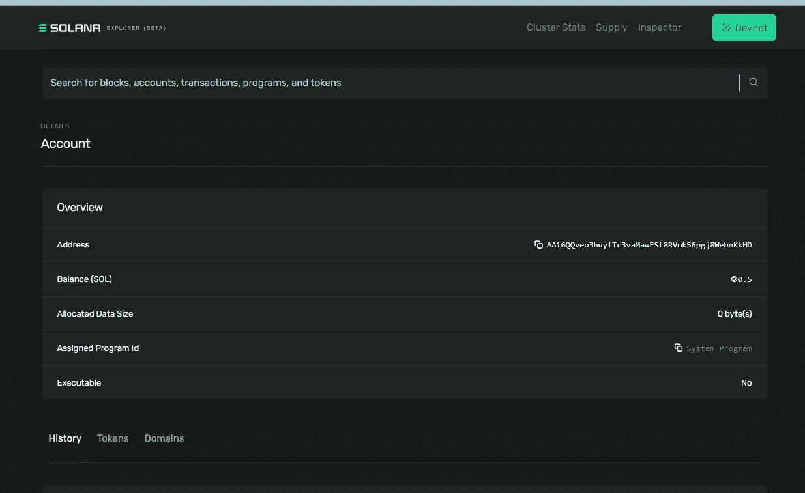*

*Example of an account balance on Solana Explorer*

*然后，我们用 1 SOL 的 *request_air_drop* 为发送方请求空投，这样发送方将有余额转移到接收方。*

```
*request_air_drop(&rpc_client, &sender.pubkey(), 1.0);*
```

*我们还可以使用 *check_balance* 检查两个键对的平衡，并打印两个*的平衡。*该方法也返回交易签名。*

```
*check_balance(&rpc_client, &sender.pubkey());
check_balance(&rpc_client, &receiver.pubkey());println!("Sender balance: {:?}", balance);*
```

*空投后，我们可以使用 *transfer_funds 调用转账。**

```
*transfer_funds(&rpc_client, &sender, &receiver.pubkey(), transfer_amount);println!("Transfer of {:?} finished. Signature: {:?}", transfer_amount, sig);*
```

## *把所有东西都包起来！*

*我们快完成了。下面是 main.rs 文件中完整执行的片段:*

*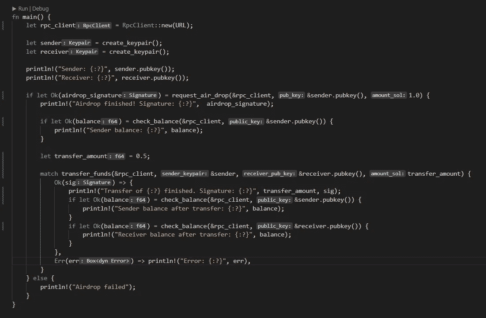*

*main function*

*运行`cargo run`来执行它。输出应该如下所示:*

*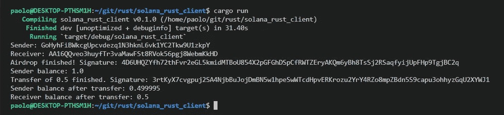*

*Console output*

*你可以在 [Solana Explorer](https://explorer.solana.com/?cluster=devnet) 上使用各自的键查看转账和账户余额，如前所示。*

*在这里您可以看到转账交易:*

*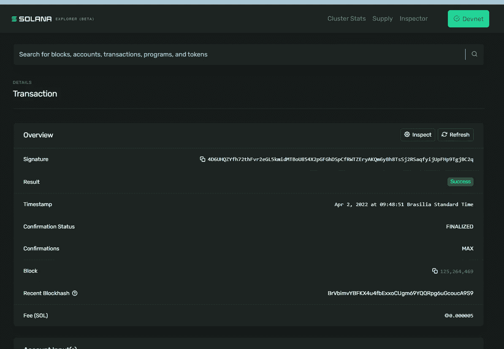*

*Solana Explorer*

*就这些了，伙计们。希望它可能对像我一样正在学习 Rust 和 Solana 其他人有用。*

*下一集再见！*