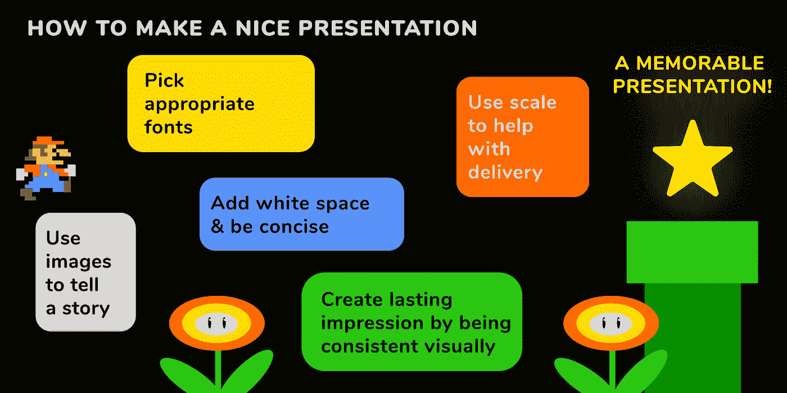
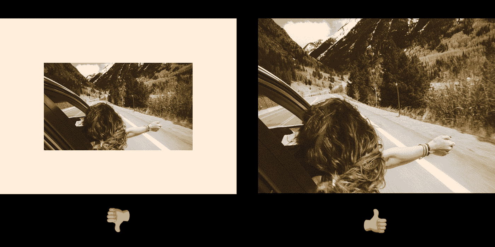
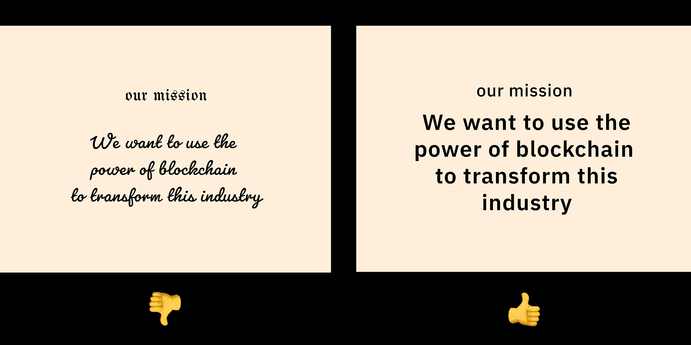
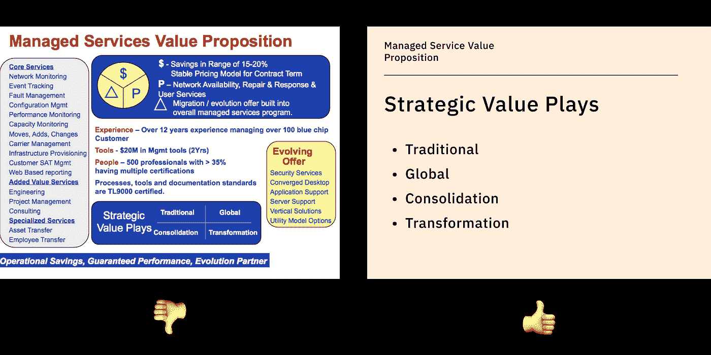
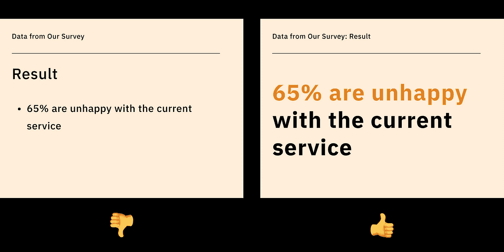

# 用这五个视觉技巧创建一个出色的推介演示

> 原文：<https://medium.com/geekculture/create-a-stellar-pitch-presentation-with-these-five-visual-tricks-749328ee58cd?source=collection_archive---------26----------------------->

# 演示计数

演示文稿有很多种。本文主要讨论推介演示，因为重点在于讲故事。这里的提示对其他类型的演示也有帮助。一致的设计和引人入胜的故事讲述在创建强大的演示文稿中可以发挥巨大的作用。

img: steps to get to a nice presentation

**这五条规则是很好的起点:**

1.  用图像来讲述故事
2.  使用合适的字体
3.  添加空白并保持简洁
4.  使用秤来帮助交付
5.  视觉上保持一致，给人留下持久的印象

**记住，演讲就是讲故事。当你设计演示文稿时，你是在使用视觉语言作为讲述故事的工具。**

# 用图像来讲述故事

一张图胜过千言万语。问自己这些问题:

*   你演讲的故事是什么？
*   你想给观众留下什么信息或情感？
*   这张幻灯片如何帮助您传达这一信息？
*   这张幻灯片上的图片如何最大限度地发挥这一作用？

一旦你想通了这些问题，就开始搜索图片吧。讲述说明关键时刻的过程的故事，并与特定情绪相关联的图像对演示特别有帮助。如果你想了解更多关于如何将想法可视化的知识，看看这篇[的帖子](https://blog.typogram.co/5850c7cfc3184f98a240687505678594)。

一个好的策略是使用全出血(边缘到边缘)图像来说明关键时刻，愿景，令人印象深刻的例子。如果图像是高分辨率的，效果会更好。

img: left- centered image on a slide; right- full-bleed image. The full-bleed image on the right will usually work better than on the left. It pulls in the audience a lot more since it is bigger in scale.

img:幻灯片上靠左居中的图像；右侧全出血图像。右边的全出血图像通常比左边的效果好。它吸引了更多的观众，因为它的规模更大。

# 使用合适的字体

如果你有一个品牌排版系统，这可能是一个很好的使用它的地方。如果你不知道用什么字体，选择 Helvetica 或者中性衬线，比如 [Plex Sans](https://blog.typogram.co/f7890c670f684209844df75207ba61c2) 或者 [Libre Franklin](https://blog.typogram.co/2c5d60cfd63243f4ac4722f3664d4162) 。

当你做演示时，你希望人们认真对待你。显示字体通常装饰性太强，容易分散注意力，不适合在正式场合使用。大多数情况下，您可能希望保存演示文稿的脚本和手写字体。

img: left- handwriting font is not appropriate for formal presentation. right- a fairly neutral sans serif is better suited and more clear.

# 通过添加空白来提高可读性

当你制作演示文稿时，你是在向你的观众清楚地展示大量的信息。有效的演示是简洁的。这意味着更短的句子、更少的文本和更多的空白。考虑增加空间:

*   文本行之间
*   在项目符号和文本之间
*   在要点和要点之间

如果你的文字会呼吸，读者的眼睛也会呼吸。

如果读者的眼睛会呼吸，他们会更容易理解和记住你的故事。

img: left- too much information and overcrowding. right- concise information with lots of white space creates better readability.

# 使用秤来帮助交付

缩放是最有效的工具之一，可以用来创建生动的视觉图像。如果你想强调一句话，可以考虑在另一张幻灯片上把句子放大，因为这样可以产生预期，吸引注意力。这就像一句妙语。

img: bigger text feels impactful to the audience.

# 视觉上保持一致，给人留下持久的印象

最后，你的演示文稿是一个讲述你的想法的视觉文档。它看起来的样子就是你用来讲述故事的方法。

当我做演示时，我试图与我如何展示(设计)每张幻灯片上的信息保持一致。这意味着:

*   页眉和正文使用相同的字体。
*   保持文本之间的间距一致。
*   记录你使用的所有不同大小的文本，并在不同级别的信息之间保持一致的文本大小。

一致性会消除你演讲中许多不必要的摩擦，这将创造更有效、更直接的故事。

# 唷。就这样。

如果你需要为工作筹集资金或制作演示文稿，我希望这能有所帮助。演示就是讲故事。如果你很好地掌握了这一点，这将是一项强大的技能，可以转化到许多其他领域。