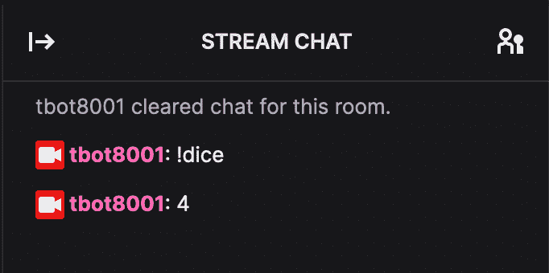
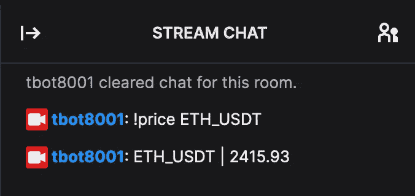

# 创建一个与 Bitmart 集成的 Twitch 聊天机器人

> 原文：<https://medium.com/geekculture/create-a-twitch-chat-bot-with-bitmart-integration-b2e024a34b6d?source=collection_archive---------42----------------------->


Photo by [Pierre Borthiry](https://unsplash.com/@peiobty?utm_source=medium&utm_medium=referral) on [Unsplash](https://unsplash.com?utm_source=medium&utm_medium=referral)

# **简介**

在本文中，我们研究了如何使用 node.js 和 tmi.js 创建 Twitch 聊天机器人。我们涵盖了应用程序和理论，以了解底层技术，同时学习如何将提供的示例扩展到其他项目中。

# **项目设置&密钥生成**

如果你还没有为你选择的操作系统下载并安装 Node.js 。在您的系统上创建一个名为“project”的空文件夹，或者使用您选择的命名并运行`npm init -y`为您的节点项目创建一个新的文件夹。

我们继续在项目目录的根目录下创建 twitchscript.js 以及一个名为。env 用于存储环境变量。要创建此文件:

Windows:在项目的根目录下创建一个空白文件，并将其重命名。包封/包围（动词 envelop 的简写）

Mac:使用“cd”命令导航到终端中的根目录，然后，

```
$ touch .env
```

Command + Shift +。将允许文件出现在 Finder 中。基本文件结构应该如下所示:

项目/
。env
twitch script . js
node _ modules

我们将在. env 后面添加三行文本，分别是用户名、密码和频道。

Username 是 bot 帐户的显示名称，password 对应于 API 密钥，channels 是客户端要与之交互的通道的逗号分隔列表。[https://twitchapps.com/tmi/](https://twitchapps.com/tmi/)为你的账户生成一个令牌。请注意，在 creds.txt 中,' oauth:'被添加到键的前面。在大多数情况下，创建一个额外的帐户来区分开发人员和个人的偏好更容易。

您的文件应该类似于:

用户名= '用户名'
密码= '密码'
频道= '频道'

就我而言:

username = tbot 8001
password = oauth:KEY
channel = tbot 8001

# **依赖关系**

Node.js 是一个通用的 javascript 运行时，有一系列的用例。在这个项目的主页上有这样的描述:“作为一个异步事件驱动的 JavaScript 运行时，Node.js 旨在构建可扩展的网络应用。”tmi.js 框架提供了 Twitch 的 [IRC API](https://dev.twitch.tv/docs/irc) 和 Node 之间的桥梁，使得为一系列聊天动作声明多个事件监听器变得容易。

本指南使用 tmi 的客户端类监听聊天消息，以返回一个介于 1 和 6 之间的整数 when！“骰子”被输入到聊天中。Node.js 执行函数来根据聊天输入限定要采取的动作。最后，我们使用 dotenv 来管理我们想要隐藏的环境变量，比如我们的 API 键。如果还没有完成，确保通过运行以下命令导入 dotenv、node-fetch 和 tmi

npm 安装 dotenv 节点-获取 tmi

请注意，这些命令应该在项目的根目录下运行。要全局安装这些程序包，以便可以在任何节点项目中使用它们，请在命令末尾附加— global，例如 npm install package_name — global。

# **认证**

在所有这些背景知识之后，我们可以进入教程的功能部分。打开 twitchbot.js，开始写下面的内容。

```
//import dependencies
const tmi = require('tmi.js');
const fetch = require("node-fetch");
require('dotenv').config();

//setting up tmi client connection
const client = new tmi.Client({
   connection: {
       secure: true,
       reconnect: true
   },
   identity: {
       username: process.env.username,
       password: process.env.password
   },
   channels: [process.env.channel]
});
client.connect();
```

这个客户端抽象了 Twitch 的认证和连接工作，dotenv 从当前节点[进程](https://nodejs.org/docs/latest/api/process.html#process_process_env)的 env 对象中提取您的凭证。

# **聊天事件**

聊天事件触发一个匿名函数，该函数输出响应聊天的信息。该函数用箭头符号表示；如果你不熟悉，你可以在这里查看快速参考。任何标准的函数符号都足够了，所以请随意使用您最熟悉的约定。

作为一个调试特性，我们添加以下代码片段，将所有聊天消息回显到触发节点的控制台。此外，该函数处理聊天事件的所有实例。

```
//handles all events caused by chat input
client.on('chat', (channel, tags, message) => {
   //log all chat messages to console
   console.log(`${tags['display-name']}: ${message}`);
}
```

我们实现的第一个交互式示例是一个骰子函数。任何匹配字符串'的聊天消息！“骰子”将触发 tbot8001 发送一个 1 到 6 之间的数字。在上面的 console.log 调用之后编写下面的代码。

```
//logic for dice rolls. Returns a random integer from 1-6
if (message == '!dice') {
    client.say(channel, (1 + Math.floor(Math.random() * 6)).toString());
}
```

至此，twitchscript.js 应该看起来像这样:

```
//import dependencies
const tmi = require('tmi.js');
const fetch = require("node-fetch");
require('dotenv').config();

//setting up tmi client connection

const client = new tmi.Client({
   connection: {
       secure: true,
       reconnect: true
   },
   identity: {
       username: process.env.username,
       password: process.env.password
   },
   channels: [process.env.channel]
});
client.connect();

//handles all events caused by chat input
client.on('chat', (channel, tags, message) => {
   //log all chat messages to console
   console.log(`${tags['display-name']}: ${message}`);

   //logic for dice rolls. Returns a random integer from 1-6
   if (message == '!dice') {
       client.say(channel, (1 + Math.floor(Math.random() * 6)).toString());
   }
})
```

为了确保事情按照我们的计划进行，在您首选的 CLI 中导航到您的项目的根目录，并运行 node twitchscript.js。然后，导航到您的 Twitch 聊天并键入！骰子。您应该会看到类似这样的内容:



恭喜你走到这一步，你已经创建了第一个正常工作的抽搐机器人！在继续 Bitmart 集成之前，这里有另一个对你的机器人有用的功能:

```
if (message == '!clear' and username == 'tbot8001') {
  client.clear(channel);
}
```

请务必将“tbot8001”更改为您的用户名。

# **Bitmart 集成**

让我们实现一个与 Bitmart 的公共[现货交易 API](https://developer-pro.bitmart.com/en/spot/basic/public.html) 通信的函数。Bitmart 是一个流行的加密货币交易所，免费向用户和非用户提供 API。下面的代码片段包含了大量的信息，但提供了完整的功能，用户可以输入！“价格曲线”来获得资产价格。

```
//logic for returning a specific price on command
if (message.startsWith('!price ')) {
 ccy = message.substring(7)
 fetch(`https://api-cloud.bitmart.com/spot/v1/ticker?symbol=${ccy}`)
   .then(response => response.json())
   .then((data) => {
     pair_info = data['data']['tickers'][0]
     client.say(client.channels[0], `${pair_info['symbol']} | ${pair_info['last_price']}`);
   })
   .catch((err) => {
     client.say(client.channels[0], `Invalid input.`)
     console.log('Fetch Error :-S', err);
   })
}
```

很简单，我们扫描以'开头的邮件。价格'来触发我们的决策树。变量 ccy 读取跟在'后面的子字符串。“价格”应该是平台支持的加密货币的名称。最后，我们实现了与 Bitmart 的连接。

在进入 ping Bitmart 服务器的 fetch 部分之前，我们定义了一个 promise 对象。根据 [MDN 网络文档](https://developer.mozilla.org/en-US/docs/Web/JavaScript/Reference/Global_Objects/Promise):

承诺对象表示异步操作的最终完成(或失败)及其结果值。

此外，

承诺处于以下状态之一:

*   *待定*:初始状态，未履行，未拒绝。
*   *完成*:表示操作成功完成。
*   *拒绝*:表示操作失败。

在我们的代码中，对 fetch 的调用返回一个承诺，当这个承诺被解析时，要么返回资产的价格，要么向控制台和聊天返回一个失败消息。我们必须使用 fetch 的原因是，数据不是从代码中的某个函数返回的，而是从外部服务器返回的，而外部服务器不会立即或可靠地返回数据。

测试这个函数我们看到:



# **结论**

我们现在有一个功能正常的 Twitch 机器人，可以连接到第三方服务。本教程应该作为创建聊天机器人和 API 交互的快速介绍，可以扩展到其他平台和用例。在本指南结束时，您的代码应该类似于:

```
//import dependencies
const tmi = require('tmi.js');
const fetch = require("node-fetch");
require('dotenv').config();

//setting up tmi client connection

const client = new tmi.Client({
 connection: {
   secure: true,
   reconnect: true
 },
 identity: {
   username: process.env.username,
   password: process.env.password
 },
 channels: [process.env.channel]
});
client.connect();

//handles all events caused by chat input
client.on('chat', (channel, tags, message) => {
 //log all chat messages to console
 console.log(`${tags['display-name']}: ${message}`);

 //logic for dice rolls. Returns a random integer from 1-6
 if (message == '!dice') {
   client.say(channel, (1 + Math.floor(Math.random() * 6)).toString());
 }

 if (message == '!clear' and username == 'tbot8001') {
   client.clear(channel);
 }

 //logic for returning a specific price on command
 if (message.startsWith('!price ')) {
   ccy = message.substring(7)
   fetch(`https://api-cloud.bitmart.com/spot/v1/ticker?symbol=${ccy}`)
     .then(response => response.json())
     .then((data) => {
       pair_info = data['data']['tickers'][0]
       client.say(client.channels[0], `${pair_info['symbol']} | ${pair_info['last_price']}`);
     })
     .catch((err) => {
       client.say(client.channels[0], `Invalid input.`)
       console.log('Fetch Error: ', err);
     })

 }
});
```

感谢阅读，我们下次再见。