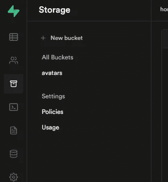
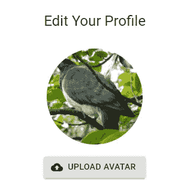
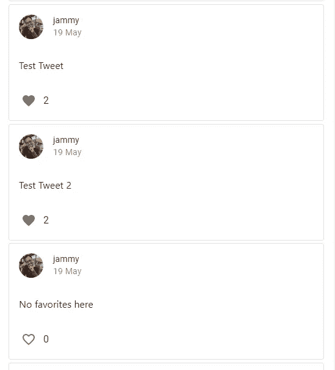
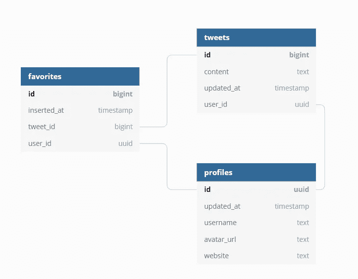
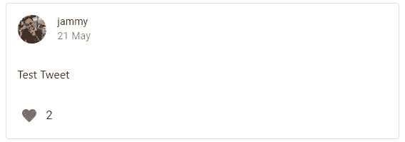
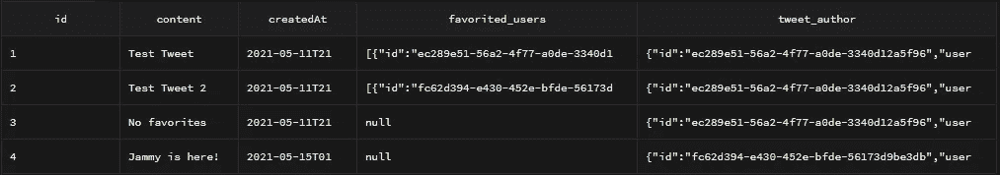
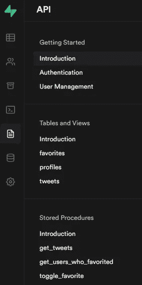
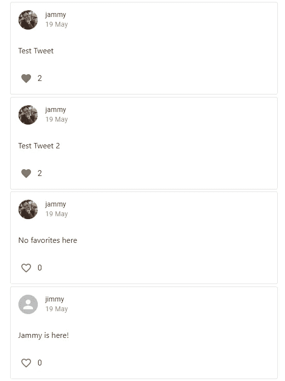

# 使用 Supabase 创建 Twitter 克隆—第 4 部分:使用存储和 Postgres 存储过程

> 原文：<https://medium.com/geekculture/create-a-twitter-clone-with-supabase-part-4-using-storage-and-postgres-stored-procedures-7e2342eede3?source=collection_archive---------18----------------------->

欢迎来到用 React 和 [Supabase](https://supabase.io) 创建 Twitter 克隆的第 4 部分！如果您继续学习，到本系列结束时，您将已经部署了一个全功能的应用程序，它允许用户:

1.  在推特上发布他们的想法，
2.  上传头像并更改其个人资料，
3.  当有新的推文时被通知，并且；
4.  当有人喜欢他们的推文时得到通知。

在第三部分中，我们做得更漂亮了，增加了一个导航条和一个编辑个人资料页面。

在第 4 部分中，我们将:

*   通过让用户上传一张图片作为他们的头像到 Supabase 存储器来完成编辑个人资料页面。
*   在 Supabase 中为用户的推文创建一个`tweets`和`favorites`表，并使用`react-query`库显示它们。

# 让用户上传他们的头像

该部分的更改在[提交](https://github.com/horizon0708/react-twitter-clone-follow-along/commit/4d99437bcfcda6073aeff6a0f34d65d3408d3d29)中。抱歉，这是个大承诺🙏。我会在下面附上一些重要的片段。这个部分将使用 Supabase 的便捷存储器让用户上传他们的头像到我们的网站。

1.  我们需要在 Supabase 中创建一个[桶](https://gist.github.com/horizon0708/21ad56716b14bac21bf2d1f4ce5bab8d)
2.  我们需要让用户将图像上传到 bucket，并将文件名保存到我们的 profiles 表中。
3.  我们需要能够从桶中获取图像，并使用保存的文件名显示它。

如果您一直在遵循本指南，那么您已经在第 1 部分[中使用 Supabase 的用户管理启动 SQL](https://gist.github.com/horizon0708/21ad56716b14bac21bf2d1f4ce5bab8d) 完成了！如果还没有，可以在 SQL 查询编辑器中运行下面的代码片段。

您也可以通过用户界面轻松做到这一点，方法是转到存储部分，然后单击“New bucket”按钮。

上传一个用户的文件到 Supabase 超级简单。你需要做的就是:

只要不与现有文件冲突，文件名可以是您想要的任何内容。通过使用类型为 `[file](https://developer.mozilla.org/en-US/docs/Web/HTML/Element/input/file)` 的`[input](https://developer.mozilla.org/en-US/docs/Web/HTML/Element/input/file)` [元素，可以通过用户的文件浏览器选择要上传的文件。在 git commit 中，我将输入按钮放在了一个`Button`组件中，使其看起来有所不同。](https://developer.mozilla.org/en-US/docs/Web/HTML/Element/input/file)

这看起来像这样。

每当用户选择一幅图像时，`onChange`回调就会被`ChangeEvent<HTMLInputElement>`调用。所以我选择每当用户选择一张图片时就上传并显示该文件。该逻辑被提取到`useUpload` 钩子中。在钩子内部，我用`event.target.files[0]`获取文件，然后把它发送到 Supabase。

`Key`的值是结果文件名，以 bucket 名称为前缀。如`avatars/my-image.png`。当用户提交表单时，我将`Key`的值作为`avatar_url`保存在`profiles`表中。现在我们需要向用户展示这些图像。

## 下载和显示图像

有两种方式向用户显示保存的图像。

一种方法是给用户一个预先签名的 URL。

另一种方法是将对象作为 blob 下载，然后从 blob 创建一个 URL。我在我的项目中选择了这种方式。

## 设置`Cache-Control`曾经被破坏

当我开始写这篇博文时，supabase 的一个 bug 不能为 S3 对象设置`Cache-Control`头。这导致对象的`Cache-Control` d 值默认为`no-cache`，使得浏览器从不缓存图像。例如，当我们渲染下面的列表时，我们会一次又一次地下载每张图片。

当我发现这个问题的时候，我提出了一个问题，并且 Supabase 的开发者很快就解决了这个问题。缓存控制将在 1.11.14 中正确设置！🎉

## 之前使用 react-query 的解决方法

当这个错误还没有被修复时，我使用了 react-query 的缓存功能来缓存应用程序中的图像。如果`path`匹配，下面的代码片段将缓存并返回承诺(`fetchAvatar`)在一个小时内返回的内容(通过`staleTime`设置)。如果你感兴趣，你可以在 react-query 的文档中阅读更多关于通过键[进行缓存的内容。](https://react-query.tanstack.com/guides/query-keys)

从 Supabase 1 . 11 . 14 版本开始，浏览器会尊重我们的缓存，因为`Cache-Control`会被正确设置(默认为`max-age=3600`)，所以实际上不需要上述解决方法。

# 让用户发微博

随着档案的工作，是时候让我们转移到主要事件:推文！该部分的更改在[该提交](https://github.com/horizon0708/react-twitter-clone-follow-along/commit/4d99437bcfcda6073aeff6a0f34d65d3408d3d29)中。

我一直保持 tweets 表非常简单。一条推文将包含以下字段:

*   `id` —大整数，主键(自动生成)
*   `createdAt` — timestampz(自动生成)
*   `content`正文
*   `userId` — UUID，`profiles`表的外键

我创建了一个收藏夹表。收藏夹包含以下字段

*   `id` —大整数，主键(自动生成)
*   `inserted_at` — timestampz(自动生成)
*   `tweetId`—`tweets`表的大整型外键
*   `userId` — UUID，`profiles`表的外键

made with [dbdiagram](https://dbdiagram.io/home)

我已经用 Supabase UI 制作了两个表和一些测试数据。我们现在需要将数据提供给我们的前端。

# 前端需要什么？

我们来看一个推文看看，前端需要哪些数据。

一条推文需要:

*   用户的头像
*   用户名
*   当推文被创建时
*   推文的内容
*   有多少人喜欢这条推文
*   (如果已登录)用户是否收藏了它

这可能看起来像一个类型脚本类型

获取 tweet 作者的个人资料非常简单，只是一个`JOIN`。但是我们如何获得一系列喜欢这条推文的用户呢？我已经启动了 Supabase 的 SQL 查询编辑器，并开始创建一个查询。在这个[堆栈溢出](https://dba.stackexchange.com/questions/173831/convert-right-side-of-join-of-many-to-many-into-array)答案的帮助下🙏我有一个查询功能。

像 [json_agg](https://www.postgresql.org/docs/9.5/functions-aggregate.html) 和`[json_build_object](https://www.postgresql.org/docs/9.4/functions-json.html)`这样的 Postgres 函数在 Supabase 中是可用的，所以使用这些函数，上面的查询给了我们一个 tweets 列表

*   身份证明（identification）
*   内容
*   创建日期
*   favorited _ users，JSON 中收藏用户的数组
*   tweet_author，在 JSON 中写推文的用户

What the above query returns in the SQL query editor

现在我们有了一个有效的查询，我们需要一种从 React 应用程序调用这个查询的方法。对我们来说很方便的是，Supabase 允许你从前端调用 Postgres 函数。所以我们来做一个 Postgres 函数。

## 创建 Postgres 函数

我们现在需要将上述查询包装在一个函数中。我已经添加了`u_id`作为函数的可选参数。当这个被提供时，它将根据用户的 id 过滤推文。当我们导航到用户的个人资料页面时，这将用于显示用户的推文。

一旦您成功地创建了函数，您可以看到我们函数的文档是在“API”部分的“存储过程”下自动生成的。

Docs automatically available under Stored Procedures😍

调用这些方法非常简单

在我的提交中，我对响应做了一点点转换(比如判断当前用户是否收藏了该 tweet ),以获得前端所需的数据。

然后使用`react-query`将该结果提供给`TweetCard`组件。

产生了一个推文列表！

# 下一步是什么？

我们今天就讲到这里。在下一部分，我们将让用户:

*   帖子和最喜欢的推文
*   使用 Supabase 的实时功能，当用户喜欢我们的推文时会得到通知

在推特(@詹姆士 _ HJ _ 金)上关注我，这样你就不会错过新的更新。像往常一样，如果有什么不清楚的地方，请随时在 Twitter 上问我。