# 创建 web 服务器和 Amazon RDS 数据库实例

> 原文：<https://medium.com/geekculture/create-a-web-server-and-an-amazon-rds-database-instance-8259a352b790?source=collection_archive---------5----------------------->


在接下来的教程中，您将在创建数据库实例时指定 VPC、子网和安全组。您还可以在创建 EC2 实例来托管 web 服务器时指定它们。数据库实例和 web 服务器需要 VPC、子网和安全组来进行通信。设置好 VPC 之后，本教程将向您展示如何创建数据库实例和安装 web 服务器。使用 DB 实例端点 endpoint 将 web 服务器连接到 VPC 中的 DB 实例。

我们将完成以下步骤:

1.  创建包含私有和公有子网的 VPC
2.  创建 RDS 数据库实例
3.  创建一个 EC2 实例并安装一个 web 服务器。

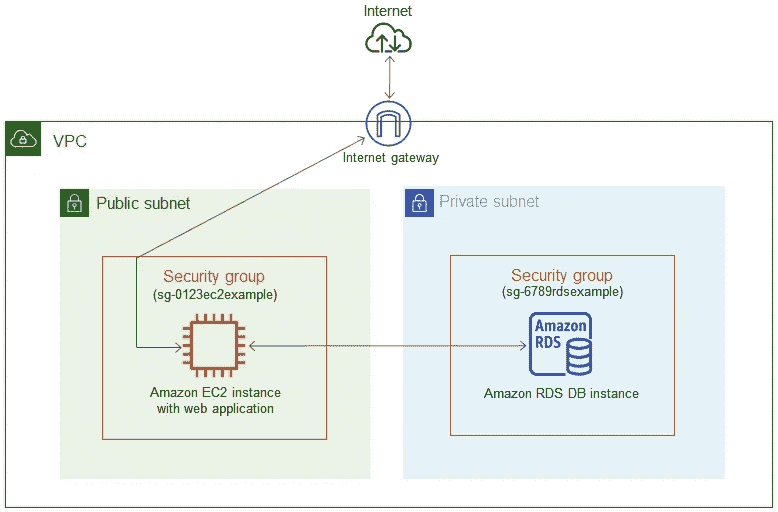

our completed configuration

如果您没有与我们的 NAT 网关关联的弹性 IP 地址，请现在分配一个。转到 EC2 部分，选择弹性 IPs

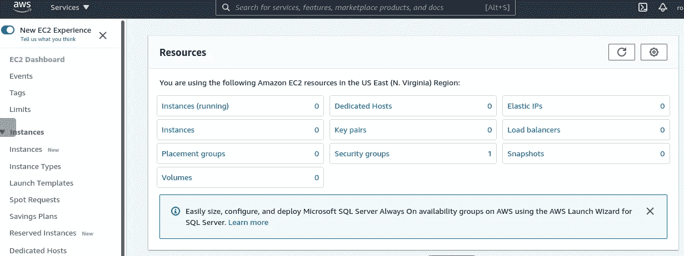

然后选择选项分配一个。

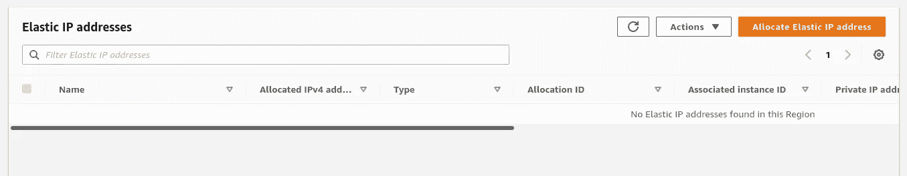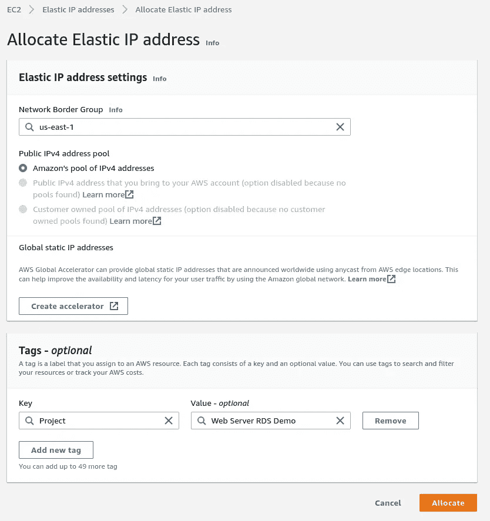

现在让我们设置我们的 VPC。转到 VPC 仪表板，启动向导。在这个过程中，我们需要设置一些值。

*   **IPv4 CIDR 块:** `10.0.0.0/16`
*   **IPv6 CIDR 块:**没有 IPv6 CIDR 块
*   **VPC 姓名:**
*   **公共子网的 IP v4 CIDR:**
*   **可用区:** `us-east-1a`
*   **公共子网名称:** `Tutorial public`
*   **私有子网的 IP v4 CIDR:**
*   **可用区:** `us-east-1a`
*   **私有子网名称:** `Tutorial private 1`
*   **弹性 IP 分配 ID:** 与 NAT 网关关联的弹性 IP 地址
*   **服务端点:**跳过此字段。
*   **启用 DNS 主机名:** `Yes`
*   **硬件租赁:** `Default`

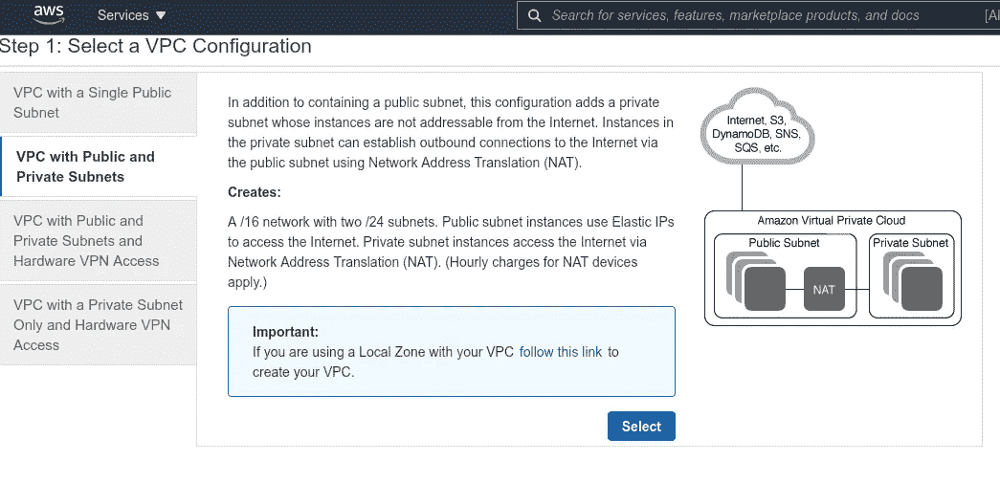

Choose the configuration for Public and Private Subnets

在步骤 2 中输入上述信息。选择我们之前创建的弹性 IP。然后*创造 VPC。*

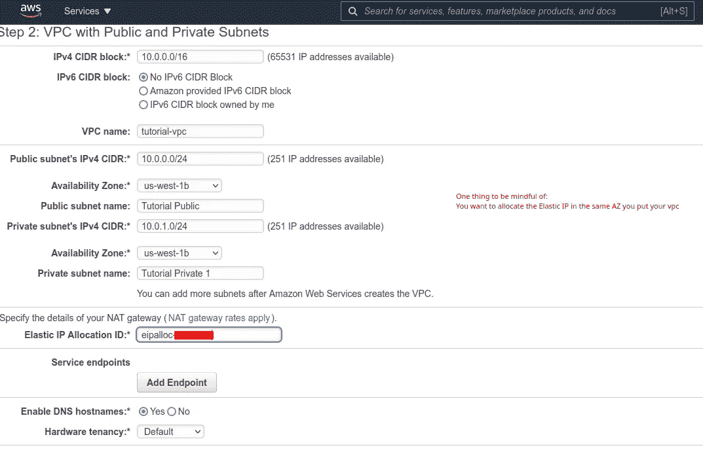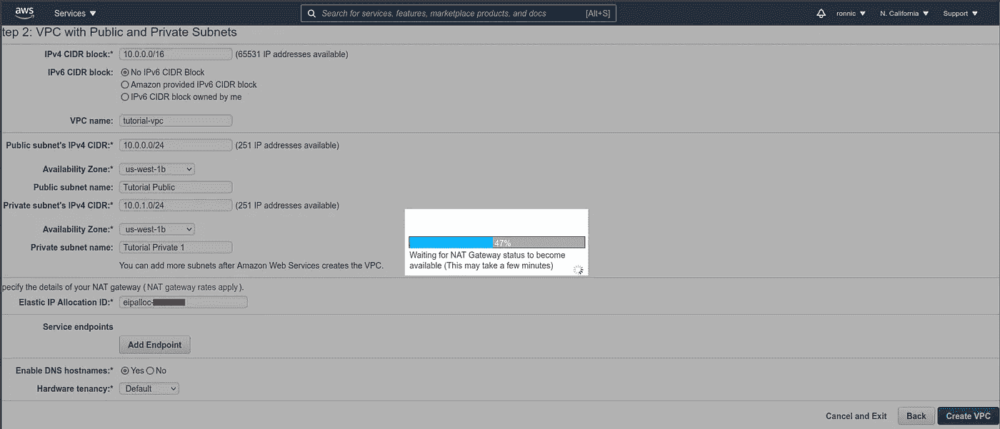

而现在你的 VPC 应该被创造成功了。警告:无论你运行 NAT 网关多长时间，都要花钱。

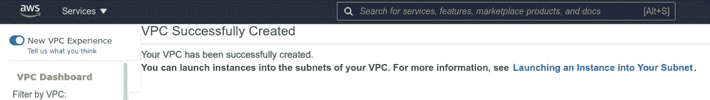

您必须有两个专用子网或两个公共子网，才能为要在 VPC 中使用的数据库实例创建数据库子网组。因为本教程的数据库实例是私有的，所以向 VPC 添加第二个私有子网。

我们将创建更多子网。您将看到*创建子网*按钮，以及我们在创建 VPC 时指定的另外两个子网。

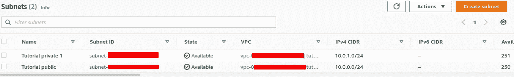

在**创建子网**页面上，设置这些值:

*   **VPC ID:** 选择您在上一步中创建的 VPC，例如:`vpc-identifier (tutorial-vpc)`
*   **子网名称:**
*   **可用区:** `us-east-1b`

*注意:选择一个不同于您为第一个专用子网选择的可用性区域。*

*   **IPv4 CIDR 块:** `10.0.2.0/24`

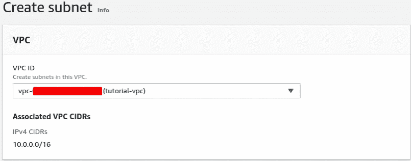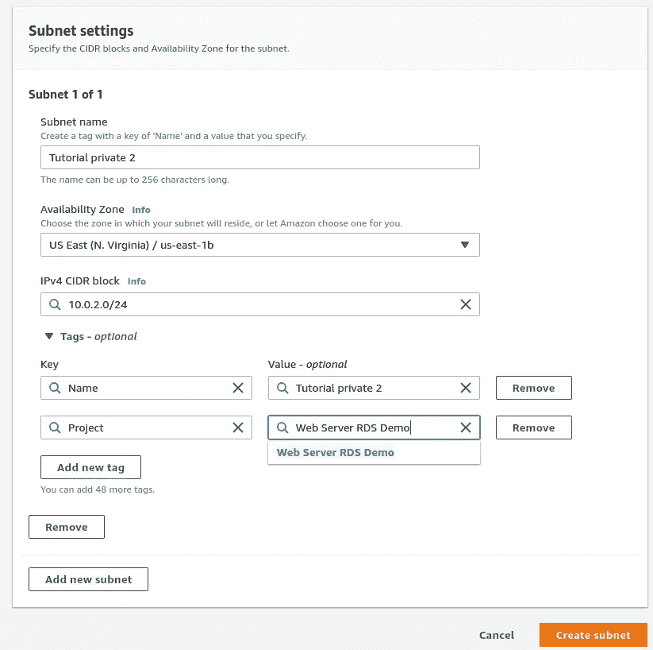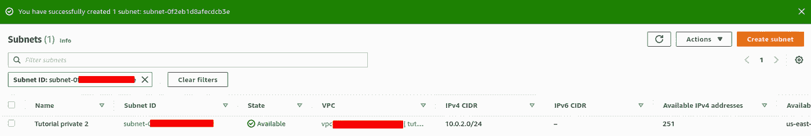

现在，我们需要确保第二个专用子网使用与我们创建的第一个子网相同的路由表。

转到 VPC 仪表板，选择子网，然后选择您为 VPC 创建的第一个专用子网`Tutorial private 1`。

在子网列表下方，您会看到路由表选项卡。

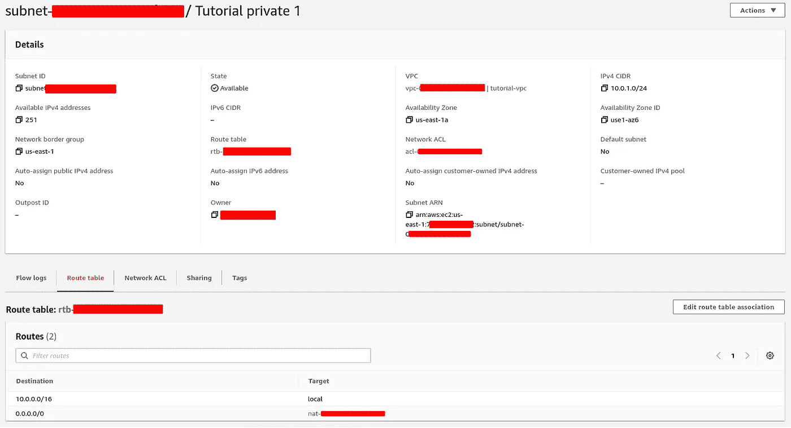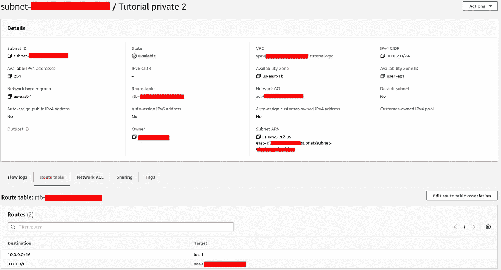

我们的公共网络服务器需要一个 VPC 安全组。

为公共访问创建安全组。要连接到 VPC 中的公共实例，需要向 VPC 安全组添加入站规则，以允许来自 internet 的流量进行连接。

返回 VPC 仪表板，选择安全组，然后*创建安全组*。

*   在**创建安全组**页面上，设置这些值:
*   **安全组名称:** `tutorial-securitygroup`
*   **描述:**
*   **VPC:** 选择您之前创建的 VPC，例如:`vpc-identifier (tutorial-vpc)`

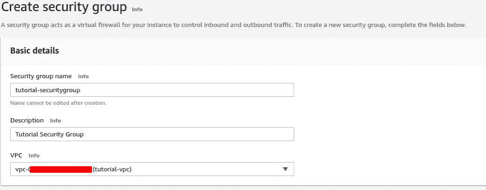

现在我们添加一些入站规则。

添加规则、SSH 和 MyIP。然后是 HTTP 和 source 0.0.0.0/0

一旦完成，*创建安全组*。

现在，我们需要一个用于私有数据库访问的安全组。

*   在**创建安全组**页面上，设置这些值:
*   **安全组名称:** `tutorial-db-securitygroup`
*   **描述:**
*   **VPC:** 选择您之前创建的 VPC，例如:`vpc-identifier (tutorial-vpc)`

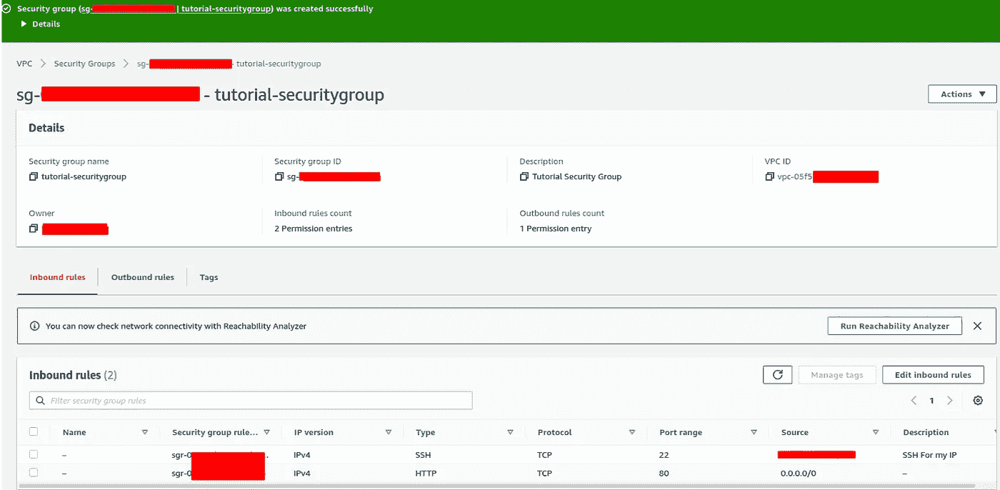

在**入站规则**部分，选择**添加规则**。

*   为新的入站规则设置以下值，以允许来自 EC2 实例的 MySQL 流量通过端口 3306。如果这样做，就可以从 web 服务器连接到 DB 实例，将数据从 web 应用程序存储和检索到数据库中。
*   **类型:**
*   **Source:** 您之前在本教程中创建的`tutorial-securitygroup`安全组的标识符，例如:`sg-9edd5cfb`。

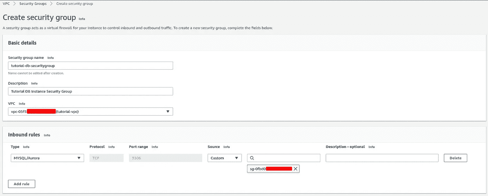

现在，我们需要为数据库实例创建一个子网组。转到亚马逊 RDS。选择左侧的子网组选项。

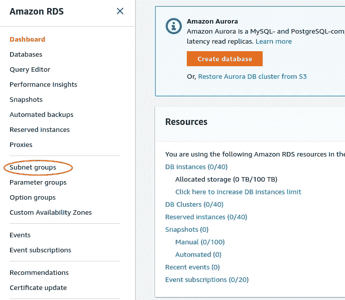

*   选择**创建数据库子网组**。
*   在**创建数据库子网组**页面上，在**子网组详细信息**中设置这些值:
*   **姓名:**
*   **描述:**
*   **VPC:**

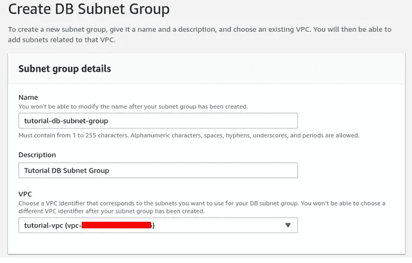

*   在**添加子网**部分，选择**可用区域**和**子网**。
*   对于本教程，为**可用区域**选择`us-west-2a`和`us-west-2b`。接下来，对于**子网**，为 IPv4 CIDR 块 10.0.0.0/24、10.0.1.0/24 和 10.0.2.0/24 选择子网。

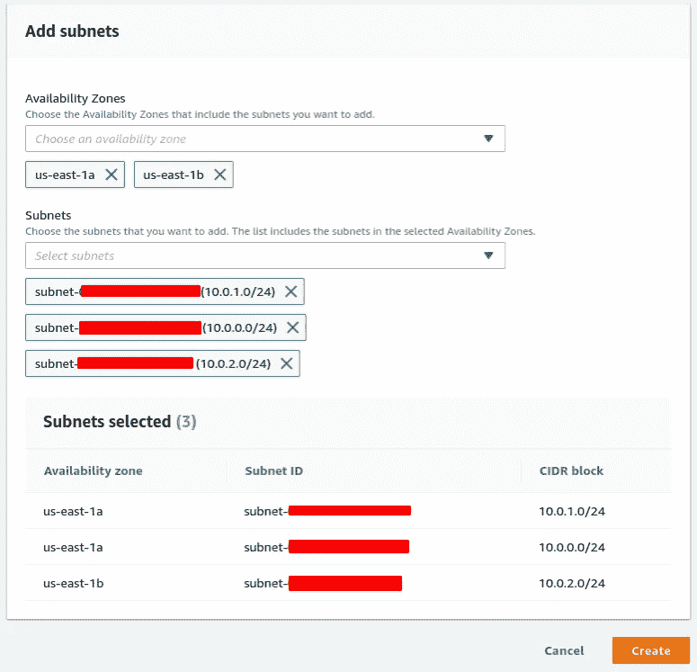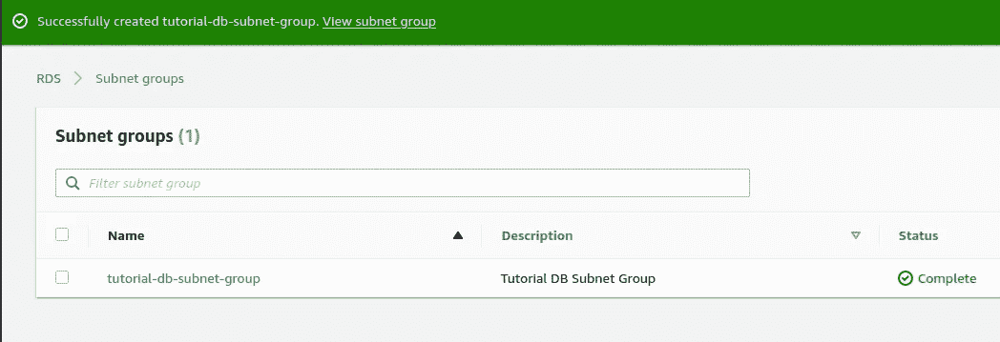

现在，我们终于准备好创建数据库实例了

回到 RDS，选择*创建数据库*。

在**创建数据库**页面，如下图所示，确保选择**标准创建**选项，然后选择 **MySQL** 。

*   在**模板**部分，选择**自由层**。
*   在**设置**部分，设置这些值:
*   **数据库实例标识符** — `tutorial-db-instance`
*   **主用户名** — `tutorial_user`
*   **自动生成密码** —禁用该选项。
*   **主密码** —选择一个密码。
*   **确认密码** —重新输入密码。

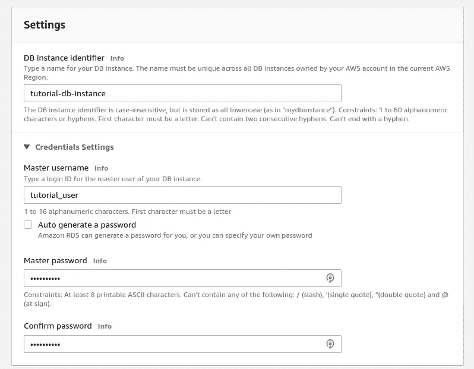

在 **DB 实例类**部分，启用**包括上一代类**，并设置这些值:

*   **突发类(包括 t 类)**
*   **db.t2.micro**

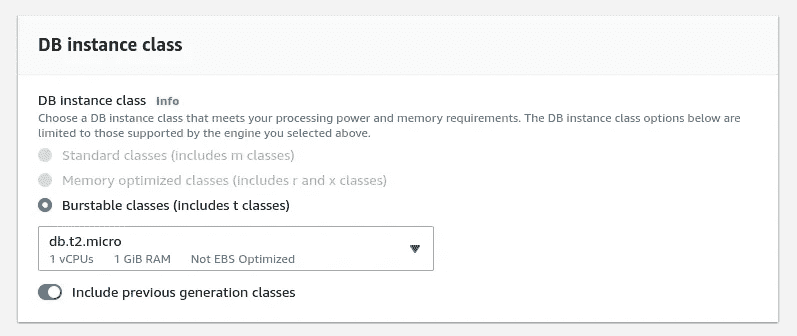

在**储存**和**可用性&耐久性**部分，使用默认值。

在**连通性**部分，设置这些值:

*   **虚拟私有云(VPC)** —选择一个既有公共子网又有私有子网的现有 VPC，例如`tutorial-vpc` (vpc- `identifier`)
*   **子网组**—VPC 的数据库子网组，如`tutorial-db-subnet-group`
*   **公共访问** — **否**
*   **VPC 安全组** — **选择已有的**
*   **现有的 VPC 安全组** —选择一个为私人访问配置的现有 VPC 安全组，例如`tutorial-db-securitygroup`
*   通过选择与每个安全组相关联的 **X** ，删除其他安全组，例如默认安全组。
*   **可用区域** — **无偏好**
*   打开**附加配置**，确保**数据库端口**使用默认值`3306`。

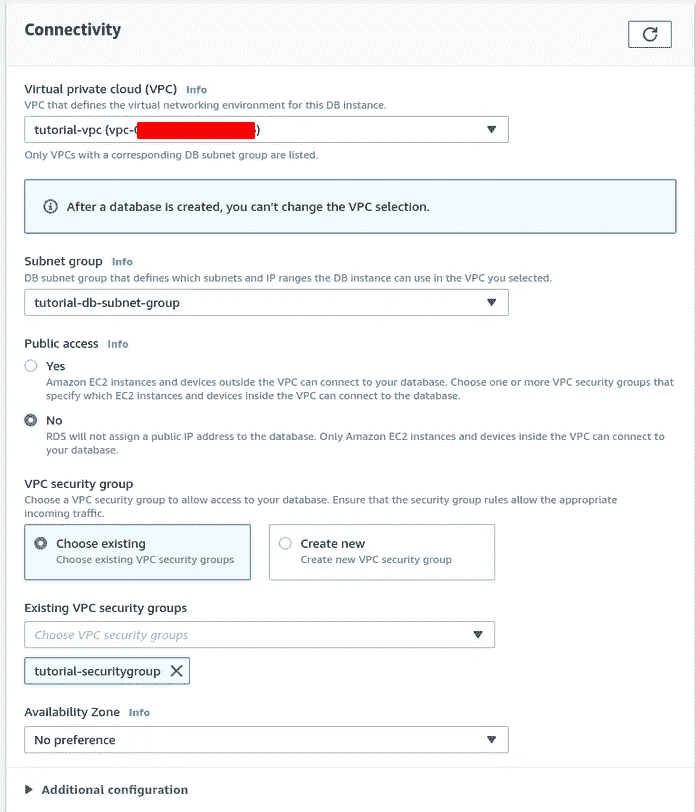

在**数据库认证**部分，确保选择**密码认证**。

打开**附加配置**部分，输入`sample`作为**初始数据库名称**。保留其他选项的默认设置。

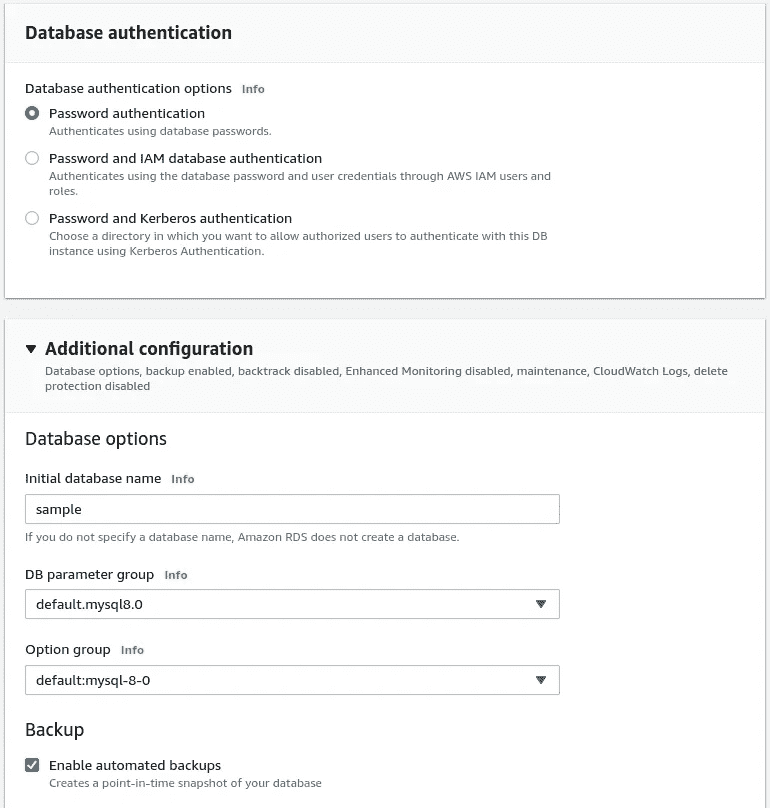

要创建 MySQL 数据库实例，请选择**创建数据库**。

您的新 DB 实例出现在**数据库**列表中，状态为**正在创建**。

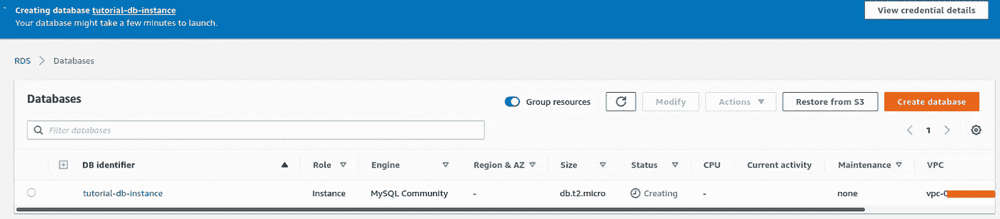

等待新 DB 实例的**状态**显示为**可用**。然后选择数据库实例名以显示其详细信息。

在**连接&安全**部分，查看 DB 实例的**端点**和**端口**。

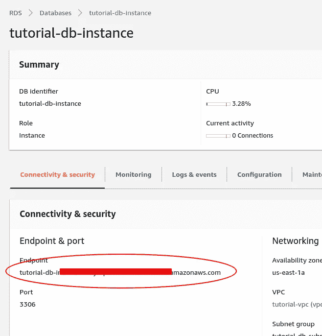

您将需要它将您的 web 服务器连接到您的数据库实例。

在下一部分中，我们将创建 EC2 实例并安装 web 服务器。

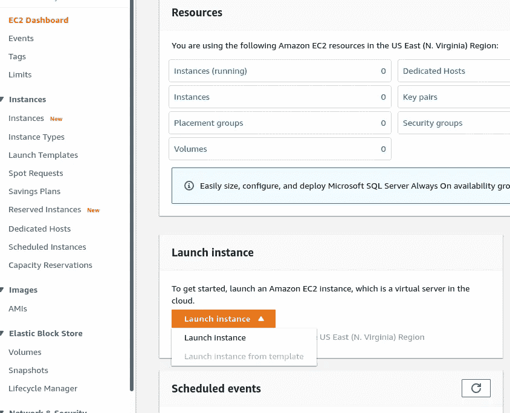

然后选择免费层亚马逊 Linux 2 AMI。

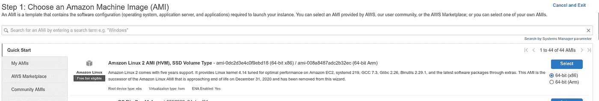

然后，停留在自由层，选择 t2 micro 作为您的实例类型。

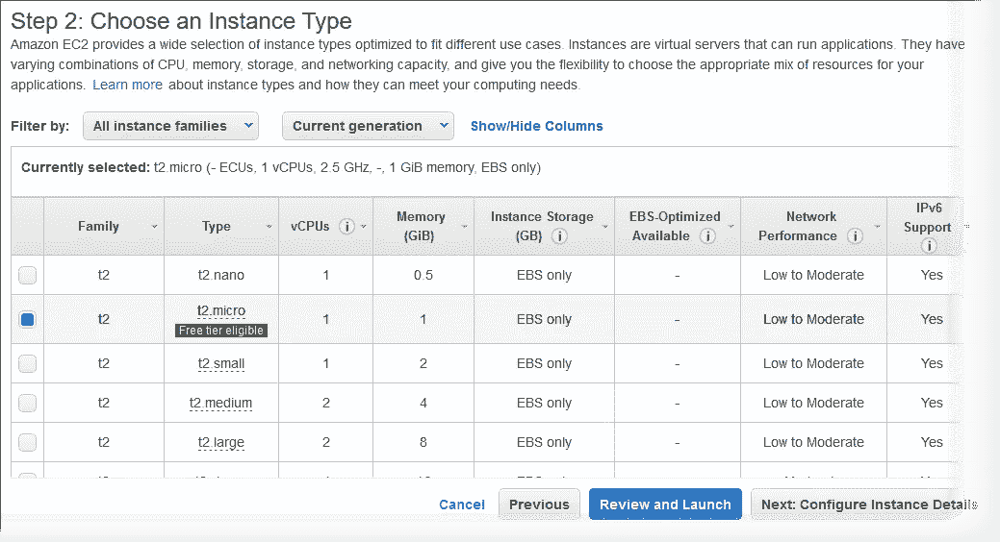

在**配置实例详细信息**页面上，如下所示，设置这些值并将其他值保留为默认值:

*   **网络:**选择带有您为 DB 实例选择的公共和私有子网的 VPC，例如在[创建带有私有和公共子网的 VPC](https://docs.aws.amazon.com/AmazonRDS/latest/UserGuide/CHAP_Tutorials.WebServerDB.CreateVPC.html#CHAP_Tutorials.WebServerDB.CreateVPC.VPCAndSubnets)中创建的`vpc-identifier | tutorial-vpc`。
*   **子网:**选择一个已有的公共子网，比如在[为公共 web 服务器](https://docs.aws.amazon.com/AmazonRDS/latest/UserGuide/CHAP_Tutorials.WebServerDB.CreateVPC.html#CHAP_Tutorials.WebServerDB.CreateVPC.SecurityGroupEC2)创建一个 VPC 安全组中创建的`subnet-identifier | Tutorial public | us-west-2a`。
*   **自动分配公共 IP:** 选择**启用**。

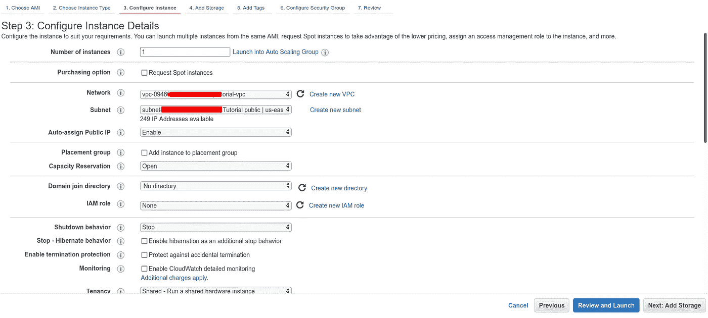

选择下一步:添加存储。保持一切默认，然后下一步:添加标签。

选择**下一步:配置安全组**。

在**配置安全组**页面，如下图所示，选择**选择现有安全组**。然后选择一个现有的安全组，如`tutorial-securitygroup`

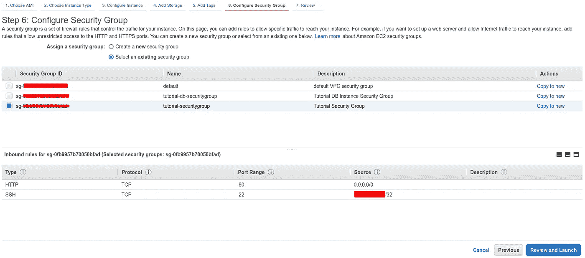

然后复习，发动。

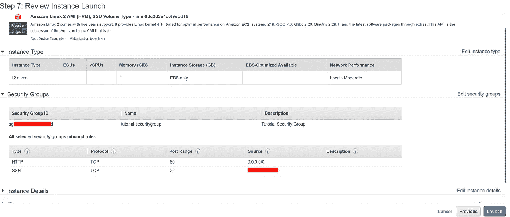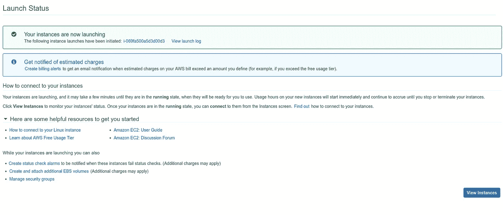

Success

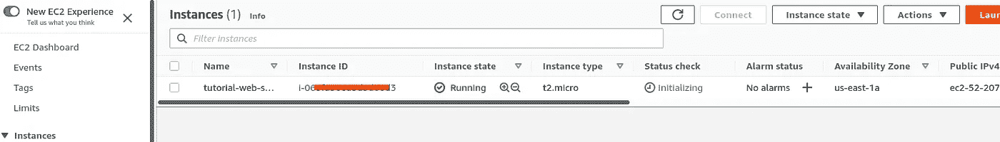

Our instance is now running

让我们安装一个 Apache web 服务器。我们将通过 SSH 连接到我们的新实例。

正确的连接方式是

*ssh-I/path/my-key-pair . PEM my-instance-用户名@ my-instance-public-DNS-name*

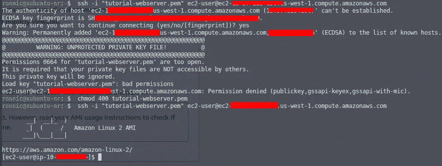

you can see I chanched permissions on my pem file with chmod 400

通过更新 EC2 实例上的软件，获得最新的错误修复和安全更新。为此，请使用以下命令:

`$ sudo yum update -y`

更新完成后，使用`amazon-linux-extras install`命令安装 PHP 软件。此命令同时安装多个软件包和相关依赖项。

```
$ sudo amazon-linux-extras install -y lamp-mariadb10.2-php7.2 php7.2
```

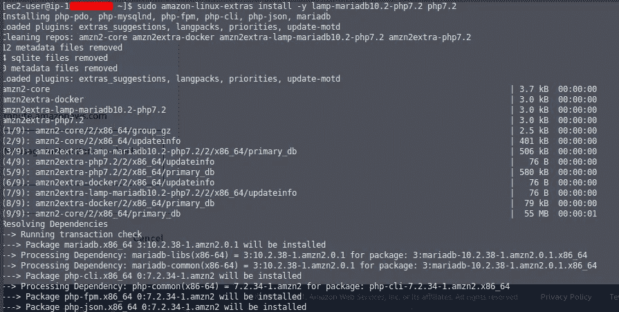

安装 Apache web 服务器。

`$ sudo yum install -y httpd`

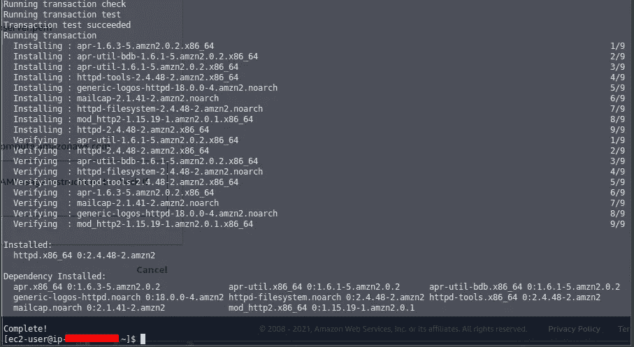

使用下面显示的命令启动 web 服务器。

```
$ sudo systemctl start httpdand then set it to start on boot.$ sudo systemctl enable httpd
```

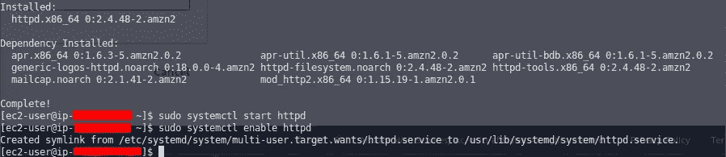

**我们需要为 Apache web 服务器设置文件权限**

将`ec2-user`用户添加到`apache`组。

`$ sudo usermod -a -G apache ec2-user`

注销以刷新您的权限，并加入新的`apache`组。

`$ exit`

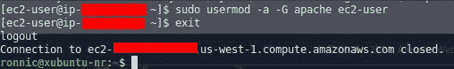

再次登录并使用`groups`命令验证`apache`组是否存在。

```
$ groups
```

将`/var/www`目录及其内容的组所有权更改为`apache`组。

`$ sudo chown -R ec2-user:apache /var/www`

更改`/var/www`及其子目录的目录权限，以添加组写权限，并在以后创建的子目录上设置组 ID。

`$ sudo chmod 2775 /var/www find /var/www -type d -exec sudo chmod 2775 {} \;`

递归更改`/var/www`目录及其子目录中文件的权限，以添加组写权限。

`$ find /var/www -type f -exec sudo chmod 0664 {} \;`

现在，`ec2-user`(以及`apache`组的任何未来成员)可以添加、删除和编辑 Apache 文档根目录中的文件，使您能够添加内容，比如静态网站或 PHP 应用程序。

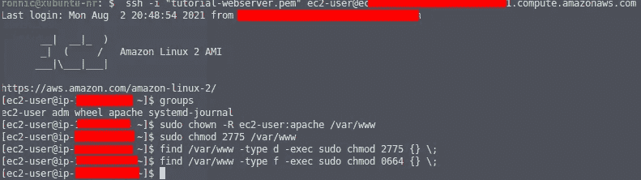

现在，我们将 Apache web 服务器连接到 DB 实例。

**向连接到数据库实例的 Apache web 服务器添加内容**

当仍然连接到 EC2 实例时，将目录更改为`/var/www`并创建一个名为`inc`的新子目录。

`$ cd /var/www mkdir inc cd inc`

在`inc`目录下创建一个名为`dbinfo.inc`的新文件，然后通过调用 nano(或者您选择的编辑器)来编辑该文件。

`$ >dbinfo.inc`

`$ nano dbinfo.inc`

将以下内容添加到`dbinfo.inc`文件中。这里，`db_instance_endpoint`是您的 DB 实例端点，没有端口，`master password`是您的 DB 实例的主密码。

```
<?php

define('DB_SERVER', 'db_instance_endpoint');
define('DB_USERNAME', 'tutorial_user');
define('DB_PASSWORD', 'master password');
define('DB_DATABASE', 'sample');

?>
```

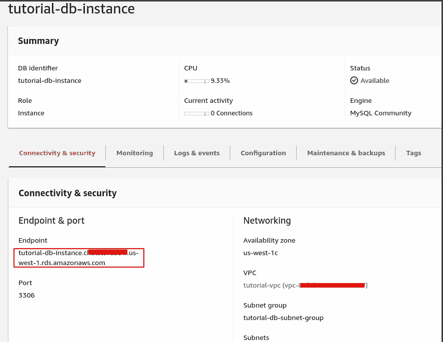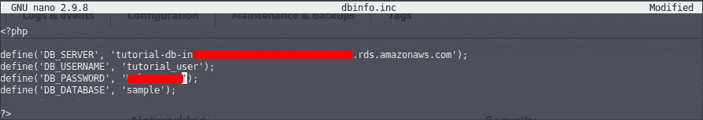

保存并关闭`dbinfo.inc`文件。

将目录更改为`/var/www/html`。

`cd /var/www/html`

在`html`目录下新建一个名为`SamplePage.php`的文件，然后通过调用 nano(或者你选择的编辑器)来编辑这个文件。

`$ >SamplePage.php`

`$ nano SamplePage.php`

将以下内容添加到`SamplePage.php`文件中:

```
<?php include "../inc/dbinfo.inc"; ?>
<html>
<body>
<h1>Sample page</h1>
<?php

  /* Connect to MySQL and select the database. */
  $connection = mysqli_connect(DB_SERVER, DB_USERNAME, DB_PASSWORD);

  if (mysqli_connect_errno()) echo "Failed to connect to MySQL: " . mysqli_connect_error();

  $database = mysqli_select_db($connection, DB_DATABASE);

  /* Ensure that the EMPLOYEES table exists. */
  VerifyEmployeesTable($connection, DB_DATABASE);

  /* If input fields are populated, add a row to the EMPLOYEES table. */
  $employee_name = htmlentities($_POST['NAME']);
  $employee_address = htmlentities($_POST['ADDRESS']);

  if (strlen($employee_name) || strlen($employee_address)) {
    AddEmployee($connection, $employee_name, $employee_address);
  }
?>

<!-- Input form -->
<form action="<?PHP echo $_SERVER['SCRIPT_NAME'] ?>" method="POST">
  <table border="0">
    <tr>
      <td>NAME</td>
      <td>ADDRESS</td>
    </tr>
    <tr>
      <td>
        <input type="text" name="NAME" maxlength="45" size="30" />
      </td>
      <td>
        <input type="text" name="ADDRESS" maxlength="90" size="60" />
      </td>
      <td>
        <input type="submit" value="Add Data" />
      </td>
    </tr>
  </table>
</form>

<!-- Display table data. -->
<table border="1" cellpadding="2" cellspacing="2">
  <tr>
    <td>ID</td>
    <td>NAME</td>
    <td>ADDRESS</td>
  </tr>

<?php

$result = mysqli_query($connection, "SELECT * FROM EMPLOYEES");

while($query_data = mysqli_fetch_row($result)) {
  echo "<tr>";
  echo "<td>",$query_data[0], "</td>",
       "<td>",$query_data[1], "</td>",
       "<td>",$query_data[2], "</td>";
  echo "</tr>";
}
?>

</table>

<!-- Clean up. -->
<?php

  mysqli_free_result($result);
  mysqli_close($connection);

?>

</body>
</html>

<?php

/* Add an employee to the table. */
function AddEmployee($connection, $name, $address) {
   $n = mysqli_real_escape_string($connection, $name);
   $a = mysqli_real_escape_string($connection, $address);

   $query = "INSERT INTO EMPLOYEES (NAME, ADDRESS) VALUES ('$n', '$a');";

   if(!mysqli_query($connection, $query)) echo("<p>Error adding employee data.</p>");
}

/* Check whether the table exists and, if not, create it. */
function VerifyEmployeesTable($connection, $dbName) {
  if(!TableExists("EMPLOYEES", $connection, $dbName))
  {
     $query = "CREATE TABLE EMPLOYEES (
         ID int(11) UNSIGNED AUTO_INCREMENT PRIMARY KEY,
         NAME VARCHAR(45),
         ADDRESS VARCHAR(90)
       )";

     if(!mysqli_query($connection, $query)) echo("<p>Error creating table.</p>");
  }
}

/* Check for the existence of a table. */
function TableExists($tableName, $connection, $dbName) {
  $t = mysqli_real_escape_string($connection, $tableName);
  $d = mysqli_real_escape_string($connection, $dbName);

  $checktable = mysqli_query($connection,
      "SELECT TABLE_NAME FROM information_schema.TABLES WHERE TABLE_NAME = '$t' AND TABLE_SCHEMA = '$d'");

  if(mysqli_num_rows($checktable) > 0) return true;

  return false;
}
?>
```

保存并关闭`SamplePage.php`文件。

通过打开 web 浏览器并浏览到`http://EC2 instance endpoint/SamplePage.php`，验证您的 web 服务器是否成功连接到您的 DB 实例

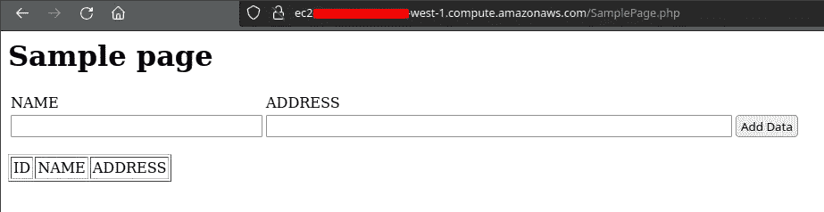

Success!

感谢阅读！