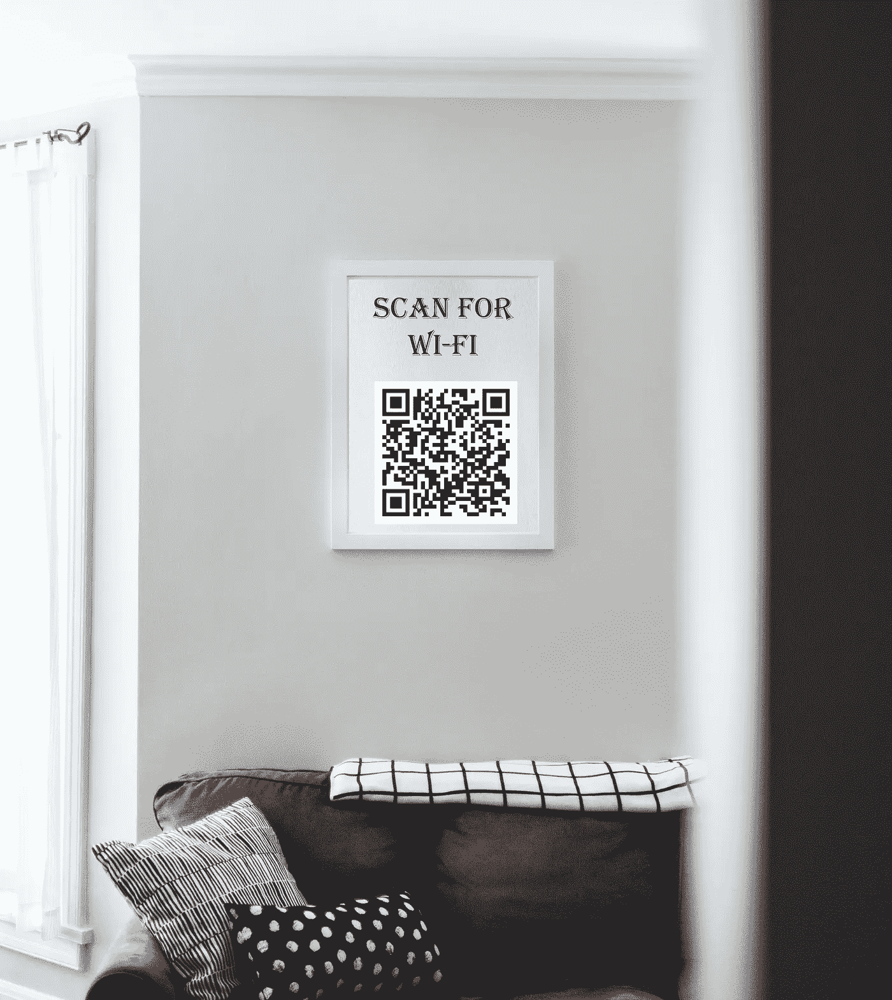

# 使用 Python 为客人创建 Wi-Fi 二维码

> 原文：<https://medium.com/geekculture/create-a-wi-fi-qr-code-for-guests-using-python-25aab6d4e68?source=collection_archive---------3----------------------->

## 大多数现代智能手机都有 Wi-Fi 共享功能，但总是建议使用访客 Wi-Fi 网络，因此访客可以连接到 Wi-Fi 的 QR 可能非常有用。您将会从 Python 中获得乐趣。

Photo by [Kari Shea](https://unsplash.com/@karishea?utm_source=unsplash&utm_medium=referral&utm_content=creditCopyText) on [Unsplash](https://unsplash.com/s/photos/paintings-frame?utm_source=unsplash&utm_medium=referral&utm_content=creditCopyText)