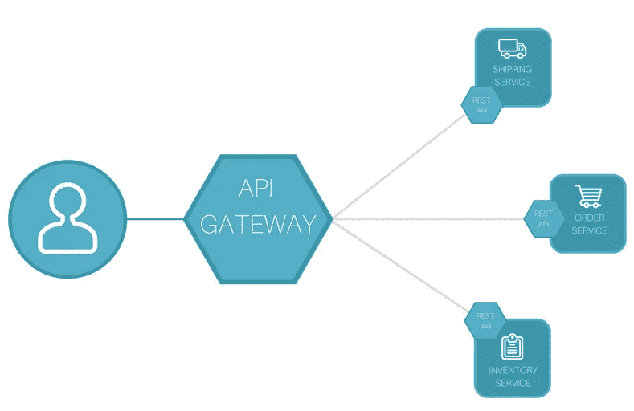
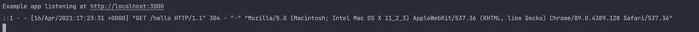
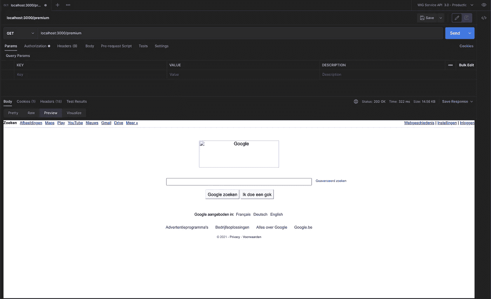

# 使用 NodeJS 和 Express 创建 API 网关

> 原文：<https://medium.com/geekculture/create-an-api-gateway-using-nodejs-and-express-933d1ca23322?source=collection_archive---------0----------------------->

假设您有一堆正在管理的 API 端点，比如一个大型的微服务集合。也许在某些时候，您希望对路由到您的服务的请求有更多的控制，但是您真的不想单独管理每一个微服务。这就是 API 网关的用武之地。



API 网关的目标是在客户端和您的微服务之间提供一个中间层。通过引入 API 网关，客户端将请求发送到网关，网关将确保请求被重定向到相应的微服务。这样，API 网关可以对传入的请求执行额外的检查和验证，比如身份验证检查、指标收集、消息验证、响应转换、速率限制等等

在这篇文章中，我想展示如何使用 NodeJS 创建一个非常基本的 API 网关。在开始实现之前，让我们先看看我们的用例。在本帖中，我们将实现一个可以部署在市场基础设施中的 API 网关。这个 API 网关的目标是检查传入的请求，并确保高级服务只能由帐户中有足够信用的用户访问。如果不是这种情况，请求应该被阻止执行。在给定的场景中，这可以归结为以下要求:

*   所有传入的请求都应该被重定向到一个微服务。
*   一些路由只允许经过身份验证的请求，其他路由不需要有效的身份验证就可以访问(例如文档端点)。
*   我们的免费服务需要限速，以减轻我们后端的负担。
*   高级服务要求用户在他们的帐户中有信用以便执行请求。

**免责声明—** 本帖包含使用 Express 创建 DYI API 网关的方法。在企业环境中，最好使用专用工具和软件来实现这一点。一些示例包包括:

*   孔(【https://konghq.com/】)
*   特拉菲克(【https://traefik.io/】T4)
*   F5([https://www.f5.com/](https://www.f5.com/))
*   …

# 先决条件

在这篇文章的代码中，我们将使用键盘锁([https://www.keycloak.org/](https://www.keycloak.org/))来支持用户授权。有许多关于如何设置 Keycloak 环境的在线资源。然而，本文中的代码可以在任何支持与 NodeJS 集成的访问和身份工具中重用。这意味着您可以只替换代码的身份验证部分，以符合您自己的系统。

# 设置✏️

首先，我们从设置项目和安装正确的依赖项开始。对于我们的 API 网关的基础，我们将使用一个 Express 服务器。所以让我们从设置项目和安装 Express 开始。为此，请执行以下命令:

```
npm init
npm install express --save
```

太好了！现在我们可以开始设置我们的基本 Express 服务器了。为什么不设置一个 hello world 端点来查看一切是否如我们所预期的那样工作呢？作为任何值得尊敬的程序员，我们需要从一个 hello world 示例开始…这意味着创建一个名为*server . js**的文件，并添加以下代码:*

```
**const* express = require('express')

*const* app = express()
*const* port = 3000;
app.get('/hello', (req, resp) => {
    *return* resp.send('HELLO WORLD!');
})

app.listen(port, () => {
    console.log(`Example app listening at http://localhost:${port}`)
})*
```

*我们可以通过运行以下命令之一来测试我们的服务器:*

```
*node server.js//ornpm run start*
```

*证据就在布丁中，所以打开你的浏览器，导航到[http://localhost:3000/hello](http://localhost:3000/hello)和 TADA🎉。你现在可以开始你的庆祝舞蹈了💃*

****

*好了，是时候加快步伐了！实现的下一步是向我们的服务器添加不同的特性，以便创建我们的 API 网关。*

# *伐木📓*

*我们想要添加的第一个特性是记录关于传入请求的信息。这不仅有助于调试，而且有助于收集 API 网关处理的请求的指标。*

*在我们的例子中，我们将使用*摩根*库([https://www.npmjs.com/package/morgan](https://www.npmjs.com/package/morgan))。 *Morgan* 允许我们用日志功能扩展我们的 Express 服务器。 *Morgan* 还支持 apache like logging，这使得它很容易集成到现有的日志收集框架中，比如 ELK stacks。*

*首先在您现有的 NodeJS 项目中安装 *morgan* :*

```
*npm install morgan --save*
```

*接下来，我们创建一个单独的 *logging.js* 文件来配置我们的日志设置，并通过一个函数导出它们。*

```
**const morgan* = require("morgan");

*const* setupLogging = (app) => {
    app.use(*morgan*('combined'));
}

exports.setupLogging = setupLogging*
```

*我们现在可以将我们的函数包含到现有的 *server.js i* n 中，以便启用请求日志记录:*

```
**const* express = require('express')
***const* {setupLogging} = require("./logging");**

*const* app = express()
*const* port = 3000;

**setupLogging(app);**app.get('/hello', (req, resp) => {
    *return* resp.send('HELLO WORLD!');
})app.listen(port, () => {
    console.log(`Example app listening at http://localhost:${port}`)
})*
```

*如果我们现在重启服务器并刷新浏览器，我们可以看到请求被记录在服务器的控制台中。*

**

# *配置🔑*

*在我们继续集成其他特性之前，我们将首先创建我们希望在 API 网关中支持的不同路由的配置。根据应启用的功能，每条路径可以有多个属性。如何配置这些属性将在专门介绍不同功能的章节中解释。*

*为了创建配置，创建一个新的*routes . js**文件，其内容如下:**

```
***const* ROUTES = [
    {
        url: '/free',
        auth: *false*,
        creditCheck: *false*,
        rateLimit: {
            windowMs: 15 * 60 * 1000,
            max: 5
        },
        proxy: {
            target: "https://www.google.com",
            changeOrigin: *true*,
            pathRewrite: {
                [`^/free`]: '',
            },
        }
    },
    {
        url: '/premium',
        auth: *true*,
        creditCheck: *true*,
        proxy: {
            target: "https://www.google.com",
            changeOrigin: *true*,
            pathRewrite: {
                [`^/premium`]: '',
            },
        }
    }
]

exports.ROUTES = ROUTES;**
```

**为了简单起见，我们确定了两条路由，一条代表免费(/free)服务的端点，另一条代表高级(/premium)服务。每个服务都可以有以下属性:**

*   ****url** —与传入请求匹配的 url 路径。这可以是 Express 支持的任何路径。这意味着它还可以包含通配符来匹配多个路径。**
*   ****auth** —布尔值，表示用户是否需要通过身份验证才能访问此端点。**
*   ****信用检查** —布尔值，表示是否需要对该请求执行信用检查。**
*   ****rateLimit** —对服务进行速率限制的配置。**
*   ****代理** —代理配置，包含关于请求应该重定向到的目标的信息**

# **代理人📩**

**接下来，我们要设置应该应用于传入请求的代理规则。这是一个重要的特性，因为我们的 API 网关将负责把传入的请求重定向到实际的微服务。**

**我们可以使用一个名为*http-proxy-middleware*([https://www.npmjs.com/package/http-proxy-middleware](https://www.npmjs.com/package/http-proxy-middleware))的现有库来为我们的路由配置不同的代理规则。通过执行以下命令来安装它:**

```
**npm install http-proxy-middleware --save**
```

**接下来，我们创建一个单独的 *proxy.js* 文件，它将为我们的路由创建代理。该文件的内容如下:**

```
***const* { *createProxyMiddleware* } = require('http-proxy-middleware');

*const* setupProxies = (app, routes) => {
    routes.forEach(r => {
        app.use(r.url, *createProxyMiddleware*(r.proxy));
    })
}

exports.setupProxies = setupProxies**
```

**你可能注意到了，这里没发生什么事情。这个代码片段所做的唯一一件事就是为我们配置中的每条路由添加了 *createProxyMiddleware* 。这确实是所有的人！我们唯一需要做的就是将正确的代理配置添加到我们的 *routes.js* 配置文件中。你可以使用文档([https://www.npmjs.com/package/http-proxy-middleware](https://www.npmjs.com/package/http-proxy-middleware))来查看不同的选项。如果您习惯使用 Angular、Apache 或 httpd 配置，您会注意到许多相似之处。**

**剩下唯一要做的就是将代理配置集成到我们的主服务器中。这可以通过将以下代码添加到我们的 *server.js* 文件中来实现:**

```
***const* express = require('express')

***const* {ROUTES} = require("./routes");**

*const* {setupLogging} = require("./logging");
***const* {setupProxies} = require("./proxy");**

*const* app = express()
*const* port = 3000;

setupLogging(app);
**setupProxies(app, ROUTES);**

app.listen(port, () => {
    console.log(`Example app listening at http://localhost:${port}`)
})**
```

**请注意，我们已经删除了 hello world 端点。我们现在进入了更高级的领域，所以不再需要 hello world 了😉**

**如果我们重启服务器，我们可以通过导航到配置中的一个 URL 来测试代码。在这个例子中，你会注意到两者都会将你重定向到 Google 网站。您可以将 *routes.js* 更改为任何主机和端口组合的代理，并将其与一些奇特的路径重写相结合。**

# **证明🙈**

**是时候向我们的 API 网关添加身份验证了。我们配置中的一些路由将要求在请求中包含有效的用户身份验证，以便允许进一步执行。正如先决条件中提到的，我们将依赖 Keycloak 来验证传入请求的访问令牌。**

**Keycloak 已经通过【https://www.npmjs.com/package/keycloak-connect】的*key cloak-connect*([T5)模块支持快速集成。让我们从所需模块的安装开始:](https://www.npmjs.com/package/keycloak-connect)**

```
**npm install keycloak-connect express-session --save**
```

**现在，我们创建一个名为 *auth.js* 的单独文件，以便配置我们的身份验证，并将不同的规则应用于我们的配置路由:**

```
***const* Keycloak = require('keycloak-connect');
*const session* = require('express-session');

*const* setupAuth = (app, routes) => {
    *var* memoryStore = *new session*.MemoryStore();
    *var* keycloak = *new* Keycloak({ store: memoryStore });

    app.use(*session*({
        secret:'<RANDOM GENERATED TOKEN>',
        resave: *false*,
        saveUninitialized: *true*,
        store: memoryStore
    }));

    app.use(keycloak.middleware());

    routes.forEach(r => {
        *if* (r.auth) {
            app.use(r.url, keycloak.protect(), *function* (req, res, next) {
                next();
            });
        }
    });
}

exports.setupAuth = setupAuth**
```

**在我们的文件中，我们定义了一个名为 *setupAuth* 的函数，它将 express 应用程序和我们的路线配置作为输入参数。为了启用 Keycloak 集成，我们需要创建一个新的内存存储，设置应用程序以使用会话并激活 Keycloak 中间件。接下来，我们可以通过下面的代码片段来保护我们的端点:**

```
**app.use(r.url, keycloak.protect(), *function* (req, res, next) {
      next();
});**
```

**这段代码在指定的 URL 上添加了 Keycloak 中间件( *keycloak.protect()* )。添加了一个额外的回调函数，使我们能够向代码添加额外的日志记录。在这种情况下，我们只需调用 *next()* 函数，该函数告诉 Express 继续处理请求。**

**为了使 Keycloak 集成工作，我们还需要一个额外的配置文件，其中包含一些特定于 Keycloak 的信息。有关设置的更多信息，请参考官方的 Keycloak 文档。下面是在这个项目中使用的一个示例 *keycloak.json* 配置:**

```
**{
  "realm": "<REALM>",
  "bearer-only": true,
  "auth-server-url": "<AUTH_URL>",
  "ssl-required": "external",
  "resource": "<CLIENT>",
  "confidential-port": 0
}**
```

**下一步是将认证设置包含到我们的主服务器中。我们可以通过用以下代码更新我们的 *server.js* 文件来做到这一点:**

```
***const* express = require('express')

*const* {ROUTES} = require("./routes");

*const* {setupLogging} = require("./logging");
*const* {setupProxies} = require("./proxy");
***const* {setupAuth} = require("./auth");**

*const* app = express()
*const* port = 3000;

setupLogging(app);
**setupAuth(app, ROUTES);**
setupProxies(app, ROUTES);

app.listen(port, () => {
    console.log(`Example app listening at http://localhost:${port}`)
})**
```

**重新启动服务器后，您会注意到导航到高级 URL([http://localhost:3000/premium](http://localhost:3000/premium))将会出现一个“拒绝访问”页面。但是，免费的网址([http://localhost:3000/free](http://localhost:3000/free))仍然可以访问👍。您可以使用 Postman 之类的工具向您的请求添加一个访问令牌，以便检查 Keycloak 集成是否正在工作。在这种情况下，当对高级 url 执行 GET 请求时，Postman 还应该显示 Google 网站。**

****

# **限速⛔️**

**我们实施的下一阶段将为我们的网关端点添加速率限制。在我们的例子中，我们将对我们的免费服务应用速率限制。降低某些服务的吞吐量可以带来多种好处，例如降低某些微服务的负载并对其进行更好的控制，鼓励用户购买额外服务以消除吞吐量限制等**

**正如我们已经实现的其他功能一样，已经有一个名为*express-rate-limit*([https://www.npmjs.com/package/express-rate-limit](https://www.npmjs.com/package/express-rate-limit))的 NPM 库，可用于将速率限制集成到现有的 Express 服务器中。可以通过执行以下命令来安装它:**

```
**npm install --save express-rate-limit**
```

**安装完成后，我们继续开发，创建一个单独的 *ratelimit.js* 文件，包含以下内容:**

```
***const rateLimit* = require("express-rate-limit");

*const* setupRateLimit = (app, routes) => {
    routes.forEach(r => {
        *if* (r.rateLimit) {
            app.use(r.url, *rateLimit*(r.rateLimit));
        }
    })
}

exports.setupRateLimit = setupRateLimit**
```

**您将再次注意到它看起来与其他特性的实现非常相似。上面的代码片段遍历了所有路由，并添加了一个速率限制中间件(如果适用于给定的 url)。提供给限速中间件的设置可以在模块([https://www.npmjs.com/package/express-rate-limit](https://www.npmjs.com/package/express-rate-limit))的文档中找到，并直接从 *routes.js* 文件中的路由配置中读取。**

**如果我们查看 *routes.js* 配置，我们可以看到我们通过指定以下属性对免费路由应用了速率限制:**

```
**rateLimit: {
    windowMs: 15 * 60 * 1000,
    max: 5
},**
```

**这些设置将对端点的请求限制为每 15 分钟最多 5 个请求。**

**接下来，我们需要在创建服务器时激活速率限制设置。这可以通过用以下内容扩展 *server.js* 文件来实现:**

```
***const* express = require('express')

*const* {ROUTES} = require("./routes");

*const* {setupLogging} = require("./logging");
***const* {setupRateLimit} = require("./ratelimit");**
*const* {setupProxies} = require("./proxy");
*const* {setupAuth} = require("./auth");

*const* app = express()
*const* port = 3000;

setupLogging(app);
**setupRateLimit(app, ROUTES);**
setupAuth(app, ROUTES);
setupProxies(app, ROUTES);

app.listen(port, () => {
    console.log(`Example app listening at http://localhost:${port}`)
})**
```

**现在让我们来测试我们的解决方案。重启你的服务器，并转到位于[http://localhost:3000/free](http://localhost:3000/free)的免费端点。什么都没变，对吧？现在刷新页面几次。刷新 5 次左右，会看到一条错误信息:“请求太多，请重试”。我们现在已经通过应用速率限制成功地限制了我们服务的吞吐量。**

****

# **信用检查💰**

**我们要添加的最后一件事是对高级端点的请求进行信用检查。如果用户在他/她的帐户中没有足够的信用来执行请求，它应该被阻止。**

**然而，在本帖中，我们将创建一个信用检查示例的更通用的实现。本章的目标是创建任何类型的中间件，在重定向或阻塞请求之前，您需要在其中进行额外的检查。**

**正如您在前面的段落中可能已经注意到的，我们总是利用 Express 中间件来将它们组合到一个请求评估/执行链中。Express 允许我们创建一个定制的中间件，并将其添加到验证链中。每个中间件都被定义为一个功能:**

```
**function(request, response, next) { // Add custom code here}**
```

**在中间件函数中，你可以访问*请求*和*响应*对象，以及一个名为 *next* 的函数。在中间件的执行过程中，您有几种选择:**

*   **通过 *response* 对象向客户端发送响应来结束请求的处理，例如:**

```
**res.status(500).send({error});**
```

*   **完成中间件，然后继续链中的下一个中间件。这就是 *next()* 函数的用武之地。它告诉 Express 您的中间件没有遇到任何错误，它可以通过下一个中间件继续评估请求。**

**所以现在让我们把这个付诸实践。在我们的示例中，我们希望对每个传入的请求进行信用检查。我们首先创建一个函数，它将在名为 *creditcheck.js.* 的文件中执行实际的信用检查**

```
***const* checkCredit = (request) => {
    *return new* Promise((resolve, reject) => {
           // Custom code here 
           if (ok) {
              resolve();
           } else {
              reject('No credits');
           }     })
}**
```

**在上面的例子中，我们忽略了信用检查的实际代码实现，因为这可以由任何自定义代码来替换，您可以根据请求对象进行额外的检查。但是，为了测试代码，我们可以编写一些代码，这些代码将导致延迟 500 毫秒的负信用检查，模拟额外请求的执行:**

```
***const* checkCredit = (req) => {
    *return new* Promise((resolve, reject) => {
        console.log("Checking credit with token", req.headers["authorization"]);
        *setTimeout*(() => {
            reject('No sufficient credits');
        }, 500);
    })
}**
```

**正如您在上面的代码中看到的，我们将拒绝承诺，这表示用户的错误或负信用余额。通过对另一个实际返回信用量的微服务执行任何附加请求，可以很容易地替换这段代码。**

**我们的下一步是添加作为中间件的 *creditCheck* 函数，以便处理我们的传入请求:**

```
***const* checkCredit = (req) => {
    *return new* Promise((resolve, reject) => {
        console.log("Checking credit with token", req.headers["authorization"]);
        *setTimeout*(() => {
            reject('No sufficient credits');
        }, 500);
    })
}

***const* setupCreditCheck = (app, routes) => {
    routes.forEach(r => {
        *if* (r.creditCheck) {
            app.use(r.url, *function*(req, res, next) {
                checkCredit(req).then(() => {
                    next();
                }).catch((error) => {
                    res.status(402).send({error});
                })
            });
        }
    })
}

exports.setupCreditCheck = setupCreditCheck****
```

**上面的代码为每个应该执行信用检查的请求引入了一个新的中间件。根据其执行情况，请求将被重定向或阻止。中间件的实际代码包含在以下代码片段中:**

```
***function*(req, res, next) {
   checkCredit(req).then(() => {
      next();
    }).catch((error) => {
      res.status(402).send({error});
    })
});**
```

**在这段代码中，我们执行 *creditCheck* 函数并等待其结果。如果解析正确，我们通过调用 *next()* 函数通知 Express 中间件已经成功执行。如果信用检查被拒绝，我们就停止处理请求，并向客户机发回一个响应。**

**我们实现的最后一步是将信用检查配置添加到服务器的启动脚本中，从而生成我们最终的 *server.js* 文件:**

```
***const* express = require('express')

*const* {ROUTES} = require("./routes");

*const* {setupLogging} = require("./logging");
*const* {setupRateLimit} = require("./ratelimit");
***const* {setupCreditCheck} = require("./creditcheck");**
*const* {setupProxies} = require("./proxy");
*const* {setupAuth} = require("./auth");

*const* app = express()
*const* port = 3000;

setupLogging(app);
setupRateLimit(app, ROUTES);
setupAuth(app, ROUTES);
**setupCreditCheck(app, ROUTES);**
setupProxies(app, ROUTES);

app.listen(port, () => {
    console.log(`Example app listening at http://localhost:${port}`)
})**
```

**剩下唯一要做的就是重启服务器，信用检查将应用于您的 *routes.js* 配置中的相关路由。您也可以通过为您的免费路线启用来轻松测试信用检查。如果您重新启动服务器并导航到免费 URL([http://localhost:3000/free](http://localhost:3000/free))，您将会收到一条消息，提示您没有足够的点数👍。**

****请记住**我们也对这条路线应用了限速，因此您可能会太快，不得不等待 15 分钟或一起禁用限速。**

****

# **全部完成！👍**

****

**干得好！我们已经创建了自定义 API 网关实现。你也可以在 Github([https://github.com/JanssenBrm/api-gateway](https://github.com/JanssenBrm/api-gateway))上找到完整的代码。我希望这篇文章能让你更好地理解如何在 Express 中使用中间件，并启发你为 API 网关添加更多有用的特性。继续编码！**