# 使用苹果现实工具包在 10 分钟内在你的房间里创建一个增强现实黑洞

> 原文：<https://medium.com/geekculture/create-an-augmented-reality-blackhole-in-your-room-in-10-minutes-using-apple-reality-kit-30c99e1ac40f?source=collection_archive---------14----------------------->

image source([https://www.livescience.com/researchers-calculate-how-many-black-holes](https://www.livescience.com/researchers-calculate-how-many-black-holes))

任何物体都可能成为黑洞，只要它的质量足够集中，足以使空间弯曲到连光都无法逃脱其引力的程度。这由史瓦西半径定义。地球要成为黑洞，整个地球必须被压缩成一个半径为 9 毫米或 0.35 英寸的小球

我想我可能没有超能力来创造一个真正的黑洞，所以我用苹果现实工具包在增强现实中创造了一个。

**先决条件**

*   有一台 Macbook 和一台 iOS 设备(iPhone，iPad)。
*   从 Apple Store 下载 Macbook 上的 Xcode。

**流程**

**步骤 1)找到免费的黑洞 3D 模型**

我通常从 Sketchfab 找到免费的 3D 模型。以下是由`rubykamen`—[https://sketch fab . com/3D-models/black hole-74c beaeae 2174 a 218 Fe 9455d 77902 b5](https://sketchfab.com/3d-models/blackhole-74cbeaeae2174a218fe9455d77902b5c)创建的一个令人难以置信的黑洞 3D 模型的链接

下载 3D 模型时，选择增强现实格式(USDZ)

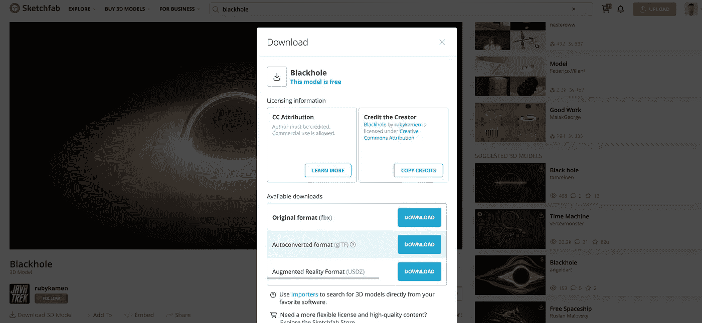

**步骤 2)在 Xcode 中创建 AR 项目**

打开 Xcode，选择`Create a new Xcode Project`。然后选择`Augmented Reality App`

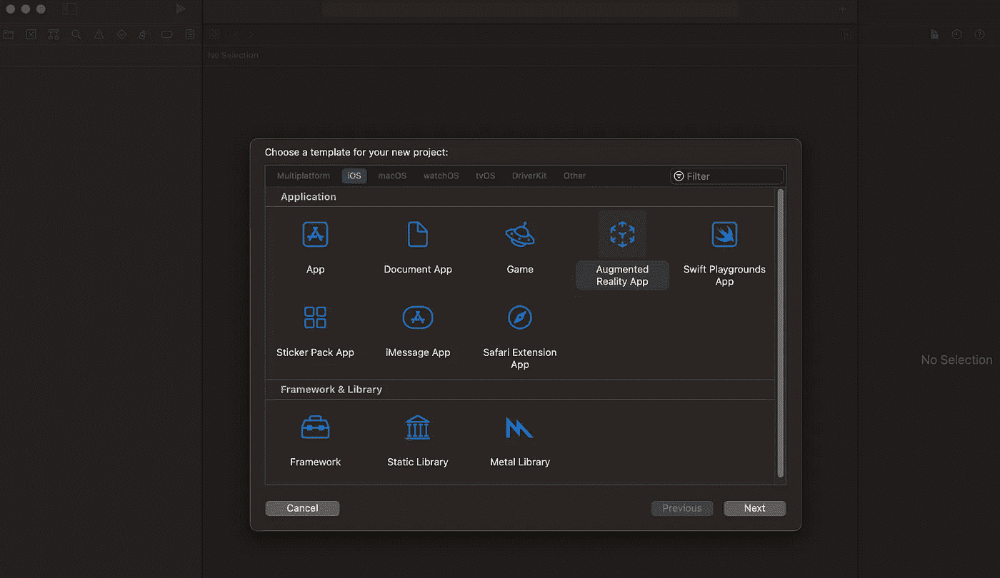

输入项目信息，我们就可以做 AR 黑洞了。

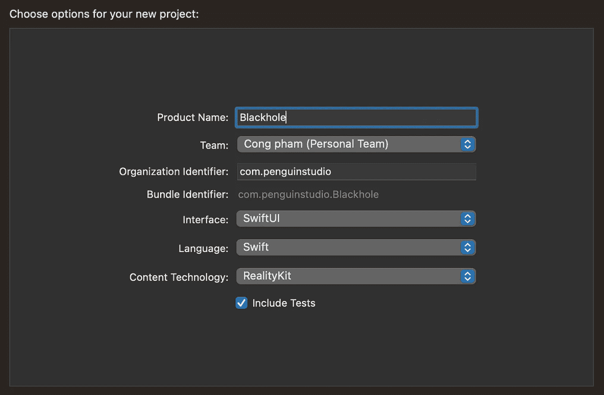

我们将在 Swift 中看到一些为我们编写的代码。不要担心，代码基本上是加载 box 对象，然后将其附加到我们手机中的 AR 视图。我们不需要改变代码中的任何东西。

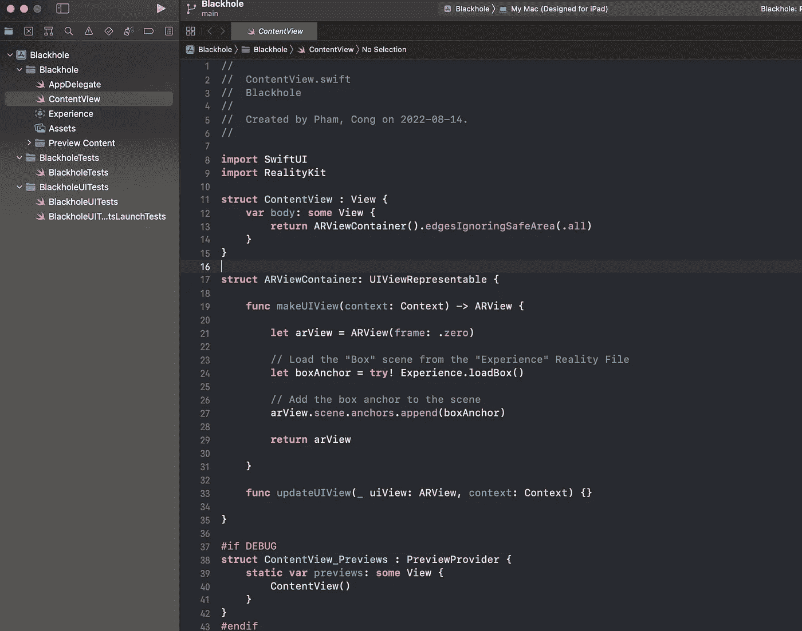

**步骤 3)将黑洞 3D 模型导入 AR 项目。**

点击左侧目录中的`Experience`，然后点击右侧的`Open in Reality Composer`

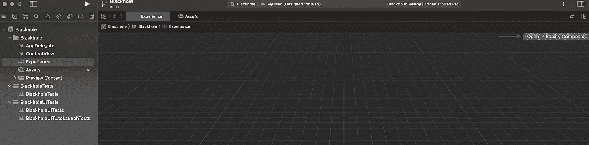

然后用鼠标右键点击顶部菜单栏上的`Add`按钮删除立方体对象。

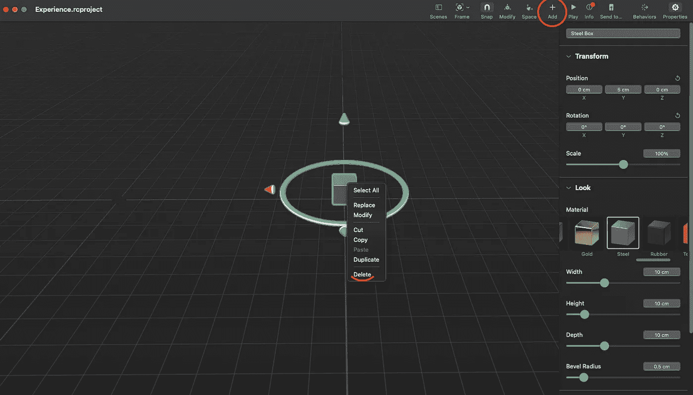

弹出窗口出现后，点击`Import`按钮，然后找到并选择我们在步骤 1 中下载的 3D 模型文件。

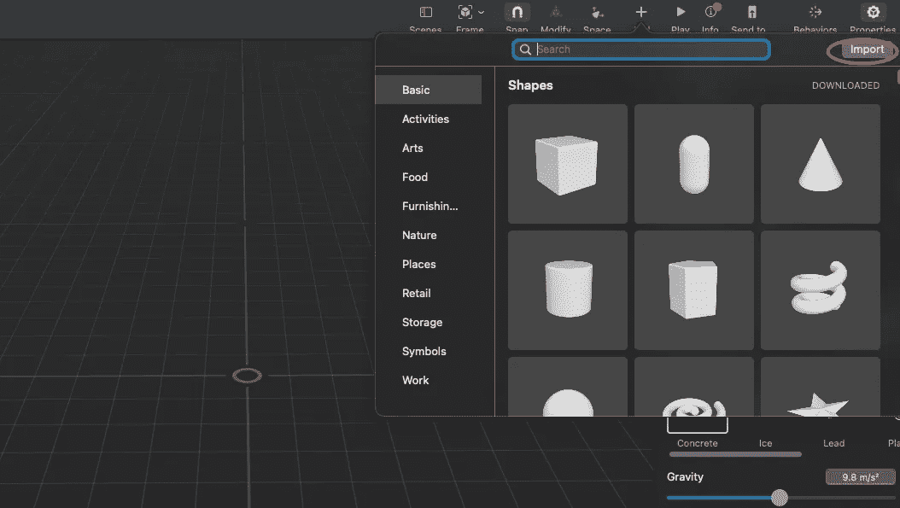

**步骤 4)配置自旋速度和黑洞的位置**

导入黑洞 3D 模型后，在我们的屏幕上单击它。然后调整`Position`、`Rotation`和`Scale`，如下图右侧菜单所示。

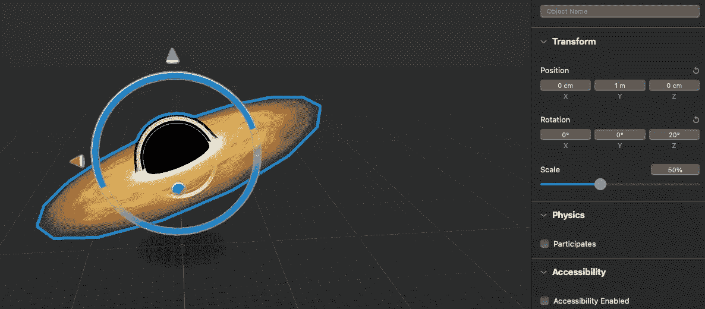

所有黑洞都有角速度，所以我们会给这个黑洞加上自旋。点击顶部菜单栏上的`Behaviours`，然后点击`+`图标并选择`Custom`行为。

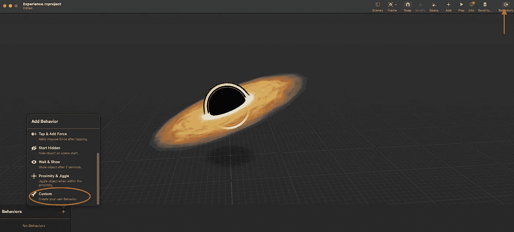

一旦添加完毕，则选择`Scene Start`触发，`Spin`动作。

在旋转动作内，选择`loop`符号。然后选择`Affected Objects`，点击我们的黑洞。

将`Duration`调整到 15 秒。以及`Iterations`到 10。这决定了我们黑洞的旋转速度。

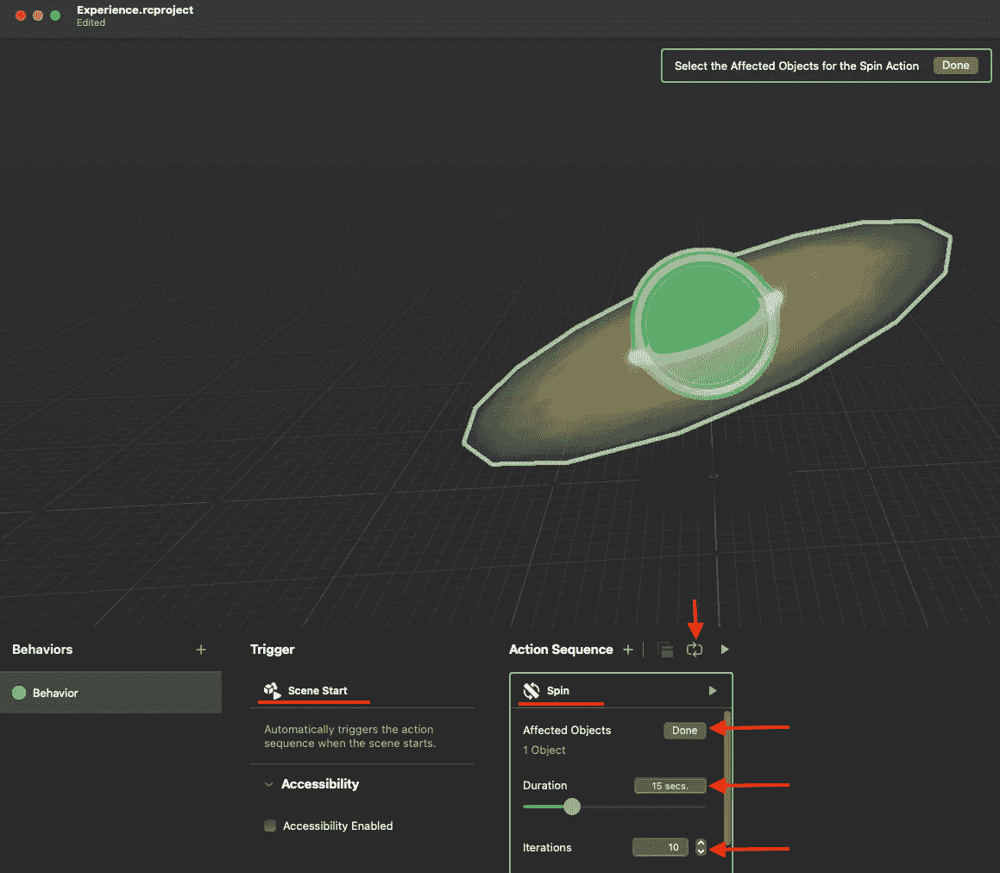

然后，我们准备将 AR 应用程序部署到我们的 iPhone 上

**步骤 5)在手机上构建 AR 应用。**

通过 USB 线将我们的手机连接到 Macbook，确保选择 iOS 设备下的设备。

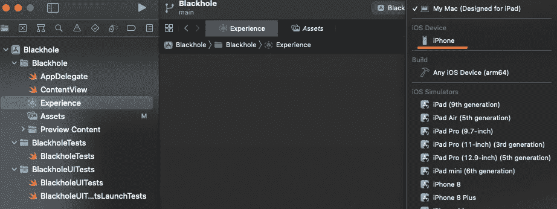

然后点击“播放”按钮，在我们的 iOS 设备中将该项目构建成一个应用程序。

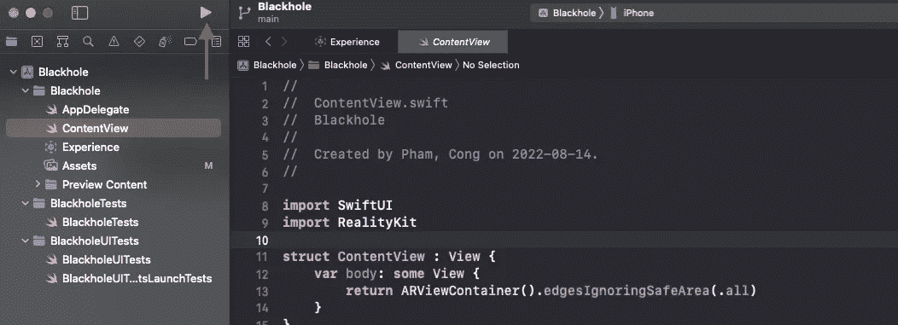

瞧，我们有创造黑洞🕳的 AR 应用程序