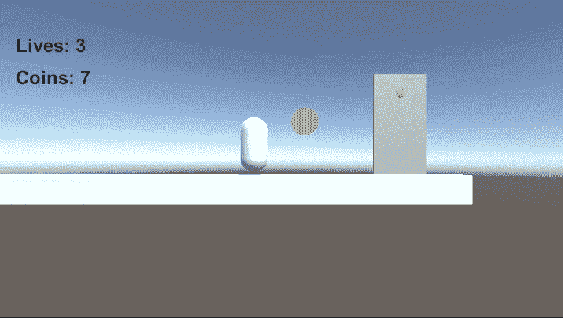
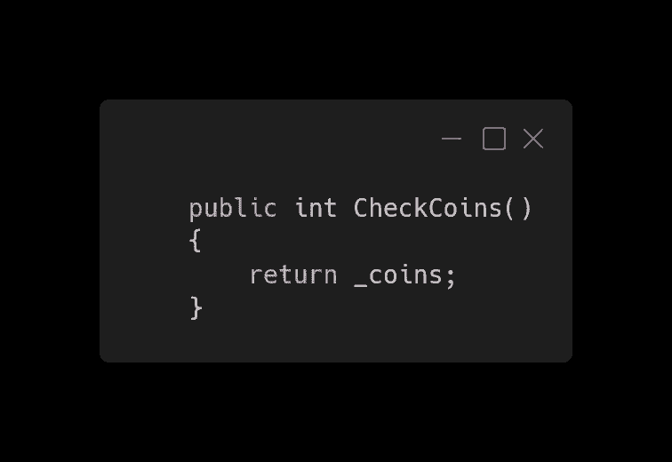
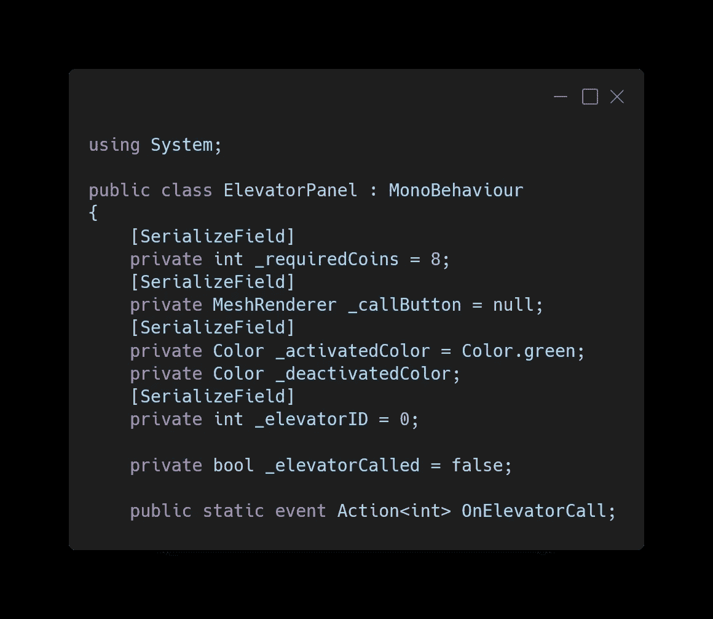
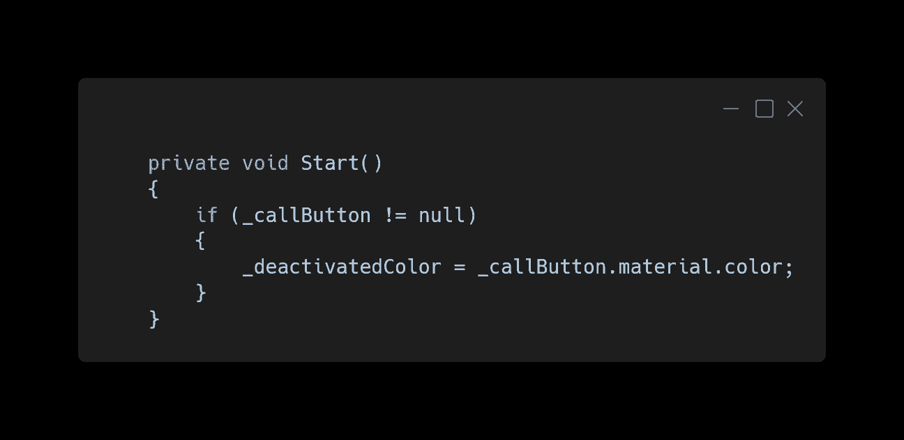
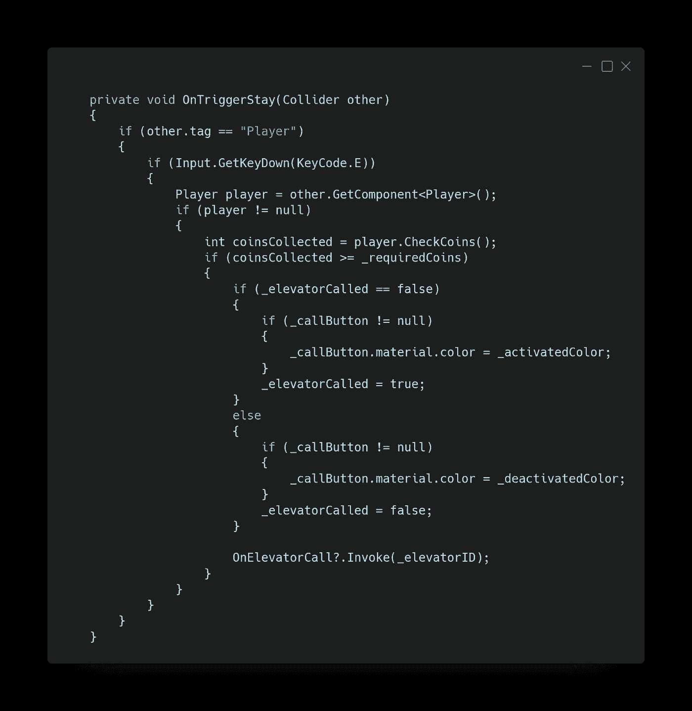
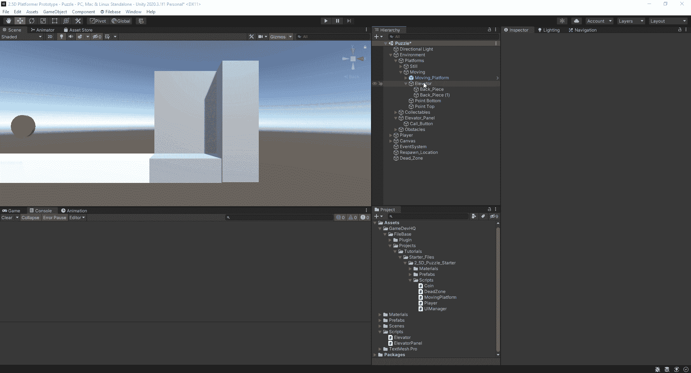
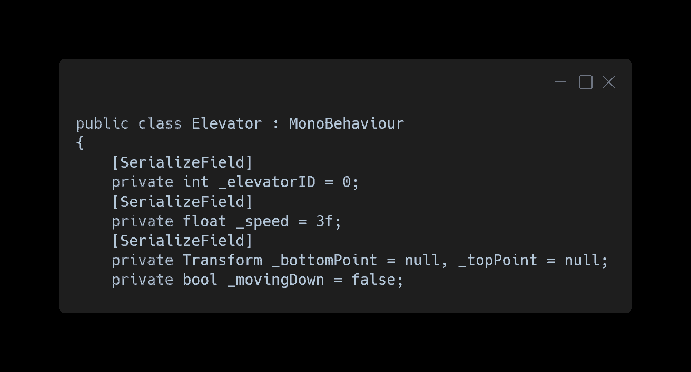
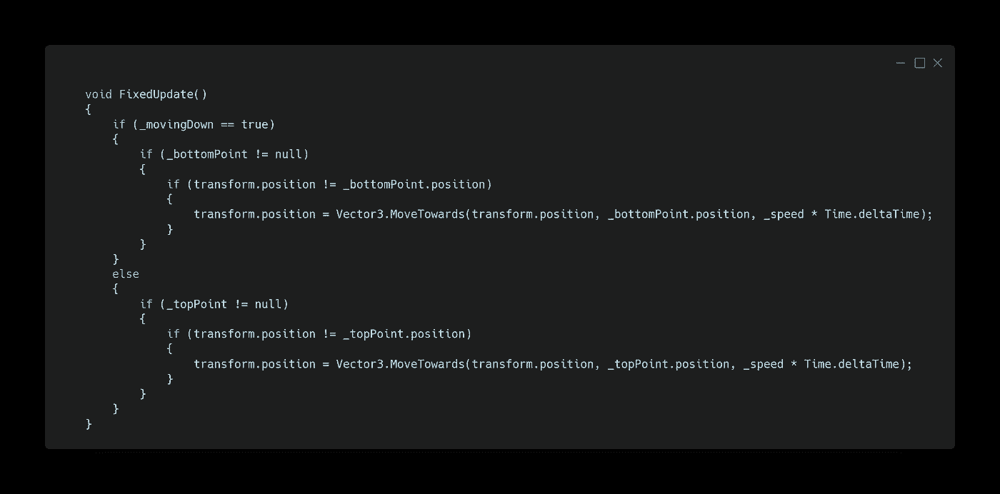
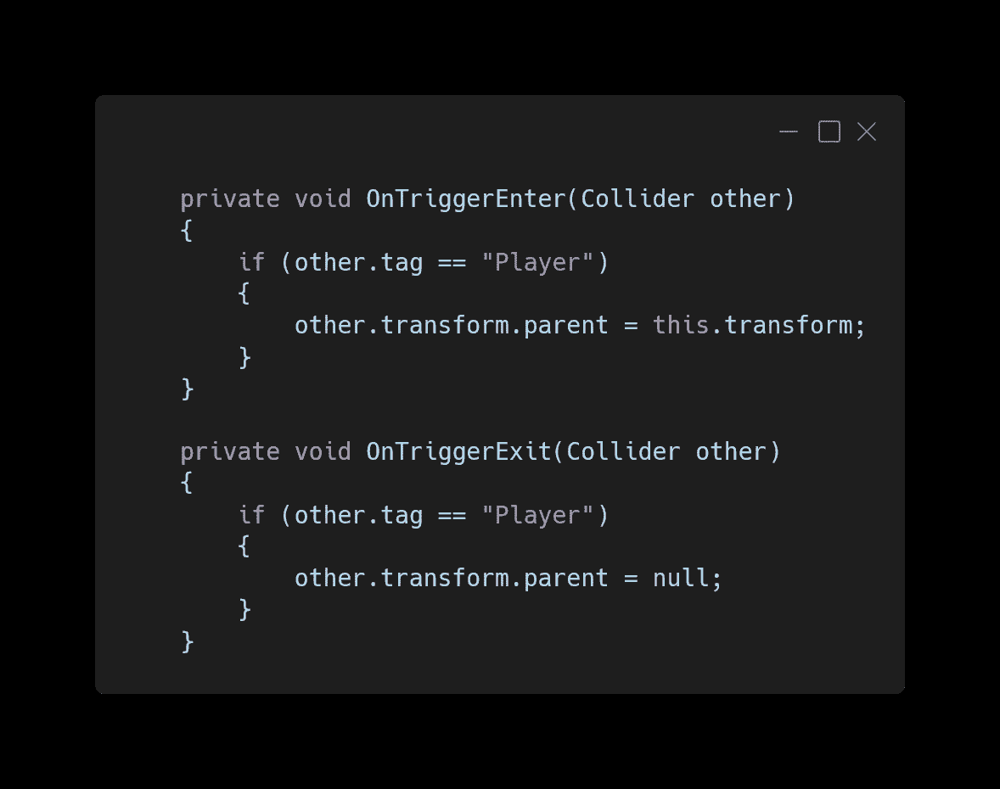
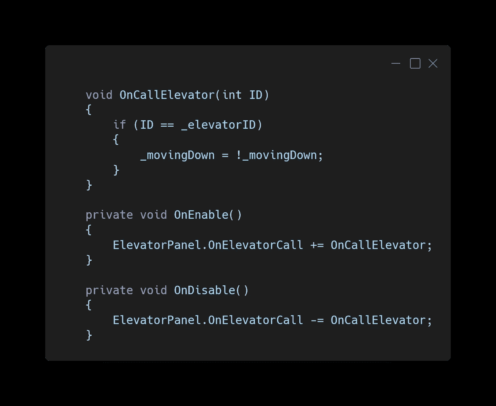

# 在统一中创造一部电梯

> 原文：<https://medium.com/geekculture/create-an-elevator-in-unity-8040bcca8216?source=collection_archive---------16----------------------->

本文将展示如何创建一个电梯系统，玩家将与该系统交互并乘坐到场景中的下一层。

电梯系统将由两个对象组成，电梯面板和电梯本身。面板将要求玩家收集足够的硬币与其互动并呼叫电梯。一旦电梯到达底部，玩家登上电梯，然后与电梯互动，让电梯回到顶部。

## 运动员

在制作电梯面板之前，我们需要在玩家脚本上添加一个方法，由面板调用以返回玩家收集的硬币数量。

## 电梯面板

电梯面板有一个盒子碰撞器，当玩家站在里面时，它会被设置为一个触发器。该面板还有一个呼叫按钮子，当与面板交互时，它会改变颜色，给玩家视觉反馈。

ElevatorPanel 脚本需要几个变量和一个动作委托来调用具有给定 ID 号的电梯。

1.  一个用于所需数量的硬币。
2.  用于更改颜色的调用按钮的网格渲染器。
3.  要更改为的颜色。
4.  原来的颜色。
5.  此面板将呼叫的电梯的 ID 号。
6.  一个知道玩家是否已经呼叫电梯的 bool。

在 Start 中，我们得到了 call 按钮的开始颜色。

我们使用 OnTriggerStay 来检测玩家是否在面板的碰撞器中。如果玩家按下碰撞器中的“E”键，我们会检查收集到的硬币数量。如果硬币足够多，那么我们改变呼叫按钮的颜色，交换名为 bool 的电梯，并调用动作，用传递的 ID 号呼叫电梯。

如果我们进入播放模式，电梯面板需要八个硬币才能激活，当玩家按下碰撞器内部的' E '键时，呼叫按钮会改变颜色。

## 电梯

电梯由三个立方体组成，创造出电梯切割的外观，以展示其内部。电梯上有两台箱子对撞机。一个被用作地板，这样玩家就不会掉下去。另一个是触发器，它将检测玩家是否正在进入或退出碰撞器，然后父或父电梯。我们这样做是为了让玩家可以随着电梯平稳移动。

电梯脚本的工作方式类似于上一篇文章中的移动平台脚本。为此，我们需要一些变量。

1.  电梯的 ID 号，以了解面板是否呼叫了它。
2.  电梯在两点之间移动的速度。
3.  底部点的参考。
4.  顶点的参考。
5.  一个知道电梯是向上还是向下移动的按钮。

在 FixedUpdate 中，如果 bool 为真，我们以设定的速度将电梯移向底部点，如果 bool 为假，则移向顶部点。当电梯到达任一端时，它停止移动，直到车厢翻转。

当玩家进入电梯的触发碰撞器时，它被设置为电梯的子，当玩家退出时，它被取消配对。

这个方法检查传入的 ID 是否与这个电梯的 ID 相同，并翻转向下移动的 bool 命令电梯移动。然后我们订阅和取消订阅 ElevatorPanel 的动作委托的方法。

当电梯面板被激活时，它调用电梯并改变 bool，使其移动。

