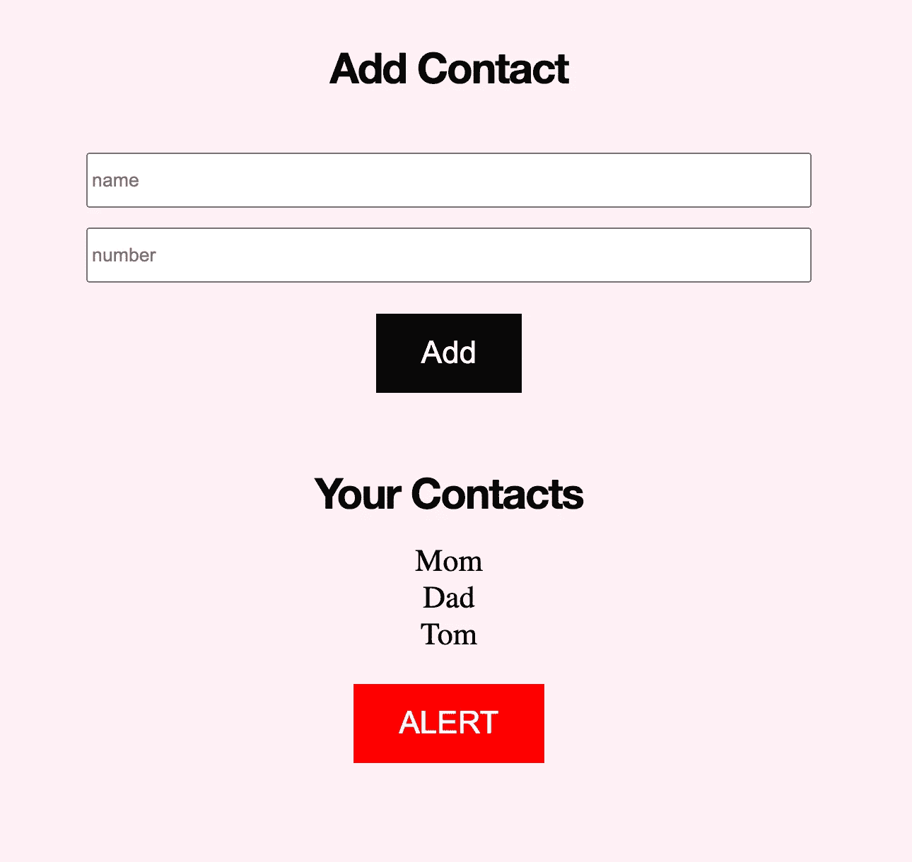

# 用 Vonage、Node 和 MongoDB 创建一个紧急广播系统

> 原文：<https://medium.com/geekculture/create-an-emergency-broadcast-system-with-vonage-node-and-mongodb-acc222e4ad9f?source=collection_archive---------16----------------------->


在紧急情况下很难做对任何事情，尤其是当你惊慌失措的时候！如果你遇到紧急情况，像让正确的人知道你需要帮助这样简单的事情可能会被证明是不可能的。今天，我们将通过构建一个 web 应用程序来解决这一问题，该应用程序允许您单击一个按钮，通过文本通知您的家人您正处于紧急情况中，并发送您的位置。我们将使用 Node.js、Express、MongoDB 和 Vonage Messages API 创建这个网站。Node 是一个流行的 web 服务器，Express 是开发人员经常使用的框架。MongoDB 是一个 NoSQL 数据库，Vonage Messages API 允许您以编程方式快速发送消息(比如 SMS 消息)。

您的 web 应用程序将如下所示。



您可以添加联系人，查看他们，当您按下提醒按钮时，它会向您的所有联系人发送短信，让他们知道您的位置和您的紧急情况。

随着您的跟进，您可以在这个 GitHub 库中找到这个项目的所有代码。

准备好开始了吗？我们来搭建一个紧急播报 app 吧！

# 先决条件

要跟随这个教程，你需要 Node(你可以[在这里](https://nodejs.org/en/download/)下载)。你还需要一个 Vonage 账户，你可以[在这里](https://www.vonage.com/communications-apis/)注册。你还需要一个 [MongoDB 账户](https://account.mongodb.com/account/register)。

在你注册了你的 MongoDB 账号之后，你需要建立一个 MongoDB Atlas 数据库，你可以在 MongoDB 的文档中学习[做这个。](https://docs.mongodb.com/manual/tutorial/getting-started/)

一旦你创建了你的 Vonage 帐户，你需要做一些初始设置。

使用以下命令全局安装 Vonage CLI:

```
npm install @vonage/cli -g
```

复制

接下来，使用您的 Vonage API 密钥和密码配置 CLI。您可以在开发人员仪表板中找到此信息。

```
vonage config:set --apiKey=VONAGE_API_KEY --apiSecret=VONAGE_API_SECRET
```

复制

为您的项目创建一个新目录，并放入 CD:

```
mkdir my_project
cd my_project
```

复制

现在，使用 CLI 通过以下命令创建一个 Vonage 应用程序:

```
vonage apps:create
```

复制

滚动到消息，点击空格键，并点击回车。现在你需要一个号码来接听电话。您可以使用以下命令租用一个(用您的代码替换国家代码)。例如，如果你在英国，用 GB 替换我们:

```
vonage numbers:search US
vonage numbers:buy [NUMBER] [COUNTRYCODE]
```

复制

现在将该号码链接到您的应用程序:

```
vonage apps:link --number=VONAGE_NUMBER APP_ID
```

复制

# 构建广播系统

首先，您需要安装将用于这个项目的 JavaScript 库，如下所示:

```
npm install express body-parser dotenv firebase mongodb mongoose @vonage/server-sdk
```

复制

接下来，在项目中创建一个. env 文件，并添加以下变量:

```
API_KEY=your_vonage_api_key
API_SECRET=your_vonage_secret
APPLICATION_ID=your_vonage_application_id
PRIVATE_KEY=your_vonage_private_key
FROM_NUMBER=your_vonage_number
PORT=5000
MONGO_URL=your_mongodb_url
```

复制

确保用您的 Vonage 和 MongoDB 帐户的信息替换每个变量的每个等号后面的所有内容。

现在，创建一个名为`app.js`的文件并导入这些库:

```
require('dotenv/config')
require('mongodb')
const express = require('express')
const Vonage = require('@vonage/server-sdk')
const bodyParser = require('body-parser')
const mongoose = require('mongoose')
```

复制

让我们从创建一个`"Hello, World!"` Express 应用程序开始。以下是方法:

```
const app = express()app.get('/', function(req, res) {
    res.send('Hello World!')
})app.listen(process.env.PORT)
```

复制

现在，像这样运行您的代码:

```
node app.js
```

复制

当你运行这段代码并进入你的本地服务器(http://127.0.0.1:5000)时，它应该显示`Hello, World!`

现在，将这段代码添加到`const app = express()`下面:

```
app.use(bodyParser.json())
app.use(bodyParser.urlencoded({
    extended: true
}))
app.use(express.static('public'))
```

复制

这段代码帮助您使用 Express 接受 POST 请求，并告诉 Express 从一个名为`public`的目录中提供静态文件。

是时候添加代码来连接到您的 MongoDB 数据库了！将这段代码添加到您的应用程序中，并更新您的`.env`文件，以包含一个名为`MONGO_URL`的环境变量，该变量包含到您的 MongoDB 数据库的链接。

```
mongoose.connect(process.env.MONGO_URL, {
    useNewUrlParser: true,
    useUnifiedTopology: true
})
const contactsSchema = new mongoose.Schema({
    name: String,
    number: Number
})
const Contacts = mongoose.model('Contacts', contactsSchema)
```

复制

上面的代码使用 Mongoose 连接到您的 MongoDB 数据库，为您的联系人(您将向其发送 SMS 消息的人)创建一个模式，并创建一个名为`Contacts`的新模型来从您的数据库添加和获取联系人。

接下来，添加这段代码来帮助使用 Vonage messages API 发送 SMS 消息。

```
const vonage = new Vonage({
    apiKey: process.env.API_KEY,
    apiSecret: process.env.API_SECRET,
    applicationId: process.env.APPLICATION_ID,
    privateKey: process.env.PRIVATE_KEY
})
```

复制

上面的代码创建了一个新的 Vonage 对象，并将您的 API 密钥、秘密、应用程序 ID 和私钥传递给您的应用程序。

现在，让我们创建几个端点。将以下代码添加到`app.js`:

```
app.post('/contacts', function(req, res) {
    const contact = new Contacts({
        name: req.body.name
    })
    contact.save()
    res.redirect('/')
})
```

复制

现在，当您向`/contacts`发送 POST 请求时，这段代码会在 MongoDB 中创建一个新的联系人，并将用户重定向到主页。

让我们创建一个端点，从数据库中获取所有联系人。将以下代码添加到`app.js`:

```
app.get('/contacts', function(req, res) {
    Contacts.find({}, function(err, contacts) {
        if(err){
            console.log(err)
       }
       else {
           res.json(contacts)
       }
   })
})
```

复制

当您向`/contacts`发送 GET 请求时，这段代码获取数据库中的所有联系人，并将其作为 JSON 返回。

现在，让我们定义一个发送 SMS 消息的端点。将此代码添加到`app.js`:

```
app.post('/alert', function(req, res) {
    let long = req.body['coordinates']['long']
    let lat = req.body['coordinates']['lat']
    let contacts = req.body['contacts']
    for (let i = 0; i <= contacts.length; i++) {
        vonage.channel.send({
                'type': 'sms',
                "number": contacts[i].number
            }, {
                'type': 'sms',
                "number": process.env.FROM_NUMBER
            }, {
                'content': {
                    'type': 'text',
                    'text': `SOS! Your friend is in an emergency! Their latitude is ${lat} and` +
                        `their longitude is ${long}!`
                }
            },
            (err, data) => {
                if (err) {
                    console.error(err)
                } else {
                    console.log(data.message_uuid)
                }
            }
        )
    }
})
```

复制

这个端点用 JSON 接受 POST 请求，其中包含用户的纬度、经度和要发送 SMS 消息的号码列表。

```
let long = req.body['coordinates']['long']
let lat = req.body['coordinates']['lat']
let contacts = req.body['contacts']
```

复制

然后，它遍历联系人，并使用 Vonage Messages API 向每个号码发送一条消息。

```
for (let i = 0; i <= contacts.length; i++) {
    vonage.channel.send({
                'type': 'sms',
                'number': contacts[i].number
            }, {
                'type': 'sms',
                'number': process.env.FROM_NUMBER
            }, {
                'content': {
                    'type': 'text',
                    'text': `SOS! Your friend is in an emergency! Their latitude is ${lat} and` +
                        `their longitude is ${long}!`
                }
            },
```

复制

最后，让我们更新我们的主页端点，以便在用户访问我们的 web 应用程序主页时进行处理。更改以前的代码:

```
app.get('/', function(req, res) {
    res.send('Hello World!')
})
```

复制

对此:

```
app.get('/', function(req, res) {
    res.sendFile('index.html')
})
```

复制

现在，您的主页将为您将要创建的文件 index.html 提供服务。

继续创建一个名为 index.html 的新文件，并添加以下代码:

```
<!DOCTYPE html>
<html lang='en'>
   <head>
      <meta charset='UTF-8'>
      <title>Emergency Broadcast</title>
      <link rel='stylesheet' href='style.css'>
   </head>
   <body>
      <h1 id='top'>Add Contact</h1>
      <form action='/contacts' method='POST'>
         <div>
            <input id='name' class='forms' type='text' name='name' placeholder='name'> <br>
            <input id='number' class='forms' type='text' name='number' placeholder='number'>
         </div>
         <div>
            <input type='submit' value='Add' class='tons' id='add'>
         </div>
      </form>
      <br> <br>
      <h1>Your Contacts</h1>
      <div></div>
      <div id='contacts'></div>
      <button onclick='alert_them()' class='tons' id='alert'>ALERT</button>
   </body>
</html>
```

复制

上面的 HTML 创建了一个表单，允许您输入一个人的姓名和号码，并按下 Add 按钮。当您按下 Add 时，表单向`/contacts`发送一个 POST 请求，这将在您的数据库中创建一个新的联系人。这个 HTML 也有一个警告按钮。当你按下它时，它向`/alert`发送 POST 请求，向你数据库中的所有联系人发送 SMS 消息。

最后，您需要在这个 HTML 中添加一些 JavaScript 来显示用户的联系人列表，并准备发送给`/alert`的数据。

在 HTML 中的 ALERT 按钮之后，添加一个脚本标记并定义一个名为 data 的对象。

```
<script>
    let data = {}
</script>
```

复制

我们将使用`data`来存储发送到`/alert`的数据。

接下来，调用一个名为`httpPostAsync`的函数，并传入`‘/contacts’`和`create_contacts`:

```
<script>
    let data = {}
    httpPostAsync('/contacts', create_contacts)
</script>
```

复制

现在，定义`create_contacts`:

```
function create_contacts(contacts) {
    data['contacts'] = []
    for (let i = 0; i < contacts.length; i++) {
        let contact = contacts[i]
        data['contacts'].push(contact)
        const newDiv = document.createElement('div')
        newDiv.className = 'left'
        const newContent = document.createTextNode(contact.name)
        newDiv.appendChild(newContent)
        const currentDiv = document.getElementById('contacts')
        document.body.insertBefore(newDiv, currentDiv)
    }
}
```

复制

这是一个回调函数`httpPostAsync`在从服务器获取联系数据时会调用。它接受联系人作为参数(联系人数据)。首先，这个函数向`data['contacts']`添加一个数组。然后，它遍历来自服务器的联系人，将每个联系人添加到数组中，并用每个联系人的名字创建一个新的 HTML `div`。

现在，您需要定义`httpPostAsync`:

```
function httpPostAsync(theUrl, callback) {
    let xmlHttp = new XMLHttpRequest()
    xmlHttp.onreadystatechange = function() {
        if (xmlHttp.readyState == 4 && xmlHttp.status == 200)
            callback(JSON.parse(xmlHttp.responseText))
    }
    xmlHttp.open('GET', theUrl, true)
    xmlHttp.send()
}
```

复制

这段代码向一个 URL 发送一个 GET 请求，并传入它在对回调函数的响应中收到的 JSON。

最后，您需要定义一个当用户单击警告按钮时做出响应的函数。

```
function alert_them() {
    function success(position) {
        data['coordinates'] = {}
        data['coordinates'] = position.coords.latitude
        data['coordinates'] = position.coords.longitude
        let xmlHttp = new XMLHttpRequest()
        xmlHttp.open('POST', '/alert', true)
        xmlHttp.setRequestHeader('Content-Type', 'application/json')
        xmlHttp.send(JSON.stringify(data))
        alert('Message Sent!')
    } function error() {
        console.log('error')
    }
    if (!navigator.geolocation) {
        console.log('Geolocation is not supported by your browser')
    } else {
        navigator.geolocation.getCurrentPosition(success, error)
    }
}
```

复制

该功能检查`navigator.geolocation`是否为`true`。`Navigator.geolocation`让你获得用户的位置。你得检查一下是不是真的，因为有些浏览器版本不支持。如果为真，上面的函数调用`navigator.geolocation.getCurrentPosition(success, error)`并传入两个函数:一个处理浏览器成功获取用户位置时发生的情况，另一个处理错误。

`success`函数将用户的坐标添加到`data['coordinates']`中，然后向`/alert`发送一个包含数据的 POST 请求。

```
function success(position) {
    data['coordinates'] = {}
    data['coordinates'] = position.coords.latitude
    data['coordinates'] = position.coords.longitude
    let xmlHttp = new XMLHttpRequest()
    xmlHttp.open('POST', '/alert', true)
    xmlHttp.setRequestHeader('Content-Type', 'application/json')
    xmlHttp.send(JSON.stringify(data))
}
```

复制

然后，您的`/alert`端点向数据库中的所有联系人发送一条 SMS 消息，让他们知道发送者有麻烦，以及发送者的纬度和经度。现在你只需要用一些 CSS 来设计你的应用程序。在 public 中创建一个名为`style.css`的新文件，并添加以下代码:

```
body {
    background-color: lavenderblush;
    text-align: center
}h1 {
    color: #111;
    font-family: 'Helvetica Neue', sans-serif;
    font-size: 30px;
    font-weight: bold;
    letter-spacing: -1px;
    line-height: 1;
    text-align: center; 
}.forms {
    height: 2.5em;
    width: 30%;
}.tons {
    margin-top: 1em;
    background-color: #4CAF50; /* Green */
    border: none;
    color: #f8f8ff;
    padding: 15px 32px;
    text-align: center;
    text-decoration: none;
    display: inline-block;
    font-size: 22px;
    font-family: Arial, serif;
}.custom-field input {
    border: none;
    -webkit-appearance: none;
    -ms-appearance: none;
    -moz-appearance: none;
    appearance: none;
    background: #f2f2f2;
    padding: 12px;
    border-radius: 3px;
    width: 250px;
    font-size: 14px;
}#alert {
    margin-bottom: 5em;
    margin-top:1em;
    background-color:red;
}#alert:hover {
    background-color: black;
}#add {
    background-color:black;
}#add:hover {
    background-color: pink;
}#top {
    margin-top: 5em;
    margin-bottom: 1.5em;
}.cons{
    font-size: 22px;
}#number {
    margin-top: 1em;
}
```

复制

现在当你进入你的网站主页时，你应该会看到一个类似本文开头图片的网站。

将您自己添加为联系人，然后按提醒。

你应该会收到一条包含你的经度和纬度的短信，让你知道你处于紧急状态。

# 最后的想法

此演示只是一个起点！你可以给它添加很多功能。例如，如果您在生产中使用它，您会想要创建一个特性来处理不同的用户(使用用户名和密码登录，等等。).你还可以添加一些功能，比如编辑联系人，为正在发生的紧急情况添加选项。如果你决定在这个演示的基础上进行构建，我很想看看你会怎么做:确保[把你在 Twitter 上构建的东西](https://twitter.com/VonageDev)发送给我们。另外，一定要加入 Vonage 开发者社区，获取更多精彩的内容和教程。你可以点击[推特](https://twitter.com/VonageDev)关注 Vonage，点击加入我们的 [Slack 频道。我希望你喜欢这个教程！感谢阅读！](https://developer.vonage.com/community/slack)

*最初发布于*[*https://developer . vonage . com/blog/2022/02/10/create-an-emergency-broadcast-system-with-vonage-node-and-MongoDB*](https://developer.vonage.com/blog/2022/02/10/create-an-emergency-broadcast-system-with-vonage-node-and-mongodb)